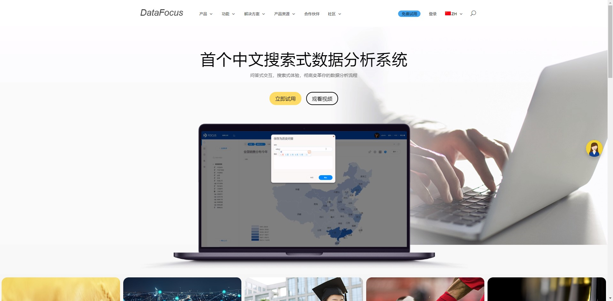

当今商业千变万化，企业需要在缩短决策时间的同时提高决策效率，才能抓住机遇。那么企业决策者最关心的问题是什么呢？第一，如何降低企业经营风险；第二如何使企业管理策略得到贯彻保障；第三，如何建立科学的评价分析体系。利用好商业智能就能有效的解决这些问题。

1. 提高可视化报表设计速度

管理模式随着业务的发展而飞速变化，这就要求报表方案的设计跟上脚步。但是报表设计太慢是现在普遍存在的问题，而商业智能技术可以解决这个问题。

2.有效整合内部数据

企业经过多年的信息化建设，积累了大量而又冗杂的数据。各个业务系统的数据相互独立，导致系统之间数据的整合分析变得很困难。而商业智能系统可以连接不同的企业内部系统数据源，将其导入至一个数据库中，总而得到一个直观的全局的企业数据视图。抽出哪些有用的数据进行清晰，摒弃无用的数据，很大程度上保证了数据的正确性。在这个基础上进行数据分析结果可视化呈现给企业管理人员，动态的交互式报告为企业管理人员能够快速且科学的制定决策提供强有力的保障。

3.科学的数据分析

好的工具最好可以具备总结过去、了解现在、预测未来三个功能，在应用ERP系统后，企业对于信息化的投入变大了，但是整体运营情况还是无法在海量的 业务报表中显示出来；对于报表需求的不断变化，报表的设计周期也就边长，统计口径也很难统一。而运用商业智能技术集收集数据、管理数据、分析数据为一体，自动更新数据从而更新报表，业务人员只需根据需求不断调整报告内容即可。商业智能技术将数据仓库、数据挖掘和联机分析处理等技术与业务相结合，并使之运用到商业决策的过程中去，提高企业决策效率。

市场上已经很多参差不齐的BI产品，做的比较优秀的有tableau、DataFocus、PowerBI，制作炫酷的可视化  大屏也不在话下！
