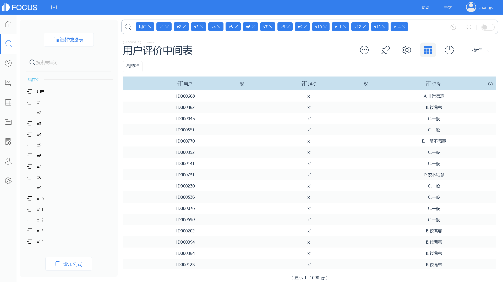
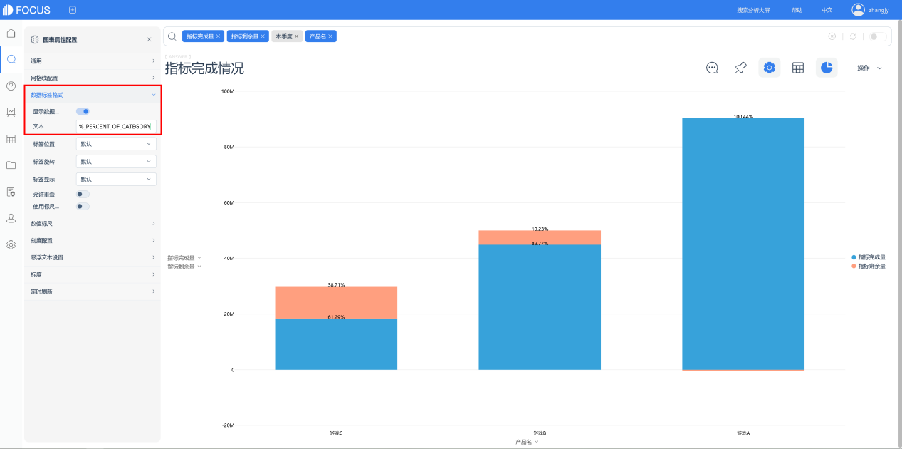

不知道大家注意到没有，看到的可视化大屏，几乎都有地图，而且大部分地图都是居中显示的，这是为什么呢？

大家不知道的是，人类的可视化可以说有数千年的历史了，1986年，在甘肃天水北道区党川乡一号秦墓考古中，发现了一套秦国地图。这套地图共七种，绘制在四块木板的两面，统称为《放马滩秦墓地图》。从考古学家的角度来看，地图可以说是人类第一个可视化的物品。

地图最早都是军事用途居多，而军事活动最主要的是什么呢？聪明如你一定猜到了，当然是临机决策。而如今的大数据可视化产品，其一个相当主要的功能就是用于汇报和展示。而受众对象一般都是领导，或者有决策力的人。

大屏中央放置一幅地图，讲解者可以从这里开始给领导进行汇报，整各交流的过程就有一种获取关键决策信息的感觉，而且无论是政务事务，还是市场化的商业活动，都是在一定的空间范围内进行的，需要汇报的关键数据基本都和地域直接相关，这样也非常方便进行全局信息的获取。

最后，[DataFocus](https://www.datafocus.ai)系统中自带地理位置图和经纬度图，地理位置图可以任意钻取，使用者在汇报时可以进行交互下钻，而地理位置图支持任意的放大缩小，这些都更加便于沟通。下图是DataFocus生成的带地图的可视化大屏。

