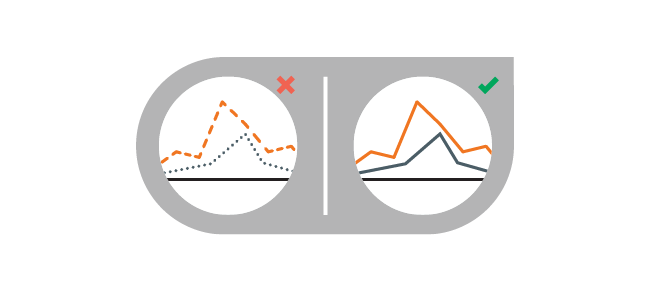
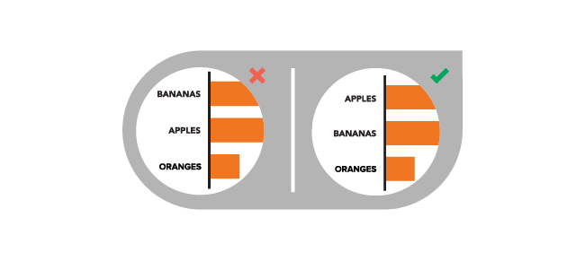

作者：Ross Crooks

_人们一直有一种误解，认为可视化工作是设计复杂的、有3D的动画效果的作品，而简单的图表可视化里没有什么科学。DataFocus君给大家带来了这篇文章，看看你有没有常犯这些简单的错误？_

_\---------------------------------------------------------------------------------------------------------------_

数据可视化是一种以引人入胜的方式传递复杂信息的强大工具。通过可视化信息，我们的大脑可以更有效地合成和保留内容，从而增加其影响力。但是，如果数据没有得到恰当的可视化，那么它可能会造成更多的损害。错误的陈述可能会减少数据的消息，或者更糟糕的是，完全歪曲它。

这就是良好的数据可视化依赖于良好设计的原因。它不仅仅是选择正确的图表类型。它是以易于理解和直观导航的方式呈现信息，使观众尽可能少地做工作。当然，并非所有的设计师都是数据可视化专家，这就是为什么我们看到的大部分视觉内容都不是一流的。以下是您可能正在制作的10个数据可视化错误以及它们的快速修复方法。

## ****1）饼图切片的错误排序****

饼图是最简单、常用的的可视化图形，但它们往往被设计得过于复杂。应直观地进行排列（切片最好不要超过5个）。以下是两种排列饼图的方法，这两种方式都会吸引读者注意最重要的信息。

****选项1：****将最大部分放在12点钟位置，顺时针方向。将第二大部分放在12点钟位置，逆时针方向。其余部分可放置在下方，逆时针方向继续。

****选项2：****从12点开始顺时针方向开始最大的部分。按顺序放置剩余部分 ，顺时针方向。

## ****2）在折线图中使用非实线****

虚线和点划线可能会分散注意力。相反，使用容易相互区分的实线和颜色。

## ****3）非直观地排列数据****

您的内容应以合乎逻辑且直观的方式呈现，以指导读者浏览数据。按字母顺序，或按值排序类别。

## ****4）视觉混淆****

确保设计中没有数据丢失或受阻。例如，在标准区域图表中使用透明度以确保查看者可以查看所有数据。

## ****5）让读者做更多工作****

通过帮助读者使用图形元素，尽可能简化数据。例如，将趋势线添加到散点图以突出显示趋势。

## ****6）虚假陈述数据****

确保所有表示都是准确的。例如，气泡应根据面积而不是直径来缩放。

## ****7）在热图上使用不同的颜色****

有些颜色比其他颜色更突出，给这些数据带来了不必要的份量。相反，使用具有不同色调的单一颜色或两种类似颜色之间的光谱来显示梯度。

## ****8）柱状图太宽或太薄****

条形图中条形之间的间距应为½条宽度。

## ****9）难以比较数据****

比较是展示差异的有效方式，但如果您的观众无法_轻松_比较则无用。确保以允许读者并排比较数据的方式呈现所有数据。

## ****10）使用3D图表****

尽管它们看起来令人兴奋，但3D形状可能会扭曲感知并因此扭曲数据。坚持使用2D形状以确保准确呈现数据。

By the way，运用DataFocus可以通过简单的搜索创建可视化图表，系统会自动推荐图形选择。尽管如此简便，这里要提醒的是，您依然可以通过切换图表，或对单个图表进行自定义设置，以达到最优效果。
