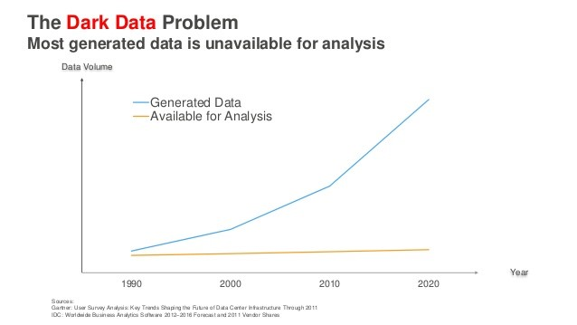
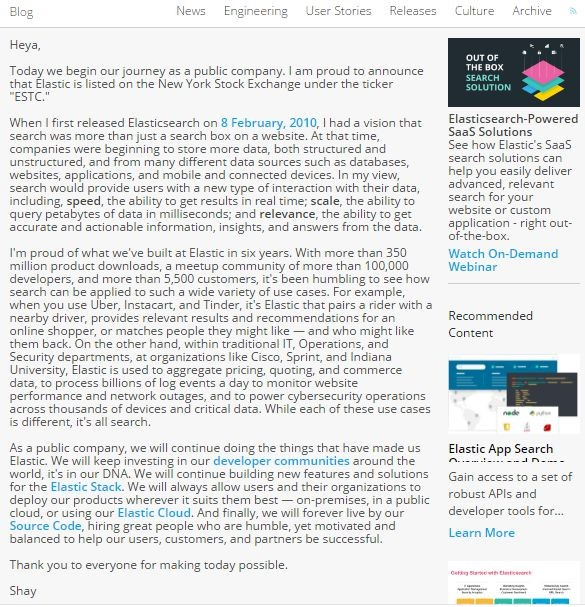

\[box\]Eleasticsearch上市一事说明什么

为什么私有化搜索引擎会成为大型企业标配？\[/box\]

**1、数据量的爆发性增长，沉默的数据占了大多数**

互联网发展至今，数据量经历了两次井喷式大爆发，一次是2000年左右浏览器的黄金年代，大大小小不计其数的网站建立起来，第一次产生了商业数据之外的巨量数据；一次是2010年左右的移动互联网大爆发，各种智能设备，尤其是智能手机彻底将互联网向最顽强的底层人群进行了渗透，引爆了大数据时代。而即将到来的5G时代将再次引爆物联网，届时将有万亿级的设备联网并产生数据，也许那个时候离Matrix的出现已经不远了。

言归正传。如今企业级的数据量越来越庞大，一家大型集团公司或互联网公司一年所产生的数据接近PB级，这个量级几乎可以与谷歌搜索引擎刚诞生之际整个互联网的数据量相比了。企业收集了如此之多的数据，直接丢弃显然是很愚蠢的行为。于是大量的企业都希望通过各种方法将数据的价值发掘出来，然而现实是很冰冷的。

先看下面一张图。沉默的数据就像冰山一样，永远都是大多数。仅仅只有少量的数据被很好的得到了利用。下图说明的是整个互联网上产生的数据都是这个规律，虽然数据量大爆发，然而被有效利用的数据确几乎没有增长。

企业的CIO应该都有同感。很多大型企业，数十套软件系统日以继夜的收集着数据，然而公司的数据应用还是停留在汇总几张报表这种简单的层面。大量宝贵的数据正在沉睡！造成这种现象的原因是什么呢？如果说十年前企业管理层没有意识到数据的价值，不知道数据挖掘和数据分析可以为提高公司效益带来好处的话，那么还说得过去；但时至今日，大数据的理念深入人心，数据是信息时代的石油已经成为行业共识。

**2、为企业构建私有化搜索引擎正当时**

2018年10月6日，Elastic在纽交所上市，市值近50亿美元。上市当天股价暴涨96%。Elasticsearch 创办于 2012 年，是最早致力于开发帮助企业搜索庞大的非结构化信息数据库的企业。以 Elasticsearch 的搜索开源产品知名，拥有5000个客户，覆盖80多个国家。2018财年营收1.6亿美元。 思科、eBay、高盛、美国国家宇航局、微软、维基媒体基金会、三星电子和韦里逊等均是其客户，下载量超过1亿人次。可见该产品的火爆程度。

一个ToB的产品，短短6年时间发展如此迅速，可见它是切到了企业用户的痛处。比如它的Elastic Stack套件：Elasticsearch、Kibana、Beats 和 Logstash；盘活了企业大量的日志数据，将这些数据有效的可视化，改善了企业的系统效率、降低了安全风险。Elasticsearch容易部署，上手使用成本非常低，部署完成后企业的非结构化数据可以很容易的通过索引搜索，极大的提高了用户的效率。

然而，企业沉默数据中仍然有一个被忽视的巨大问题没有得到有效的解决。企业的业务系统往往是多年的建设形成的，囿于业务流程、业务目标各不相同，各种系统的数据都是割裂开来的，大量的结构化数据存在于各种数据孤岛之中。即使是很多企业建设了统一的数据仓库，对这些结构化数据的取用、分析、挖掘也是难度极高的事情，需要大量专业工程师和数据分析师进行开发，这严重阻碍了企业数据的价值提炼！要知道结构化数据往往具有比非结构化数据更高的价值！

DataFocus就是一款针对企业结构化数据的智能搜索引擎，是国际上第一家支持中英双文智能搜索的大数据分析产品，也是中国唯一一家实现智能搜索式大数据分析的产品。DataFocus通过独创的智能数据库搜索引擎全面革新了用户的数据分析体验。特有的搜索即分析方式支持多种语言，学习成本低、无需用户进行任何复杂的代码操作，辅助的搜索提示功能，让数据分析更高效；而高速内存计算引擎与智能可视化更好地完善了系统的分析性能与分析体验。

DataFocus像谷歌一样简洁的交互方式，可以将数据分析任务分散到每个业务人员的工作中，从而给企业带来更高效的效益，必将帮助更多领先企业构建自己的大数据智能搜索分析平台，助力企业在数字化竞争中快人一步！

