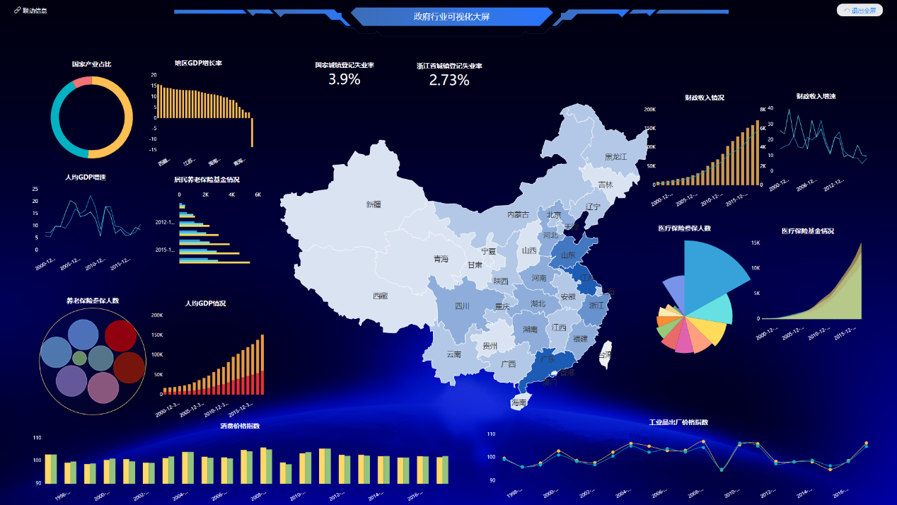

可视化，顾名思义，就是将原本不可视、不敏感的数据通过一定的方法使其可视，能够为更多的人理解、可视的这一个过程。因此可视化，不仅仅是一个点，而是一个过程，这也就导致若要进行数据可视化需要许多繁琐的前期准备工作等等。既然这么麻烦，为什么还要做可视化呢，我多看几眼数字难道不行吗？

其实可视化最大的好处，在于能够将整个公司用一种更加有体系的方法进行整合，使得管理能够逐步高效化，矛盾也能更加明显，解决问题更加便捷有效。

接下来，我将结合我的理解，分析一下为什么要进行可视化？

1、快速消化信息。

人脑对视觉信息的处理要比书面信息容易得多。使用图表来总结复杂的数据，可以确保对关系的理解要比那些混乱的报告或电子表格更快。

2、充分利用数据

可视化允许企业去跟踪运营、不同业务性能之间的连接。在竞争环境中，找到业务功能和市场性能之间的相关性是至关重要的。

3、决策导向

数据可视化可以帮助企业在较短的时间内浏览分析更多的数据、快速做出业务决策，改进策略，推动业务增长，从而使其更好的适应市场发展。

4、与数据交互

动态图表具备交互特性，使企业能够用一些简单美观的图形就能体现那些复杂信息，用一张图通过切换维度、过滤指标即可展现多个不同的维度。

本来公司是一直利用传统的Excel来进行数据汇总，编制每月的报表，然而各部门填报上来的数据杂乱无章，更加增加了我们部门的数据处理难度。但是前几天公司申请了一款协助BI软件，叫DataFocus，我能明显感受到，这款工具投入使用后，我们部门的压力大大减轻，同事们再也不是愁眉苦脸地来上班了。

利用这款工具进行可视化后，不仅数据运用的能力有所上升，还能更好的凸显数据中的矛盾，更是帮助公司做出了很多科学的决策。
