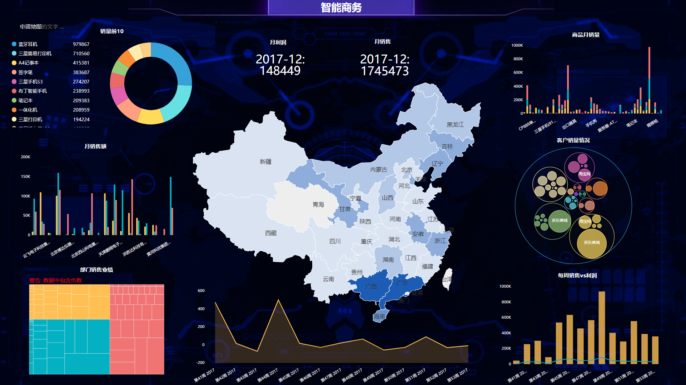

在这个数据爆炸的时代，企业数据量以亿级增长，每个企业多多少少都有自己的“全景数据库”，只是有的是已经能够利用DataFocus等智能数据分析工具产生价值了，有的把数据还深埋在土里。我相信大家都记得马老师提出的五新变革，其中两个是新资源和新技术，资源是什么资源，是数据资源，是企业的内外部大数据资源，把数据埋在土里是一种极大的沉没成本。新技术，就是能够利用AI等日新月异的技术，把这个可持续发展的资源给最大化的利用，让其产生价值。

那么数据的价值其实可以分为几点来说。

第一就是最主要的，能够帮助企业诊断自身存在的问题，优化决策路径，让每一个业务都能被精细化的数字化管理，以提升效率。如果让人工来做势必会事倍功半。像是用人工去做EXCEL数据分析最后做透视图，那一周估计一张报表就不错了。此时可以借助工具的力量，比如DataFocus的可视化大屏，直接一键搜索后秒出可视化视图，然后可以自由组合出来的可视化图表，就算要修改重新搜索就好，这样就可以直接对着数据来说问题，数据的价值就在这里体现。

第二就是数据之间都是有关联的，拍脑袋之间是没有的。一个数据报表反映出的问题同时具备准确和关联的特性，拍脑袋的发现问题有可能是错误的并且单一的。举个例子，对于一个爆款产品没有“爆”，拍脑袋可能就直接想“一定是销售人员不积极”。而用数据来分析，一个报表显示的爆款评价40%包含“不好吃”，30%包含“物流太慢了”“客服小姐姐态度差”等，这样一张报表就能解决大部头的问题。

第三就是数据能够让平行的部门之间有更好的沟通，全部信息化，以提升管理效率。比如一个公司旗下三个品牌可以共享数据，这样就可以让资源放在最需要它的地方，可能是数据显示的某个品牌在某很有潜力的地区没有影响力，就需要花预算去做活动等等。
