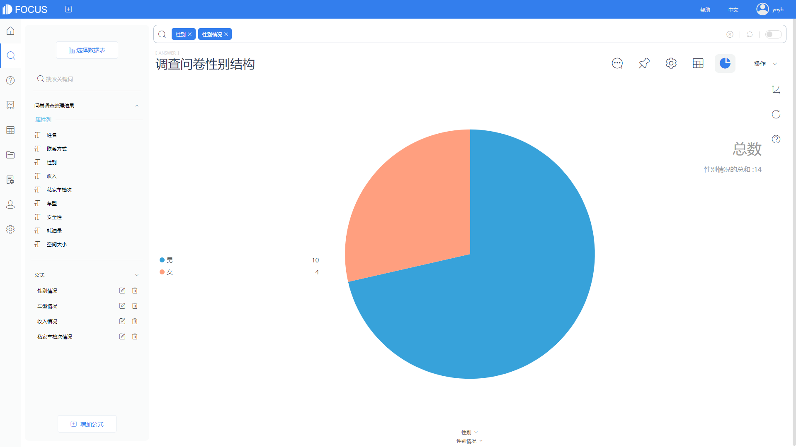
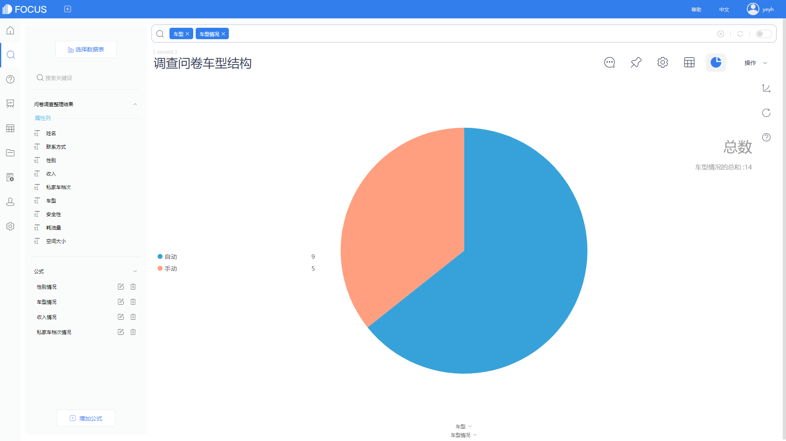
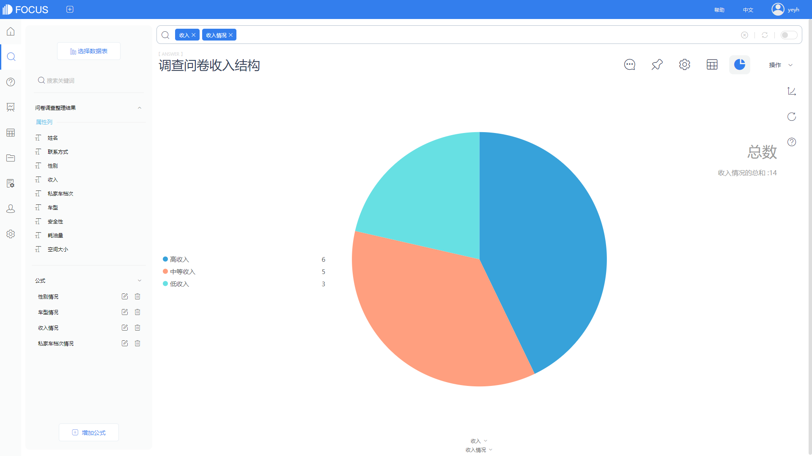

今天，本文主要给大家分享一些DataFocus中的使用小技巧，在数据可视化展示中，经常会遇到需要计算的时候，有简单计算的，也有需要重复利用公式计算的，那在DataFocus中，如何重复利用公式进一步进行计算呢？那下面就让我们一起来了解下DataFocus中如何进行公式嵌套。

我们今天用一个金融指标—7天强弱指标RSI 的例子，来演示公式如何嵌套，复杂公式如何使用。

1、首先我们需要准备数据，数据来源于网上201812月铜期货交易数据，如下：

2、要求RSI，第一步我们需要计算出7天平均涨幅，以及7天平均跌幅，这里需要两个不同的公式分别计算涨幅以及跌幅，7天平均涨幅：sum\_if (涨跌1 大于0 , 涨跌1 )/7，7天平均跌幅：sum\_if (涨跌1 小于0 , 涨跌1 )/7，如下图所示：

涨幅公式

跌幅公式

3、有了平均涨跌幅，需要利用平均涨幅以及平均跌幅计算相对强度RS，RS=7天的平均涨幅/7天的平均跌幅，这里的“7天的平均涨幅”以及“7天的平均跌幅”就是上述2中两个公式结果，那在这里，我们需要直接利用这两个公式进一步计算；

4、求最后的RSI，需要利用上述3中的RS公式，同样地，我们直接使用RS公式，创建一个新的RSI公式：100-(100/(1+RS ) )；

5、搜索公式RSI，以及列：合约代码，输入关键词：每周，结果以折线图显示；

在上述计算RSI强弱指标时，我们总共创建了4个公式，分别为7天平均涨幅，7天平均跌幅，RS，RSI，公式嵌套总共用了两次，第一次在计算RS的时候嵌套了前面的平均涨幅跌幅公式，第二次在计算RSI的时候嵌套了RS公式。

通过这个例子，我们可以感受到，在DataFocus中，不管是复杂的嵌套公式，还是简单的公式计算，其实都不难，只要看一遍，基本就可以自己独立使用复杂公式进行计算了。
