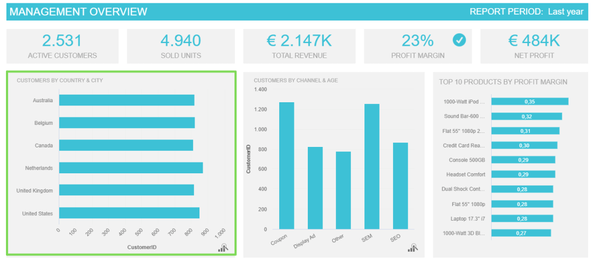
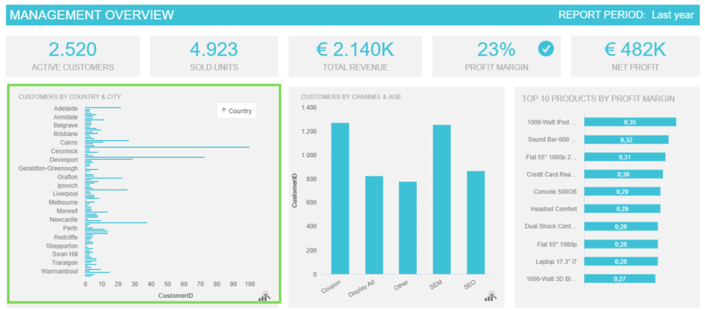
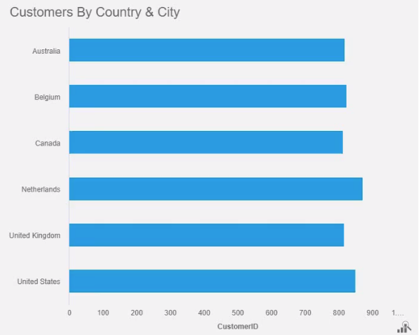

众所周知，商业世界正变得越来越受数据驱动。每天，越来越多的决策者依赖来自多个来源的数据来做出明智的战略决策。但是，随着数据的使用变得越来越流行，所收集的信息量呈指数级增长。

考虑到这一点，[BI 工具](https://www.datafocus.ai/infos/best-bi-tools-software-review-list)开发了多种解决方案来帮助企业以最有效的方式处理他们的信息。从自动化报告、预测分析和交互式数据可视化，数据报告从未如此简单。

现在，如果您刚刚开始使用数据分析和商业智能，那么了解管理数据的最有效方法是非常重要的。在这篇文章中，我们将介绍两个相关的[商业智能](https://www.datafocus.ai/infos/business-intelligence-features)特性，以及它们如何为您的报告带来价值。我们讨论的是向下钻取和钻取。

让我们以详细的向下钻取的含义开始吧！

## 什么是向下钻取？

向下钻取是一种分析实践，它允许您在一个图表中可视化粒度级别的数据。通过“嵌套”分层数据的附加变量，向下钻取分析可以让您提取更深入的见解，而无需跳转到另一个图表或报告。

通常，可以将数据钻取添加到任何图表或数据可视化中。但是，事实证明，它们在表格中特别有用，因为它们允许您访问其他数据以提取更深入的见解。例如，按大陆、国家和城市细分客户。与其他图表类型不同，表格特别受益于向下钻取，因为可以压缩更大的数据集，而不会过度拥挤图表。

向下钻取数据的主要价值在于，它可以让您以一种交互式的方式挖掘分层信息，而无需创建额外的报告，也不需要在当前报告中使用几十张图表。像这样，您可以在一个地方随时随地发现有价值的见解。

上图显示了用于管理的下钻报告。绿色框处显示的图表按国家/地区显示活跃客户。此处的数据钻取可让您右击此图表以获取较低级别的 x 轴，例如按城市划分的活跃用户。下图显示了应用下钻后较低级别数据。

 

 

 

## 数据钻取在报告中的作用

向下钻取和钻取是[BI 报告工具](https://www.datafocus.ai/infos/bi-reporting)的两个强大功能。它们不仅允许您从数据中提取更深入的见解，而且还使报告过程更加直观和高效。例如，通过使用深入报告，您可以找到重要问题的答案，例如按国家/地区划分的销售额、目标客户购买最多的渠道、最成功的产品类别等等。

不仅如此，通过一次呈现一个维度的数据，钻取和向下钻取报告功能减轻了数据负载，使最终用户的报告过程更加高效。总而言之，它们很重要，因为：

- **它们允许更深入的见解：**如前所述，使用数据钻取技术的主要好处之一，是它们允许您提取更深层次的结论，否则这些结论将未被开发。钻取和向下钻取报告可以证明对支持讨论特别有用，因为您只需单击几下即可轻松获取复杂的报告并将其调整为宏观级别。
- **它们可以节省成本和时间：**无论您要构建哪种[类型的报告](https://www.datafocus.ai/infos/types-of-reports-examples)，这都是一项乏味且耗时的任务。由于要跟踪的指标和 KPI 如此之多，企业面临着为每个领域和目标构建多个报告的问题。数据钻取报告允许一定程度的交互性，可以在一个地方可视化大量数据。从长远来看，这将节省您的业务时间和金钱，因为无需生成无限的静态报告。
- **从不同的角度看数据**：如果你曾经处理过数据，你一定知道，挖掘得越深，你就会发现更多的价值。钻取数据使您能够查看最相关的信息并从不同的角度对其进行可视化。像这样，您可以发现不同场景的根源并制定明智的策略，让您的业务取得成功。
- **提升报告体验**：[数据报告](https://www.datafocus.ai/infos/data-report-examples)并非易事。没有技术知识的用户可能很难通过大数据集提取所需的结论。自助式 BI 工具提供易于使用的直观数据钻取功能。只需点击几下，所有知识水平的用户都可以深入了解报告，并以直观和交互的方式提取所有需要的信息。像这样，整个报告过程的体验感将得以提升。

## 向下钻取：报告中的示例

到目前为止，您应该能够了解这两个交互式报告功能可以为您的业务带来的好处。为了继续审视这些重要分析功能的价值，让我们通过[仪表板软件](https://www.datafocus.ai/infos/best-dashboard-software-features)生成的一些示例来查看它们的实际作用。

### A. 深入报告示例

[自助式 BI](https://www.datafocus.ai/infos/self-service-bi-tools)工具（例如 DataFocus）只需简单点击即可提供向下钻取功能，轻松钻取到数据的不同层级。让我们看看下钻功能的实际应用。

1. **按国家和城市划分客户**

我们的第一个示例是按国家和城市显示客户的条形图。如以下图表所示，右键向下钻取，将整个图表的维度从国家改成城市，显示各城市的客户数量；同样的，右键向上钻取返回按国家/地区查看界面。像这样，您无需进入其他报告或图表即可获得有关此数据的额外见解。

另一个重要的注意事项是，在此示例中，我们只是展示了从国家到城市的演练，但您可以在数据允许的范围内走得更远。在这里，您可以继续深入了解邮政编码、每个城市的特定商店，甚至每个商店内表现最佳的销售代表。这种详细程度使您能够使用所有需要的信息微调策略。

1. **按产品类别和产品名称划分的客户**

我们的下一个示例来自表格图表。正如文章开头所提到的，表格是一种[在线数据可视化](https://www.datafocus.ai/infos/data-visualization-tools)类型，它可以从下钻分析中获益最多，因为它们可以覆盖多个数据层。将数据钻取应用到您的表格可能很有用，因为它允许您将更大的数据集放入您的报告中而不会过度拥挤。

在上面的深入可视化中，我们可以看到如何分解每个产品类别并了解哪些特定产品吸引了最多的客户。这是非常有价值的，因为它可以让您立即比较哪些是您的客户最喜欢的产品，并得出关于未来投资、促销等的结论。

1. **按渠道和年龄划分的客户**

我们深入分析示例列表中的最后一个是条形图，按渠道和年龄跟踪活跃客户的数量。同样，在这里我们可以看到，根据您想要可视化的特定数据过滤整个图表是多么容易。从实习生到经理，任何人都可以使用此图表做出相关的战略决策。

根据不同的渠道了解客户的不同年龄范围可以提供非常有价值的见解。例如，您可以查看您的目标受众最常使用渠道类型，或者如果您的业务针对所有年龄段的人，您可以了解针对每个年龄段的最佳渠道。

 

## 向下钻取的关键要点

在本文结束时，我们希望你对钻取数据给你的报告过程带来的价值有一个清晰的理解。这里要记住的关键是，钻取数据分析不仅可以帮助您更深入地挖掘业务中不同场景的根源，而且还可以防止您在生成多个报告时产生不必要的开支（这也将使您浪费宝贵的时间）。

通过投资正确的技术来管理数据，您可以从多个BI特性中受益，向下钻取分析只是其中的一个。[在线数据分析工具](https://www.datafocus.ai/infos/data-analysis-tools)（例如 datafocus）提供了通过构建交互式仪表板来有效分析数据的可能性，任何人都可以使用这些仪表板，而无需任何技术技能。根据数据而不是简单的直觉做出决策将引导您的业务取得成功。

如果您准备好开始使用这些有价值的功能[，请免费试用我们的 BI 报告软件](https://www.datafocus.ai/console/) 30天！
