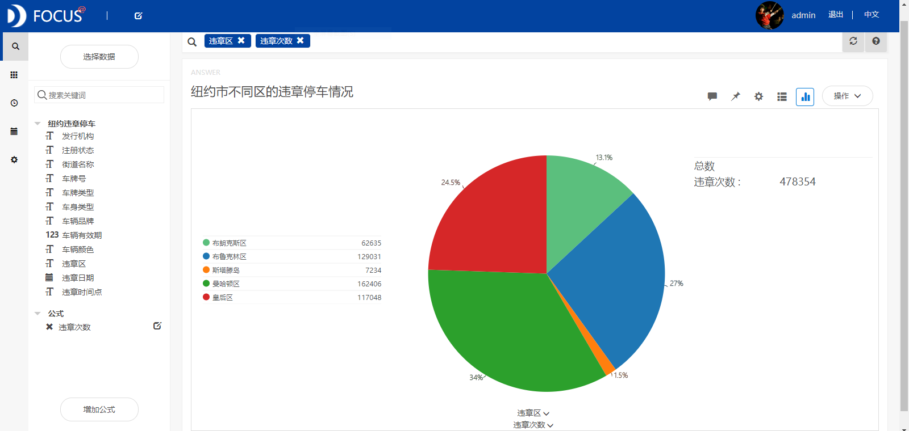
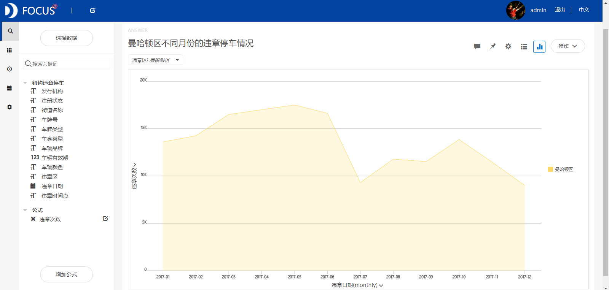
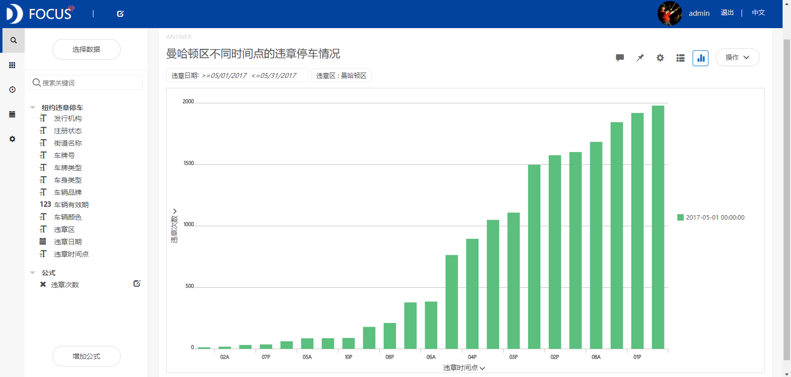
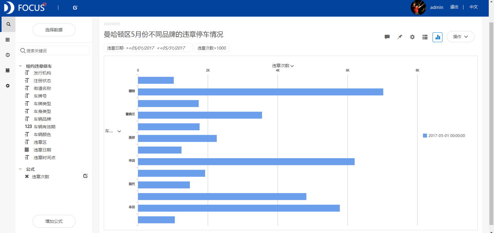

**目的：**研究2017年纽约最常发生违章停车事件的地区、时间点和车类型。

**摘要：**纽约市是美国人口分布最多、金融商业最发达的城市。因此该市违章停车事件数也居美国前列。本文通过研究2017年纽约市的违章停车数据主要得出了以下结论：2017年纽约市曼哈顿区的违章停车数最多，其次是布鲁克林区和皇后区。曼哈顿区内违章停车次数最多的三个街道依次为百老汇、第三大道和麦迪逊大道。2017年曼哈顿区前半年的违章停车数显著地高于后半年，并且5月份的违章停车事件最多。违章停车最多的时间点为早上9点—11点、下午1点等。

**关键词：**Datafocus,纽约,违章停车

**一、案例背景**

违章停车会给一个城市带来很多不好的影响。首先，它会使得城市的秩序出现混乱的现象，还会导致城市的品味以及形象都受到影响，这就使得城市道路的交通环境无法提升。其次，机动车如果在行驶中随意的停放，就会导致交通事故的增加，给群众的生命安全带来隐患。最后，机动车随意停放会导致路段不畅通，而违章停车的地方大部分都是学校，或者是银行以及饭店的附近，因此如果长时间将道路占据就会形成堵塞点，直接导致道路上出现不必要的堵塞现象。因此，我们有必要通过了解最常发生违章停车事件的地区和时间点等，来为交通管理部门制定政策提供一定的参考，使得他们可以在最常发生违章停车的地区多安排一些交警，通过开罚单等方式来减少违章停车事件的发生。

**二、案例问题**

纽约市是美国人口分布最多、金融商业最发达的城市，而该市的违章停车情况也很突出。本文基于2017年纽约市的违章停车数据，研究2017年纽约最常发生违章停车事件的地区、时间点和车类型。研究的结果可以使交通管理部门在最常发生违章停车的地区或街道多安排一些交警，设立禁止违章停车的牌示，对违章者开罚单予以警示。由于纽约违章停车数据信息量巨大，用EXCEL操作起来会略显麻烦，使用Datafocus产品就可以快速处理大量数据，还可以将分析结果进行可视化。

**三、案例分析**

将分析的“纽约违章停车”CSV文件导入到Focus系统中。

**（一）不同区的违章停车情况**

为了分析不同区的违章停车情况，绘制出饼图如图1所示。从饼图中可以看出2017年曼哈顿区的违章停车数最多，其次是布鲁克林区和皇后区。因此接下来我们针对曼哈顿区的违章停车情况进行研究，研究内容主要包括月份和街道两个方面。 

图1 纽约市不同区的违章停车情况

**（二）曼哈顿区的违章停车分析**

**1.不同街道的违章停车情况**

我们从违章区中筛选出曼哈顿区，研究该地区内违章次数大于1000的街道情况。从面积图中我们可以看出该区内有违章停车次数最多的三个街道依次为Broadway（百老汇）、3rd Ave（第三大道）和Madison Ave（麦迪逊大道）。

图2 曼哈顿区不同街道的违章停车情况

**2.不同月份的违章停车数统计**

利用曼哈顿区的违章停车数据，绘制出折线图（见图3）来研究该区不同月份的违章停车情况。从图中可以发现2017年前半年的违章停车数显著地高于后半年，并且5月份的违章停车事件最多。 

图3 曼哈顿区不同月份的违章停车情况

**3.违章停车的时间点分析**

为了分析曼哈顿区不同时间点的违章停车情况，筛选出该区5月份的违章停车数据，绘制出柱状图如图4所示。从柱状图中，我们可以看到，违章停车最多的时间点依次为09A、01P、11A、08A、10A等。这说明管理部门可以在这些时间点安排较多的交警来加强交通管制。****

图4 曼哈顿区不同时间点的违章停车情况

**4.不同车辆品牌的违章停车情况**

从曼哈顿区5月份的违章停车数出发，比较不同车辆品牌情况下的违章停车差异。通过观察条形图可以发现，福特车的违章停车次数最高。  图5 曼哈顿区不同车辆品牌的违章停车情况

**（四）数据看板**

最后将这5个结果图导入“纽约市违章停车状况分析”数据看板中，操作结果如下： 

图6 数据看板

**四、结论**

通过分析主要得出的结论有：

2017年纽约市曼哈顿区的违章停车数最多，其次是布鲁克林区和皇后区。曼哈顿区内违章停车次数最多的三个街道依次为Broadway（百老汇）、3rd Ave（第三大道）和Madison Ave（麦迪逊大道）。2017年曼哈顿区前半年的违章停车数显著地高于后半年，并且5月份的违章停车事件最多。违章停车最多的时间点为早上9点—11点、下午1点等。福特车的违章停车次数最高。

**五、对策建议**

由于曼哈顿区的违章停车数最多，所以美国政府应该将地区作为治理违章停车现象的主要区域，并且重点管制百老汇、第三大道和麦迪逊大道等街道的违章停车现象。由于曼哈顿区前半年的违章停车数显著地高于后半年，可相应地在前半年分配更多的交通管理人员。而违章停车最多的时间点为早上9点—11点、下午1点等，说明交通管理部门可以在这些时间点安排较多的交警来加强交通管制。
