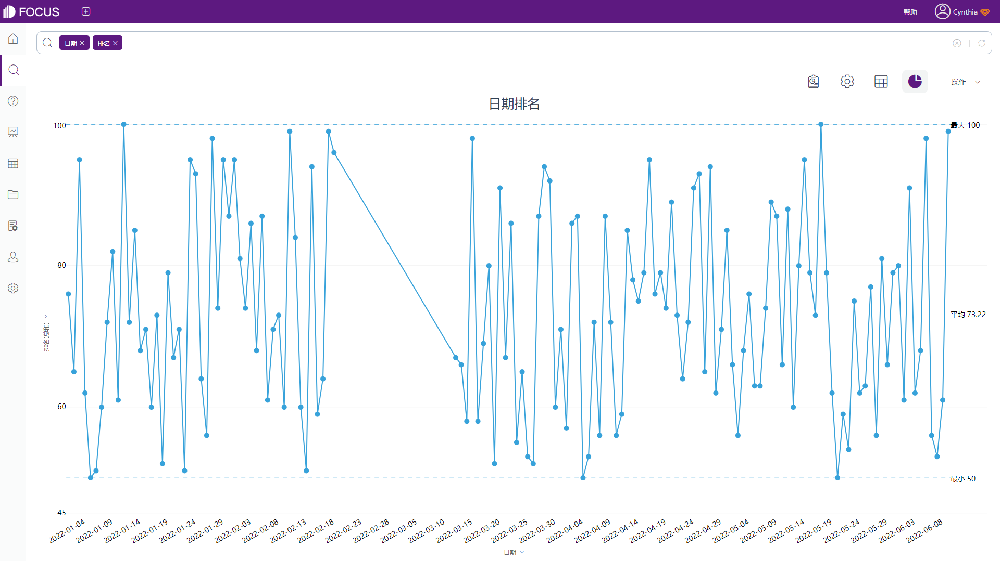
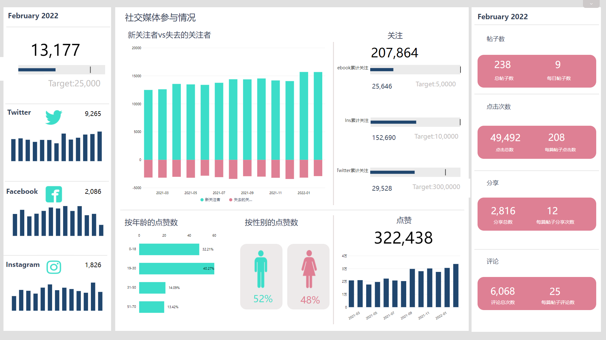

网络时代，下载APP、点击注册网页、购物车下单付款等，用户每一次的操作、点击都将形成一条条记录，存储或有效或无效的信息，这些信息组合起来，在某种意义上，其实就是数据。

数据的重要性对公司来说不言而喻，投资人通过查看公司的财务报表、销售业绩等衡量公司对应的价值，产品经理则可以通过公司产品对应的分析报告发现产品潜在的问题或寻找成功的机会。

**重应用，轻理论。**

对于一名产品经理来说，利用BI工具制作数据看板、学习数据挖掘都不是他应该钻研的方向。产品经理需要做的，应该是借助自身的数字敏感性和分析意识，从整理出来的分析报表中寻找数据潜在的规律，发现产品可能存在的问题或者寻找成功的机会。这里可能就需要依靠平时积累的一些“经验”。

所以这篇文章主要就是总结一下我和小伙伴们在平时工作中得出的一些可以帮助提升数据分析意识的方法。

## **一、学会提出问题**

举一个之前遇到的客户案例，客户研发的一款APP在应用市场的排名走势如下图所示：

_截图来源：DataFocus（数据已脱敏）_

X轴代表日期时间，Y轴代表该APP在应用市场的排名数据，中间有一段明显的排名空缺（2022年2月19日至2022年3月11日）

基于上述图表，我们想提出这样几个疑问：

1. 应用市场是依据哪些影响因素对APP产品进行排名？
2. 2022年2月19日该APP为何跌出榜单？
3. 2022年3月12日该APP为何能够重回榜单？

针对图表内容提出的上述3个问题，都是相对基础的，第一个是从本质上寻找可能对数据表现存在干扰的影响因素，二、三则是针对数据的异常值提出疑问。

有了问题，我们才能去寻找解决问题的答案，最后再理顺答案之间关联逻辑，就可以得出结论。

## **二、从趋势去挖掘**

接下来，观察该客户的APP系统在另一个渠道上的用户评论数量。从整体趋势上看，该款APP的评论数量在2022年2月10日出现了断崖式的下跌，同时整体呈现下降趋势，甚至在最近几天，评论数下降为0。

_截图来源：DataFocus（数据已脱敏）_

对比所有渠道的APP下载量和评论数后，我们发现，除了上述这个渠道，其他渠道的下载量和评论都比较正常，且远高于这一渠道。这个渠道的下载量和用户评论的活跃程度几乎可以忽略不计。

再结合该渠道的表现，目前有两种方法解决，一是想办法投入资源和精力增加该渠道的用户活跃；二是弱化该渠道并逐渐退出。

最后，我们结合这一渠道的客户定位和实际情况，选择了第二种，放弃这一渠道，将精力集中到剩余其他正常的渠道中。

## **三、关注重点数据**

透过现象看本质，重点数据往往不会浮于表面。需要关注可能会影响表象的深层因素，然后对于这些重点数据进行对比、挖掘，才不至于被表象欺骗，忽略真实数据结论。

_截图来源：DataFocus数据看板_

最后进行总结，产品经理在应用分析数据时，不仅需要客观冷静，有逻辑的进行数据分析，还需要跳脱出正常思维，不要循规蹈矩，拘泥于常规的分析逻辑，学会换位思考。
