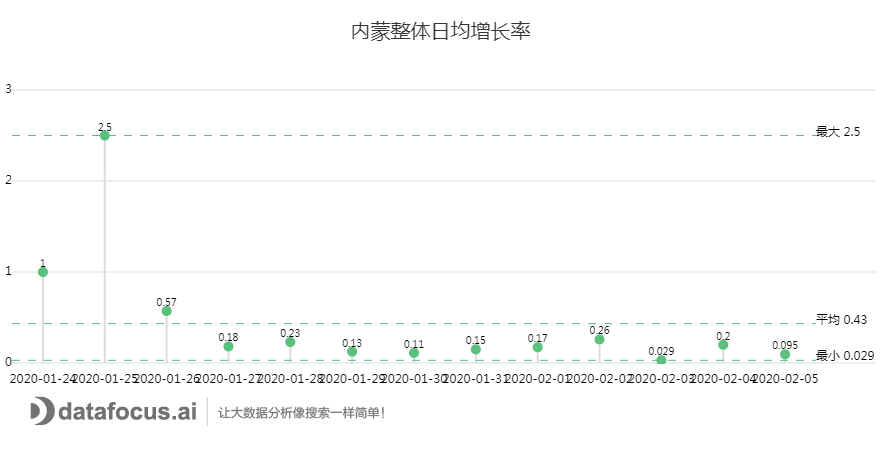
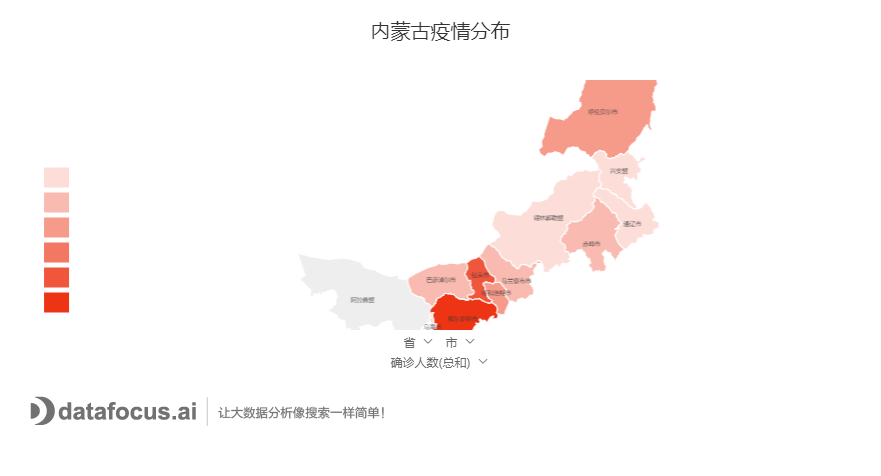
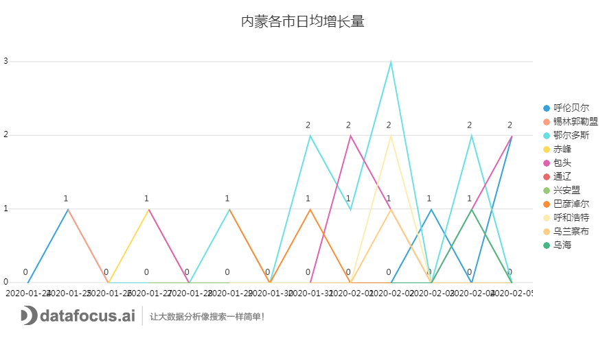
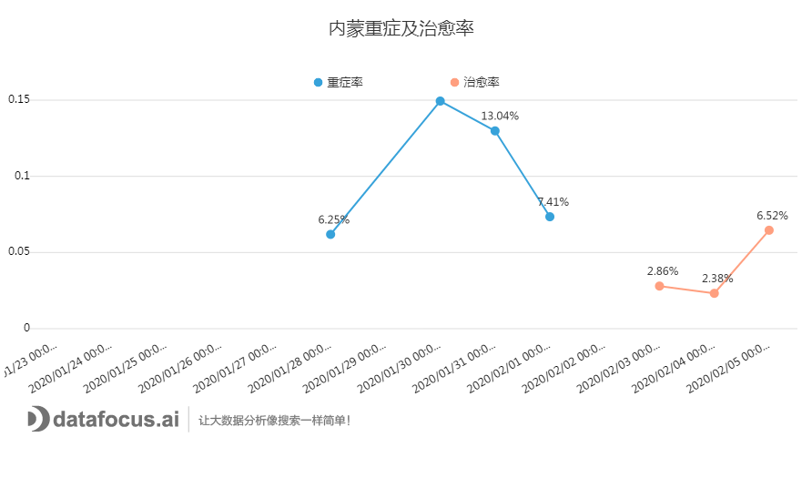

今天我们要介绍的省份是中国国土面积第三大的内蒙古自治区。说起内蒙古，大家是不是都会想起蒙古包、大草原、成群的牛羊，想起诗句里“天苍苍，野茫茫，风吹草低现牛羊”的壮阔景色。这些都说明了内蒙古的地广人稀——住在蒙古包里面的人们可能和他们的邻居隔着一座山的距离。

为了防止此次疫情的二次传染，依据钟南山老先生的指导，大家都纷纷取消了新春佳节的拜年活动，取消了朋友的聚会，选择蜗居在家、减少出门的频率。那么此次新型冠状病毒对于地广人稀的内蒙古的影响是否会比较小呢？小面就让小编带大家来详细分析下。

内蒙古的疫情较其他地区来得稍晚些，首例病例确诊是在1月23日的呼伦贝尔市。截止2月6日上午9时，内蒙古自治区累计报告新型冠状病毒感染的肺炎确诊病例46例，疑似7例，出院3例，在全国排名第27。

从下图看内蒙古自治区从疫情爆发至今的病例日均增长情况，我们可以看到，内蒙古在病例爆发后的反应非常迅速，在3天内成功将病例的增长控制在了20%以下，并且不再有明显的上升。

图1：内蒙古日均增长率

1.分市概览：潜伏病例开始爆发

下面这张地图是累计2月6日9时，内蒙古自治区下属的各地区的确诊病例数。从图中可以明显看到，内蒙古自治区内疫情最严重前三个的地区分别是鄂尔多斯、包头、呼伦贝尔，内蒙古自治区的阿拉善盟还坚挺着，没有被感染。（对，就是爱情公寓5曾小贤去的地方）

图2：内蒙古各市疫情分布

接下来展示的是，内蒙古自治区各地区的日均增长情况，从图中，可以非常直观的看出，鄂尔多斯的增长量是最密集的，但各地区每日的增长量最多不超过三人，基本都是一人或者两人。其次，从图中我们还可以看到，2月1号之后的病例增长量明显有增加的趋势，潜伏的病例都开始一个个冒出来了。

图3：内蒙古各市日均增长情况

2.病情隐患：密切接触人数巨大

据钟南山老先生发表的声明可知，现阶段已知的新型冠状病毒感染的肺炎最主要的传播方式为飞沫传播和接触传播，存在非常明显的人传人现象。任何与患者有过接触的人群都可能带有冠状病毒的病原，因此，密切接触人数也是非常重要的相关数据之一，结合下图，我们可以看到，内蒙古自治区的密切接触人数的增量在2月1日达到一个小高潮后，开始迅速下行。因此，内蒙古自治区在密切接触人数方面的排查工作做得还是很不错的。

图4：内蒙古密切接触情况

3.重症率及治愈率：密切接触人数

因为内蒙古卫健委公开的重症病例及治愈人数数据有限，能进行展示的数据量不多，因此就对仅有的数据进行绘图分析。从图中我们可以看到，内蒙古自治区的重症率最高达到了15%，而治愈率则仅有6.52%。当然，重症率偏高的原因不能排除内蒙古自治区的确诊病例人数的基数偏少。但随着时间的推移，我们还是可以看到，重症率在不断下降，而治愈率则在不断上升，相信这一定是个鼓舞人心的好消息！

图5：内蒙古重症率及治愈率情况

万事开头难，疫情从一开始的全面爆发到现在的逐步开始受到控制，政府、所有的医护人员以及我们的普通民众都付出了很多，可以说，现今局势开始向好的方向发展是全国人民众志成城的结晶。我们正处于疫情发展的关键时刻，希望大家能够继续保持，不要放松警惕，不给病毒可乘之机。
