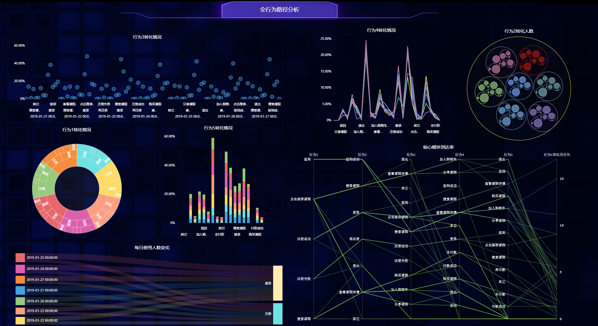
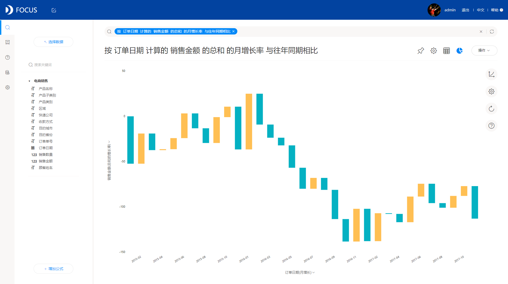

在这个商业智能横行的时代，BI已经成为很多企业的宠儿。而也存在很多情况，第一就是最好的情况，企业知道自己的短板，知道自己的坑在哪里，BI就像溶胶一样填上那些坑，让企业变得完整；第二就是一般的情况，企业觉得其他人都在上BI，自己也来一套，这类企业也有很多的坑，但是BI的“溶胶”不一定100%准确填平，有些地方没补好，有些地方涂太多了凸了出来；第三种就是比较尴尬的情况，有些企业看着别人用了BI以后效率提升飞快，蒸蒸日上，自己还在纠结，比如一些用手工记账的制造业工厂企业，转型成本很高，越不转越高越落后，陷入恶性循环。

针对第二三种企业，其实每一个企业的实际情况都不同，每个公司都有自己的难处或困惑。DataFocus作为数据老司机，遇到过形形色色的客户。比如老板身兼数职，这种在电商企业尤为常见，在决策方面根本无暇思考或无人可用，只能使用数据分析来让决策靠谱些；还有的是业务很多，平行方面用人工的工作成本高并且容易出错，常见于品牌联营或联合外企，每个业务的数据不统一，需要统一规范化。一般来说哦这些都常见于扩张非常快，或是已经“传统”很久的老牌企业，在新世代的浪潮下已经不能靠拍脑袋了不然就像抹黑在河里划船，不计算水流不计算距离水深等，什么时候搁浅什么时候逆行什么时候冲下瀑布都不知道。

所以，这个时候上BI就不该犹豫，并且也不能够犹豫。比如面对公司今年要业绩翻一番的目标，传统拍脑袋怎么做？从源头就做不了了，从哪一块业务开始实现？哪一块业务是表现比较好的？哪一款产品是比较受欢迎的？等等，没有BI，就等于没有了眼睛。上BI的目的，就是为了让每一个决策，都能靠谱的实施，都有据可依，这样企业才能稳步的健康发展。
