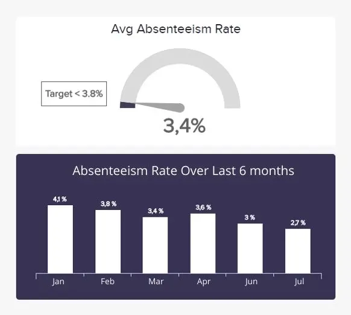
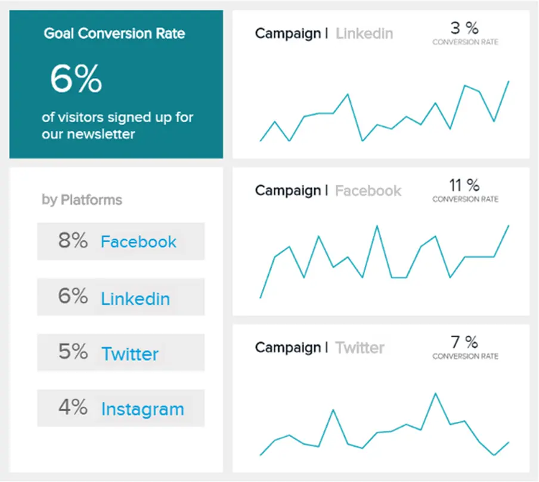

数字数据就在我们身边。事实上，据《福布斯》报道，我们每天创建大约 2.5 万亿字节的数据，仅在过去两年中，全球 90% 的数字洞察就产生了。

如果使用得当，数据将为希望随着时间的推移提高商业智能、运营效率、盈利能力和增长的个人和公司提供大量机会。在当今时代，未能利用数字数据为您带来优势可能会对您的业务造成灾难性的影响——这就像戴着眼罩走在繁忙的街道上。

随着可用数据的速度呈指数级增长，使用正确的[在线报告工具](https://www.datafocus.ai/infos/online-reporting)不仅要细分、整理和分析大型数据集，还要发现您甚至不知道存在的新问题的答案，这一点至关重要。在为特定问题寻找可行的答案时，临时分析和报告至关重要。我们将解释现实世界中的含义、好处和用途。让我们开始吧！

## 什么是临时报告？

\*\*点击放大\*\*

即席报告是商业智能的早午餐，用于以动态仪表板的形式生成具有实时数据的一次性报告。借助自助式 BI 工具，业务用户无需技术知识即可轻松创建即席报表。

与定期或持续（每日、每周或每月）数据报告一起工作，临时报告通过提供一定程度的洞察力，为[数据驱动的决策](https://www.datafocus.ai/infos/data-driven-decision-making-in-businesses)过程增加额外的实质和成功，构成了任何企业、品牌或组织增长和可持续性的重要组成部分。

虽然这些报告通常由 IT 部门使用 SQL（结构化查询语言）开发，可能需要几天时间，但有一些工具和平台允许非技术业务用户访问这些最宝贵的见解，只需使用[SQL 报告生成器](https://www.datafocus.ai/infos/sql-report-builder)即可。这是特设报告定义的实质;提供一次性快速报告，无需生成复杂的 SQL 查询。

此外，许多临时分析或报告平台拥有集成的[在线数据可视化工具](https://www.datafocus.ai/infos/data-visualization-tools)，以帮助增强勘探过程。这减少了对软件开发人员或 IT 人员进行简单报告的依赖。

在解释了报告的含义之后，我们现在将更详细地研究分析部分。

## 什么是临时分析？

临时分析是公司用来当场回答关键战略问题的商业智能 （BI） 过程。借助现代仪表板，决策者可以可视化多个数据源，并从中提取可操作的见解。

使用临时分析工具，用户通常会创建当前不存在的报表，或更深入地钻取现有[仪表板报表](https://www.datafocus.ai/infos/dashboard-reporting)，以获得更深层次的见解，最终有利于组织的持续成功和可持续性。

即席数据分析是用户在探索、检查和从报告中得出切实结论后发现并采取的后续行动。

通常，即席数据分析涉及为更小、更利基的受众发现、呈现和操作信息，并且比标准静态报表更直观。现在您已经了解了两个主要定义，现在是时候研究其好处了，然后是现实世界和实际示例。

## 临时报告和分析的好处

现在我们已经回答了“什么是临时报告？”这个问题，让我们看看使用这些类型的[数据报告的](https://www.datafocus.ai/infos/data-report-examples)明显好处：

1\. 减少 IT 工作量：

即席报告的自助服务性质允许最终用户在业务的利基领域使用自定义报告，而无需依赖开发人员的技术援助，从而促进了报告创建过程。这样可以节省时间和成本，同时最大限度地减少任何潜在的部门间障碍。

2.易于使用：

由于临时数据分析平台或仪表板本质上是直观和可视化的，因此发现正确问题的正确答案比以往任何时候都更简单，允许用户做出决策并推出有助于改善业务的计划，而无需在令人生畏的数据流中跋涉。

3\. 确保在不断变化的商业环境中的灵活性：

即席分析提供交互式报告体验，使最终用户能够实时进行修改或添加。由于报表元素是单独选取的，因此用户可以提出问题并进行适合其需求和目标的自定义。尽快回答业务问题至关重要，而临时报告的好处之一恰恰提供了这一点 - 随着业务时刻的要求和不断发展，可以跟踪不断变化的业务环境。

4.节省时间和成本：

现代临时报告工具旨在节省无数小时，因为它们的界面设计简单但功能强大。直观的性质可帮助用户创建交互式视觉效果，而无需等待专业分析师或如前所述，IT部门。这种[自助式 BI](https://www.datafocus.ai/infos/self-service-bi-tools)性质使数据驱动的系统完全由用户控制，最终节省了无数的工作时间和成本，因为用户不必等待报告并根据需要构建任意数量的即席报告类型。

此外，如果团队可以立即操作公式并避免使用多个电子表格来整合预先固定的数据或静态演示文稿，并且不可能深入挖掘数据，那么他们将更加投入。

5.完全可定制：

虽然临时企业报告侧重于在整个大型组织中获得并保持可见性，但重要的是要考虑这些报告提供的自定义可能性。例如，一些工具提供内置仪表板，这些仪表板已经具有模板，您可以根据需要使用和调整这些模板。这样，您可以节省更多时间，专注于真正重要的事情：您正在寻找的业务答案。但不仅如此，如前所述，如果您是一位经验丰富的分析师并正在寻找现代软件解决方案，那么在高级SQL框中构建自己的查询的可能性将为您提供更多的自由。

您的机会：[想从专业的临时报告中受益吗？](https://www.datafocus.ai/console/)探索我们的专业报告软件 14 天，完全免费！

## 临时分析示例 - 真实世界

毫无疑问：临时分析为各行各业的企业提供了丰富的价值。为了展示其潜力，让我们深入研究这一宝贵的数据驱动计划在商业世界中的实际应用。

- 临时财务分析：

我们特别报告示例列表中的第一个侧重于财务。就其本质而言，金融行业（或财务部门）充斥着事实、数字、[财务 KPI、指标](https://www.datafocus.ai/infos/kpi-examples-and-templates-finance)和数据。临时数据分析为企业提供了深入挖掘非常集中的数据段（或业务目标）的方法，从而能够发现趋势，从而提供最佳的投资回报率（ROI）。

从本质上讲，每当您需要更深入地了解财务数据时，您都会执行临时财务报告。例如，在月底，您需要找出扣除直接成本后还剩下多少收入。从本质上讲，您（或利益相关者）希望尽快了解您的毛利率。

临时报告带来的是即时答案，无需等待 IT 部门数天才能生成像上面这样的简单视觉对象，或者如果您计划了特定的会议或演示，则需要完成临时仪表板。

虽然这些是从这种分析实践中受益的主要行业，但无论您从事哪个行业，通过利用此类报告和交互式[商业智能仪表板](https://www.datafocus.ai/infos/bi-dashboard-best-practices)，您将看到业务关键领域的显着改进。

- 销售中的临时报告：

临时报告和分析可用于拥有大型销售数据库的公司。假设用户想要找出与特定场景相关的特定销售的结果，他/她将构建一个仅使用一次的单个报告来提供该结果。这种情况可以在拥有大量外部销售队伍的公司中找到，然后可以导出临时报告，根据总体销售目标显示他/她的区域（访问的客户数量或产生的潜在客户）的结果。

- 医疗保健领域的临时报告：

我们可以关注的另一个领域是医疗保健。医生可能不知道如何构建HTML报告或运行SQL查询，但报告工具可以轻松生成快速所需的数据，并且只有一次 - 例如血液检查报告，或者有多少人在特定的日子/一周内被送入急诊室。

临时分析有助于彻底改变医疗保健行业。利用[医疗保健分析软件](https://www.datafocus.ai/infos/healthcare-analytics)，提供更高的数据可见性并提高准确性，同时帮助此类机构中的高级利益相关者做出快速准确的决策，最终挽救生命、提高运营效率并降低死亡率。

- 政府：

政府实体处理大量关键信息、见解和决策，这些信息、见解和决策最终会影响很多人。通过获得磨练非常具体的任务或挑战的能力，并达到做出准确、繁荣决策所需的洞察力水平，同时自动执行曾经手动的数据收集任务，全球政府机构在提高生产力的同时享受改善的公共资金分配。证明了临时分析的力量。

- 临时招聘报告：

在我们竞争激烈的商业环境中，运行个性化、快速和准确的招聘报告至关重要。使用人力资源部门的临时报告示例，公司有机会发现人力资源管理中的缺陷并提高员工满意度，考虑到[各行各业缺乏](https://www.hrdive.com/news/talent-shortage-emerging-as-a-top-risk-for-organizations/546612)人才，这一点至关重要。

从实际意义上讲，您可能会怀疑或假设在一年或 6 个月内的缺勤率更高。通过生成类似于上述示例的临时报告示例来进一步调查可能被证明是非常有利的。该公司可以确定假设是否正确，这意味着利率是走高、稳定还是下降。如果有增量，您可以通过与员工互动并找到解决问题的适当解决方案来轻松确定原因。要创建此类视觉对象，您可以浏览我们关于最突出[的招聘指标](https://www.datafocus.ai/infos/recruitment-metrics-and-dashboards)的文章。

- 零售：

事实证明，这些类型的报告在零售业的损失预防方面特别有效。通过针对特定损失预防领域（如入店行窃或员工盗窃）量身定制的特定于商店的[零售分析](https://www.datafocus.ai/infos/retail-analytics)报告，许多著名的零售商已经能够跟踪库存并发现趋势，从长远来看为他们节省了大量金钱（和时间）。

在零售业，定期跟踪销量以优化在线商店或实体店的整体性能非常重要。像上面这样的临时报告示例可以查明销量低于平时的特定周。通过更深入地检查报告，您可以得出结论，由于外部条件，例如，一场大风暴推迟了交货并导致许多取消，因此需求较低。

- 教育：

教育部门对我们社会的未来至关重要，临时数据分析通过集中数据和分析[报告](https://www.datafocus.ai/infos/analytical-report-example-and-template)简化一系列流程发挥了重要作用。它还促进了部门之间的信息共享，以帮助学生在更深入，更个人的层面上参与。这种级别的举措提高了教师、学生乃至经济的成功率。

这些类型的报告带来的内容很简单：数据管理的有效分散化，并将分析过程直接转移给最终用户。虽然您可以使用多种[数据分析方法](https://www.datafocus.ai/infos/data-analysis-methods-and-techniques)，但临时报告系统将使您能够在现场进行分析并立即回答您提出的问题。这不仅在商业智能中至关重要，而且正如我们所看到的，在教育或政府服务等其他领域也至关重要。

- 顾客服务：

也许客户服务比任何其他部门都更能从一次性报告中受益，以回答关键问题，这些问题将指导他们为客户提供最佳支持。例如，支持经理可能需要生成一份报告，以了解过去一周解决了多少工单以及哪些沟通渠道，以便他们可以相应地计划策略。

更深入[地了解](https://www.datafocus.ai/infos/drill-down-drill-through-reports)这些数据可以揭示其他有趣的元素。例如，通过比较客户最有可能呼叫的高峰时间，经理可以确保座席在这些时间可用以满足需求。此外，您可以查看解决问题和解决任何低效率问题的平均时间。

- 营销：

如本文所示，临时报告以可视化格式呈现数据，可以更轻松地在现场分析和提取可操作的见解。在充分利用您的营销工作时尤其如此。在处理促销活动时，您需要充分利用可用的资源。过去发起促销活动时，直到几周后生成报告才知道它是否成功。由于这种报告的速度，营销人员现在可以实时了解活动是如何被感知的，并相应地进行调整以避免浪费资源。

- 制造业：

在制造业中，使用临时报告提供的实时数据被证明非常有用。能够快速了解不同生产阶段的状态，使企业能够掌握任何问题，并确保生产按计划运行，以满足与客户的发货期限。

例如，一家即将交付大量货物的制造公司可以创建一个临时报告，以了解不同机器的生产份额。如果观察到机器性能不佳，报告将显示它并实施纠正措施。

您的机会：[想从专业的临时报告中受益吗？](https://www.datafocus.ai/console/)探索我们的专业报告软件 14 天，完全免费！

## 静态报告与临时报告：主要区别

到目前为止，我们已经介绍了一些定义和好处，并查看了临时报告如何促进普通业务用户管理其日常活动数据的方式的实际示例。为了继续正确看待它们的价值，我们将将它们与更传统的数据管理方法进行比较：静态报告。

也称为罐头报告，这种传统的报告方式已经执行了几十年，并被企业用来评估他们过去的业绩。这些文档通常由数据分析师或 IT 部门生成，并根据以前的要求每周、每月、每季度或每年提交给决策者。这两者之间的一些主要区别包括：

- 生成：这两种分析工具之间的第一个区别是它们的生成方式。如前所述，静态报告通常由 IT 团队根据使用它们来回答重要问题的不同部门的请求创建。由于它们的静态性质，无法探索有关它们的信息，这使得它们的通用性降低。另一方面，普通业务用户在需要知道的基础上轻松生成临时报告，并用于做出重要决策。的确，没有经验的用户的学习曲线可能是一个挑战，但是在正确的自助服务工具的帮助下，管理起来相当容易。

- 可用性：接下来，我们有可用性。如前所述，静态报告无法导航或操纵以当场回答特定问题，因为它们是针对特定目标和更广泛的受众生成的。如果出现不同的需求，则需要订购新报告，这可能需要数小时或数天才能完成，因为 IT 部门可能已经忙于其他任务。相反，临时报告以交互性和实时数据为基础。它们可以包括各种级别的数据，并且可以轻松导航以回答出现的任何重要问题。这要归功于[仪表板工具](https://www.datafocus.ai/infos/online-dashboard)提供的交互式过滤器和可视化效果。

- 格式：使用报告的格式是这两种方法之间的另一个巨大差异。一方面，静态文档通常通过电子邮件以电子表格或PowerPoint演示文稿的形式发送。另一方面，可以从任何具有互联网连接的设备在线访问临时分析。如果您为组织选择正确的解决方案，这是您可以享受的多种[BI 功能](https://www.datafocus.ai/infos/business-intelligence-features)之一。

- 可访问性：遵循与最后一点相同的行，在比较两者时，可访问性是一个关键因素。如上所述，静态报表通常通过电子邮件以传统格式（如 Excel 工作表）共享。如果更改了某些内容，用户需要浏览同一文档的多个版本，这使得它变得混乱且难以协作。临时报告的核心是可剪切性和数据透明度。由于其在线性质，报告可以在部门之间轻松共享，以实现协作数据驱动的环境。

所有这些观点并不是说传统报道不好。在某些情况下，静态文件被证明对企业很有用，例如，向当局显示财务合规性。也就是说，它们的静态性质对于日常决策过程来说似乎很乏味和重复。更不用说，它给 IT 部门带来了大量工作负担，甚至效率都不高。因此，采用自助服务方法的 [BI 解决方案](https://www.datafocus.ai/infos/business-intelligence-bi-solutions)提供了一种以省时、可访问和交互式的方式管理数据的方法。无论如何，这些技术的使用也给组织带来了挑战。我们将在下一节中探讨其中的一些。

## 临时分析和报告的挑战

虽然在组织中实施临时报告和分析在纸面上看起来很完美，但它并非没有挑战。尽管使用数据已成为现代企业的强制性做法，但对于普通用户来说，仍然存在很大的知识差距，这使得在决策过程中使用数据变得更加困难和令人生畏。这与我们将在下面解释的其他限制相结合。

- 缺乏素养：研究表明，[90%](https://hbr.org/2021/08/how-data-literate-is-your-company)的公司领导者将数据素养视为整体成功的驱动力。然而，只有 25% 的员工表示他们有信心使用它。考虑到临时分析的自助服务性质，缺乏知识或信心可能会带来巨大的挑战。再加上缺乏一般数据知识，也有可能面对那些根本不受技术驱动或没有主动学习能力的员工的挑战。为了解决这个问题，实施培训实例以展示分析更友好的一面是开始授权员工将这种做法实施到其常规工作流程中的好方法。

- 不完整的数据：将所有数据集中在一个位置是确保临时报告系统成功的关键因素。如果您的信息分布在多个位置，则可能会使报告生成过程变得更加困难。幸运的是，[BI 仪表板工具](https://www.datafocus.ai/infos/bi-dashboard-tools)提供了多个来源的快速高效集成，然后只需单击几下即可在交互式报告中可视化。

- 缺乏治理：在临时分析方面，没有适当的系统来管理进入组织的大量数据是另一个巨大挑战。数据治理是确保数据保持安全、可用和可用的实践。因此，实施它以确保整个报告过程的效率至关重要。

- 覆盖所有部门的需求：另一个挑战是覆盖所有部门的需求。这一点与公司领导者决定投资什么工具的阶段有关。如前所述，传统的报告是为更广泛的受众编写的，而临时报告则更为具体，需要满足特定的部门需要。为了应对这一挑战，有必要提前生成大纲并选择具有最佳满足所有组织需求的功能的工具。为了帮助您完成此任务，您可以在下面找到主要功能。

## 在临时报告工具中寻找什么？

为了创建最佳报告，这些解决方案应提供一些功能，以确保最大的应用价值。在这里，我们列出了最关键的：

1\. 高级交互功能

生成电子表格相当容易，但如果该电子表格没有为您提供所需的答案，那么您将有数千行和列无法轻松操作。交互式即席报表将使您能够深入了解指定数据分析的零碎部分，并确保您可以使用专业[商业智能仪表板软件](https://www.datafocus.ai/infos/bi-dashboard-tools)的高级交互式功能与报表进行交互。

从高级图表选项和复杂的过滤器到时间间隔和图表缩放;与数据交互的可能性是巨大的。此外，屏幕空间过度拥挤已成为过去 - 现代[仪表板软件](https://www.datafocus.ai/infos/best-dashboard-software-features)的交互功能不断发展并适应用户。

2\. 访问大量数据源

通过在一个位置访问不同的数据源，报告可以轻松地回答公司拥有的每条数据的当前和即将到来的业务问题。

借助可靠的临时报告软件，可以通过添加屏幕过滤器、滑块、用于过滤的条件格式和用于直接比较的链接报告仪表板等元素，将控件应用于特定仪表板。这样就可以轻松访问和管理所有数据。

3\. 基本和高级分析可能性

这些报告解决方案需要提供基本和高级分析功能。无论您是需要提取简单报表的普通业务用户，还是创建自定义查询的高级分析师，即席分析都应涵盖两者。这样，业务用户就有机会使用拖放界面，您只需拖动值即可分析它们，分析师有一个特殊的SQL框，他/她可以在其中自行构建查询。

4\. 数据可视化能力

人类是视觉学习者是一个科学事实，因为人类大脑的一半致力于[处理视觉信息](https://www.seyens.com/humans-are-visual-creatures)。数据可视化有助于理解更大或更小的数据量，比书面或口头语言快得多。换句话说，图表比纯数字、列或原始数据行强大得多。例如，与简单地呈现充满数字的电子表格或被项目符号和句子堵塞的PowerPoint演示文稿相比，销售图表将立即向您显示[销售](https://www.datafocus.ai/infos/sales-graphs-and-charts-for-managers)流程的主要发展。

5\. 人工智能功能

运营临时报告通常还包括有关未来的问题。专业软件具有内置的预测分析功能，这些功能简单但[功能非常强大](https://www.americanexpress.com/en-us/business/trends-and-insights/articles/big-data-business-benefits-the-perks-of-predictive-analysis)。对于一个实际的临时分析示例，假设利益相关者想知道根据指定的营销渠道，他们在未来 6 个月内可以期待什么样的收入。根据选定的过去数据点，该工具将自动计算预测，并在几分钟内得到答案。请记住，尽管这些功能非常先进，但没有人可以 100% 准确预测未来。关键是要获得数据概述，以便更好地为潜在的业务变化做好准备。

6\. 多种共享选项

商业智能和临时报告的目标之一是简化决策过程，同时在同事和部门之间建立协作文化。报告的创建相当容易，但共享过程也应该如此。专业的[业务报告软件](https://www.datafocus.ai/infos/business-reporting-software)将涵盖多种共享选项：

- 立即通过电子邮件或指定的时间间隔共享
- 查看器区域，使外部各方能够根据您分配的筛选器操作仪表板
- 公共 URL 将使您能够发送一个简单的链接
- 您可以在应用程序或网站中插入的[嵌入式仪表板](https://www.datafocus.ai/infos/embedded-dashboards)，例如

您的机会：[想从专业的临时报告中受益吗？](https://www.datafocus.ai/console/)探索我们的专业报告软件 14 天，完全免费！

## 临时报告工具示例

很明显，临时报告为任何雄心勃勃的现代企业的持续成功和发展提供了许多好处。当涉及到提供自由性、灵活性和可用性同时帮助快速准确地回答关键问题的临时报告软件时，DataFocus 的数据可视化和报告工具可以满足所有需求。

我们不同类型的[仪表板](https://www.datafocus.ai/infos/strategic-operational-analytical-tactical-dashboards)和自助报告工具专门针对最终用户，直观且易于访问，这意味着您无需拥有丰富的技术知识即可使用我们的平台。拖放界面使处理重要数据集既合乎逻辑又易于理解。此外，我们的尖端算法在我们的应用程序后台运行，通过增强的内置智能来加强我们的界面，从而在临时数据分析之旅的每一步为您提供帮助。

为了随时随地报告，我们的工具、应用程序和仪表板还允许您随时随地使用网络浏览器或平板电脑监控数据并生成新的见解，因为您的数据隐私和安全正在按照最高标准得到保护，因此可以安全地保护您的数据隐私和安全。

在DataFocus，我们投入了大量的时间和精力来开发类似于核心银行应用程序的企业级安全层。因此，可以将现有数据复制到我们的数据仓库中，以加快您的工作负载，或者通过将 DataFocus 远程连接到您的服务器来在内部保留您的数据。由于您摆脱了从一个特定位置管理数据的束缚，因此只需单击几下即可与同事共享仪表板、KPI 报告、发现和见解。

要了解有关我们的工具、解决方案和服务的更多信息，请浏览我们的[商业智能功能](https://www.datafocus.ai)页面。

如果您想更深入地了解卓越数据分析的力量，那么我们完全免费的[14 天试用版](https://www.datafocus.ai/console/)将帮助您开始数据驱动的启蒙之旅！
