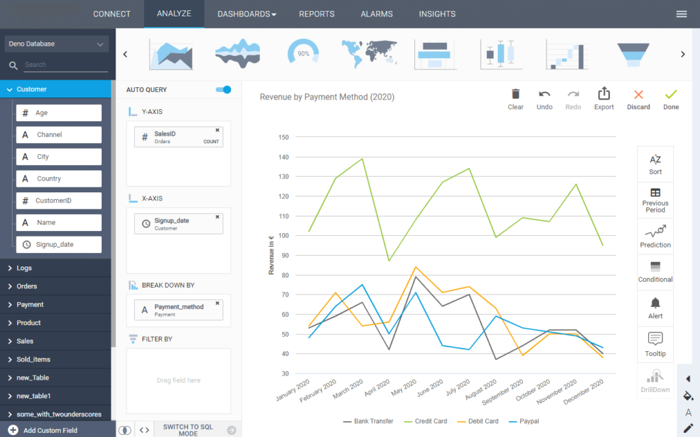

在线商业智能（在线 BI）是高管和决策者利用商业智能解决方案来准备、分析和共享他们的数据以提取可操作的见解并确保在线环境中的业务增长的过程。

在线 BI 的目的是提供更好的决策流程，同时通过 SaaS 解决方案，通过 Web 浏览器、移动设备和应用程序保护对移动数据的访问，从而使用户能够节省时间并提高生产力。[BI 报告](https://www.datafocus.ai/infos/business-intelligence-reporting)、在线分析处理、数据挖掘、流程挖掘、绩效管理、基准测试、预测性和规范性分析，BI 技术处理所有保存和存储在云托管环境中的大量数据，最终无论用户在何处都可以访问数据位于，并从任何设备。支持从战略到运营的广泛业务决策可以通过一个提供最佳信息管理解决方案的在线 BI 软件来完成。

在线商业智能可用于以下目的：

- **绩效管理：**业务领导者可以通过使用智能在线 BI 工具获得可操作的见解，该工具将告知他们衡量指标和基准测试如何实现其业务目标。
- **为您的员工赋能：**借助易于使用的 BI 在线工具，您会发现商业智能毫无压力。由于直观的拖放界面且无需 SQL 知识，您组织中的每个人都可以从强大的在线 BI 报告中受益。借助[BI 仪表板](https://www.datafocus.ai/infos/bi-dashboard-best-practices)在几分钟而不是几天内测量性能、跟踪生产力和预测趋势，他们需要的一切都触手可及。无论是哪个领域或部门，您都会发现组织中的每个决策过程都是战略性和数据驱动的。
- **高级分析：**通过数据挖掘、统计分析、预测性和规范性分析等各种分析选项，这些解决方案执行建立可持续发展所需的知识发现。
- **促进数据管理：**传统的数据管理方式需要大量的人工工作；IT 部门可能需要几个小时到几天才能生成一份报告。[借助包括专业数据连接器](https://www.datafocus.ai/infos/data-connectors)在内的在线 BI 工具，您只需单击几下即可将所有内部和外部数据源连接到一个访问点。这将使您有足够的时间专注于分析的重要部分：提取可行的见解以提高您的业务绩效。
- **智能报告：**商业智能可用于报告实践，以创建有效的策略，借助涉及数据可视化的交互式报告和直观而全面的[业务仪表板](https://www.datafocus.ai/infos/dashboard-examples-and-templates)带来新信息。
- **加强协作：**通过利用在线商业智能，部门、内部和外部利益相关者之间的协作变得易于处理和共享。一个简单的链接或登录使用户可以在一个集中点访问所有业务数据。
- **云存储：**借助在线环境，您不必担心仪表板或数据库会弄乱您自己的存储。在线 BI 工具基于云，并将您的所有仪表板、演示文稿和报告存储在它们自己的服务器中。这也使您可以从任何有互联网连接的地方访问您的数据。

各种规模的企业现在比以往任何时候都更需要强大、可靠且易于使用的商业智能解决方案。在分析是公司成功的关键，并且创建和积累的数据量达到前所未有的水平的时代，决策者、战略家和利益相关者了解其业务的各个方面至关重要。在线环境中商业智能的重要性通常与基于云的解决方案相关，这些解决方案不需要复杂的安装或大型 IT 支持或部门。

### 专业在线 BI 工具的优势

在线商业智能软件是一种易于使用的分析工具，旨在在一个中心位置分析您的数据。您可以从数据中轻松构建有意义的表格、图表和图形，并通过动态[BI 报告工具](https://www.datafocus.ai/infos/bi-reporting)和 KPI 仪表板分享您获得的见解。此外，您可以持续监控您的数据并快速执行临时分析，以确保您不会再错过任何商机。

当谈到在线商业智能工具时，我们知道是否投资的决定可能是一个复杂的决定。但是，BI 工具之所以成为您的组织必不可少的补充，有几个关键优势和功能：

- **提高全面决策的质量和速度：**使用功能强大的[KPI 报告软件](https://www.datafocus.ai/infos/kpi-reporting)，只需几分钟即可生成报告，您将受益数周；强大的解决方案可以将一些工作从决策中解脱出来。通过将数据整理、划分和排序成图表，准确显示您需要了解的内容，您的决策将变得更加精简和准确。
- **解决紧急问题并洞察增长：**利用商业智能进行[财务分析](https://www.datafocus.ai/infos/finance-analytics)、市场分析、销售机会、客户细分或[零售分析](https://www.datafocus.ai/infos/retail-analytics)，使用户无需高级 IT 知识即可管理和操作大量数据集。实时数据以几乎无限的方式展现洞察力；只需单击几下即可确定增长领域并衡量您的市场地位。此外，可以立即解决危机，在几秒钟内生成临时报告，并防止进一步的问题。
- **预测未来并获得全局：**借助数据可视化和仪表板，高级管理人员可以有效地、全局地查看整个公司的绩效。在人工智能技术的支持下，如果任何业务表现出现异常迹象，无论是积极的还是消极的，都会触发数据警报，这让您在监控成功方面具有优势。另一方面，预测分析算法将分析您的历史数据以发现趋势和模式，以预测您未来的绩效结果。在线 BI 工具提供的多维分析提供了可以跨部门共享并在几秒钟内生成的数据的动态概览。
- **受益于实时数据：**企业在处理数据时面临的启动问题之一是需要不断更新数据以提取新见解。商业智能在线解决方案为您提供实时数据，带来诸多好处。一方面，您将摆脱手动清理和更新数据的痛苦，另一方面，您将始终掌握最新的可用数据，以便您可以随时提取新的见解。
- **以交互方式可视化您的数据：**借助用户友好的界面，您组织中的每个人都可以创建自己的实时仪表板，并从强大的 BI 在线分析中受益。借助强大的数据可视化，您可以以引人入胜且易于理解的方式构建数据故事。您的[在线仪表板](https://www.datafocus.ai/infos/online-dashboard)包含多个过滤选项，使您能够在一个屏幕上完成整个分析过程，留下静态演示文稿，并有更多时间提取所需的业务洞察力。
- **保护您的数据：**战术数据安全管理确保公司数据在每个阶段、休息或使用中都受到保护和加密。实施了一系列数据安全措施和协议，以确保最高标准的数据完整性和保护。您的在线报告可以通过受密码保护的实时 URL 共享，您的仪表板可以设置特殊查看权限，以便查看者只能访问仪表板中的特定数据。使用专业的在线商业智能工具，始终确保安全。
- **从任何地方访问您的仪表板：**商业智能在线工具的另一个主要好处是您可以随时随地访问您的数据。无论您是在办公室还是在家里，您只需要一台具有互联网连接的设备，您就可以使用您的数据。仪表板可适应屏幕大小，因此您可以通过手机、iPad 或计算机对其进行可视化。
- **使用 SaaS 降低业务成本：**通过订阅计划，与本地解决方案相比，安装在线 BI 软件的成本要低得多，并且可以根据公司的特定业务需求进行调整。可扩展的定价模型使您能够为完全保持最新并定期检查的服务付费。由于在线 BI 工具根本不存在这些问题，因此消除了额外的基础设施成本。提供该工具的公司完全支持您。

与其他 BI 软件解决方案或高级[SQL 查询构建器](https://www.datafocus.ai/infos/sql-query-builder)工具相比，使用 datafocus 不需要 BI 专家或 IT 专业人员。我们的使命是向贵公司的所有个人和团队提供相关数据。这些数据可以存储在您自己的数据库中，也可以由不同的第三方提供商（例如 Google Analytics 或 Salesforce）生成。

我们易于使用的拖放界面是与大量公司（从小型初创公司到全球参与者）共同开发的，以确保我们提供直观且不言自明的软件。该工具中的智能抽象层将您的交互转换为数据库查询，由我们强大的专有分析引擎提供支持。此外，与市场上为数不多的其他[SQL 报告工具](https://www.datafocus.ai/infos/sql-reporting)不同的是，我们开发了智能算法来促进 SQL 查询构建过程并优化其质量和速度。通常，多维 SQL 查询和大数据集的分析需要技术人员提供昂贵的额外服务以及不同的软件。在这种情况下，datafocus 提供了快速、全面且廉价的在线商业智能软件。

### 使用我们的在线商业智能软件轻松分享生成的见解

根据我们的经验，我们知道，在许多公司中，只有一小部分员工可以访问他们做出合理业务决策所需的所有数据。我们授权管理、业务开发、控制和营销部门最终通过拖放界面自行生成查询和分析。通常，限制是没有适当的商业智能软件，或者个人不具备访问数据库和自行查询的技术技能。使用 datafocus，您甚至可以在没有任何 SQL 知识的情况下进行群组分析，例如，计算一段时间内或每个获取渠道的客户保留率。

事实证明，在线商业智能工具可以通过节省时间和 IT 资源来提高您的运营效率。我们知道等待分析结果或报告所花费的时间是浪费时间，因此我们的[KPI 仪表板软件](https://www.datafocus.ai/infos/kpi-dashboard-software)可让您即时了解您的数据，并按需提供自动化仪表板报告和情报。所有常用数据库均可在 10 分钟内完成集成。报告可以立即发送给同事。这意味着无需再花费数小时搜索信息，也无需在 IT 队列中等待。此外，您的分析结果（如表格和图表）可以在实时[BI 仪表板工具](https://www.datafocus.ai/infos/bi-dashboard-tools)的帮助下共享，这些工具生成自动报告，可与您的团队和/或外部利益相关者共享。

datafocus 的[SaaS BI 工具](https://www.datafocus.ai/infos/saas-bi)使您能够从任何地方通过云观察您的数据并生成重要的业务洞察力。您可以在 Web 浏览器中访问 datafocus，也可以通过智能手机或平板设备访问。我们在保持高数据隐私和安全标准的同时提供这种灵活性。因此，我们花费了很多资源来为我们的用户提供企业级安全层，就像在核心银行应用程序中使用的那样。我们的在线商业智能软件为您提供了一种直观而简单的方式来发展您的业务，让您始终了解您的业务动态。

通过注册我们的 14 天免费试用，了解 datafocus 的商业智能软件工具可以为您的组织实现什么——无需任何其他义务，或联系我们获取我们的 BI 咨询服务。测试我们的智能软件，您将亲身体验如何做出持久的改变，推动您的业务朝着正确的方向发展。
