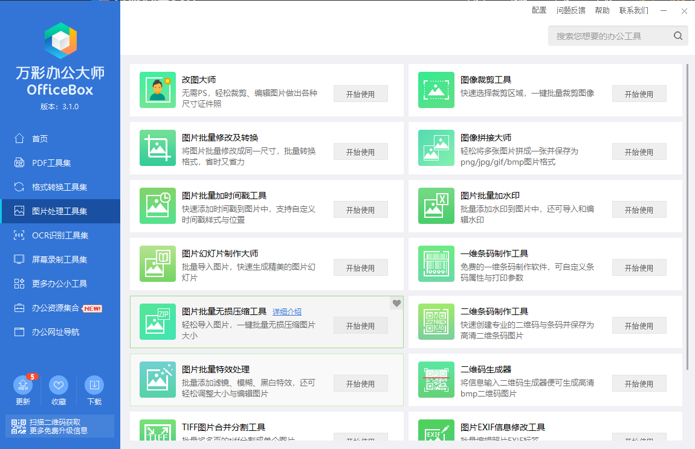
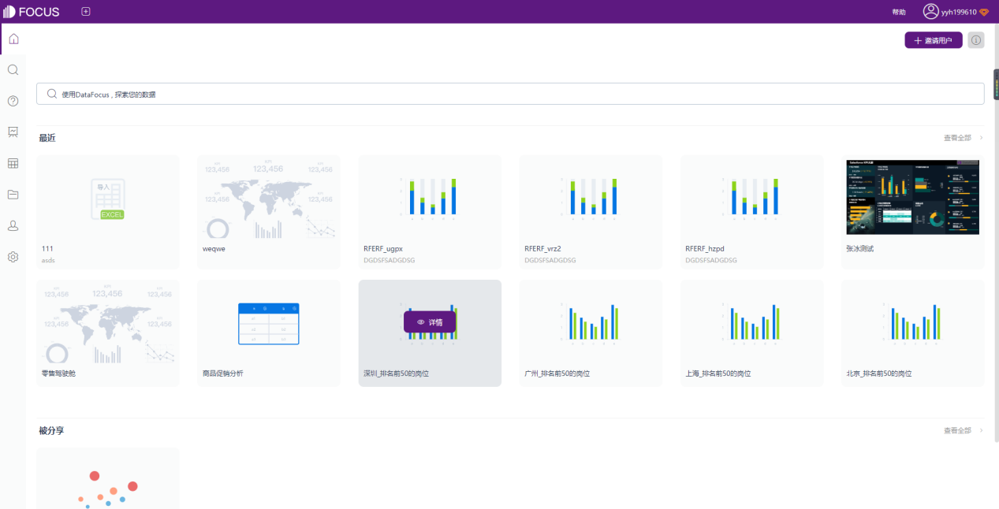
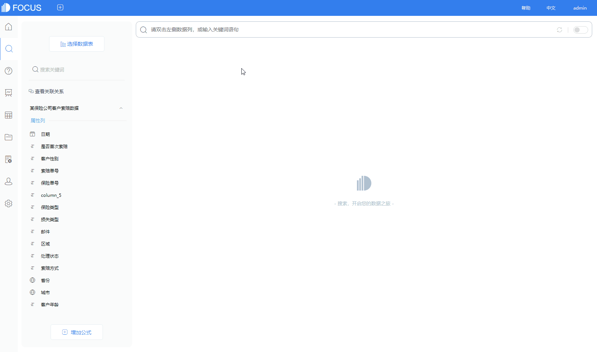
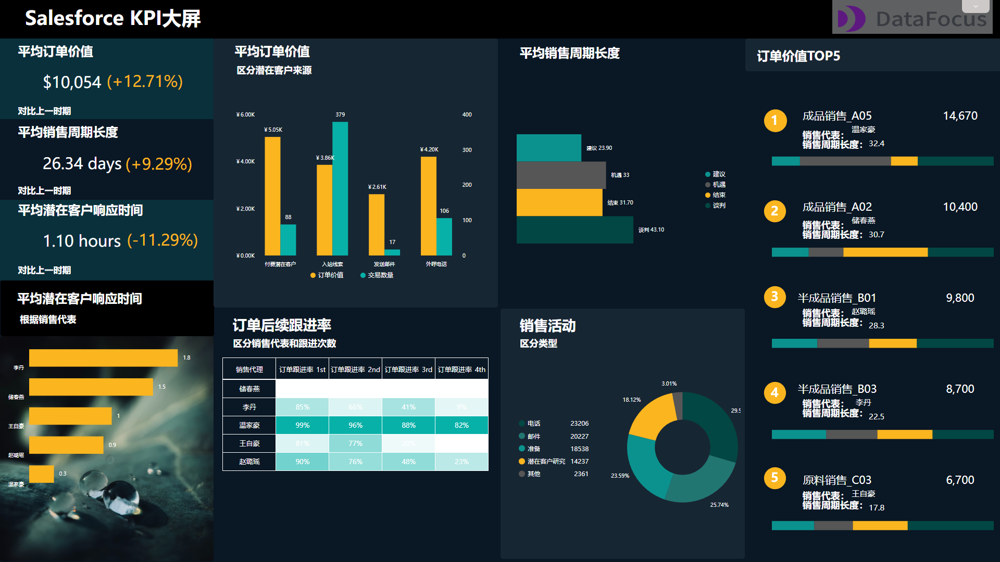

今天推荐4款非常实用的国产效率软件，无论是办公还是学习都一定用得上，每个都堪称珍宝。

**1.**

**格式工厂**

**轻松转换文件格式**

工作中常常会需要转换文件，常用的方法就是去百度搜索转换格式工具，但一般功能也不太齐全，而且转换速度还慢。

而格式工厂就是一款功能齐全、速度快的多媒体文件转换工具。

它支持几乎所有类型的多媒体格式，如视频、音频、图片等多种格式。而且在转换过程中，可以修复损坏的文件，文件质量不会有损耗。

它还额外支持iphone/ipd等多媒体指定格式，转换的图片也可以使用旋转、缩放、水印等功能。

而且这款软件是完全免费的，没有捆绑软件和太多的广告，界面也干净清晰。

**2.**

**万彩办公大师**

**PDF工具/万能格式转换/识别工具 小工具百宝箱**

很多时候有办公上的需求，常常会一个个地去搜索去找，找到后安装又需要下载一堆捆绑软件，不用了就立马卸载。

而万彩办公大师则是涵盖了60+个无广告及插件的办公小工具，无需安装直接启动即可。

其中包括PDF工具集、格式转换工具集、图片处理工具集、屏幕录制工具集等等。有要处理一些办公上遇到的小问题，就直接用这款软件就可以了。

比如想要把图片进行拼接，则点开图片处理工具集，找到对应的图像拼接大师，再选择好图片和顺序，就可以进行拼接了。

当然这款软件是完全免费的，不论个人还是企业，无需注册也无VPI。

**3.**

**DataFocus**

**搜索式数据分析，一键生成可视化图表**

****

工作中常常需要利用数据完成工作汇报、项目复盘等工作，复杂的数据分析步骤耗时又费力，大多数人整理了大半天数据，开始用Excel、PPT来做项目成果汇报，好不容易花了一周的时间做好了，领导又不满意，反复修改又是花费很久的时间。

而DataFocus是国内备受好评的**搜索式BI平台**，可以让我们**通过搜索就能实现数据分析**，并**一键生成可视化图表**，极大提升工作效率。

导入数据表后搜索数据关键词，系统即会以可视化图表的形式回应，短短几步完成数据分析，耗时甚至不到3分钟。

完成后还可以将完成的所有图表放置于一张大屏中，大屏中可以对**实时更新的数据进行联动、钻取等操作，分享的数据观点一目了然**。

最重要的是，这款软件个人版是免费的。

**4.**

**[夸克浏览器](https://www.zhihu.com/search?q=%E5%A4%B8%E5%85%8B%E6%B5%8F%E8%A7%88%E5%99%A8&search_source=Entity&hybrid_search_source=Entity&hybrid_search_extra={"sourceType":"answer","sourceId":"1105523375"}" \t "https://www.zhihu.com/_blank)**

**智能搜索，网盘下载不限速**

普通浏览器总是容易搜出一大堆没用的信息，尤其是广告。而且大多数浏览器界面都是花里胡哨，冗余的要素过多了。

这款阿里旗下高颜值的免费小众浏览器，叫夸克。搜索界面简单清新，打开、搜索速度都飞快，而且搜索出来的结果基本没有广告。

还有很棒的一点是夸克网盘下载速度非常快，最高能达1-5M/s，比起其它没开会员就只有几十k/s龟速的网盘，确实快很多。

**小结**

日日行，不怕千万里；常常做，不怕千万事。

相信坚持使用能优化工作效率的这些国产软件，必能看到工作成效。还有什么好用的国产良心软件可以推荐呢？欢迎评论区分享。
