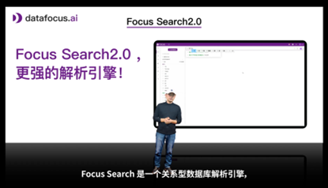

在现代商业环境中，数据分析已成为企业做出明智决策和保持竞争优势的关键。随着技术的进步，商业智能（BI）工具也在不断发展，从早期的静态报告到如今的动态交互式分析，再到最新的搜索式BI（ChatBI）。DataFocus作为这一领域的先锋，通过其创新的ChatBI技术，如Focus Search、智能助手小慧AI和FocusGPT，重新定义了数据分析的方式。本文将深入探讨DataFocus及其ChatBI技术，重点介绍其在自然语言处理（NLP）和数据库查询方面的先进技术。

## 一、DataFocus简介

DataFocus是一家专注于数据分析和商业智能解决方案的公司。其产品涵盖了数据可视化、数据挖掘和智能决策支持等多个领域。DataFocus致力于通过创新技术帮助企业更好地利用数据做出决策，提高运营效率和业务绩效。

### 主要产品

1. **Focus Search**：基于关键词搜索的智能数据查询工具。
2. **小慧AI**：智能问答助手，提供自然语言交互和数据分析功能。
3. **FocusGPT**：多轮问答功能，增强用户与数据之间的互动性。

## 二、Focus Search：关键词搜索的便捷性

Focus Search是DataFocus推出的关键词搜索工具，旨在通过简单直观的搜索功能，帮助用户快速获取所需数据。其核心特点在于用户只需输入关键词或简单的查询语句，系统便能自动解析并返回准确的数据结果。

### 1\. 关键词搜索功能

Focus Search通过NLP技术，能够理解用户输入的关键词或短语，并将其转化为数据库查询。无论用户是查询销售数据、库存情况还是财务报表，Focus Search都能迅速响应，提供精准的结果。

### 2\. 智能解析与推荐

系统不仅能处理简单的关键词，还能根据用户的查询习惯和历史记录，智能推荐相关的查询内容。这种智能推荐功能大大提高了用户的搜索效率和准确性。

### 3\. 数据可视化集成

Focus Search支持与DataFocus的数据可视化工具无缝集成，用户在获得数据结果的同时，还能通过多种图表和仪表盘进行直观展示。这种集成使得数据分析过程更加完整和高效。

### 应用场景

- **销售管理**：快速查询销售数据，分析销售趋势和绩效。
- **库存管理**：实时监控库存情况，优化库存水平。
- **财务分析**：查询财务报表和关键指标，支持财务决策。

## 三、小慧AI：智能问答助手

小慧AI是DataFocus推出的智能问答助手，旨在通过自然语言交互，使数据分析过程更加人性化和智能化。小慧AI不仅能理解用户的自然语言问题，还能提供详细的回答和数据分析结果。

### 1\. 自然语言处理技术

小慧AI采用了先进的NLP技术，能够理解用户提出的各种自然语言问题。无论是简单的问题，如“本月的销售额是多少？”还是复杂的问题，如“上季度各产品线的销售趋势如何？”，小慧AI都能准确解析并提供详细的回答。

### 2\. 智能问答与分析

小慧AI不仅能回答具体的问题，还能进行数据分析。例如，用户可以询问“本季度的销售额增长率是多少？”，小慧AI会自动计算并返回结果。同时，系统还能生成相关的图表，帮助用户更好地理解数据。

### 3\. 个性化交互

通过学习用户的行为和查询习惯，小慧AI能够提供个性化的回答和建议。例如，当用户频繁查询某一类数据时，系统会优先推荐相关的分析内容。这种个性化交互大大提高了用户体验和分析效率。

### 应用场景

- **客户服务**：为客户提供即时的数据信息和问题解答。
- **业务分析**：支持业务分析人员进行详细的数据查询和分析。
- **管理决策**：帮助管理层快速获取关键信息，支持决策制定。

## 四、FocusGPT：多轮问答的高级功能

FocusGPT是DataFocus推出的多轮问答工具，基于先进的GPT技术，进一步增强了用户与数据之间的互动性。FocusGPT能够理解复杂的对话上下文，通过多轮对话实现深入的数据查询和分析。

### 1\. 多轮对话技术

FocusGPT利用GPT-4技术，支持多轮对话。用户可以连续提问，系统能够理解上下文关联，提供连贯的回答。例如，用户可以先询问“去年第三季度的销售额是多少？”，然后进一步询问“与前年同期相比增长了多少？”，系统会理解前后问题的关联，提供准确的回答。

### 2\. 高级数据分析

通过多轮对话，FocusGPT能够进行更复杂的数据分析。例如，用户可以通过连续提问，逐步深入了解某一业务领域的详细数据和分析结果。系统能够根据用户的需求，自动生成详尽的报告和图表。

### 3\. 自然语言到SQL的转化

FocusGPT通过先进的NLP技术，将用户的自然语言查询转化为SQL语句，直接查询数据库。这种技术不仅提高了查询的准确性，还极大地提升了系统的响应速度和数据处理能力。

### 4\. 灵活的集成与扩展

FocusGPT支持与企业现有的数据系统和应用程序进行集成，无论是ERP系统、CRM系统还是自定义的业务应用，都能方便地接入FocusGPT进行数据查询和分析。此外，系统还支持定制化开发，满足企业特定的业务需求。

### 应用场景

- **高层决策支持**：帮助管理层通过多轮对话深入了解业务数据，支持战略决策。
- **市场分析**：通过连续提问，深入分析市场趋势和客户行为。
- **运营优化**：通过多轮对话，详细了解运营数据，发现问题并优化运营流程。

## 五、DataFocus在自然语言到数据库查询领域的先进技术

### 1\. 自然语言处理（NLP）

DataFocus在NLP领域的技术优势显著，系统能够处理各种复杂的自然语言查询，准确理解用户意图。无论是关键词搜索、智能问答还是多轮对话，NLP技术都是其核心。

### 2\. SQL自动生成

DataFocus的系统能够将自然语言查询自动转化为SQL语句，直接查询数据库。这一技术不仅提高了查询的准确性，还增强了系统的处理能力，使其能够高效应对大规模数据查询。

### 3\. 机器学习与智能推荐

通过机器学习算法，DataFocus能够分析用户的查询行为和数据模式，提供个性化的推荐和分析建议。这种智能推荐功能不仅提高了用户的分析效率，还帮助用户发现数据中的潜在价值。

### 4\. 实时数据处理

DataFocus支持实时数据处理和分析，用户可以随时查询最新数据并做出及时决策。这种实时性对于快速变化的商业环境尤为重要，帮助企业保持竞争优势。

## 六、结论

DataFocus通过其创新的ChatBI技术，如Focus Search、智能助手小慧AI和FocusGPT，重新定义了数据分析的方式。凭借先进的自然语言处理技术、SQL自动生成、机器学习和实时数据处理能力，DataFocus为企业提供了强大的数据分析工具，帮助用户以更加直观、便捷和高效的方式利用数据做出明智决策。未来，随着技术的不断发展，DataFocus有望在更多领域发挥重要作用，为企业的数字化转型和业务创新提供有力支持。
