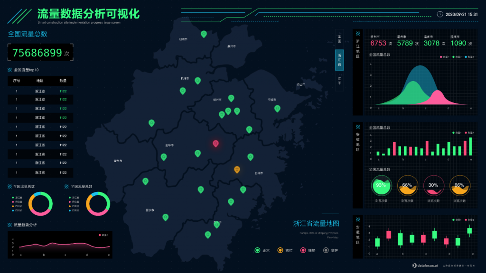

# 从云数仓获取更多价值的 3 种方法

云已成为每个组织数据存储、处理和计算的重要核心。它也成为公司实施或升级新数据仓库的默认值。

云的灵活性和轻盈使云数据仓库使用起来不费吹灰之力。鉴于包括 ETL/ELT 在内的整个云技术生态系统的兴起，将数据输入这些仓库从未如此简单。

然而，将这些数据转化为有价值的见解并非易事。根据 NewVantage 相关数据显示，只有24%的公司表示自己已经成为数据驱动型公司。实现数据的实际价值仍然是许多组织面临的挑战。

以下是利用云分析实现云数据仓库价值最大化的三种方法。

### 节省实施时间

将数据放入云数据仓库是一个耗时的过程。它需要测试、评估，然后经过仔细考量和斟酌移动公司最有价值的资产——数据。

通过云分析，您无需再次完成所有这些复杂的设置工作。相反，您可以快速连接到云数据仓库，并开始将解决方案扩展到不同的团队。更妙的是，如果您找到连接到多个云数据仓库的云分析解决方案，您可以在数据存储的地方启动无限使用案例。

### 将云数据桥接到业务用户

正如《哈佛商业评论》的研究表明，87% 的领导者表示，当他们授权一线员工做出数据驱动决策时，他们的组织将更加成功。然而，大多数分析解决方案仍然需要深厚的技术专长。这在数据和业务团队之间造成了同样的瓶颈，几十年来，这些瓶颈一直制约着分析的使用。在云驱动的世界中，这种速度和个性化障碍可能是灾难性的。

现代云分析提供了直接与云数据仓库接洽的新方法。通过搜索等直观的界面，任何商务人士都可以找到见解并做出更好的决策。企业用户可以自由地浏览数据、深入挖掘和回答自己的问题，而无需学习专业技能。

### 站在创新的前沿

虽然云分析今天提供了卓越的价值，但整个数据生态系统的变化速度从未像现在这样快。随着新功能的不断引入，简单的云分析技术无法满足组织需要的创新。

现代云分析为企业提供了实施这些新技术的无缝体验。云分析不是重新部署或等待新的软件安装，而是将最新的功能直接带到指尖。而基于消费的定价，你只支付你使用的东西，并发现有价值的。

释放云数据的力量，立即试用DataFocus Cloud！
