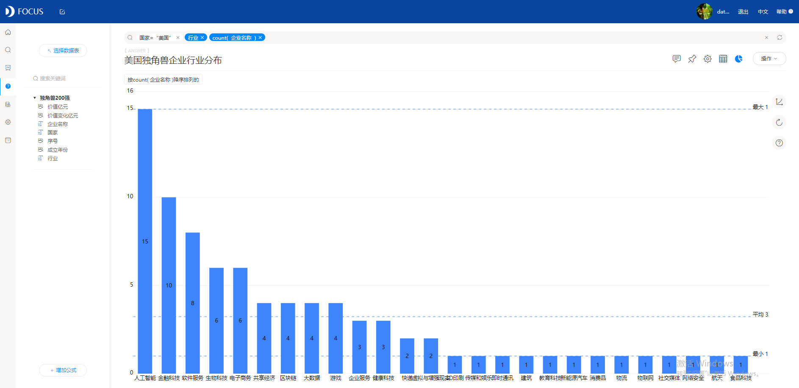

数据来源：胡润研究院、中商产业研究院

今年，胡润研究院发布了《2020胡润全球独角兽榜500强》，中国有227家独角兽企业上榜，仅次于美国的233家，中国独角兽企业较上年增加21家。全球十大独角兽企业分别是蚂蚁集团、字节跳动、滴滴出行、陆金所、SpaceX、Stripe、爱彼迎、快手、菜鸟网络、帕兰提尔科技，其中有6家来自中国。

其中，独角兽企业中的前200强的实力更是不容小觑。今天，小编就带大家一起使用DataFocus软件，分析一下独角兽企业的分布情况吧。

> 1、前200强分布情况

首先看各国分布情况，其中美国有84家，占比42%，中国有65家，占比32.5%。随后是印度、英国和印度尼西亚。

再看行业分布情况。前200强的独角兽企业中，占比最多的行业是金融科技、电子商务，以及近几年大热的人工智能和共享经济。

再看成立时间。从生成的面积图中可以直观看出，前200强的独角兽企业中，成立时间在2012年到2016年最多，大多独角兽企业的成长速度都非常迅速。

最后看一下各国独角兽企业的平均市场估值。其中马来西亚以单家企业950亿美元的估值排名第一，除此之外，中国的独角兽企业平均市值超700亿美元，稳居第二，足见中国独角兽企业的强劲实力。

> 2、中美独角兽企业的对比分析

中国与美国都是独角兽企业大国。两国的独角兽企业又有哪些差异呢？不如一起看一下。

首先看中国独角兽企业的行业分布情况。电子商务、金融科技、人工智能、传媒和娱乐、新能源汽车、物流都是目前的热门行业。

再看美国独角兽企业的行业分布情况。人工智能、金融科技、软件服务排名前三，目前美国人工智能行业的独角兽企业众多，整体估值也超过中国。

最后看1年内价值增长超过100亿元的独角兽企业。美国占比60%，中国占比15%，其次是印度。可见自2019年-2020年美国的独角兽企业整体发展增速较快。

其中，中国企业中，估值增长最快的分别是字节跳动、快手、菜鸟网络、贝壳、京东健康、猿辅导。

相信细心的朋友已经发现，**在DataFocus中制作图表时，小编是直接在搜索框中输入关键词实现的**，比如想要了解价值增长超过100亿元的企业，直接输入价值变化亿元大于100、国家、count(企业名称)就可以实现了，几秒钟就能出图，非常方便。

不如你也来试着做一下吧，相信你会有不一样的发现。了解更多DataFocus信息，欢迎留言咨询或访问官网。
