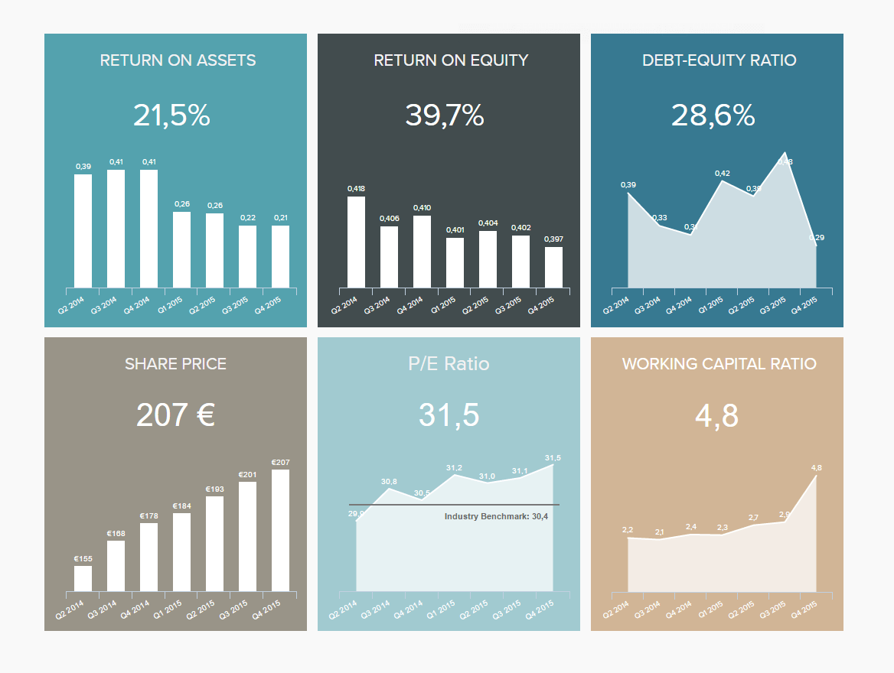
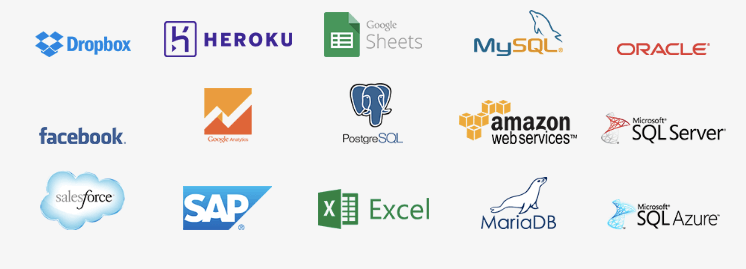

_“BI 就是指在正确的时间向正确的人提供正确的数据，以便他们做出正确的决定”——尼克·史密斯_

数据分析不再是大公司的专利。各种类型、规模和行业的企业、组织和项目都可以使用它。数据分析和[商业智能](https://www.datafocus.ai/infos/bi-skills-for-business-intelligence-career)的力量是普遍的。

在信息时代，具有前瞻性的组织正在通过利用创新的新商业智能 (BI) 解决方案的能力达到了令人兴奋的新水平。成功的故事似乎无穷无尽。

凭借基于 BI 的实力，这些组织证明了使用[在线数据分析](https://www.datafocus.ai/infos/data-analysis-tools)来增强组织的流程和战略的好处。这些好处包括成本效率、优化库存水平、减少信息浪费、增强营销沟通和更好的内部沟通——以及许多其他促进业务发展的改进。

但是，虽然 BI 是组织成功的真正驱动力，但正确使用它，也会遇到相当多的障碍。

在这里，我们将探索 BI 挑战的动态，并着眼于当今企业家和公司领导者面临的 10 大商业智能问题。在此过程中，我们旨在让您深入了解需要注意什么以及如何应对商业智能的核心挑战，一次一项举措。

让我们开始吧！

## 企业家和商业智能挑战

[小型企业在商业智能](https://www.datafocus.ai/infos/business-intelligence-for-small-business)领域取得了一定程度的成功。

“一般来说，我们发现小型组织是较早采用商业智能的机构，对商业智能的成功估计最高。” Dresner Advisory Services 创始人兼首席研究官Howard Dresner说。为了成长、保持竞争力和成功，小企业需要保持敏捷和创新。他们需要做出快速和明智的决定。他们需要最大限度地利用有限的资源。企业家是商界的牛仔。他们经常根据直觉和小数据做出这些决定。最优秀的企业家将直觉与分析相结合。他们越来越多地通过更新的、适应性更强的[在线 BI 工具](https://www.datafocus.ai/infos/online-bi-tools)及其提供的跨组织集成能力进行交流和开展业务。

尽管 BI 已帮助无数公司做出更明智的数据驱动决策，但它尚未得到普遍采用。

尽管 BI 取得了这些成功，但企业家仍然面临商业智能方面的挑战。许多企业家在使用传统（通常是过时的）BI 方法时遇到了商业智能问题。这些过去的 BI 问题可能会阻碍他们采用企业范围的 BI 软件。许多人还对从哪里开始感到不知所措，担心成本和工作量，并对商业智能失败的故事感到沮丧。“高达 70% 的 BI 实施最终未能实现所有业务目标，”Gartner 表示，因此企业家们担心也就不足为奇了。

## 商业智能的 10 大挑战

既然我们已经概述了当今雄心勃勃的商业领袖和企业家所面临的内在 BI 挑战的动态，让我们更深入地研究一下。

事不宜迟，以下是当今数字世界中商业智能的十大挑战，以及如何使用现代软件来解决这些问题。

### 1) 成本太高且难以证明 BI 的投资回报率

各地的预算和资源都很紧张，尤其是对小企业而言。部署 BI 的价格是中小型企业 (SME) 最关心的问题。购买合适软件的高昂成本使中小企业望而却步。此外，有限的资源使得寻找合格的专业人士，如数据科学专家、IT 基础设施专业人士和咨询分析师，变得不切实际和令人担忧。对部署 BI 软件所需的昂贵基础设施投资的担忧加剧了这些阻碍。过去，昂贵的企业 BI 解决方案需要大量的硬件资源。除了增加部署成本之外，设置这些数据仓库和处理器还影响了昂贵的 IT 劳动力资源。

[随着通过 BI 平台自助分析](https://www.datafocus.ai/infos/self-service-analytics)的兴起，成本不一定是商业智能的挑战。著名专家Mike Ferguson已经看到这些工具是如何帮助企业家并消除对昂贵 IT 支持的需求。“毫无疑问，今天，[自助式 BI 工具](https://www.datafocus.ai/infos/self-service-bi-tools)已经在许多业务领域扎根，业务分析师现在可以创建自己的报告和仪表板，而不是等待 IT 为他们开发一切。”

企业家正在转向商业智能以提高运营效率并节省资金。他们还需要这些工具来产生真正的投资回报率。如果公司是一家初创公司并且需要对董事会和投资者负责，这一点尤为明显。查看下面的投资者关系仪表板示例，这是我们[管理仪表板](https://www.datafocus.ai/infos/dashboard-examples-and-templates-management)系列的一部分：

_\*\*点击放大\*\*_

正确的商业智能工具对于销售是更轻松的投资回报。与其他工具相比，主要好处是降低了实现成本：基础设施、培训和 IT 支持。可以轻松实现强大的仪表板，通过简单的数据切片和切块，可以快速突出潜在的节省和利润。可以轻松更新无效的仪表板以专注于业务需求。可以很容易[推出战略、运营、分析和战术仪表板](https://www.datafocus.ai/infos/strategic-operational-analytical-tactical-dashboards)， 以便每个仪表板讲述一个有凝聚力和重点的数据故事。

很可能，企业目前正在分析他们的数据，只是没有以最有效的方式。[是时候通过使用交互式仪表板](https://www.datafocus.ai/infos/interactive-dashboard-features)来节省宝贵的人力资源并摆脱静态电子表格了。仅从生产当前报告节省的时间和减少的成本所产生的ROI就会提高你的底线。

像DataFocus这样的敏捷、创新和[云 BI](https://www.datafocus.ai/infos/cloud-bi)软件解决方案允许小型企业获取他们需要的数据，而无需任何人支付大量现金进行部署——这是商业智能投资回报的明显事例。小型企业现在可以选择提供可扩展解决方案的 BI 供应商，这些解决方案不需要大量的 IT 支持，并且可以以合适的价格交付。

### 2) 缺乏全公司采用

BI 实践的脱节和普遍采用的失败是一个关键的商业智能挑战。在过程的早期，获得所有涉众的认同是至关重要的，以使每个人都站在同一立场上。为此，您需要开发一组业务需求和目标。不要在封闭状态或仅在管理层开发这些。咨询关键利益相关者，包括 IT、财务、营销、销售和运营。明确的目标和预先确定的关键绩效指标将有助于指导成功采用 BI。尽管有各种[KPI 示例](https://www.datafocus.ai/infos/kpi-examples-and-templates)，但您应该只选择最适合您的部门或行业的示例。

可能会有阻力。在小型企业中，数据文化可能还不存在。部门可能会因缺乏时间、数据敏锐度和资源而气馁，并不愿鼓励企业采用BI。他们可能没有看到采用成本超过收益。

他们需要看到基于云的企业级 BI 工具的实际应用。正确的工具将使整个组织团队受益。这些工具允许广泛的用户轻松连接、交互、可视化和交流他们的数据。简单的搜索分析方面需要很少的培训，也不需要数据分析或 SQL 技能。企业家不必担心通过广泛的培训和认证扩展有限的人力资源的事情。

正确的 BI 软件可以提供富有洞察力和可操作性的信息，而无需数据科学家收集、准备和分析复杂数据并将其处理成管理层可以理解的报告。在小型企业中为员工提供他们可以立即使用的仪表板，可以促进其采用并确保BI的成功。

### 3）分析来自不同数据源的数据

在Matillion进行的一项调查中，27.4% 的受访企业表示，跨多个系统或数据源进行报告/分析是他们面临的最大挑战。您的企业，无论规模大小，都可能正在收集有关业务运营的数据。问题是这些数据通常分布在各种不同的系统和软件中。数据可以存储在各种 ERP 系统、CRM、数据库和 Excel 电子表格中。由于数据分布在多个系统中，因此获取所需信息可能是一项艰巨的任务。

企业家们正在转向创新的 BI 工具来解决这个商业智能问题。这些工具可以轻松地即时合并不同的数据集，而无需重组数据库或建立数据仓库。[这允许小型企业在数据连接器](https://www.datafocus.ai/infos/data-connectors)的帮助下连接其所有数据源，并超越数字，发现新关系并检测趋势，从而从重要的业务决策中摆脱猜测。

### 4) 企业没有衡量正确的指标

组织可以快速衡量[财务 KPI](https://www.datafocus.ai/infos/kpi-examples-and-templates-finance)，但不幸的是，他们经常止步于此。虽然这些指标很重要，但它们通常在年底或季度末进行衡量，并且在本质上是相当被动的。再次强调，它们是衡量和报告的关键，但中小企业应加强监测。这就是全面的 BI 计划有助于组织成功的地方。广泛使用适当的 KPI 来衡量进度和绩效非常重要。这些数据可用于对内部或跨部门/办公室进行基准测试。这些数据还可用于比较公司与业内其他公司的业绩。

在线[KPI 仪表板软件](https://www.datafocus.ai/infos/kpi-dashboard-software)可以减轻 中小企业有限资源的负担。该软件使企业家能够根据自己的个人需求可视化和分享他们的数字。

### 5) 提供基于移动的 BI 绝非易事

我们生活在一个移动时代。随着世界上移动设备的数量超过人类，生产工作、计划、共享信息或项目协作的日子已经一去不复返了。

我们向移动时代的超连接转变意味着对基于移动的 BI 解决方案的需求从未如此强烈。但随着基于商业智能的需求而来的是商业智能问题。

在快节奏、竞争激烈的数字环境中，企业领导者必须能够全天候获取数据驱动的报告和洞察力。虽然开发针对移动设备优化的 BI 解决方案可能是一项开发挑战，但通过使用正确的交互式商业智能平台，无论您身在何处，都可以登录并从移动设备中获取宝贵的见解，而不会丢失任何关键特性或功能。

您基于移动设备的商业智能问题已解决。

### 6) 提供真正的自助服务分析

当今企业面临的最大 BI 挑战之一是如何从真正的自助数据分析解决方案中获益。

在起步阶段，基于 BI 的数据解决方案很难驾驭，只有拥有高级技术知识的人才可以使用。这个最紧迫的 BI 问题意味着从数据中提取可操作见解的过程将是缓慢且碎片化的，信息在到达你的收件箱之前通过传递线传递。

交互式[BI 仪表板工具](https://www.datafocus.ai/infos/bi-dashboard-tools)的进步意味着您可以在众多移动设备上访问关键见解。当今最好的解决方案都是直观、可视化且易于掌握的，这意味着您无需依赖组织内的其他任何人来获取有助于您的企业蓬勃发展的信息。

### 7) 处理数据质量差的影响

确实，我们生活在信息时代，近年来产生的数据比历史上任何时候都多。但是，当我们在数据中畅游时，随着这种洞察的涌现，饱和度随之而来。

在当今的数字世界中有如此多的数据可用，因此筛选并挖掘可帮助您提高业务成功率的黄金信息是当今最困难的商业智能问题之一。

与 BI 相关的现代数据过剩有两个突出的问题：

- 重要数据被深埋在系统、应用程序和平台中，因此被丢失或遗漏。
- 以 BI 为中心的系统和来源提供糟糕、不准确和令人费解的数据驱动的洞察，最终会浪费时间和金钱，同时取得惊人的进展。

为确保避免有害数据，您需要制定适当的策略来促进整个组织的质量控制。

除了使用与您的业务内的特定需求、目标和计划相一致的动态 KPI 之外，您还应该采用[数据质量管理](https://www.datafocus.ai/infos/data-quality-management-and-metrics)(DQM) 方法，并鼓励业务内的其他人效仿。

### 8) 缺乏清晰定义的 BI 策略

当今企业家或商界领袖面临的最容易被忽视的商业智能挑战之一是，尽管可以访问大量促进风险投资的优质数据，但这些洞察背后却严重缺乏战略。虽然这比单独“凭直觉行事”要好，但如果没有明确的数据驱动策略，你仍然是在黑暗中”狩猎”。

使用促进交互式数据可视化的强大 BI 仪表板，您应该制定战略路线图，以帮助您确定数据的方向、流动性，并在整个组织中增加价值。

任何可靠的 BI 路线图都始于检查您现有的流程以及定义您的关键信息涉众开始的，并最终选择最适合工作的工具。为了引导您完成整个过程，我们有一份 11 步[商业智能策略](https://www.datafocus.ai/infos/roadmap-to-a-successful-business-intelligence-strategy)指南可供参考。

### 9) 较差的 BI 功能和交互性

如前所述，交互式[数据仪表板](https://www.datafocus.ai/infos/data-dashboards-definition-examples-templates)具有许多内置特性和功能，可以快速、简单且有效地从数据中提取洞察，从而解决了最常见的数据共享过程缓慢的 BI 问题。

许多企业都面临着这个问题，因为人们需要从多个来源收集、整理和分析数据，这些来源通常来自手工操作非常少且缺乏交互性的平台或程序。通常情况下，糟糕的流程和功能会导致不准确、效率低下和代价高昂的错误，这些错误可能会阻碍业务的发展。

通过使用交互式 BI 仪表板，您将能够超越 Excel、PowerPoint 和其他静态[报告工具](https://www.datafocus.ai/infos/online-reporting)之类的工具，获得直观的、交互式的可视化数据，从而帮助您获得应得的结果。

### 10) 查询和数据库性能缓慢

最后，我们转向第十个，可能也是最令人恼火的商业智能问题：查询或数据库性能缓慢。

作为迄今为止报告最广泛的 BI 挑战之一，缓慢的数据库性能会导致许多内部挑战，包括商业智能安全问题、碎片化的流程、部门间沟通不畅和严重的报告滞后。当然，这些问题都对企业不利。

无论您属于哪个领域或行业，时间都与金钱相关——这意味着随着时间的推移，糟糕的查询性能或缓慢的数据库响应将使您付出巨大的代价。

不仅要对数据进行质量控制并为分析做好充分准备，而且要集中最有价值的见解，以便进行快速、有凝聚力的数据分析。

通过利用强大的[数据存储仓库](https://www.datafocus.ai/infos/data-storage)的强大功能 ，并与一个可以直观的集中位置访问所有与业务相关的见解的高性能平台合作，您将提高整体业务绩效，同时消除数据性能不佳的障碍。

此外，确保您的数据具有凝聚力且紧密联系，始终保持数据安全可靠，将克服任何潜在的商业智能安全问题。

_“你可以有数据而没有信息，但你不能没有数据而有信息。” ——__丹尼尔·凯斯·莫兰_

## 克服最紧迫的 BI 挑战

如您所知，商业智能的挑战是存在的，如果它们出现了，您需要竭尽全力正面应对。

在我们的数字时代，有很好的工具可以解决这些固有问题，您可以利用它们来发挥自己的优势。创新的解决方案都是简单和高效的——这正是现代商业智能所提供的。

随着自助服务数据驱动平台的到来，中小企业和初创企业现在可以享受到大量可操作、快节奏的商业智能解决方案，尽管它们缺乏大公司的购买力。在现代，数据驱动的竞争环境相对公平，是时候开始竞争了。

正确的软件即服务 ( [SaaS 商业智能](https://www.datafocus.ai/infos/saas-bi)) 平台，如 DataFocus，消除了许多挑战——包括成本、采用、不同的数据结构、缺乏技术专业知识等问题。

更少的 BI 挑战意味着您将能够将更多时间用于做企业家喜欢和最擅长的事情：发展他们的业务。要在实践中看到这一点，您可以试用我们的商业智能软件，[试用 30 天](https://www.datafocus.ai/console/)，完全免费！

总而言之，以下是 10 大商业智能挑战：

1. 成本太高，很难证明BI的ROI是合理的
2. 缺乏全公司的采用
3. 分析来自不同数据源的数据
4. 企业没有衡量正确的指标
5. 提供基于移动的 BI 绝非易事
6. 提供真正的自助式分析
7. 处理数据质量差的影响
8. 缺乏清晰定义的 BI 策略
9. BI 功能和交互性差
10. 查询和数据库性能缓慢

欢迎来到未来。
