根据消费行为对客户进行分级 （1）传统商业数据分析 传统商业数据分析从产品销售结果出发，主要注重销售数量、销售金额、单品销售利润等等，通过统计上述指标，来做一些企业日常决策。 从传统商超销售数据统计图（图14-1）中可以看到熟食类的销售量最多，结合观察不同类商品的销售金额和销售频次，可以看到消费金额较高的产品来自销售量较小的珠宝和女性服装以及销售相对中频的化妆品。从中得出女性市场商品的单价高，同时销售额也高的结论，这和销售市场的基本情况相对一致，表明这个销售数据表现较为正常。 传统的商业分析可以对产品的生产和配置、经营状况进行追踪和了解。在信息爆炸的时代，人手一只手机实时接收各类信息，而企业如果还停留在查看昨天的销售数据阶段，显然已经落后了。如今，卖方市场竞争激烈，因此仅从产品出发的信息开始不足以支持企业的进一步决策了。经营者需要另辟新角度切入分析，以获得更多的信息。 这里就要说到消费者行为分析。对客户的深入探索是商业分析的永恒主题。首先企业需要针对消费者进行特征分析，基于此实现消费人群的精准营销。延伸而来的就是如何平衡营销成本和营销获利、如何给消费者提供更好的服务等来增加企业的竞争力。但是所有策略实施的前提，都是根据消费者行为对客户进行分群。

图14-1 商超销售数据统计

（2）基于客户维度的商业指标分析 营销过程中产生的客户行为的信息量很大，我们不可能对用户逐个进行分析，这时候我们需要一种更合理的归纳方式。按行为的差异将客户进行分群，从而探索不同群体的代表特征，实现不同群体的精准营销。比如，综合考虑会员的销售金额、销售数量，将客户划分为 4个群体，了解不同客户群的消费能力和购物的品类结构等，如图14-2。

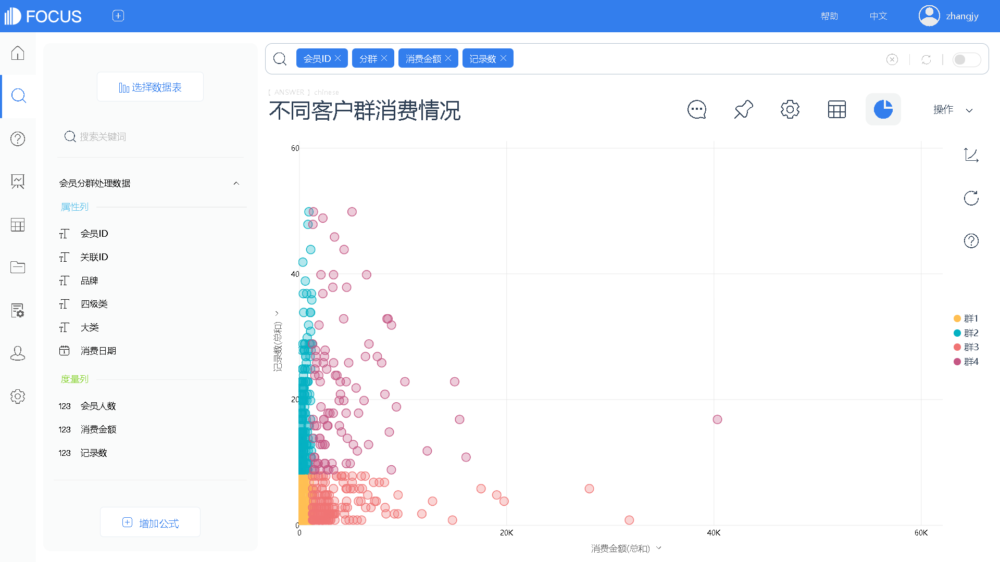

图14-2 不同客户群消费情况

我们分别观察每个群集在不同大类上的购买数量和购买金额情况，可以方便观察不同群体在不同类上的购买分布，如图14-3。

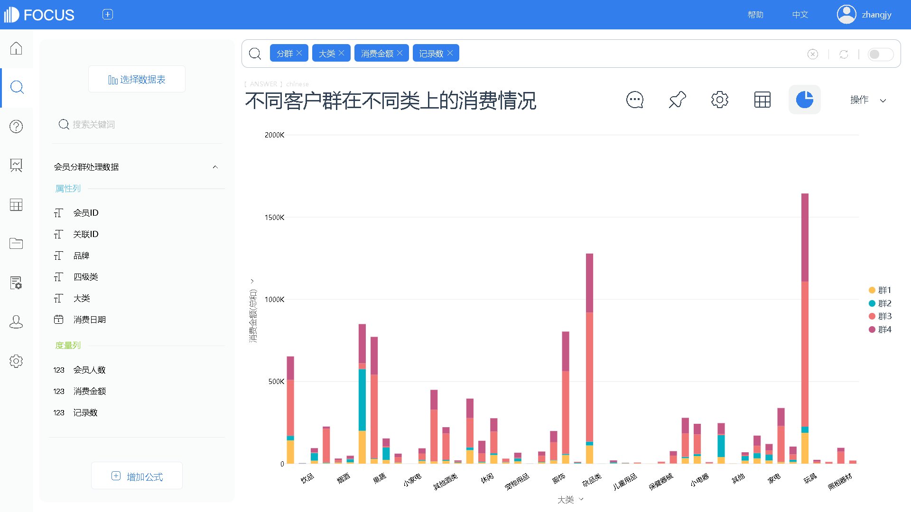

图14-3 不同群体在不同类上的消费情况

我们也可以筛选出单个群集，这样的数据观察会相对清晰。例如我们筛选出群2的行为模式，可以看到他们在不同大类上的消费情况，如图14-4。

图14-4 群2在不同大类上的消费情况

最后我们组合群集消费图表构建一个综合观察数据看板，根据数据更新随时跟踪观察经营状态，如图 14-5。这样就可以根据数据变化，及时调整群集的划分标准，探查更多的客户群行为特征来支持商业决策。

图14-5 客户画像数据看板

5.2 技术实现：应用DataFocus实现14.1的分析 （1） 导入数据，如图 14-6 和图 14-7。单击“导入表”选择导入本地数据→在弹出的对话框中选择xls格式文件→选择“会员分群数据.xls”文件→单击打开按钮→选择上传→确认数据列信息无误后，点击“确定”，完成数据的导入。

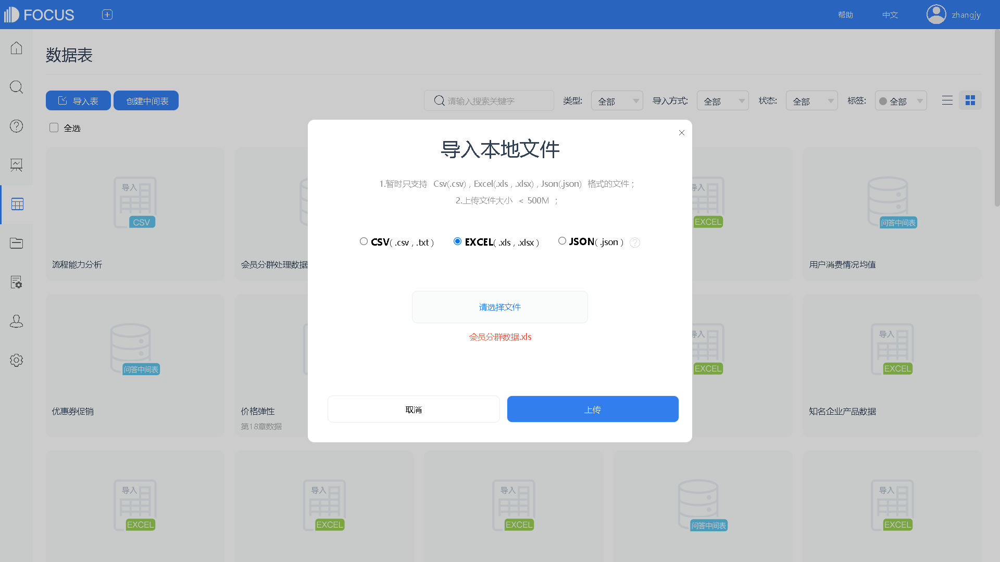

图14-6 选择导入的数据

图14-7 导入数据编辑

（2）构建“会员人数”字段，如图14-8。进入搜索页面→选择数据表“会员分群数据”→单击“增加公式”→输入公式内容：unique\_count（会员 ID）→将新字段命名为“会员人数”→单击“确定”，完成新字段构建。

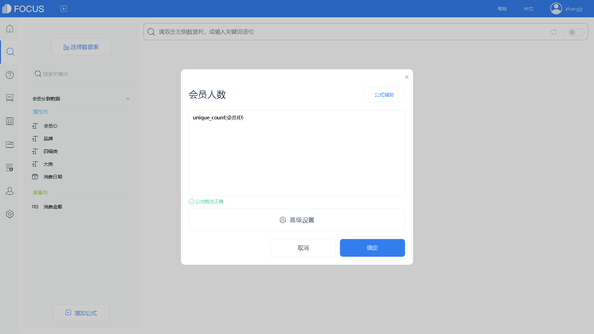

图14-8 构建“会员人数”字段

（3）构建“记录数”字段，如图14-9。单击“增加公式”→输入公式内容：count（会员ID）→将新字段命名为“记录数”→单击“确定”，完成新字段构建。

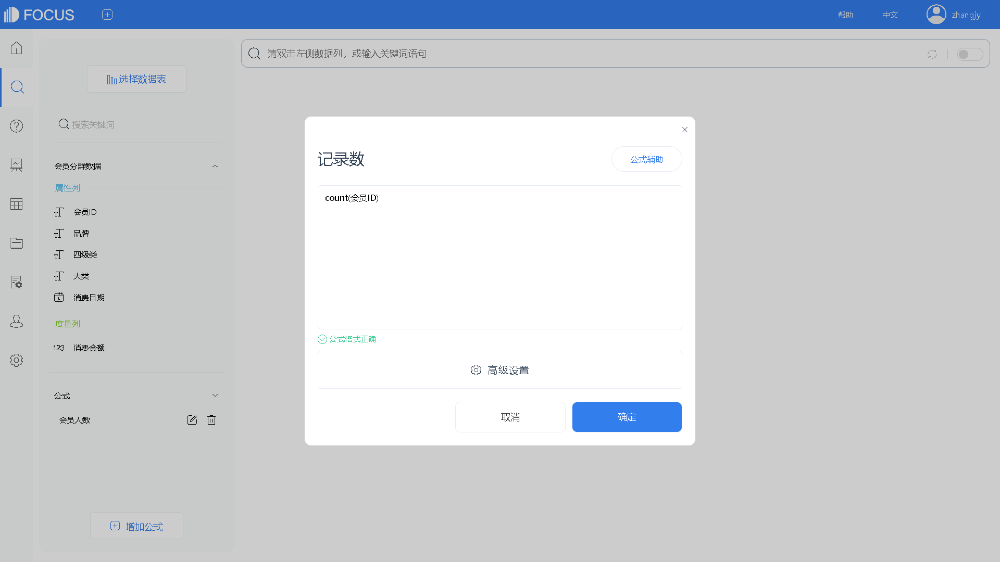

图14-9 构建“记录数”字段

（4）构建“人均记录数”字段，如图14-10。单击“增加公式”→输入公式内容：记录数/会员人数→将新字段命名为“人均记录数”→单击“确定”，完成新字段构建。

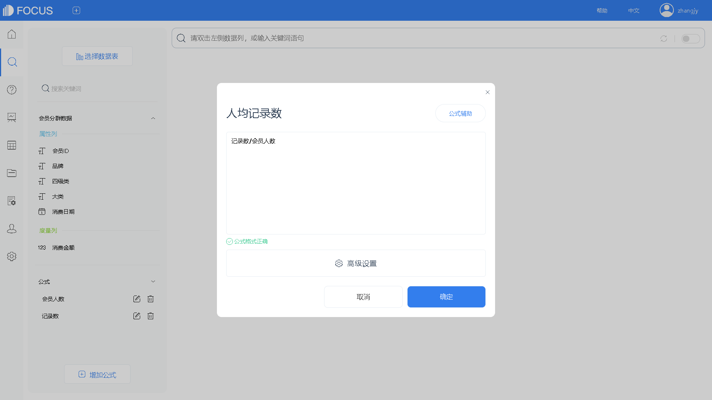

图14-10 构建“人均记录数”字段

（5）构建“人均消费额”字段，如图 14-11。单击“增加公式”→输入公式内容：sum（消费金额）/会员人数→将新字段命名为“人均消费额”→单击“确定”，完成新字段构建。

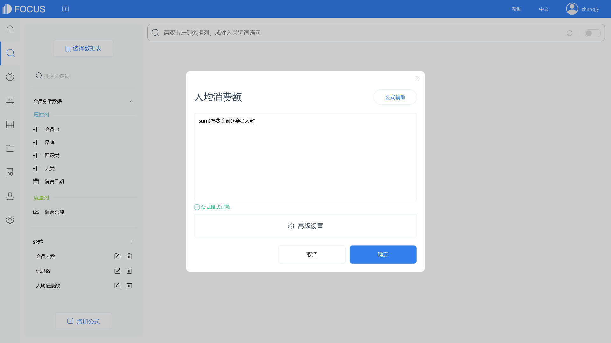

图14-11 构建“人均消费额”字段

（6）构建“关联 ID”字段，如图 14-12。单击“增加公式”→输入公式内容：to\_string（1）→将新字段命名为“关联ID”→单击“确定”，完成新字段构建。

图14-12 构建“关联ID”字段

（7）创建“用户消费情况均值”中间表，如图14-13。选择“关联ID”“人均消费额”“人均记录数”字段进入搜索框→点击操作→保存为中间表→命名为“用户消费情况均值”→单击“确定”，完成新中间表的创建。

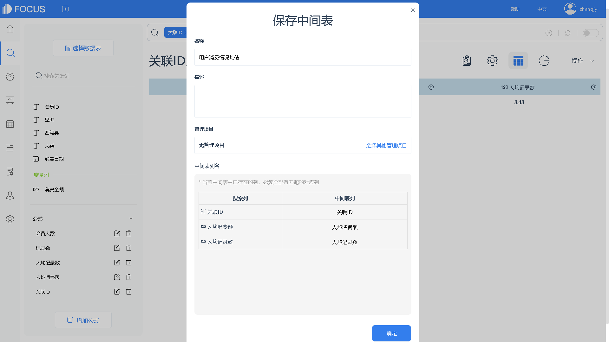

图14-13 创建用户消费情况均值中间表

（8）创建“会员分群处理数据”中间表，如图 14-14。选择“会员 ID”“品牌” “四级类”“大类”“消费日期”“消费金额”“会员人数”“记录数”“关联 ID”字段进入搜索框→点击“操作”，保存为中间表→命名为“会员分群处理数据”→单击“确定”，完成新中间表的创建。

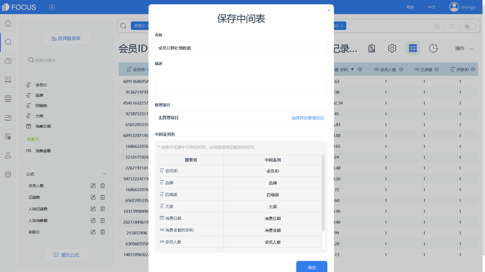

图14-14 创建“会员分群处理数据”中间表

（9）创建关联关系，如图 14-15。在项目管理页面选择“会员分群处理数据”工作表源→选择关联关系——增加关联→选择“用户消费情况均值”维度表→连接类型选择“内连接”→选择源列为“关联 ID”字段，目标列为“关联ID”字段→点击“确定”，完成关联关系的创建。 （10）构建“分群”字段，如图14-16。进入搜索页面→选择数据表“会员分群处理数据”“用户消费情况均值”→单击“增加公式”→输入公式内容：if sum（记录数）＜average（人均记录数）and sum（消费金额）＜average（人均消费额）then “群 1” else if sum（记录数）＞average（人均记录数）and sum（消费金额）＜average（人均消费额）then“群 2” else if sum（记录数）＜average（人均记录数）and sum（消费金额）＞average（人均消费额）then“群 3” else “群 4” →将新字段命名为“分群”→单击“确定”，完成新字段构建。

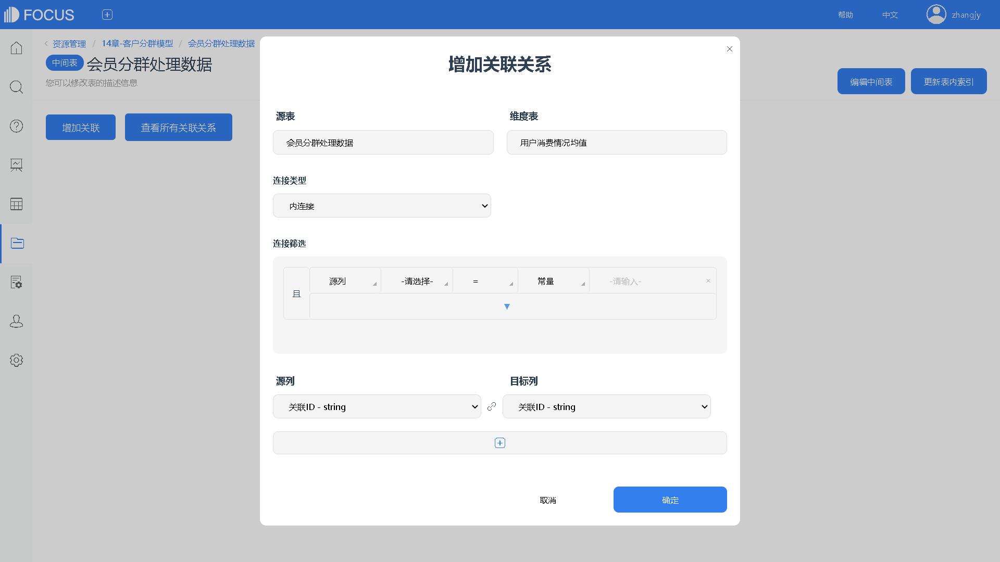

图14-15 创建关联关系

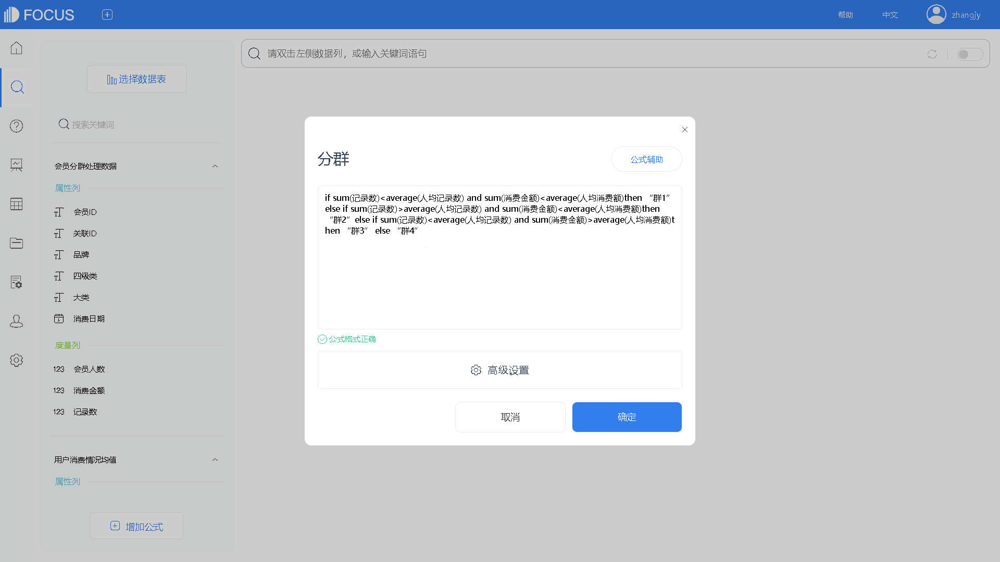

图14-16 构建“分群”字段

（11）创建“会员分群”中间表，如图 14-17。选择“会员 ID”“分群”字段进入搜索框→点击操作→保存为中间表→命名为“会员分群” →单击“确定”，完成新中间表的创建。

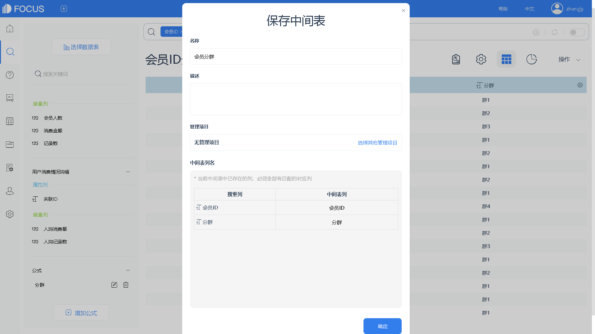

图14-17 创建“会员分群”中间表

（12）创建关联关系，如图 14-18。在项目管理页面选择“会员分群处理数据”工作表源→选择“关联关系”——增加关联→选择“会员分群”维度表→连接类型选择“内连接”→选择源列为“会员 ID”字段，目标列为“会员ID”字段→点击“确定”，完成关联关系的创建。

图14-18 创建关联关系

（13）不同客户群消费情况，如图14-19所示。进入搜索页面→选择数据表“会员分群”“会员分群处理数据”→双击选择“会员 ID”“分群”“消费金额”以及“记录数”字段→切换图形为散点图→点击操作，保存为历史问答，命名为“不同客户群消费情况”。

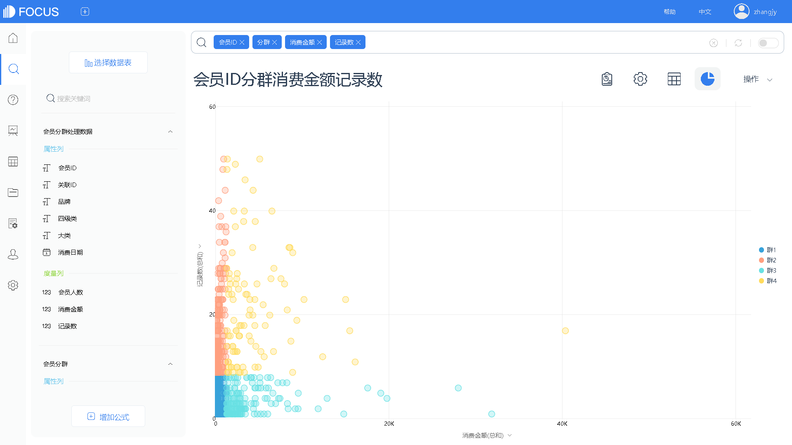

图14-19 不同客户群消费情况

（14）双击选择“分群”“大类”“消费金额”以及“记录数”字段→切换图形为堆积柱状图→点击“操作，保存为历史问答”，命名为“不同客户群在不同类上的消费情况”，如图14-20。 （15）在上图的基础上切换图形为组合图→筛选出“分群”字段中的“群2”→点击图轴按钮，设置“记录数的总和”为右Y轴→点击图表属性按钮，设置主题颜色和线条粗细，美化图表→点击“操作，保存为历史问答”，命名为“群2在不同大类上的消费情况”，如图14-21至图14-25。

图14-20 不同客户群

图14-21 消费金额记录数

图14-22 筛选群2

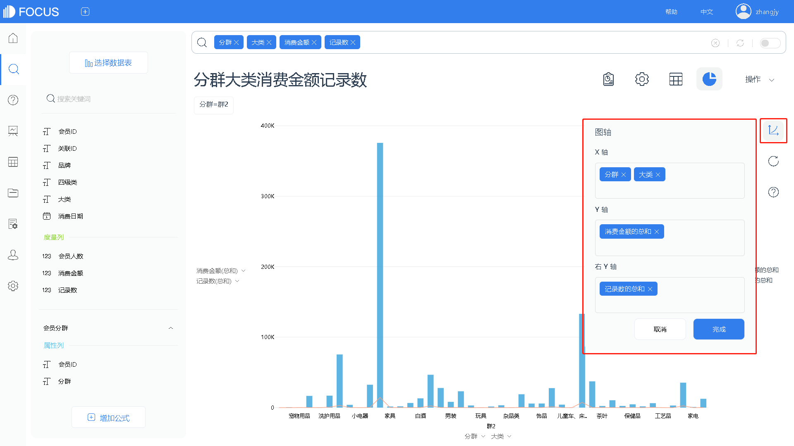

图14-23 调整图轴

图14-24 自定义颜色

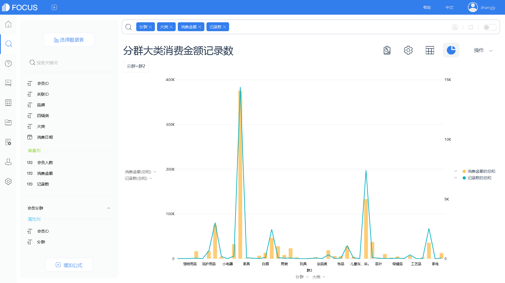

图14-25 群2消费金额记录数情况
