##  研究客户流失情况

### 6.1   客户留存分析

随着现阶段互联网的飞速发展，用户规模开始逐渐饱和，想要获取新客户的难度在不断增加。因此，如何留住老用户成为各企业的首要问题，留存率已成为检验产品的重要指标。但在现实生活中，受制于一些实际情况，比如内部营销管理中缺乏有效的分析和反馈机制，很难建立有效的目标客户行为体系，或者在很多商业场景中，客户流失行为点不容易精确界定等，很多企业在老用户的维持和留存上并没有主动采取相关措施，因此老客户的流失还是比较严重的。

那么，企业应该如何利用数据分析来构建比较有效的客户流失预警模型，做好老客户的维持和留存工作呢？

对于 APP 的使用者而言，留存率越高，表明该 APP 越能抓住用户的核心需求；对于 APP 本身而言，留存率越高，说明活跃用户多，转化为忠实用户的比例会越大。下面介绍常用的客户留存漏斗分析法。

首先我们来观察一下不同月份注册用户的总体留存情况，见图15-1。图形的纵轴为用户购买年月份，图例为用户注册月份。每个柱子代表在图例对应月份注册并在横轴对应月份有购买行为的人数。

图15-1 用户留存图

我们按注册月份来查看图形，每一类颜色对应的数据代表当月注册并在注册当月之后的月份还存在购买行为的用户数量，即注册后的一段时间依然留存的用户。

为了便于观察，我们增加了一个时间维度字段“购买点会员生命期”（以注册月份为基准，计算销售日期和注册日期的余额差值），将销售日期列替换为相对时间列——购买点会员生命期，如图15-2和图15-3。

图15-2 会员留存情况

 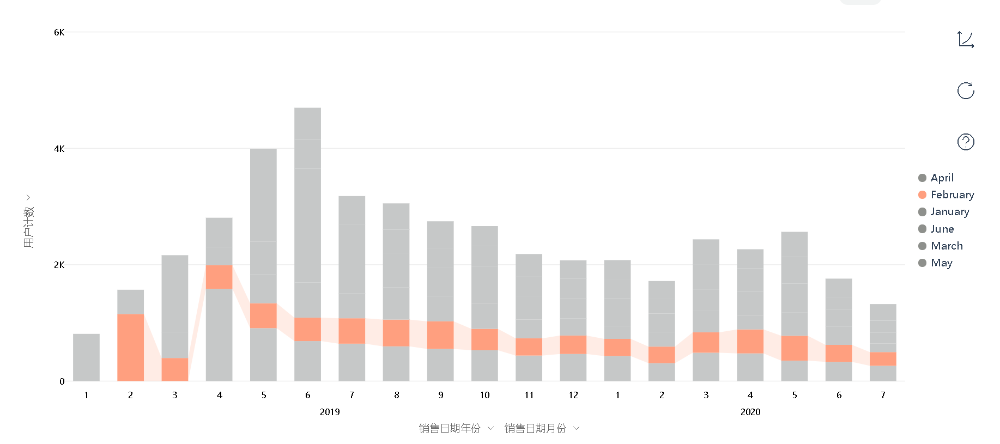 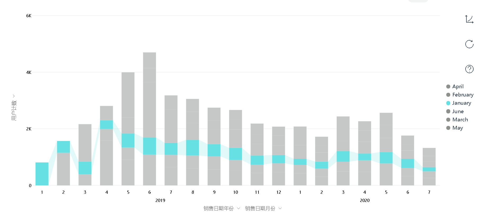 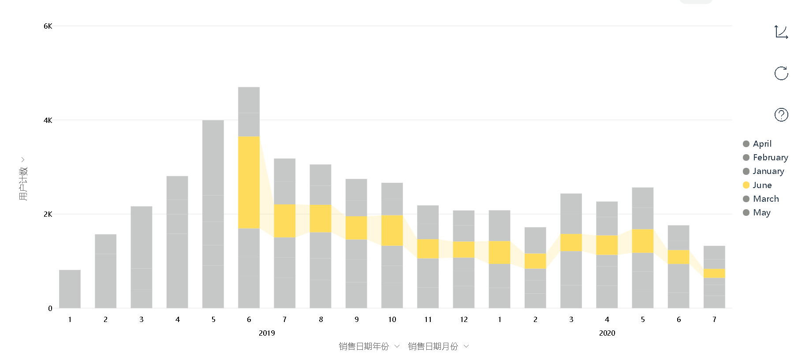 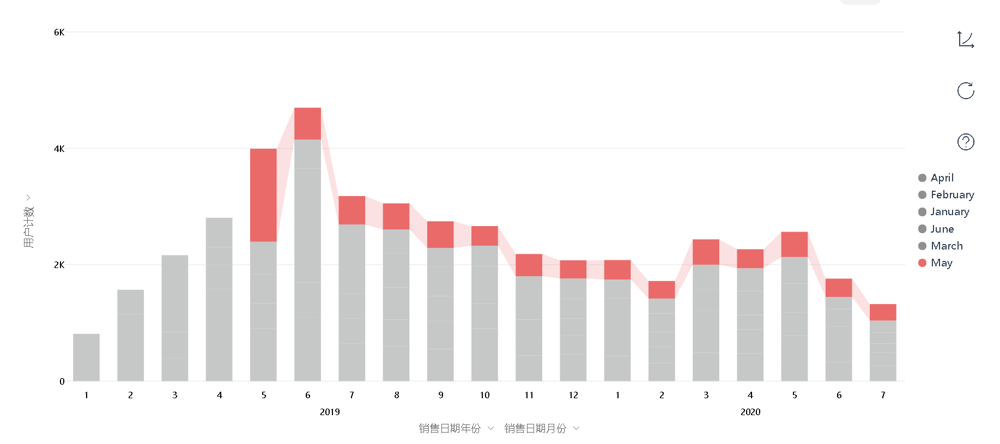 

图15-3 按注册月份查看

接下来对图形进行对称处理。绘制成简单的大家更为熟悉的漏斗图（见图15-4），可以看到新注册用户在第二个月复购人数大幅度减少。

那么，大规模用户的市场留存率是否都是这样的水平？我们加入一个地域维度来观察一下不同地域用户的留存率情况，如图15-5。

在没有精确的客户行为（如客户主动注销、退货）来界定客户流失的商业场景中，需要定义一个客户无购买行为的时段，以定义流失，超过这个时间段，就认为是客户流失。一般而言，12个月是一个合适的周期。

按照这个客户无购买行为时间段，将不同购买地域用户归纳为不同的等级组，分别为高留存组、中留存组和低留存组。另外将上图中得分最高组 SDWF（山东潍坊）与得分最低组（电商平台购买）做综合分析，观察不同组不同品类首次购买的平均数量和金额的情况（见图15-6）。其中颜色越深的单元格代表购买数量越多。

图15-4 漏斗图

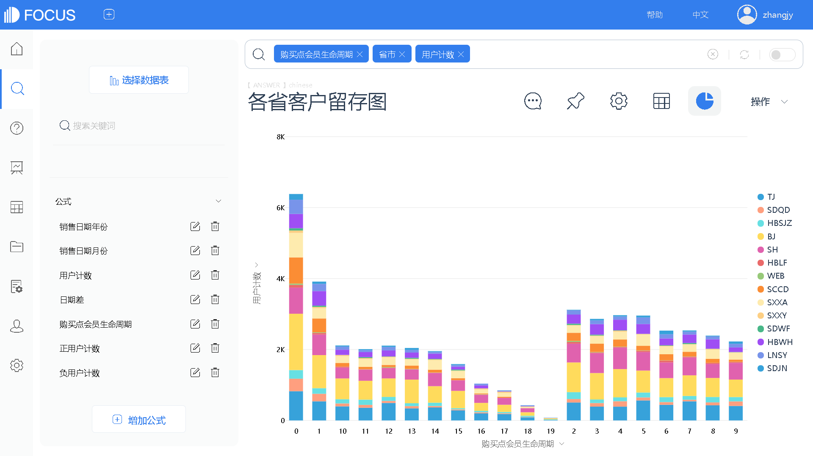

图15-5 各省客户留存图

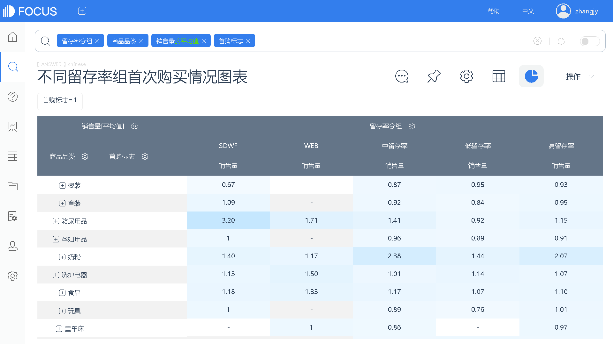

图15-6 不同留存率组首次购买情况图表

从上图中我们发现，通过网络注册的电商销售模式用户留存率较低。说明想要维护住信息获取便捷、具有比价后购买的行为模式的网络用户较为困难。留存率最高的SDWF地区的用户，首次购买行为中孕妇用品、童装和防尿用品的平均购买量高于其他群体。

图15-7是整个客户留存数据看板，在数据看板中可以动态筛选不同品类的留存数据。

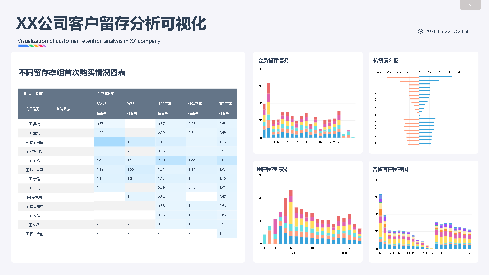

图15-7 数据看板

### 6.2   客户黏性分析

在客户流失情况分析中，除了用户的“留存”，我们还需要进一步增强用户的“黏性”。黏性分析是在留存分析的基础上，对一些用户指标进行深化，除了一些常用的留存指标外，黏性分析能够从更多维度了解产品或者某功能粘住用户的能力情况，更全面地了解用户如何使用产品，新增什么样的功能可以增强用户留存下来的欲望，不同用户群体之间存在什么样的差异，不同用户对新增的功能有何看法。黏性分析能帮助企业更科学全面地评估产品及其功能情况，有针对性地制定留存策略。

近些年来，移动互联网飞速普及，各式各样的APP如雨后春笋般出现，有的如昙花一现，有的却能持久受到人们的喜爱。其实归根结底，是一个用户留存和黏性的问题。因此，很多人会有这样的一个疑问：如何提高用户黏性呢？我们以某款APP为例介绍黏性分析法。

首先我们需要知道对于本款APP，用户在近一周内使用了几天。见图15-8，可以看到最近一周内，只登录一天的用户占绝大部分，一周登录次数超过 5天的用户非常少.

图15-8 上周用户登录天数分布

接下来对不同用户群之间的黏性进行对比，如图15-9。我们将时间数据筛选为近 1个月，即数据收集点以前的一个月。该用户群分为充值会员和非会员，因此可以对比不同用户群在近一个月内登录天数分布情况。

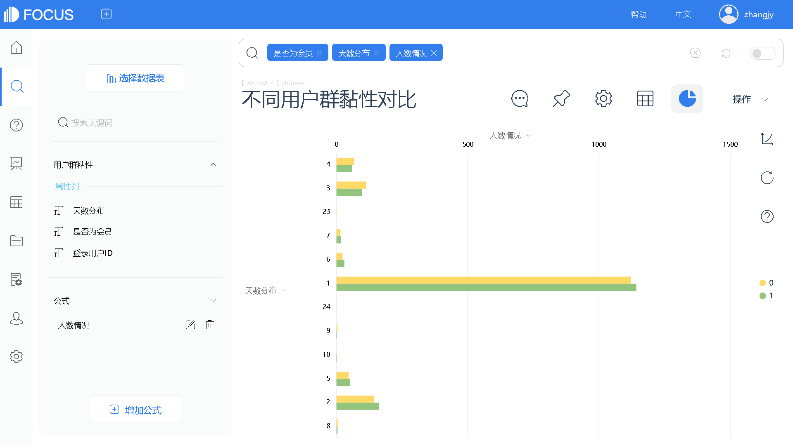

图15-9 不同用户群黏性对比

得到用户群之间的黏性对比后，我们分析了2021年第17周至第22周，会员和非会员每周用户签到行为在两天及两天以上的人数变化趋势，如图15-10。

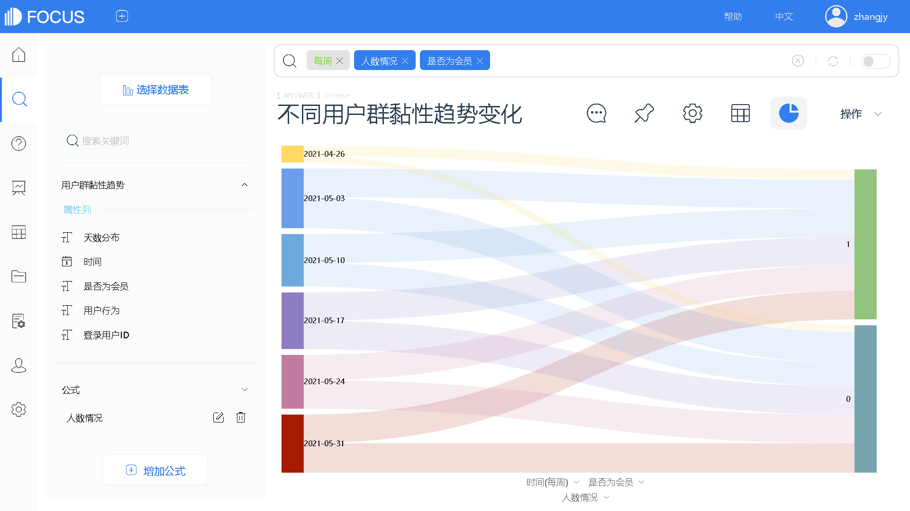

图15-10 不同用户群黏性趋势变化

综合以上分析，可以看出，该APP的会员用户的黏性稍强于普通用户；而APP的签到功能，对增强用户黏性并没有帮助，如图15-11。

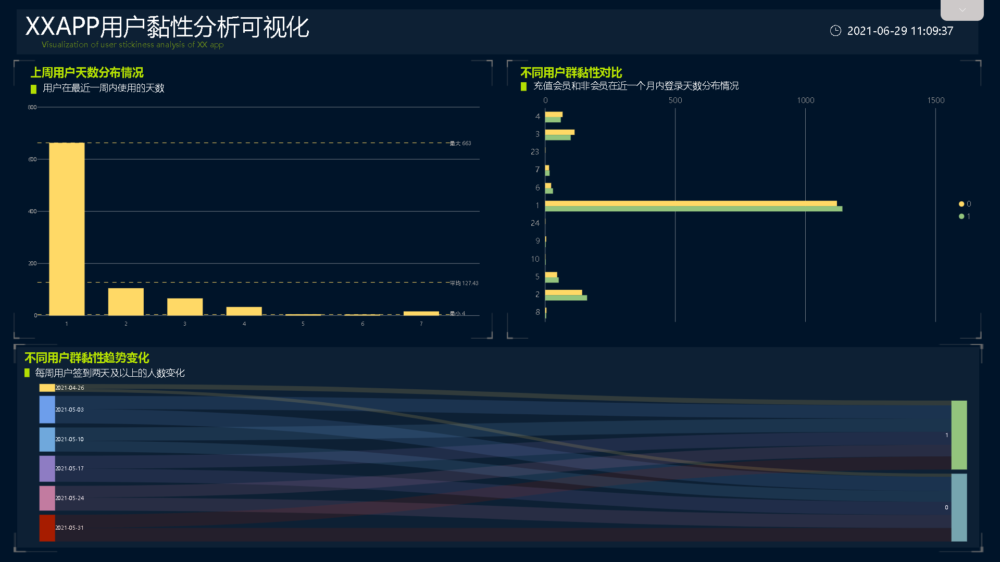

图15-11 用户黏性分析数据看板

### 6.3   技术实现：应用DataFocus实现15.1及15.2的分析

#### 6.3.1   留存分析

（1） 导入数据。单击“导入表”选择导入本地数据→在弹出的对话框中选择 csv格式文件→选择“会员留存分析 .csv”文件→单击“打开”按钮→选择上传→修改文件编码为“ANSI”格式→单击“下一步”→查看数据列信息无误后，点击“确定”，完成数据的导入（如图15-12至15-14）。

（2） 构建“销售日期年份”字段。进入搜索页面→选择数据源“会员留存分析”→单击增加公式→输入公式内容：year（销售日期）→选择列类型为“属性列”，聚合方式为“无”→将新字段命名为“销售日期年份”→单击“确定”，完成新字段构建，如图15-15。

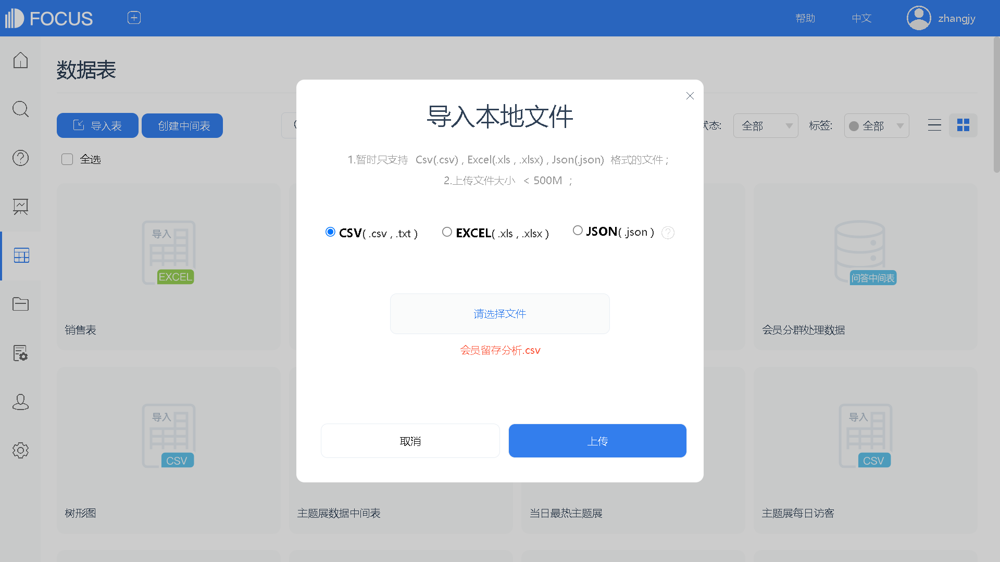

图15-12 导入数据

图15-13 数据导入配置

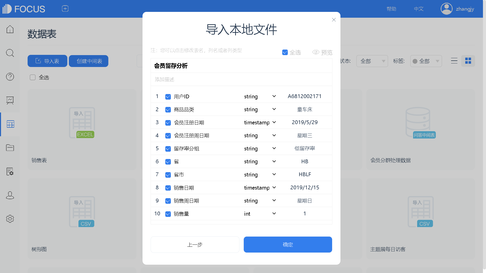

图15-14 选择导入字段

图15-15 构建“销售日期年份”字段

（3）构建“销售日期月份”字段。单击“增加公式”→输入公式内容：month\_ number（销售日期）→选择列类型为“属性列”，聚合方式为“无”→将新字段命名为“销售日期月份”→单击“确定”，完成新字段构建，如图15-16。

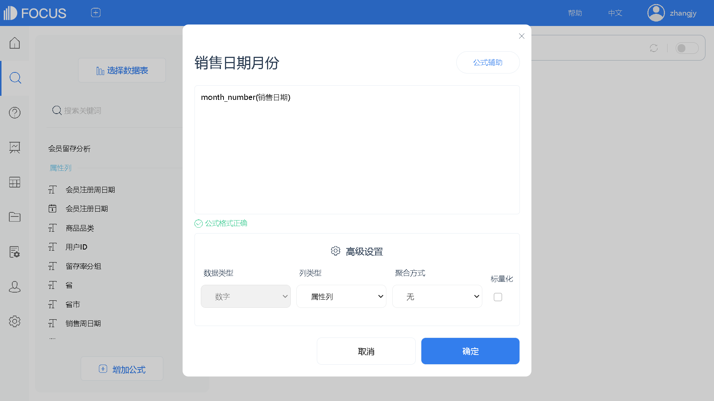

图15-16 构建“销售日期月份”字段

（4）构建“用户计数”字段。单击“增加公式”→输入公式内容：count（用户ID）→将新字段命名为“用户计数”→单击“确定”，完成新字段构建，如图15-17。

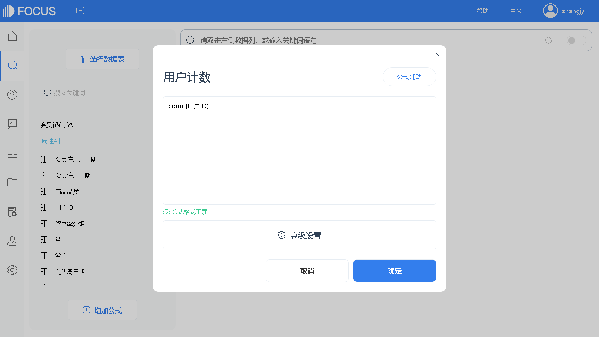

图15-17 构建“用户计数”字段

（5）用户留存分析。在搜索栏输入month（会员注册日期），双击选择“销售日期年份”“销售日期月份”以及“用户计数”字段→切换图形为堆积柱状图→配置图设置：将图例设置为 month（会员注册日期）字段，横轴设置为销售日期年份和销售日期月份字段→点击操作→保存为历史问答，命名为“用户留存图”，如图15-18。

图15-18 用户留存分析

（6）构建“日期差”字段。单击“增加公式”→输入公式内容：to\_string（diff\_days（销售日期，会员注册日期））→将新字段命名为“日期差”→单击“确定”，完成新字段的构建，如图15-19。

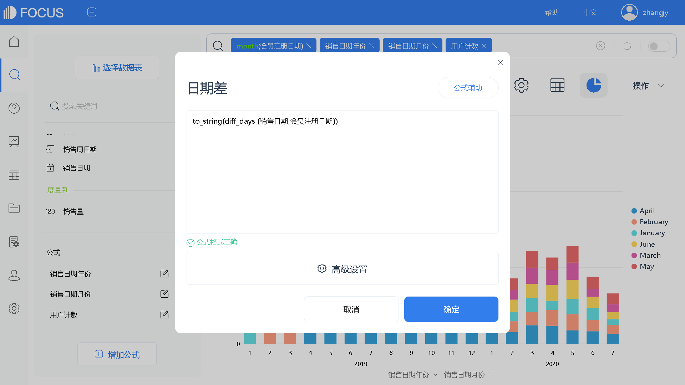

图15-19 构建“日期差”字段

（7）构建“购买点会员生命周期”字段。单击“增加公式”→输入公式内容：to\_string（ceil （to\_integer （日 期 差）/30））→将新字段命名为“购买点会员生命周期”→单击“确定”，完成新字段的构建，如图15-20。

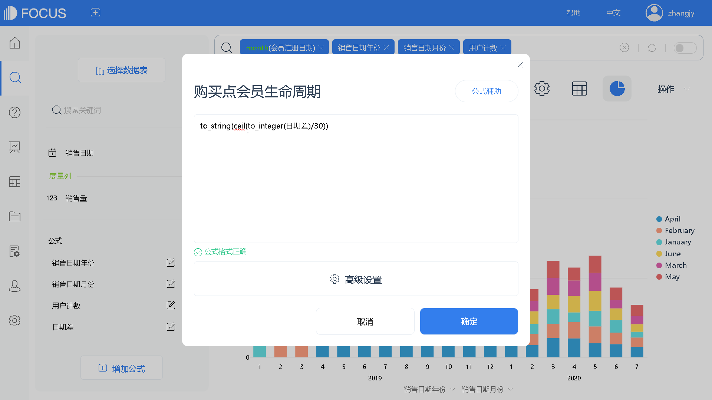

图15-20 构建“购买点会员生命周期”字段

（8）会员留存情况。在搜索栏中删除“销售日期年份”“销售日期月份”字段→双击“购买点会员生命周期”字段进入搜索框→图形选择堆积柱状图→点击“操作→保存为历史问答”，命名为“会员留存情况”，如图15-21。

（9）构建“正用户计数”字段。单击“增加公式”→输入公式内容：count（用户ID）

/2 →将新字段命名为“正用户计数”→单击“确定”，完成新字段的构建，如图15-22。

（10）构建“负用户计数”字段。单击“增加公式”→输入公式内容：0-count（用户ID）/2→将字段命名为“负用户计数”→单击“确定”，完成新字段的构建，如图15-23。

（11）传统漏斗图。在搜索栏中删除“用户计数”“month（会员注册日期）”字段→双击“正用户计数”“负用户计数”字段进入搜索框→切换图形为条形图→点击“操作→保存为历史问答”，命名为“传统漏斗图”，如图15-24。

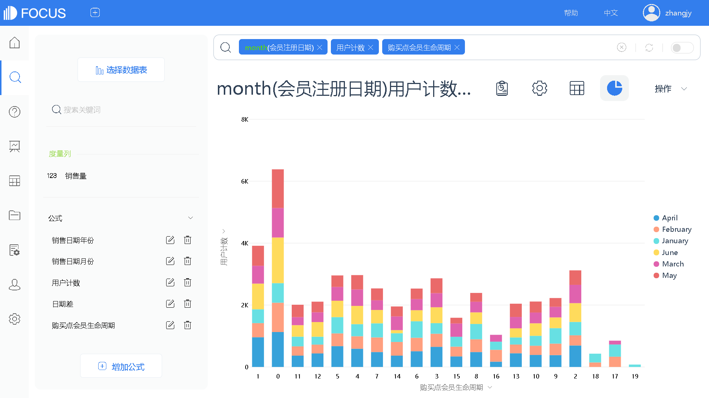

图15-21 会员留存情况分析

图15-22 构建“正用户计数”字段

图15-23 构建“负用户计数”字段

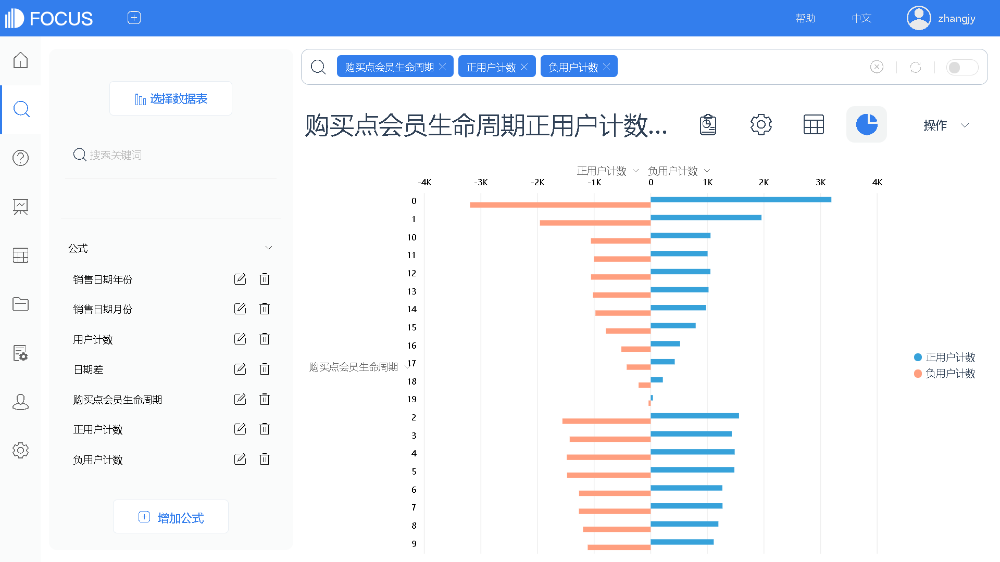

图15-24 漏斗分析

（12）各省客户留存图形。在搜索栏中删除“正用户计数”“负用户计数”字段→双击“省市、用户计数”字段进入搜索框 →切换图形为堆积柱状图→配置图设置：将图例修改为省市字段，横轴修改为购买点会员生命周期字段→点击“操作→保存为历史问答”，命名为“各省客户留存图”，如图15-25。

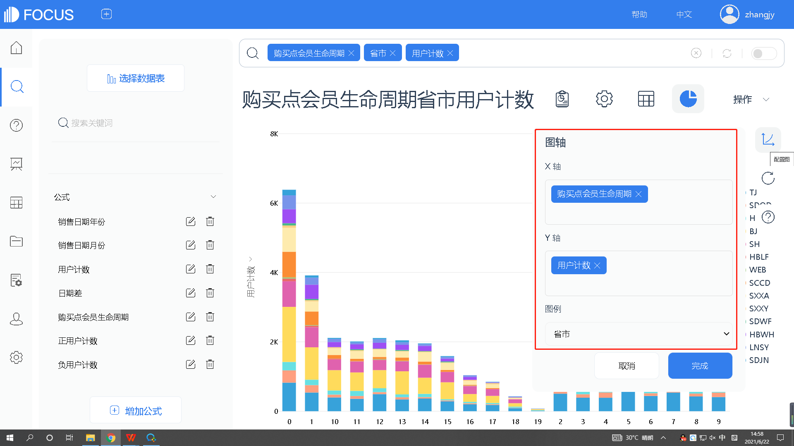

图15-25 各省客户留存

（13）构建“首购标志”字段。单击“增加公式”→输入公式内容：if会员注册日期等于销售日期 then 1 else 0 →选择列类型为“属性列”，聚合方式为“无”→将新字段命名为“首购标志”→单击“确定”，完成新字段的构建，如图15-26。

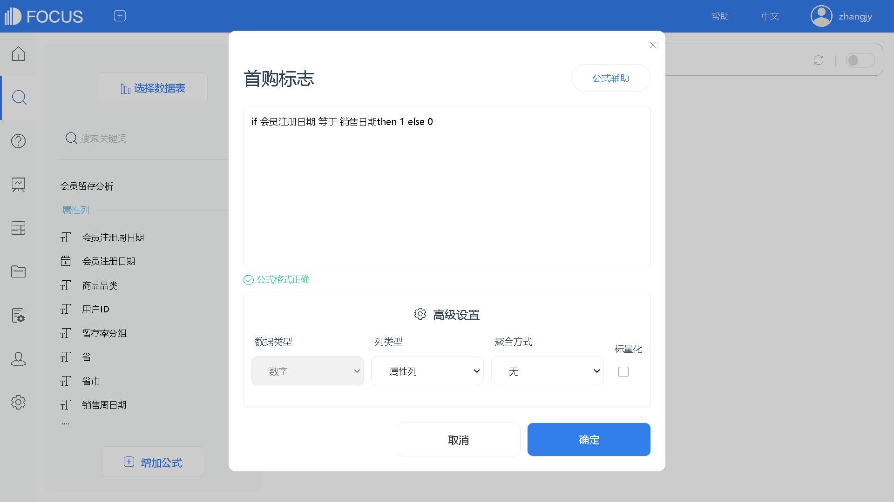

图15-26 构建“首购标志”字段

（14）不同留存率组首次购买情况图表。在搜索栏中输入“留存率分组”“商品品类”“销售量的平均值”“首购标志”字段→筛选出“首购标志\=1”→切换图表为数据透视图→选择热图模式→点击“操作→保存为历史问答”，命名为“不同留存率组首次购买情况图表”，如图15-27。

图15-27 不同留存率组首次购买情况

#### 6.3.2   黏性分析

（1）导入数据。单击“导入表”选择导入本地数据→在弹出的对话框中选择csv格式文件→选择“用户登录汇总 .csv”文件→单击“打开”按钮→选择上传→修改文件编码为“ANSI”格式→单击“下一步”→查看数据列信息无误后，点击“确定”，完成导入→同样的操作步骤上传“登录用户会员属性.csv”文件，如图15-28至15-30。

（2）创建关联关系。在数据管理页面进入“用户登录汇总”工作表详情→选择关联关系——增加关联→选择“登录用户会员属性”维度表→连接类型选择“内连接”→选择源列为“登录用户ID”字段，目标列为“用户ID”字段→点击“确定”，完成关联关系的创建，如图15-31。

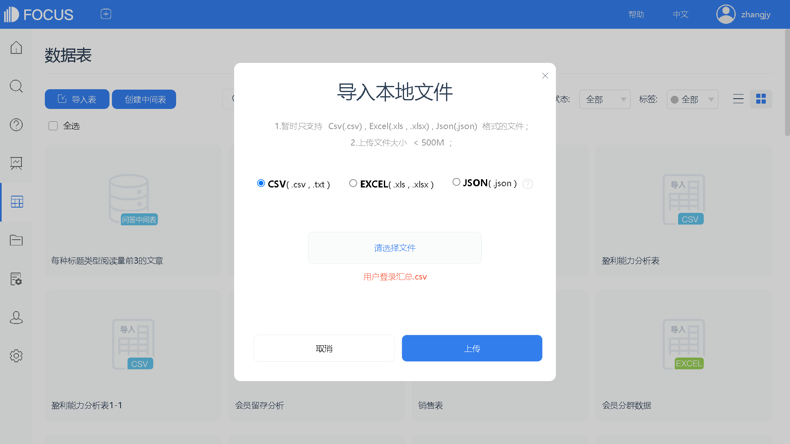

图15-28 选择数据

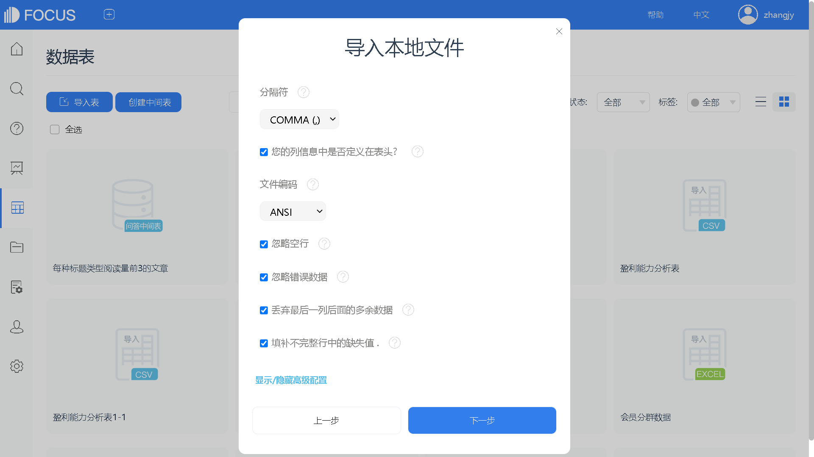

图15-29 导入数据配置

图15-30 选择导入字段

图15-31 创建关联关系

（3）构建“天数分布”字段。进入搜索页面→选择“用户登录汇总”“登录用户会员属性”数据表→单击增加公式→输入公式内容：to\_string（count（登录用户ID））→将新字段命名为“天数分布”→单击“确定”，完成新字段的构建，如图15-32。

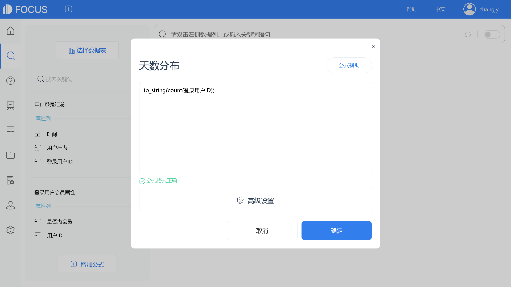

图15-32 构建“天数分布”字段

（4）创建“上周天数分布情况”中间表。在搜索框中键入“每周”→选择“时间”“登录用户 ID”“天数分布”字段进入搜索框→筛选日期为“时间＞＝‘2021-5-31 ’”→点击“操作”，保存为中间表→命名为“上周天数分布情况”→单击确定，完成新中间表的创建，如图15-33和图15-34。

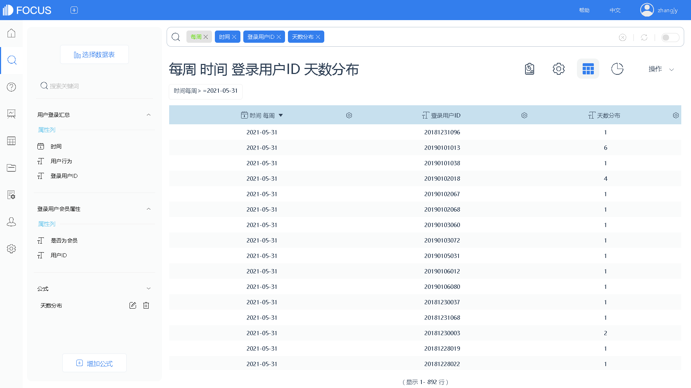

图15-33 创建上周天数分布中间表

图15-34 保存中间表

（5）创建“用户群黏性”中间表。选择“登录用户 ID”“天数分布”“是否为会员”“时间”四列进入搜索框→筛选时间为收集数据时间点前一个月，即时间大于等于“2021-5-7”→点击“操作”，保存为中间表→命名为“用户群黏性”→单击“确定”，完成新中间表的创建，如图15-35和图15-36。

图15-35 创建用户群黏性中间表

图15-36 保存中间表

（6）创建“用户群黏性趋势”中间表。选择“用户行为”“登录用户ID”“天数分布”“是否为会员”四列进入搜索框→ 键入“每周”→筛选“用户行为＝‘签到’”→点击“操作”，保存为中间表→命名为“用户群黏性趋势”，设置中间表列名，完成新中间表的创建，如图15-37和图15-38。

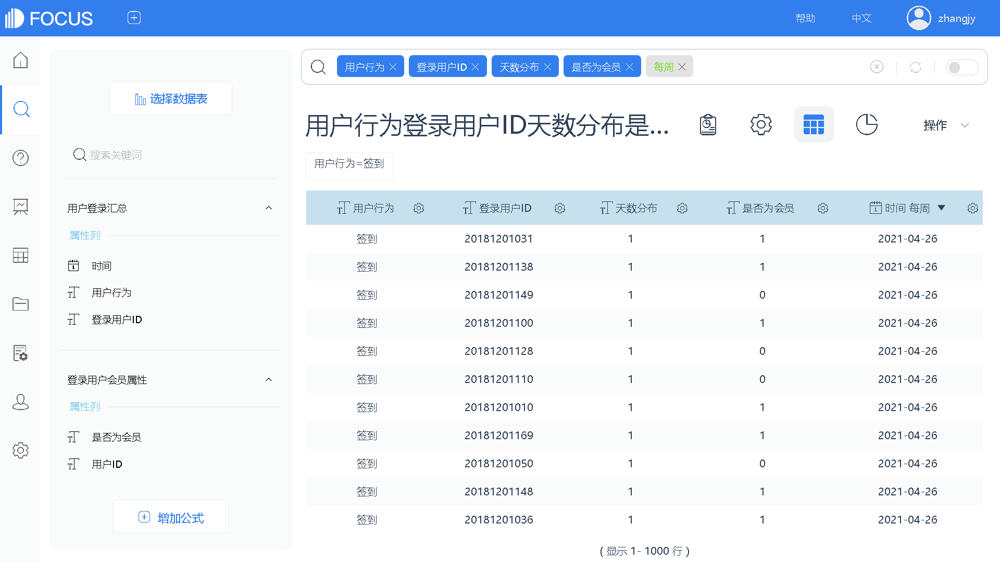

图15-37 创建用户群黏性趋势中间表

图15-38 保存中间表

（7）构建“人数情况”字段。打开“上周天数分布情况”中间表→单击增加公式→输入公式内容：count（天数分布）。将新字段命名为“人数情况”→单击“确定”，计算各天用户的人数分布情况，如图15-39。

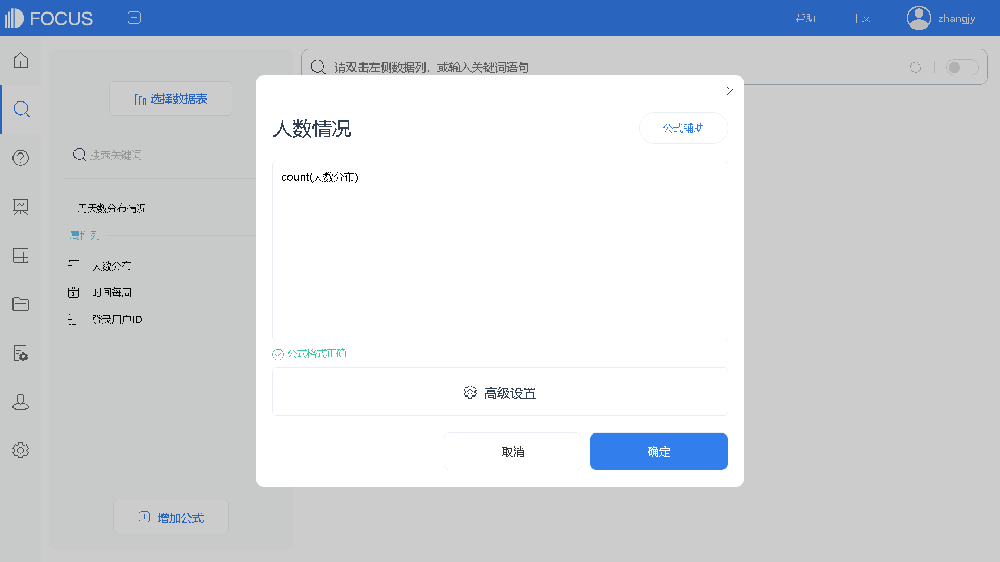

图15-39 构建“人数情况”字段

（8）上周用户天数分布。选择“天数分布”“人数情况”两列加入搜索框→切换图表类型，选择柱状图→点击图表属性→修改主题颜色→点击“操作”，保存为历史问答，命名为“上周用户天数分布情况”，如图15-40。

图15-40 上周用户天数分布情况

（9）不同用户群黏性对比图。打开“用户群黏性”中间表→选择“是否为会员”“天数分布”“人数情况”三列加入搜索框→图表类型选择条形图→点击“操作”，保存为历史问答，命名为“不同用户群黏性对比”，如图15-41。

（10）不同用户群黏性趋势变化。打开“用户群黏性趋势”中间表→在搜索栏键入“每周”→选择“是否为会员”“人数情况”两列加入搜索框→图表类型选择桑基图→点击“操作”，保存为历史问答，命名为“不同用户群黏性趋势变化”，如图15-42。

图15-41 不同用户群黏性对比

图15-42 不同用户群黏性趋势变化
