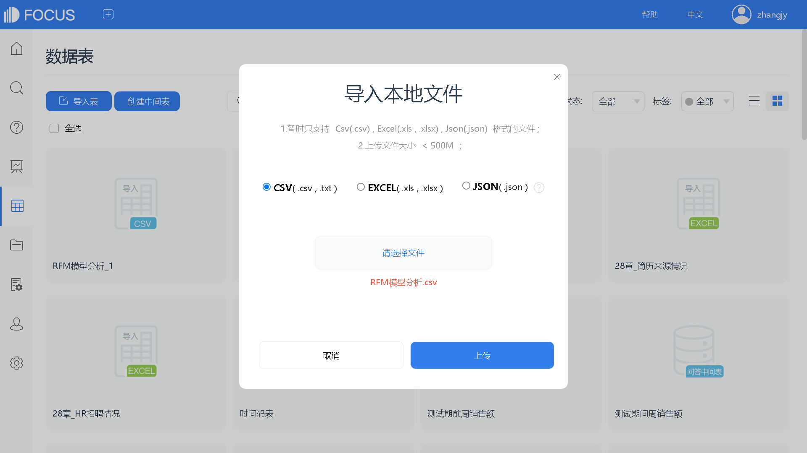
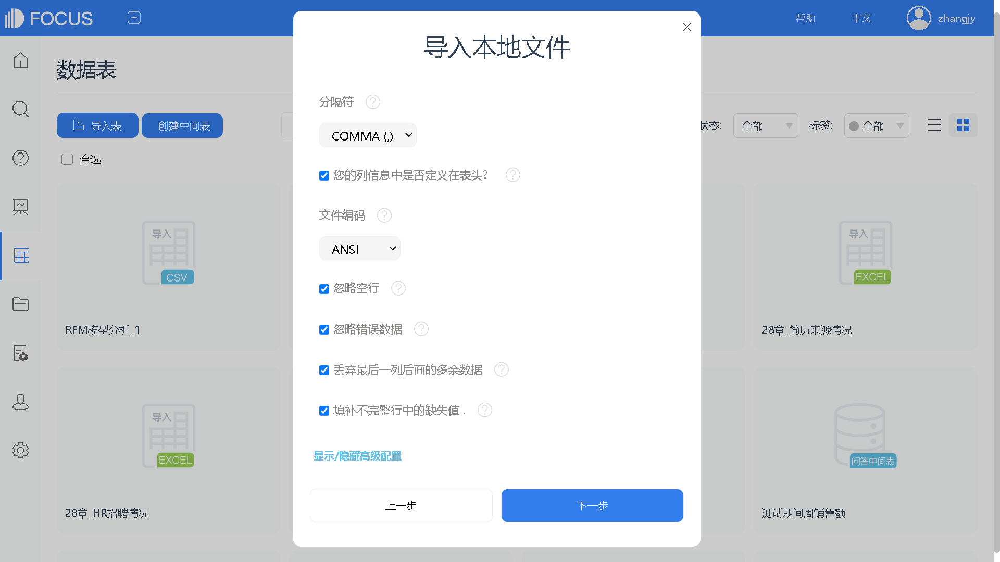
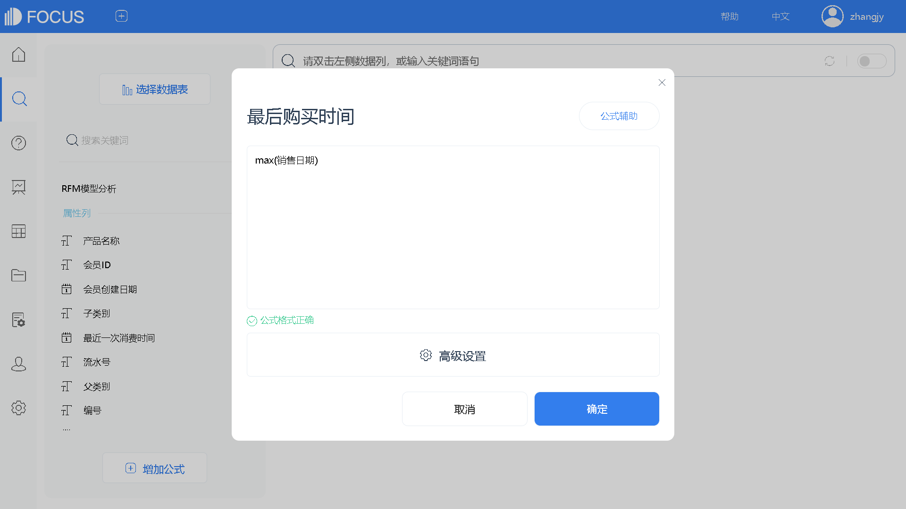
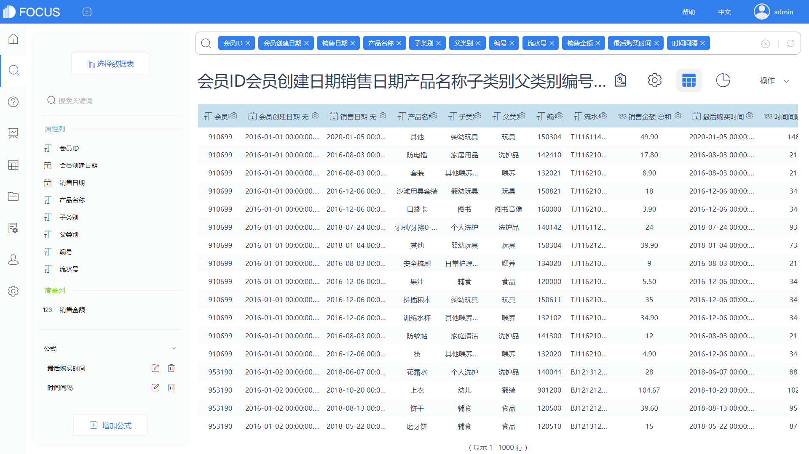
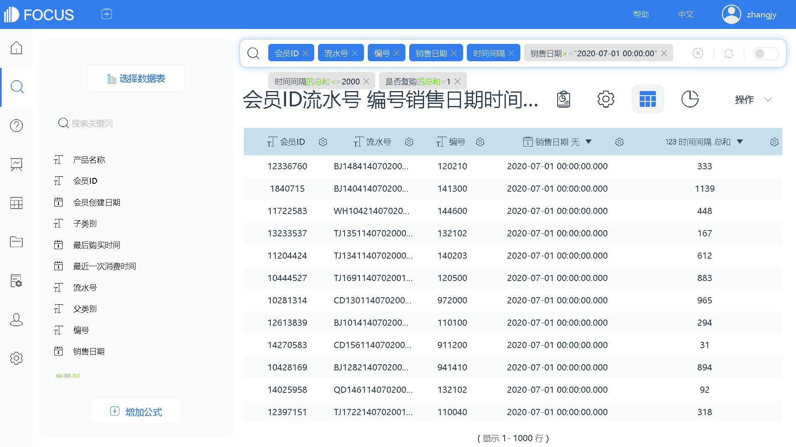
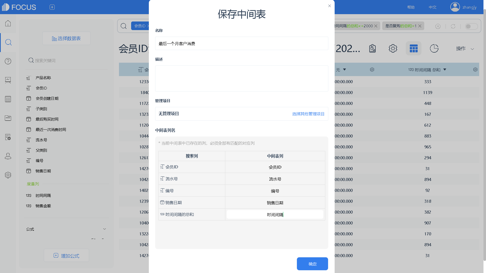
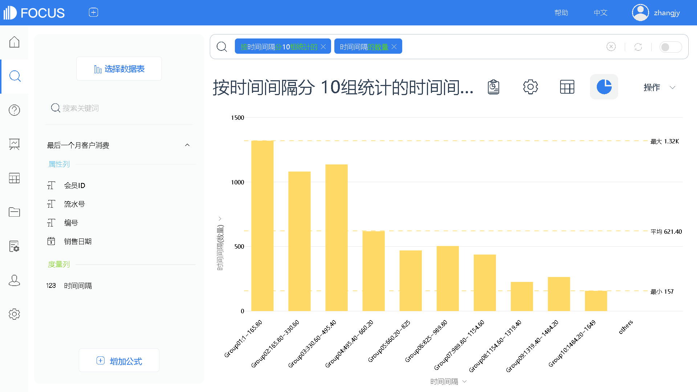

##  客户生命期分析

所谓客户生命周期，简单来说，就像人的生命一样，存在着诞生、成长、成熟、衰老、死亡的一个完整过程。和人类的生命类似，客户生命周期也有短有长，存在不同的价值。因此对客户的生命周期进行分析就显得尤为重要，通过分析找出其中可能蕴含的信息，为企业的经营决策提供参考依据。

作为企业最重要的资源之一，每个客户的生命周期都能产生一定的商业价值，但有些用户注定更有价值。客户生命周期分析是指从客户开始接触并使用企业产品到客户完全不再使用该产品的全过程，是指客户与企业产品之间的关系水平随时间变化的发展轨迹，动态描述客户关系在不同阶段的总体特征。

客户生命周期大致可以划分为五个阶段，分别是考察期、形成期、稳定期、退化期和流失期。考察期是客户关系开始孕育的阶段，在这阶段需要通过一些有效的渠道提供合适的价值定位以获取客户；形成期是客户关系的快速发展的阶段，此阶段可以通过推出刺激需求的产品组合或服务组合把客户培养成高价值客户；稳定期是客户关系发展较为成熟的阶段，此阶段的主要任务是培养客户的忠诚度；退化期是客户关系水平发生逆转的阶段，该阶段可以通过建立客户预警机制，实时监控，延长客户的生命周期；流失期是客户已经流失的阶段，该阶段的主要任务是如何赢回客户。更为精准地，可以将整个生命周期划分为11个关键价值创造节点，即客户的购买意向，新增客户的获取，客户每月收入贡献的刺激与提高，客户日常服务成本的管理，交叉销售/叠加销售，价格调整，签约客户的合同续签，客户在品牌间转移的管理，对流失的预警和挽留，对坏账的管理，对已流失的客户进行赢回，这些环节其实就是企业日常运营的重点。客户生命周期分析围绕着这11个关键价值创造环节，利用丰富的客户数据进行深入分析，设计针对单个客户的个性化策略，继而通过运营商与客户间的大量接触点，执行这些策略。

### 1   客户生命周期分析

客户生命周期是由企业的产品生命周期演变而来，但对于商业企业而言，客户的生命周期比企业的产品生命周期重要得多。那为什么要分析客户的生命周期和价值？因为无论运营做得多么出色，都无法阻止客户的流失，所以只能尽一切可能延长客户的生命周期，并使得客户在生命周期中创造尽可能多的商业价值。

下面我们将观察一组数据集，通过对数据集的分析，简单了解一下客户生命周期理论。

首先观察数据集内最后一个月有消费的客户，计算其生命期，然后将计算得出的生命期筛选掉生命周期过长的客户后，分成10组进行统计，绘制客户生命周期柱状图。因为要观察客户的复购行为，所以排除数据中当天办卡当天消费的客户。图16-1显示，最后月份有消费行为的客户，以生命期1年期左右的客户为主，2—3年的老顾客也占了较大的比重，整体结构还算健康。

图16-1 客户生命周期构成

从图16-2中，可以看到在此次数据分析周期的最后一天有消费行为的客户，同样以生命期1年期左右的客户为主，2—3年的老顾客也占了较大的比重，但客户总体分布在上半年，也就是说，上半年成为会员的客户较下半年多。

这里就是举了一个简单的例子，可以根据数据和分析场景，添加需要分析的客户生命周期的情况。

图16-2 客户最后一天消费的生命周期

### 2   技术实现：应用DataFocus实现16.1的分析

下面讲述一下利用DataFocus数据分析工具制作图表的主要操作过程。

（1）导入数据。单击“导入表”选择导入本地数据→在弹出的对话框中选择 csv格式文件→选择“RFM 模型分析.csv”文件→单击“打开”按钮→选择上传→修改文件编码为“ANSI”格式→单击“下一步”→查看数据列信息无误后，点击“确定”，完成数据的导入（如图16-3至图16-5）。

图16-3 导入数据

图16-4 数据导入配置

图16-5 选择导入字段

（2）构建“最后购买时间”字段。单击“增加公式”→输入公式内容：“max（销售日期）”，计算客户最后一次消费的日期→命名为“最后购买时间”→单击“确定”，完成新字段的构建，如图 16-6 所示。

图16-6 公式创建“最后购买时间”字段

（3）构建“时间间隔”字段。单击“增加公式”→输入公式内容：“diff\_days（销售日期，会员创建日期）”，计算每个客户此次消费与其创建会员日期之间的时间间隔→命名为“时间间隔”→单击“确定”，完成新字段的构建，如图16-7。

图16-7 公式创建“时间间隔”字段

（4）创建“生命周期分析”中间表。选中“RFM模型分析”数据源的所有列和添加的两个公式，进入搜索框→点击“操作”，保存为中间表→命名为“生命周期分析”→单击确定，完成新中间表的创建，如图16-8和图16-9。

图16-8 创建“生命周期分析”中间表

图16-9 保存中间表

（5）添加“是否复购”字段。选择数据表“生命周期分析”，单击“增加公式”→输入公式内容：“if会员创建日期\= 销售日期 then 0 else 1”，区分客户是否出现复购行为，用以排除当天办卡当天消费的客户→命名为“是否复购”→单击“确定”，完成新字段的构建，如图16-10。

图16-10 创建“是否复购”字段

（6）创建“最后一个月客户消费”中间表。双击选择“会员ID”“流水号”“编号”“销售日期”“时间间隔”字段，进入搜索框→筛选销售日期在最后一个月范围内的数据，即“销售日期＞＝‘2020-07-01 ’”，并筛选“时间间隔的总和＜＝2000”和“是否复购的总和＝1”→点击“操作”，保存为中间表→命名为“最后一个月客户消费”，修改中间表列名→单击确定，完成新中间表的创建，如图16-11和图16-12。

图16-11 创建“最后一个月客户消费”中间表

图16-12 保存中间表

（7）查看客户生命周期构成。选择数据表为“最后一个月客户消费”，在搜索框输入“按时间间隔分 10组统计的时间间隔的数量” →图表类型选择柱状图→更换主题颜色→点击“操作”，保存为历史问答，命名为“客户生命周期构成”，如图16-13。

图16-13 客户生命周期构成

（8）创建“最后一天客户消费”中间表。选择数据表为 “生命周期分析”，双击选择“会员 ID”“流水号”“编号”“时间间隔”“最后购买时间”进入搜索框→筛选“最后购买时间＝‘2020-07-23’”和“时间间隔的总和＜＝1500”→点击“操作”，保存为中间表→命名为“最后一天客户消费”，修改中间表列名→单击确定，完成新中间表的创建，如图16-14和图16-15。

图16-14 创建“最后一天客户消费”中间表

图16-15 保存中间表

（9）查看客户生命周期构成。选择数据源为“最后一天客户消费”，在搜索框中输入“按时间间隔分 10组统计的时间间隔的数量”→图表类型选择柱状图→点击“操作”，保存为历史问答，命名为“客户最后一天消费的生命周期”，如图16-16。

图16-16 客户最后一天消费的生命周期
