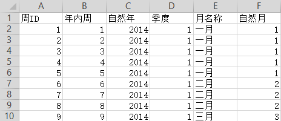
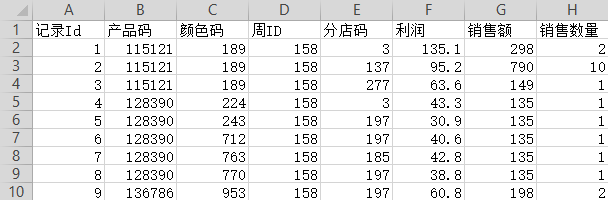
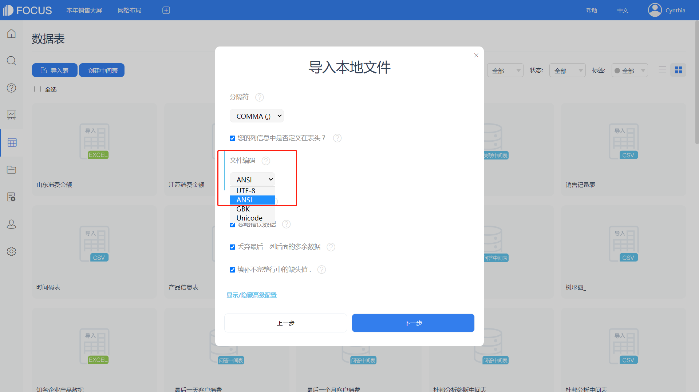
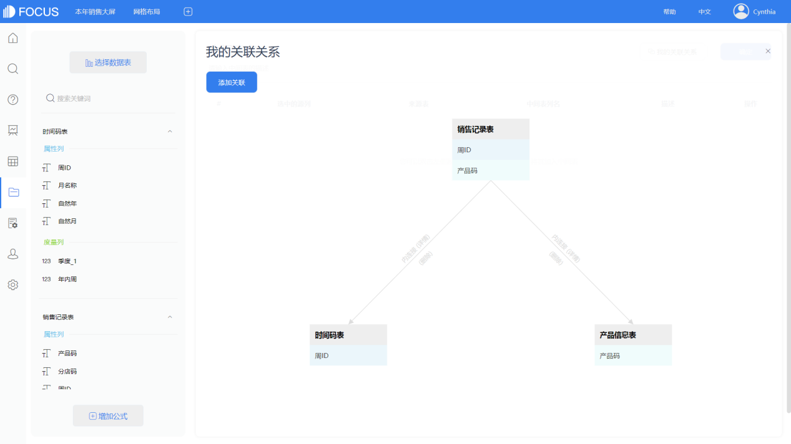
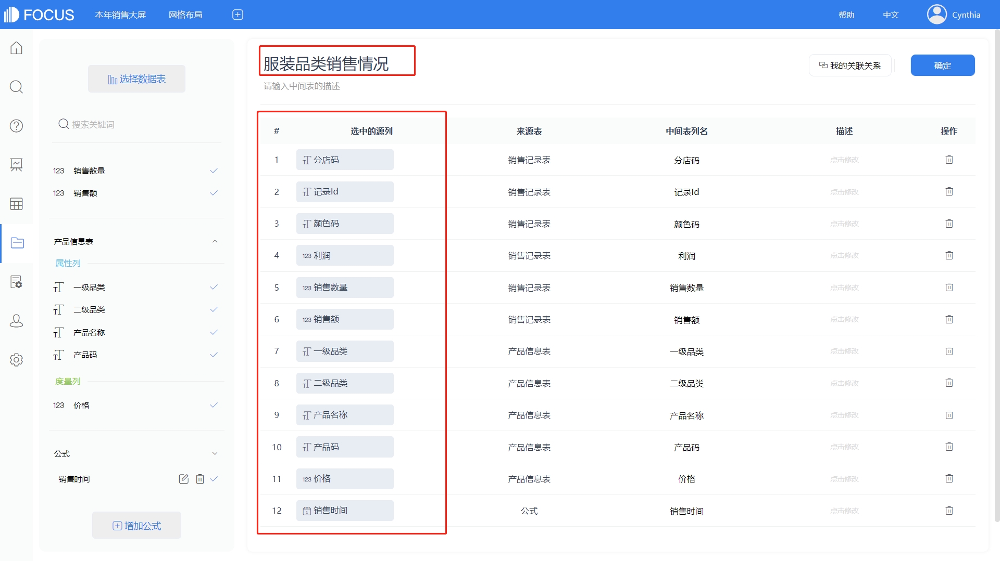
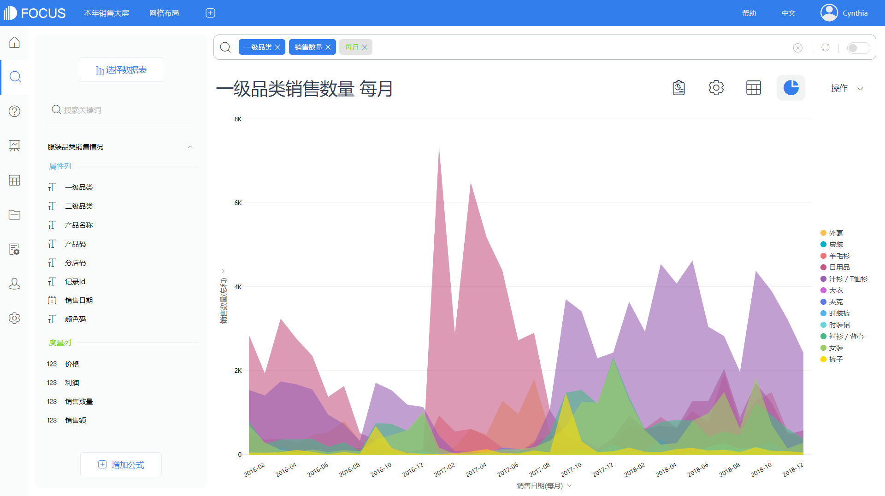
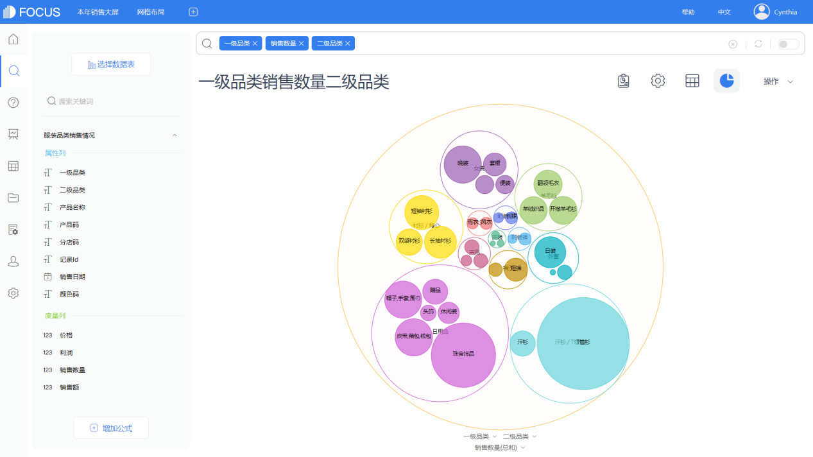
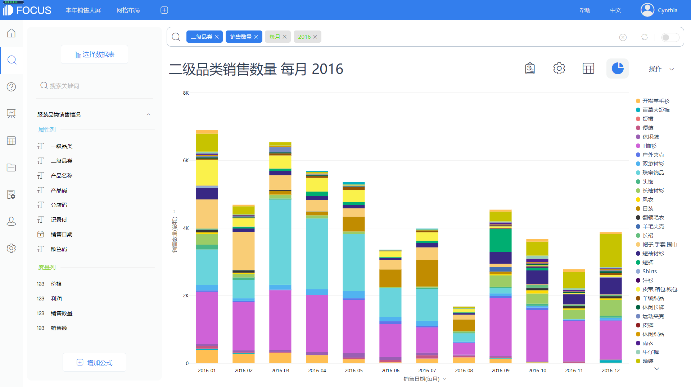
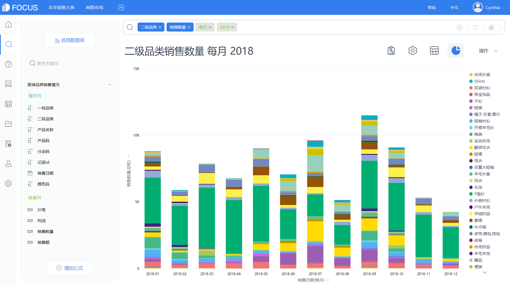

##  发现销售的规律特征

### 1   一年销售期产品销售分析

从一张来自某服装销售企业的销售表中提取2018年一整年的历史销售数据，绘制成一级品类产品的每月销售数量图，如图12-1。

图12-1 某服装企业产品线年销售趋势

我们可以看到，品类为“汗衫/T恤衫”的产品销售量是最大的，月份上显示该品类的销售旺季是3到7月，可以推测最重要的影响因素可能是气温、季节。而羊毛衫、大衣等保暖性服装的销售量呈现出与汗衫/ T恤衫不同的季节性特征，从日常生活习惯判断应该也是受季节影响的结果。

接下来对产品的二级品类进行衍生分析，特别是针对“汗衫/T恤衫”品类的产品，对其下属二级品类的销售量进行分析查看，如图12-2。

图12-2 钻取分析汗衫/T恤衫的二级品类

这里我们可以看到两种子产品T恤衫和汗衫在一整年的各个月份的销售情况，T恤衫有更为明显的春秋季服装产品的季节性特征，而汗衫更偏向于夏季季节性特征。顾客的购买很符合日常的生活习性。

在这个分析过程中我们得出，商品销售一般都有其独特的销售周期。受到季节循环以及消费者生活习惯的影响，服装类是以年为销售周期进行循环。而在图形展示过程中，图12-1虽然展现了完整的问题，但是陈列的信息太多，容易让读者错过重点信息，图12-1有针对性的对类别进行二次分析，结合图12-1就会有更好的展示效果。

### 2   长周期分组多层级分析

上节我们分析了具体一个销售周期中各品类产品的销售数量，从中看出服装类商品销售数量存在明显的季节性影响。那么这样的季节性是真实恒定的吗？

我们提取最近三年全部的销售情况，按年统计分析每个一级品类不同月份的销售量，如图12-3。

图12-3 各品类近三年销售数量趋势

这时我们就会发现，之前在一年周期内呈现出季节性的数据，放置到三年的时间长度中却并没有呈现出类似的季节性特征。结合上一节内容，同样可知，从一级品类和二级品类去看产品的销售数量，得出的结论也存在很大的差异。因为在大规模的分析维度上，数量级的膨胀和品类中各个产品数据的相互影响，导致相对规模较小、类别较细的产品的特征被忽略了，所以针对分析需求选择合适的分析维度和分组方式是很重要的。分组再结合多维度联动分析的方式较为科学全面，因此，设计了一份完整的产品销售规律可视化大屏，如图12-4。

结合三年整体销售和各年份的销售情况来分析，可以发现更多的问题。比如在销售情况最好的一级品类“汗衫/ T恤衫”中，二级品类“汗衫”的销量前期一直很小。该一级品类的销售量是在2017年末暴涨起来的，同时伴随着一级品类销量的暴涨，原本低迷的二级品类“汗衫”的销售情况逐渐有了起色。

发生这种变化的原因是什么？是消费者的需求发生了变化？是气候温度的影响？还是产品本身的变化带来的？而这会成为一种持续的销售模式吗？从图表上我们可以看到，“汗衫/T 恤衫”品类的销量已经开始有所回落，那么如何去维持之前高涨的销售状态呢？这里便提出了一个需要继续调查的问题，而这一问题的答案可能会促使后续销售策略甚至产品开发方向发生改变。

这个案例虽然简单，但是提供了一个很好的思路，企业管理者应该关注每一个异常的销售细节，不管它是好的变化还是坏的，然后进行追踪。

销量变动的原因是市场还是企业自身？

特殊场景的产品需求点在哪里，如何去迎合？

繁多的产品如何进行分组分析，以及应该结合怎样的分析维度去看？

找到真正的问题所在和问题背后的原因，才是销售分析的重中之重。

图12-4 T恤类产品线深入分析

### 3   产品数据清洗处理

一份完整清楚的数据是完成一份出色的数据分析报告的基础，但是我们在实际案例中接触到的业务数据往往没有那么“干净”“清晰”，这就要求我们需要对原始数据表进行简单的数据清洗、多表关联等预处理工作。本章节的内容就着重介绍一下DataFocus系统中的数据预处理方式。使用的示例数据是三张销售表中的原始数据（表12-1至表12-3）。

表12-1 产品信息表

表12-2 时间码表

表12-3 销售记录表

我们使用DataFocus系统的中间表功能，将这三张表整理为分析时需要用到的的中间表“服装品类销售情况”表，如图12-5。

图12-5 整合后的销售表

（1）正确导入三张原始表

导入文件类型选择“CSV”时，会比Excel导入多出一个界面，如图12-6所示。需要用户选择正确的文件编码，这里我们一般修改为“ANSI”；

修改完毕，点击下一步，修改列的数据类型后，点击确定即可导入csv数据表；

图12-6 修改文件编码

（2）创建中间表

在“数据表管理”模块点击“创建中间表”；

选择数据源表为“产品信息表”、“时间码表”和“销售记录表”，如图12-7所示；

图12-7 选择数据源表

（3）多表关联

因为有多张数据源表，需要先建立表与表之间的关联关系。将销售记录表和时间码表进行内关联，关联列为“周ID”；将销售记录表和产品信息表进行内关联，关联列为“产品码”，关联后的结果如图12-8所示。

图12-8 多表关联

（4）添加公式和列字段

增加公式“销售时间”，将日期转换成系统内通用的时间日期格式列，如图12-9所示。

图12-9 公式销售时间列

双击列名选择添加需要的列（来自多表），修改中间表名，如图12-10所示；点击“确定”，等待中间表创建完成即可使用。

图12-10 创建中间表

### 4   技术实现：应用DataFocus实现12.3的分析

将上一小节经过数据预处理得到的中间表“服装品类销售情况”作为本节的数据源惊醒使用分析。

（1）一级品类销售趋势

将“服装品类销售情况”作为数据源，双击“一级品类 销售数量”字段加入搜索框，然后在搜索框中输入“每月”，选择面积图；

打开图表属性\--通用，修改主题颜色为主题二；

点击“操作”，保存为历史问答，如图12-11。

图12-11 一级品类每月销售趋势

（2）各品类销售概览

双击“一级品类 二级品类 销售数量”字段加入搜索框，选择打包图；

点击“操作”，保存为历史问答，如图12-12。

图12-12 多级品类销售结构图

（3）16年二级品类销售情况

双击“二级品类”“销售数量”字段，将其加入搜索框，然后在搜索框中输入“每月”“2016”，选择堆积柱状图；

点击“操作”，保存为历史问答，如图12-13。

图12-13 2016年二级品类销售趋势

（4）17年二级品类销售情况

在上一步图的基础上，将2016改为2017；

点击“操作”，保存为历史问答，如图12-14。

（5）18年二级品类销售情况

在上一步图的基础上，将2017改为2018；

点击“操作”，保存为历史问答，如图12-15。

图12-14 2017年二级品类销售趋势

图12-15 2018年二级品类销售趋势

（6）看板调整及筛选

进入“企业销售可视化规律”看板，在自由布局下调整看板各个问答的大小。再添加组件“筛选下拉框”，选定筛选列为一级品类，如图 12-16所示。在预览界面中，可以点击筛选下拉框，选择一级品类为“汗衫/T恤衫”进行联动筛选。

图12-16 配置数据看板
