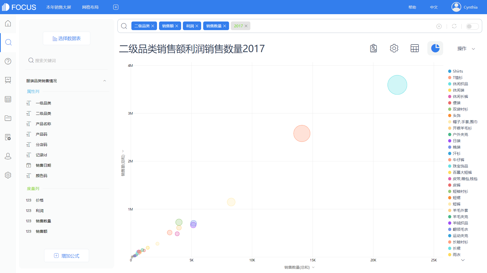
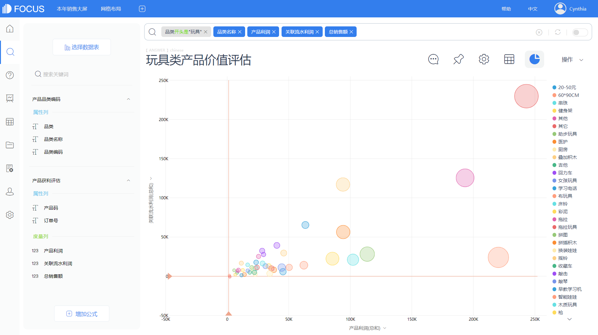
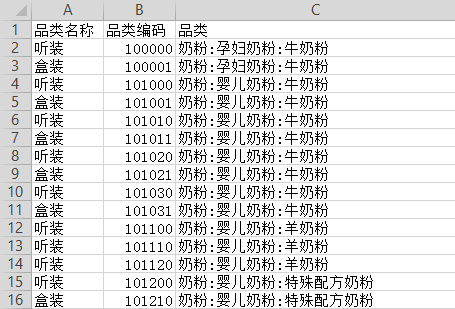
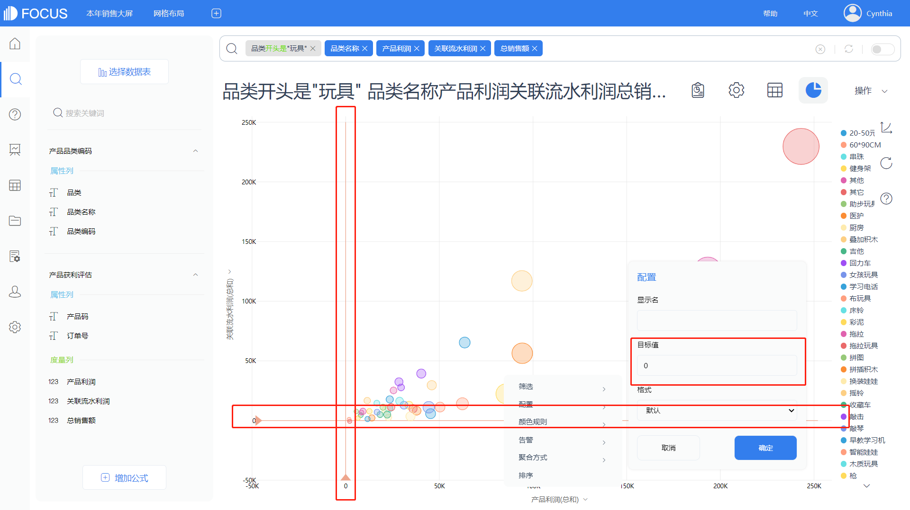

##  综合评估产品价值

### 4.1   产品销售初步分析

图13-1 是一张2017年整年的销售额、销售数量和销售利润的气泡图。每一个气泡代表一个产品的二级品类，X轴代表销售量，Y轴代表销售金额，气泡大小代表利润。不同的颜色代表的是不同的产品二级品类。从单类产品来看，销

图13-1 2017年二级品类销售情况气泡图

售额越多、销售量越大、利润值越高的产品就越好，而这反映在图表上就是气泡越靠近右上角、气泡面积越大越好。但这并不代表其他的产品就不好，一些销量大但是利润较低的产品适用于做产品促销，可用来做引流或者品牌影响力推广之类的活动，然后通过给其他高利润的产品带来更多的销售量来获得相应的利润补偿。具体要根据企业的需求和状态而定，综合、全面地评判衡量产品的价值，及时科学地进行销售策略的转变和制定。

### 4.2   产品价值总和评估

图13-2是某儿童用品厂商的玩具类产品在某月的销售盈利情况散点图，可以用来分析不同产品的销售（促销）价值。

图13-2 产品价值评估气泡图

可以看到该散点图中的横坐标轴为产品利润，纵坐标轴为产品关联流水利润（即产品的销售流水利润减去自身销售利润后的净利润），不同颜色的圆点为不同的产品，圆的大小代表产品的总销售额。与横纵坐标轴各自平行的红线分别代表对应轴的零线，将散点图分为四个象限。

通过这张图我们可以进行分析：

一般，第一象限（右上角的象限）产品的净利润为正，产品的销售利润也为正，这说明这款产品是客户喜欢并需要的硬通货；第二象限（左上角的象限）的产品净利润为正，销售利润为负，是用于促销扩展市场的产品；第三象限（左下角的象限）的产品净利润为负，销售利润也为负，是应该优化或下架停产的产品；第四象限（右下角的象限）的产品净利润为负，销售利润为正，是用来做捆绑销售的促销产品。

这是一个通俗常态的聚类划分法，但并不是完全的策略，还需要针对具体产品来做调整。

### 4.3   技术实现：应用DataFocus实现13.2的分析

（1）处理数据

将图13-3和图13-4进行内关联，关联列为产品码与品类编码。

图13-3 产品品类编码

图13-4 产品获利评估

（2）制作气泡图

将关联后的“产品品类编码”和“产品获利评估”作为数据源；

输入搜索语句“品类开头是‘玩具’ 品类名称 产品利润 关联流水利润 总销售额”，选择气泡图；

点击配置图轴，X轴为产品利润，Y轴为关联流水利润，大小为总销售额，如图13-5。

图13-5 玩具类产品价值评估

（3）配置最小值、设置目标值

调整X轴的最小值，使图形呈现四象限，如图13-6；

分别点击X、Y轴的列名，配置目标值为0，点击操作，保存为历史问答，如图13-7。

图13-6 配置最小值

图13-7 配置标度线
