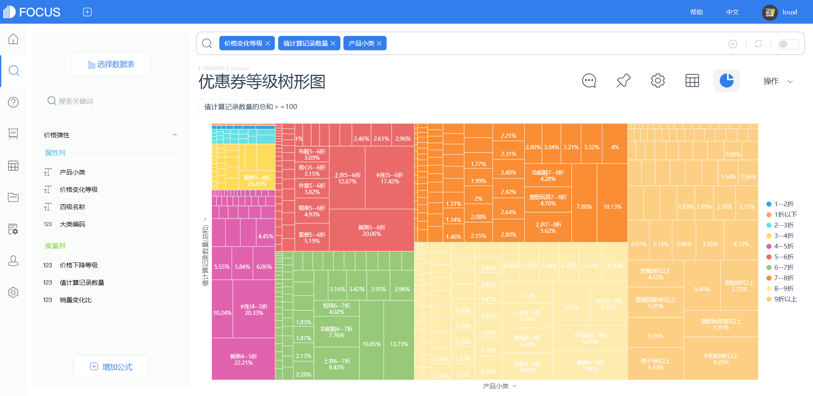
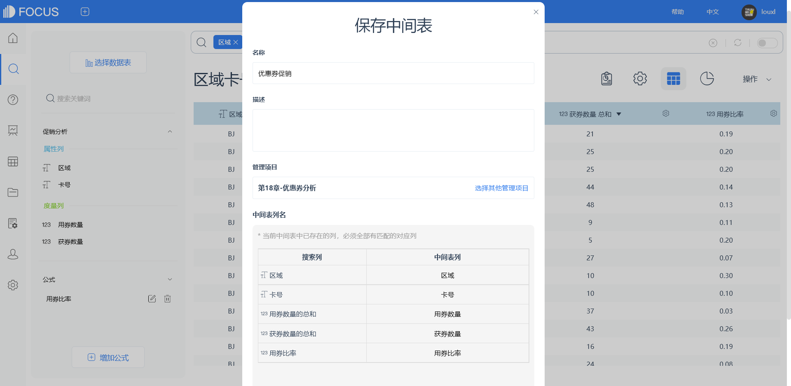
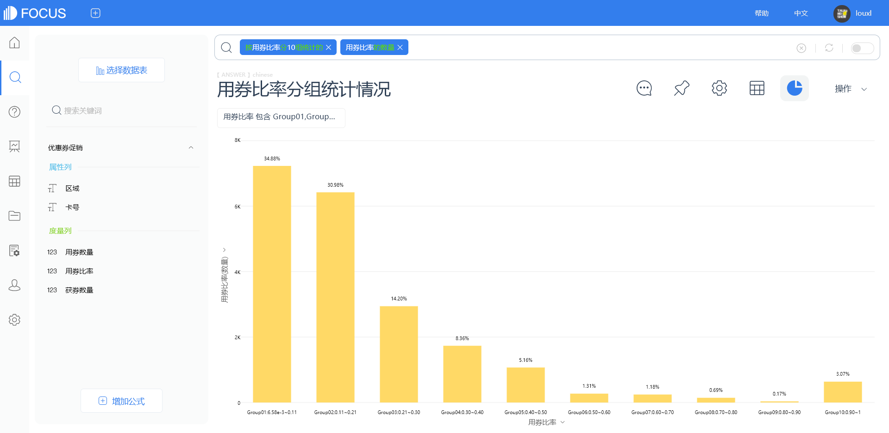
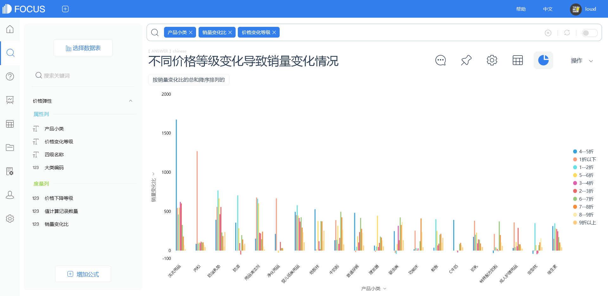

## 价格优惠对客户的态度影响

优惠券作为一种重要的促销手段，自19世纪20年代出现以来，经过纸质券、打印券再到电子券的不断演化，到现在几乎每个能够进行交易的网络平台都有优惠券的存在。

小小的优惠券其实并不简单。从本质上来讲，它是个经济学问题，优惠券是一种“价格歧视”策略。“价格歧视”属于微观经济学范畴，通常指商品或服务的提供者针对不同的消费需求进行的价格差异化设定，既不侵犯消费者平等权，也不违背公平交易原则，是商家追求利润最大化的合理定价行为；但同时，它也是个消费心理学问题，更是运营人需要掌握的重要运营策略。用户需要的不一定是占便宜，而是占便宜的感觉。如果直接降价，短时间内确实会刺激销量上升，但是时间一长，当用户熟悉了这个价格之后，这种刺激就失去了作用，当你恢复原来的价格时，反而可能导致销量下降。而使用优惠券，会产生一种对比效应，使用户产生了占便宜的感觉，让用户产生一种有便宜不占白不占的冲动，从不买到买，从少买到多买。

因此，用好优惠券是一种重要的运营策略。对活动运营而言，优惠券是订单转化和提升客单价的有力工具；对用户运营而言，优惠券是维护用户乃至召回用户的重要手段。

### 1   优惠券的使用情况

本次分析的数据来源于一个企业案例，本章主要利用了其中消费者优惠券和价格弹性的部分内容作示例。在数据收集时间范围的两年内，为了提高企业业绩，该企业针对不同产品做过各种不同形式的促销活动，几乎把市场上常见的营销策略都用了个遍。但因为不懂得灵活运用数据，导致无法评估各种促销活动的价值与优势。因此本章利用这部分历史数据，帮助企业分析优惠券的使用情况，评估营销活动价值。

首先我们使用“促销分析”数据集，得到该时期商家发放的优惠券数量以及用户使用的优惠券数量的散点图。在实际场景中，优惠券的使用情况还与活动力度等一系列因素有关，因此假设此次分析在各种限制因素都不存在的情况下进行，且用户之间不存在任何差异。结果如图18-1所示，X轴代表用户获得的优惠券数量，Y轴代表用户使用的优惠券数量，图例为区域代号。

图中每个散点代表一个用户，大部分散点集中分布在左下角，其余散点则代表用户之间存在较大的差异，需要进行进一步分析。

通过公式添加一个“用券比率”的字段，然后将计算的“用券比率”分成10组统计，绘制“用券比率”分组统计的柱状图，如图18-2所示，结果显示“用券比率”在10%以内的占比最高，“用券比率”在30%以内累计占比80%。

图18-1 用户获券数及用券数散点分布

图18-2 用券比率分组统计情况

受源数据限制，我们无法进一步追踪不同产品优惠券的使用情况，所以接下来我们使用“价格弹性”数据集，更宏观地研究不同品类商品在不同价位变化下的销售变化情况，从另一个数据维度分析促销优惠对商品销售的影响。

首先关注各产品小类价位变动与销量变化的关系，如图18-3所示，X轴代表不同的产品小类，Y轴代表销量变化比，图例为折扣情况。结果显示，并非折扣力度越大，销量就一定越高，反而是折扣在5-7折时销量增长最多。不同产品小类受折扣变化的影响也不同，其中销量变化较为突出的是洗衣用品和肉松。

接下来，按照不同折扣价位绘制矩形树图，分析各品类产品在不同价位时的销量变化，当然由于数据量较大，因此先过滤掉销量数据太小的产品和折扣在1折以下的数据，再进行数据分析。从图18-4可以看到，数据并不是呈现“折扣越低，销量就越高”的规则，在折扣很低的区域，销量情况反而不太理想，这说明消费者有自己的判断，超低价位折扣可能会引起消费者的警惕，最佳的折扣价位是7-9折。

图18-3 不同价格等级变化导致销量变化情况

图18-4 优惠券等级树形

### 2   技术实现：应用DataFocus实现18.1的分析

（1）导入数据。将分析所需的数据“促销分析”“价格弹性”导入DataFocus系统，选择恰当的数据类型。

（2）制作散点图。选择“促销分析”数据表，双击“区域”“卡号”“获券数量”“用券数量”进入搜索框，制作散点图，如图18-5。

图18-5 用户获券数及用券数散点图

（3）添加公式“用券比率”。左下角选择“增加公式”，添加字段“用券比率”，输入“sum(用券数量)/sum(获券数量)”，计算用户获得优惠券后的用券比率情况，如图18-6。

图18-6公式创建 “用券比率”字段

（4）创建中间表“优惠券促销”。选中“促销分析”数据源的所有列和添加的公式“用券比率”，去掉个别的离群值，固定“用券比率”的数值小于1.5，单击保存为中间表，将中间表命名为“优惠券促销”，如图18-7所示。

图18-7创建中间表“优惠券促销”

（5）制作柱状图。将“用券比率”进行分组统计。选择数据源为“优惠券促销”，在搜索框中键入“按用券比率分10组统计的用券比率的数量”（如图18-8所示），即可将用券比率按照相等的间隔划分为10组进行统计。

图18-8 用券比率分组统计情况

（6）制作柱状图。选择“价格弹性”数据表，双击“产品小类”“价格变化等级”“销量变化比”，选择柱状图。由于数据差异较大，纵轴的划分并不合理，因此配置图表的数据标尺，根据得出的数据结果配置最小值为\-100，最大值为2000（如图18-9）。最后得出的柱状图，如图18-10所示。

图18-9 配置数值标尺

图18-10 不同价格等级变化导致销量变化情况

（7）制作矩形树图。双击“产品小类”“价格变化等级”“值计算记录数量”，并筛选“值计算记录数量的总和\>=100”的数据，同时，价格等级筛选去除“1折以下”的数据，最后得出不同价位的产品销售数量情况的矩形树图，如图18-11所示。

图18-11 优惠券等级树形
