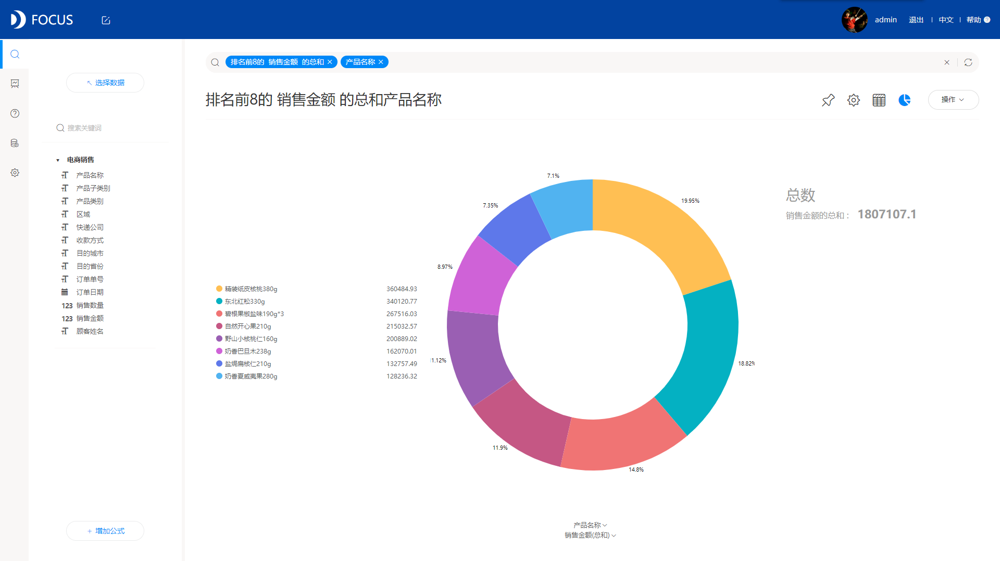

**企业数据分析还用报表？那你就out了！**

当今社会信息化发展迅猛，大数据产业呈指数型增长，企业通过多年的业务积累了海量数据，如何利用分析这些数据，也就成了各企业的一大难题。

在传统的数据分析过程中，更多的是采用报表形式，而且分析的也很浅，没有真正深入挖掘数据隐藏的巨大价值。因此，在信息化时代的今天，我们要分享一个实操性非常强，性价比非常高，创新型的数据分析工具。利用这样一个专业的数据分析工具，可以做到事半功倍，大大减轻数据分析的难度，提高数据分析的深度，让大家在面对企业业务数据分析时不再迷惑，做到步步为营，让数据分析真正释放出潜能，驱动业务快速增长。

前文提到的数据分析工具就是DataFocus。DataFocus是近年市场上新晋的数据分析工具，其最大的特点在于搜索式的交互方式，这种交互方式取代了传统的拖拽式，使得数据分析像谷歌搜索一样简单，如下图所示：

好的数据分析工具，不是说界面做得有多复杂，功能就有多好，而是要能适合大多数人进行自助式分析，要简单实用，而DataFocus的数据分析界面就如此，简简单单，一个搜索框，就包含大部分的分析功能，想要分析的信息，双击加入到搜索框或者自己手动输入，系统就会自行的按照搜索框内提供的内容进行分析，并且将结果返回，就跟百度搜索问题一样。DataFocus还有丰富的图表类型，在数据分析过后，将结果以合适的图表展示。

数据分析，已经跨过了使用传统报表的时代，正在进入使用专业工具的时代。
