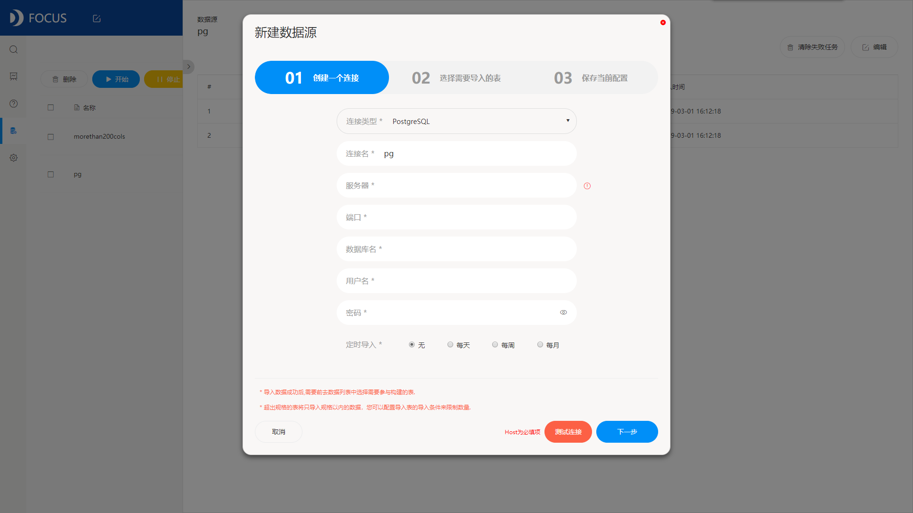

企业经过这么多年的业务发展，早已积累了海量数据，如何利用这些数据，这时候数据分析的重要性就尤为突出了。

数据分析的一大重点，就是整合企业分布在不同业务系统中相互独立的数据，只有数据齐全了，才能分析出有效的结论，才能依据分析结果制定正确的决策。数据整合之后会有成百上千张表，表与表之间如何实现跨表分析？本文今天的主要目的，就是分享如何跨表分析查询。

我们的数据分析工具以DataFocus为例，因为它实操性很强，操作非常简便，而且功能强大。

1、链接数据库，将各数据库中的数据整合到DataFocus中，DataFocus支持的数据库类型丰富，基本满足企业的需求；

2、选择有关系的多个表，选定主表，创建与维度表的关联关系；

3、关联关系创建完成之后，需要构建模型，关联关系才能生效，因此我们需要先去系统管理页面开始构建模型，待模型构建状态变为“SUCCESS”，即可正式进行跨表分析查询；

4、正式开始跨表分析，选择之前创建过关联关系的两个表；

5、直接进行搜索分析，双击需要的列，或者直接在搜索框内手动输入，系统会自动识别搜索框内容进行分析，并以最合适的图形展示；

6、至此，跨表分析完成，可以将分析结果保存为一个历史问答，然后添加到数据看板（即可视化大屏），以便后续进行查看；

这样一整个流程下来，是不是觉得跨表分析查询其实并不难呢？学会了吗？当然，不可否认，这么简单的主要原因在于DataFocus数据分析工具操作简单，没有什么复杂操作。
