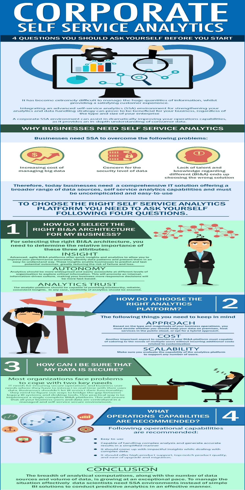

今天的客户是社会驱动的，比以往更有价值意识。每天的客户互动会产生高达2.5艾字节的数据，相当于1,000,000太字节，而且这个数字预计每年都会增长40％。随着企业面临应对数据量激增和客户互动数量激增的挑战，管理大量信息变得极其困难，同时提供令人满意的客户体验。企业和企业必须采用基于预测分析的数据驱动方法来创建以客户为中心的体验。

无论企业的类型和规模如何，集成高级自助分析（SSA）环境以加强分析和数据处理策略都可以证明对您的业务有益。企业SSA环境可以帮助您显着提高运营能力，因为它可以深入了解消费者数据。反过来，这可以帮助您的员工采用更灵敏，更灵活的方法来分析数据，并促进基于事实的决策制定，而不是预测和猜测。自助服务分析提供了丰富的智能和洞察力，可以帮助您理解数据并建立更亲密的关系，从而获得更好的客户体验。

**为什么企业需要自助分析**

随着有效管理大数据的成本增加成为扰动的原因，企业需要一个可以帮助扩展而不破坏银行的平台。此外，数据的安全级别也存在严重问题。大多数企业缺乏关于不同商业智能和分析（BI＆A）的人才和知识，并且往往最终选择不适合其业务规模和运营的错误模型。这会导致不准确的数据洞察，导致IT瓶颈，断开的分析体验，安全和治理风险以及额外费用。

企业需要的是一个全面的IT解决方案，提供更广泛的数据源和自助分析功能。此外，分析平台必须简单易用，同时它应该能够精心处理复杂的分析功能。

为确保您考虑选择的自助分析平台适合您的业务，您需要在开始之前先问自己这四个问题：

**1.如何为我的企业选择正确的BI和架构？**

您需要选择一个提供更深入见解，准确分析和完全自主信任的平台，以帮助您的员工更好地理解数据并提取关键信息，同时减少工作量和成本。要为您的企业选择正确的BI＆A体系结构，您需要确定这三个属性的相对重要性：

- **洞察力：**  先进，灵活的BI＆A平台可在您组织的不同区域提供快速洞察和分析。它们允许您通过提供创新的解决方案来提高您的绩效。此外，他们准确地识别数据模式并以易于理解的方式呈现它们，使企业能够根据可靠的事实和更有信心做出决策。这些见解使企业能够预测和测试潜在的结果，从而大大降低失败和丢失的风险。
- **自治：** 分析应该更广泛，并且可以在组织的不同级别轻松访问。这将允许您借助自助数据发现和数据准备工具探索关键信息并设计见解。这样做可以促进内部的，信息驱动的文化，使您的业务更具响应性，自信和灵活，同时决策将更加基于事实。
- **信任分析：** 分析平台应该能够提供值得信赖，可靠，一致的见解。但是，企业需要记住，转换到高级BI＆A平台不应该以不准确，不可信赖的见解和信息为代价。无论如何，在您可以进行组织范围的实施之前，确保分析平台输出的可信度至关重要。

**2.如何选择正确的分析平台？**

在选择正确的分析平台时，您需要记住以下几点：

- **方法：**  根据业务运营的类型和规模，您必须决定是保留内部数据，公共云中的主机服务还是选择混合方法。
- **成本：** 需要考虑的另一个重要方面是您的BI＆A平台必须能够满足多个用户的需求，而不会产生与定制相关的额外成本。该平台本身应支持数据准备和迁移。此外，费用应仅包括您使用的费用。
- **可扩展性：**  确保您评估分析平台的功能，以支持从几百到几千的任意数量的用户。企业级企业需要一整套功能来满足其不同的商业智能需求。

**3.我如何确保我的数据安全？**

大多数组织在应对两个关键需求时面临着问题：IT需要确保安全运营和业务用户需求，他们必须与自己的数据实时交互。企业不应该让BI限制其功能; 他们需要找到弥合传统BI系统和桌面工具之间差距的方法。一种实用的方法是实现一个完整的BI＆A平台。这将确保您的所有业务用户和数据集中在托管和自助服务安全环境中。

 **4.推荐哪些操作功能？**

这可能是您需要清楚了解的最重要的问题。为确保成功实施BI＆A计划，它必须易于使用，同时能够处理复杂的分析并以简化的方式生成准确的结果。重要的是，您的员工在没有正式知识或技术背景的情况下，能够使用BI＆A平台，这将节省时间和精力，用于定期参与技术支持以解决琐碎问题。

在处理复杂的数据组合时，您的BI＆A平台应该应用一系列分析技术，并提出更好，更有影响力的洞察力。更广泛地共享数据洞察并快速响应用户对数据的查询将相对容易地实现业务收益。此外，它应该提供高产品支持，一流的产品质量，以及易于升级和迁移。

希望了解数据分析或者BI解决方案，请移步DataFocus官网，我们诚挚的欢迎您的咨询来访。

