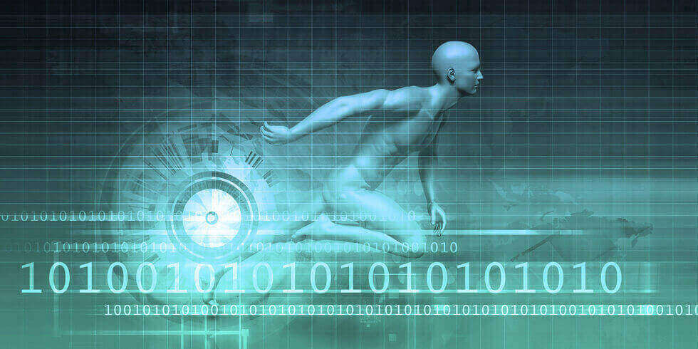

数据在许多业务领域保持其最流行的[商业智能流行语的地位。](https://www.datafocus.ai/infos/business-intelligence-buzzwords-2019)由于我们能够收集大量数据，不断发展的计算能力使分析师能够将这些数据分解成有意义的见解。现在数据分析的应用已经远远超出了传统业务。我们已经给出了一些关于[大数据如何在医疗保健领域挽救生命的示例。](https://www.datafocus.ai/infos/big-data-examples-in-healthcare)今天，我们将焦点放在体育领域中的大数据，运动分析软件和电子产品的发展上。最先进的摄像头、传感器和可穿戴设备使专业运动员能够以越来越详细和复杂的方式监控他们的表现。教练和经理利用数据来决定比赛的球队阵容，规定球员的卡路里摄入量，设计训练课程并实时监督他们的行动。此外，体育大数据通过交互式智能手机应用程序和智能体育场馆为球迷提供更好的体验。

旨在限制此类工具自由使用的体育主管部门的规定表明，[数据分析工具](https://www.datafocus.ai/infos/data-analyst-tools-software)在多大程度上可以影响体育的面貌。例如，NFL 不允许球员在比赛期间使用 GPS 追踪器，而只能在训练期间使用。在足球界，FIFA 长期以来一直反对在比赛中使用可穿戴设备，但根据最近的公告，他们现在允许球员在比赛中佩戴监控设备。国际网球联合会规定，球员在比赛期间不得访问球员分析技术 (PAT) 设备生成的信息，除非比赛暂停和教练允许。问题来了——为什么体育中的大数据如此强大，它究竟能揭示什么，以及它如何影响比赛？

## 足球大数据

教练和球员现在可以充分利用数码相机上记录的所有数据。新设备捕捉所有球场上的运动，并提供多维视图。由提供商StatsPerform提供的最先进的体育分析系统已经安装在伦敦北部的酋长球场——阿森纳足球俱乐部的主场。体育场周围安装了 8 个摄像头，系统每秒为每位球员跟踪 10 个数据点，即每场比赛 140 万个数据点，所有球员的互动、助攻、传球和铲球都不会被忽视。除了支持教练和球员的战术设计和表现监控外，ProZone 系统还用于测量个人球员的身体指标和负荷，以减轻潜在的伤害。

其他已经被世界级运动员成功使用的运动分析工具的例子是阿迪达斯开发的 miCoach 系统。在巴西 FIFA 世界杯期间，获胜的德国队在训练期间佩戴了 miCoach。该工具实时收集生理信息，并将这些数据实时传输到 iPad。它可以洞察球员的心率、距离、速度、加速度或力量，并将这些数据发送给在场边观看比赛的教练。之后，他们可以使用它进行深入的会后分析，以确定团队的弱点。

运动员分析领域公认的领导者是澳大利亚的公司Catapult Sports，该公司生产依赖 GNSS 卫星的跟踪设备。它的无线本地定位系统几乎可以捕捉所有的动作，包括微动作指标，并查看每个球员的身体负荷。

## 大数据与美式橄榄球

可穿戴设备也越来越多地用于跟踪美式橄榄球运动员的表现。美国最受欢迎的碰撞运动队已经发现，与让最昂贵的球员因伤缺席一个赛季相比，实施分析程序的成本微不足道。如今，可穿戴传感器通过监测球员努力的强度和碰撞的影响来防止此类事件的发生，并将这些指标与历史数据进行比较，当球员过度用力时及时提醒教练员。

在美式橄榄球分析中，Sportvision 处于领先地位。该系统收集有关球员的精确数据，如速度或总距离，并在广播中直观地跟踪他们。它还允许以 3D 格式观看比赛，以及在球场上用图形元素说明的得分驱动器。视频功能包括将视图旋转到不同的角度、放大或绘制箭头和线条以进行更清晰的分析。甚至球员本身也可以从视图中突出显示或删除。此外，Sportvision 的 Stromotion 功能可以定格球员或物体，并在回放中多次显示，以可视化序列中的运动轨迹。这只是大数据在美式橄榄球中所能做的一小部分，但它已经证明了它可以如何改善训练课程，并将电视转播提升到一个新的水平，从而更好地给观众带来体验。

## 网球大数据

大数据不仅在团队运动中是一件大事。技术进步带来了一套新的设备，可以实时收集和显示有关球员表现的信息。“球员分析技术”（“PAT”）包括心率监测器、智能球拍以及位于球场周围的基于摄像头的远程球员跟踪系统等可穿戴设备。

PAT 产品通常使用加速度计等传感器来记录速度，使用陀螺仪来测量球的旋转，摄像头和电极来测量力、运动和生理信息。这些提供了全面而详细的数据材料，随后可以与历史数据进行参照和并列。似乎有了所有这些分析工具，甚至连一次击球或球的旋转都无法逃脱教练的注意。

## 大数据和游泳

水不是尖端体育分析技术的障碍。游泳者佩戴一枚硬币大小的运动传感器，称为加速度计。在游泳的时候，尺寸实际上很重要，因为任何太大的东西都会干扰游泳者的划水或增加阻力。游泳生物力学可以通过英国公司Activinsights生产的加速器进行审查. 加速度计的工作原理非常简单——它包含一个附在弹簧上的小质量，当传感器开始移动时，质量会发生偏转，然后偏转转换为电信号。小型加速器可以连接到身体的任何部位，它们能够在水下长时间工作。这允许收集大量数据。只有对游泳者的手臂和腿部循环运动进行详细、长期的记录，才能分析特定泳姿所特有的模式，并且这一切构成了特定游泳者的技术。

昆士兰体育技术集群 ( QSTC ) 提出了一种可穿戴设备，它可以测量一个更重要的变量——每次游泳后的实际排水量。为什么这些信息有用？它让游泳者更好地理解自己的动作。他可以调整动作，以更少的动力排出更多的水，并保持高能量水平。

## F1中的大数据

每位赛车手身后都站着这么多工程师站在，我们可以将F1称为团队运动。汽车带有安装在底盘、轮胎和发动机各处的传感器。它们测量空气对车头的压力、刹车温度和轮胎压力。仅方向盘上的电子设备，就能做很多事情，从使汽车减速到通过头盔向驾驶员输送液体。

F1技术的高水平还体现在它的智能电路中，其中充满了能够以光速传输数据的光纤电缆。塔塔通信公司设计的技术能够从每辆赛车的一百多个传感器收集数千兆字节的数据，并将这些信息发送给维修区的工作人员、现场广播运营商和数千英里外的工程团队。多亏了实时数据，广播公司可以实时决定打开哪个摄像机、创建什么图像以及在每次拍摄中显示哪些广告牌。

## 大数据与粉丝体验

体育大数据不仅为运动员打开了新的视角，也为体育迷们打开了新的视角。没有观众就没有这种奇观，票务商正在不遗余力地鼓励球迷离开他们舒适的沙发和电视，观看现场比赛。分析可以提升体育迷的体验，例如通过智能手机。移动应用程序通过提供有关最近的可用停车场、排队最短的洗手间或允许他们订购食物并将其送到座位，使球迷在体育场逗留更加方便。体育迷们会很高兴在比赛期间从手机上看到回放、不同角度的镜头或特写视频。演出结束后，该应用程序将向您显示交通信息，并建议最快的回家路线。

一些批评者不赞成在体育运动中使用大数据，认为这与体育运动是技术娴熟的人类在田径场上竞争的理念相悖。他们声称，这将成为科学家和工程师之间的竞争，他们试图通过利用先进的分析技术来优化运动员的表现。然而，运动员一直得到教练、理疗师、心理学家和其他专家团队的支持。大数据技术将行业推向更高水平的数据分析，并开启了无数新的可能性，因此体育运动与其他任何行业一样，都应充分利用它。
