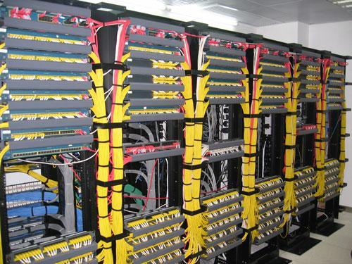

谈智能中台之前，我们先来谈一谈数据中台。这是最近几年兴起的一个概念，其中尤以阿里巴巴的推广而知名。所谓数据中台，首先强调的是一个集中的平台管控，就是要把企业的数据集中到一个地方进行治理。这一个动作要打破的就是数据孤岛。大型集团企业都有很多个业务系统，有的甚至有多达几十个的业务系统，每个业务系统都拥有自己的数据库，这些数据库各自为政，独立存在。更由于企业的业务系统非一朝一夕建成的，其代码风格，数据字段命名，接口风格各异；甚至很多关键业务系统，都已经找不到原厂商，仍然还在担任着重要的业务支撑工作。

把这些业务系统的数据统一到数据中台进行集中存管，就便于跨部门的使用这些数据。正是由于上面提到的历史沿革问题，要进行数据集中，首先必须进行数据清洗（ETL）工作，数据清洗是个繁琐复杂的工作，涉及到数据标准化，关联打通等等工作，越是历史悠久的业务系统，越是难以进行标准化清洗。所以，这里我们说，阿里巴巴的数据中台战略能成功，除了其雄厚的技术实力之外，最大的优势就在于其业务系统一直在与时俱进，标准化工作只是量大，难度甚至还不及一些大型国有企业。数据标准化工作之前，给幅图大家感受一下：

一团乱码似的数据，别说要利用他了，就算是动一下也是不敢的。面对上面这种情况，广大IT人员不烧高香祈求不要出问题就很不错了。

Ok，有了上面的标准化整理工作，我们就可以很方便的规划数据的取用。这时候的数据，就像自来水公司的水，需要对外输出利用的时候，我们只需要根据标准的供水管道接口，将自来水引入居民楼，装上自来水管和水龙头，随取随用了。感觉就是这样的：

说了半天，那么智能中台又是什么呢？上面提到，建设好了数据仓库，将数据进行标准化清洗之后，就像把各种野生水源地的水进行层层过滤、消毒处理，得到了可以使用的自来水。尽管可以通过自来水管道引入这些水，但终端用户要喝水，还得用热水器、净水机等等设备进一步处理。类比到数据中台，就是这些数据尽管标准化了，业务人员需要取用，仍然需要写sql语句，去计算并处理之后才能拿到结果。有没有更智能的数据中台呢？赋予我们更加广泛的应用包装能力？

有！答案就是DataFocus。运用其基于自然语言处理的数据库搜索引擎技术，终端用户对于数据的使用，变得异常简单。所有对于数据的查询和分析操作，都可以通过搜索的方式进行，简单的问答交互，就像封装好的各种饮料，可以开瓶即用！
