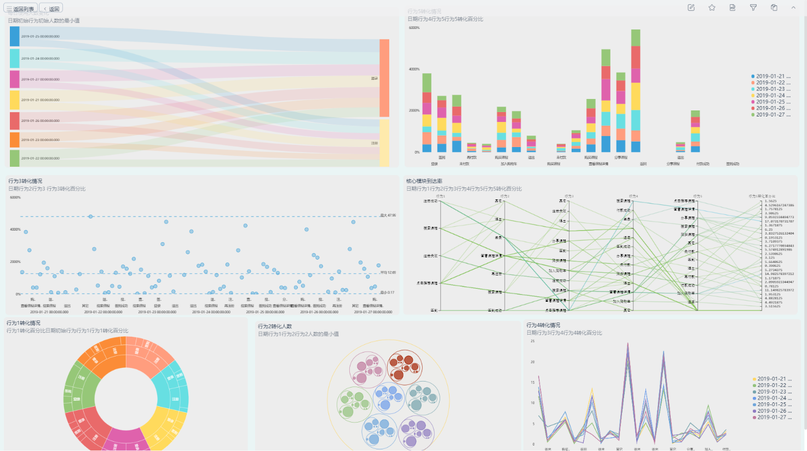

数据可视化是将数据用图形化的方式来表示，可以帮助人们迅速明白某些数据的重要性、理解数据的背后含义。**数据可视化**通常是理解和交流分析的第一步，因为当数据以图形方式而非数字方式呈现时，人们更善于理解数据。通过交互式（可点击）数据可视化，向下钻取以探索细节，识别模式和异常值，更容易让人看清新兴趋势，这是获得洞察力的第一步。

数据可视化也是传达发现的有效方式，利用人类视觉的快速感知直觉，支持更轻松的协作和更快的创新。随着数据的普及，数据可视化技术的使用越来越多，并且在多个学科中不断涌现。我们来看看DataFocus的数据可视化到底能给我们带来哪些价值？

## 1、更快地带来见解

数据可视化可以轻松发现趋势并更快地识别异常值。这些信息有助于了解业务的表现以及正在发展的机遇和风险。使每个人都能够快速，轻松地将数据转换为洞察力。

以上图形，由DataFocus搜索绘制

## 2、做出更明智，更快速的决策

通过理解信息并与他人合作以更快地激发洞察力和发现数据模式，组织可以快速做出基于数据数据驱动的决策。告别那种依靠直觉做出无把握决策的日子。

以上数据看板，由DataFocus制作

## 3、通过高级分析为每个人提供支持

现在，您的组织可以从易于使用的交互式仪表板中受益，该仪表板具有内置的地理空间，联动和钻取分析，可以开发更深入的见解，发现隐藏的模式，并对高价值的商业机会采取行动。

以上数据看板，由DataFocus制作

## 4、提高产品或服务的价值

数据具有令人难以置信的价值，但大多数用户没有时间或耐心去学习专业的商业智能工具。通过在你的应用和业务流程中嵌入DataFocus便捷的自助式分析能力，为用户提供方便，直观的数据。

## 5、在自定义分析请求上花费的时间更少

保护您的技术团队不为每个报告或可视化编写自定义代码，也不需要重复的，耗时的任务。相反，允许他们专注于构建您的核心产品或服务，使最终用户能够通过DataFocus的问答式搜索，自己可视化并从数据中获取答案。

