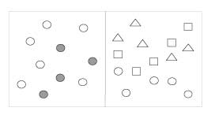
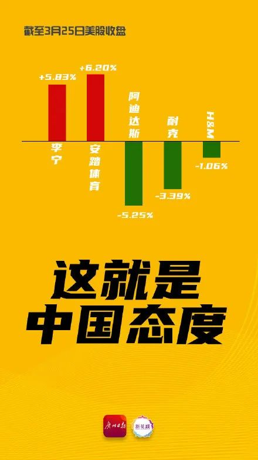

_可视化的软件的兴起，使得这项工作变得前所未有的容易。但是，往往是容易做的事情，才让我们忽视了其背后的真理。本文深入浅出的为大家讲述了数据可视化背后的理论，从实例出发，引导读者探索发现，数据认知背后的科学；带领读者从认知科学的演变历史中，逐步探究如今的可视化原则是如何依赖于科学实践的发展而来的。_

数据可视化是抽象信息的图形显示，有两个目的：感知（也称为数据分析）和通信。数据可视化中的重要工作是发现和理解这些故事，然后将其呈现给其他人。

统计信息是抽象的，因为它描述的不是物理的东西。无论是销售，疾病发生率，运动表现还是其他任何事情，即使它与物理世界无关，我们仍然可以在视觉上展示它，但要做到这一点，我们必须找到一种方法来实现：将其转化为视觉的物理属性（长度，位置，大小，形状和颜色，等等），但只有在我们对视觉感知 和认知有所了解时才能成功。换句话说，为了有效地可视化数据，我们必须遵循 源于对人类感知的理解的[设计原则](https://www.interaction-design.org/literature/topics/design-principles" \o "什么是设计原则？)。

俗话说“一张图片胜过千言万语” --甚至更多。但只有当故事以图形方式而不是口头方式讲述，并且图片设计得很好时，才有这种效果。你可以整天盯着一张数字表（想想看所谓的中国式报表），看看那些大同小异的数目字，不会有什么明显的感受。请允许我举例说明：下图是一份简单的，分两个区域记录1年的销售数据表。

__

_作者/版权所有者：未知（待定调查）。版权条款和许可：未知（待定调查）。请参阅以下[版权条款](https://www.interaction-design.org/admin/bookChapters/100749/edit?return_page=publication" \l "copyrightNotice)中的“例外”部分。_

这个表格做得非常好：它精确地记录了这些销售数值，提供了一种有效的方法来查找特定地区和月份的销售数值。但是，假如我们想在这些值中寻找模式、趋势或例外，或者我们想要快速了解这些数字中包含的故事，又或者我们需要比较整组数字而不是一次只比较两个；对不起，这个表格无法帮助你。

我们再来以折线图的形式查看以下相同信息：

_作者/版权所有者：未知（待定调查）。版权条款和许可：未知（待定调查）。请参阅以下[版权条款](https://www.interaction-design.org/admin/bookChapters/100749/edit?return_page=publication" \l "copyrightNotice)中的“例外”部分。_

****Ok，****现在我们可以从折线图中看出几个事实：

- 国内销售额大幅度持续高于国际市场。
- 全年国内销售总体呈上升趋势。
- 相比之下，国际销售保持相对平稳，但有一个明显的例外：它们在8月急剧下降。
- 国内销售表现出周期性，每季度重复一次上涨、下跌的周期性格局，并在当个季度的最后一个月达到峰值，然后在下一个月的第一个月大幅下降。

这些数字在表格中作为文本时无法向你传达这些丰富的信息，我们的大脑通过使用语言处理来解释，在视觉上进行交流时变得可见和可理解。这就是“数据可视化”的力量。

虽然数据可视化通常具有定量值之间的关系，但它也可以显示本质上不是定量的关系。例如，可以使用节点和链接可视化来显示诸如Facebook之类的社交网站上、或者可疑恐怖分子之间的人之间的连接。在下面的示例中，人是节点，表示为圆圈，它们的关系是链接，表示为连接它们的线。

__

_作者/版权所有者：由Jeffrey Heer和Danah Boyd使用Vizster提供。版权条款和许可：CC-Att-ND（Creative Commons Attribution-NoDerivs 3.0 Unported）。_

以实例之间的关系为特征的可视化，例如上面例子中的人，也可以通过添加定量信息来丰富。例如，任何两个人交互的次数可以用连接它们的线的粗细来表示。

### **数据可视化的历史**

有记录显示，至少自公元2世纪以来，人们一直在将数据排列成表格（列和行），但直到17世纪才出现以图形方式表示定量信息的想法。对于这项创新 我们得感谢法国哲学家和数学家勒内·笛卡尔(Rene Descartes)。他开发了一个用于显示数值的二维坐标系，包括一个变量的水平轴和另一个变量的垂直轴，主要作为执行数学运算的图形方式。

直到18世纪晚期，我们才开始利用图形的潜力进行定量数据的传播，感谢苏格兰人威廉·普莱菲尔（Playfair），他开创了许多当今常用的图形。他是第一个使用变化得线段来显示值如何随时间变化（折线图），如下图所示。他还发明了条形图、饼图。

__

_作者/版权所有者：由William Playfair（1759-1823）提供。版权条款和许可：pd（公共领域（共同财产的信息，不包含原创作者））。_

****图35.4****：Playfair在他的商业和政治地图集（1786年）中包含了这张图，以反对英格兰通过国债为殖民战争提供资金的政策。

多年来，定量图形的使用逐渐增加，但是它们的方法和有效性在20世纪下半叶之前几乎没有发展。雅克· 贝尔廷（Jacques Bertin）在1967年出版的“ Semiologie graphique”（The Semiology of Graphics，Bertin 1967）一书中为大部分进展奠定了基础。他的工作至关重要，因为他发现视觉感知是按照规则运作的，可以通过直观，清晰，准确，高效的方式直观地表达信息。

真正向我们介绍数据可视化，并将其作为探索和理解定量数据的手段的人是普林斯顿统计学教授John Tukey，他在1977年提出了一种称为探索性数据分析的全新统计方法。

1983年，在今天从事该领域工作的人，爱德华·图夫特（Edward Tufte）出版了他的开创性著作“量化信息的视觉显示”。他在其中指出，哪些用以可视化显示数据得方式是有效的，哪些是低效的（不幸的是，大众常用的方式，有时候效果不佳）。威廉·克利夫兰（William Cleveland）也在努力改善数据可视化实践，他为统计学家扩展和改进了数据可视化技术。

此后不久，“信息可视化”在学术界演变成一个新的研究专业。自21世纪之交以来，数据可视化已经普及，通过DataFocus、Tableau等商业软件产品到达大众。

令人感慨的是，在大量促进数据可视化的产品中，有一些表面上具有[美学](https://www.interaction-design.org/literature/topics/aesthetics" \o "什么是美学？)吸引力的 ，却不是有用和有效的数据探索--他们一味的强调视觉效果，但忽视了人的意识形成和信息沟通。

_作者/版权所有者：未知（待定调查）。版权条款和许可：未知（待定调查）。请参阅以下[版权条款](https://www.interaction-design.org/admin/bookChapters/100749/edit?return_page=publication" \l "copyrightNotice)中的“例外”部分。_

****图35.5****：此显示由同一数据集的多个视图组成，是使用DataFocus Mini创建的，DataFocus是目前了解数据可视化的少数软件供应商之一。

在为数据可视化理解做出贡献的人中，Colin Ware在理解人类感知方面做了大量工作。Ware的两本优秀书籍：《信息可视化：设计感知》（Ware，2004）和《视觉思维设计》（Ware 2008），汇编、组织和解释了我们从几个关于视觉思维和认知学科中学到的东西，并将这些知识运用到数据可视化。

### **眼睛是心灵的窗户**

数据可视化仅在以我们的眼睛能够辨别，并且我们的大脑能够理解的方式对信息进行编码的程度上是成功的。做到这一点更像是一门科学，而不是一门艺术，我们只有通过研究人类的感知才能实现这一点。目标是将抽象信息转换为可以轻松，高效，准确和有意义地解码的视觉表示。举个例子，当您需要帮助人们了解下表中包含的美国死亡的主要原因时：

__

_作者/版权所有者：未知（待定调查）。版权条款和许可：未知（待定调查）。请参阅以下[版权条款](https://www.interaction-design.org/admin/bookChapters/100749/edit?return_page=publication" \l "copyrightNotice)中的“例外”部分。_

您的数据可视化显示应实现以下目标：

- 清楚地表明这些价值观是如何相互关联的，在这种情况下是一个部分和整体的关系 - 每个原因的死亡人数加起来的总和等于一年中的所有死亡人数。
- 准确表示数量。
- 可以轻松比较数量。
- 可以轻松查看值的排序顺序，例如从死亡的主要原因到最少。
- 明确人们应该如何使用这些信息 - 他们应该用它来实现什么。

以图形方式显示此信息的传统方式涉及饼图，如下图所示。

__

_作者/版权所有者：未知（待定调查）。版权条款和许可：未知（待定调查）。请参阅以下[版权条款](https://www.interaction-design.org/admin/bookChapters/100749/edit?return_page=publication" \l "copyrightNotice)中的“例外”部分。_

这个饼图如何满足我们的有效性标准？让我们来审视每个要求。

- 清楚地表明了这种关系的本质？是。饼图的主要优势在于它清楚地表明了值之间的部分到整体的关系。
- 准确的表示数量？不是。饼图通过使用三个视觉属性冗余地编码值：每个切片的面积，饼图中心的每个切片形成的角度，以及沿饼图周长的每个切片的长度。即使正确计算每个切片的面积，角度和周长，也会失败，因为我们无法准确地感知这些属性中的任何一个。人类的视觉感知尚未发展为支持沿曲线的区域，角度或距离的准确解码。
- 是否可以轻松比较数量？不会。因为我们无法准确地感知这些值，所以我们也无法轻易或准确地比较它们。此外，在这个特定的饼图中，因为已经使用图例来标记切片，所以我们不断地通过找到通常难以区分的正确颜色来反复查找我们希望比较的切片的含义。此饼图已在3-D中渲染的事实也使简单的比较行为变得复杂，因为透视会使切片的相对大小和形状发生偏斜，使得底部的切片看起来比顶部相似大小的切片更大且更突出。
- 可以轻松查看排名的值顺序？不会。即使切片按照从最高值（心脏病）到顶部并按顺时针顺序到最小的排序顺序显示，排除最后的“所有其他原因”切片，这个排名并不明显，因为它很难比较切片。例如，由于3-D效应，红色癌症切片看起来比蓝色心脏病切片大，这使其具有更多的视觉重量。诸如此饼图的3-D渲染之类的效果有时被用于故意误导。
- 明确人们应该如何使用这些信息？部分是。尽管饼图成功地鼓励人们比较切片以了解每个部分对整体的相对贡献，但它无法有效地支持此操作。

鉴于此饼图的显示方式未能与人类感知相匹配，让我们考虑另一种显示形式。以下条形图显示相同的值集，但是以更容易感知的方式显示。

__

_作者/版权所有者：未知（待定调查）。版权条款和许可：未知（待定调查）。请参阅以下[版权条款](https://www.interaction-design.org/admin/bookChapters/100749/edit?return_page=publication" \l "copyrightNotice)中的“例外”部分。_

让我们使用与之前相同的标准来检查此条形图的有效性。

- 清楚地表明了这种关系的本质？是。就其本身而言，条形图并未声明这些值之间关系的部分到整体性质，因为与饼图不同，条形图也可用于显示其他关系。然而，这个特定的条形图包括使关系的性质清晰的组件，包括标题（“总死亡人数......”），尤其是加起来为100％的值列。
- 准确表示数量？是。每个条结束的水平位置和相对于沿x轴的定量标度的长度都以可准确感知的方式编码这些值。与区域，角度和不共享共同基线的曲线长度不同，二维位置和直线对象（例如这些条形的长度）共享一个共同基线并且彼此平行运行是视觉属性我们可以高度准确地感知。
- 是否可以轻松比较数量？是。因为我们可以在编码为条形时准确地感知这些值，所以比较它们也很容易。请注意，在比较饼图的切片时，看到这些条的长度差异是多么容易。另外请注意，当每个酒吧共享相同的颜色时，不同于颜色不同的馅饼切片，我们鼓励我们的眼睛比较酒吧的相似性。并且因为条形图直接用死亡原因的名称标记，所以我们必须在比较值时不再进行图例所需的工作。
- 可以轻松查看排名的值顺序？是。因为条形长度的差异很容易被察觉，所以除了最终的“所有其他原因”条之外，它们从最高到最低排名的事实是显而易见的。通过按排序顺序排列条形图，我们还通过将图中最接近值的死亡原因放在一起，使得比较更加容易。
- 明确人们应该如何使用这些信息？是。应该比较这些条形以了解这些死因导致总死亡的不同程度，这一事实直观明显。

比较饼图和条形图的感知效果的关键不是针对饼图（尽管这个案例表现如此），而是为了说明****我们应该****如何****总是根据度量来判断可视化的优点。我们可以轻松，高效，准确，有意义地感知信息必须讲述的故事****。要做到这一点，我们必须理解用于显示特定故事的各种图形方式的感知优势和弱点。要做到这一点，我们必须了解感知。

### **数据可视化和人类感知**

数据可视化是有效的，因为它改变了感知和认知之间的平衡，以更充分地利用大脑的能力。看到（视觉感知）由位于大脑后部的视觉皮层处理，非常快速和有效。我们立即看到，没有多少努力。思维（即认知）主要由大脑前部的大脑皮层处理，速度慢得多，效率也低。传统的数据意义制定和呈现方法需要对几乎所有工作进行有意识的思考。[数据可视化](https://www.interaction-design.org/literature/topics/data-visualization" \o "什么是数据可视化？) 将平衡转向更多地使用视觉感知，尽可能利用我们强大的眼睛。

__

_作者/版权所有者：未知（待定调查）。版权条款和许可：未知（待定调查）。请参阅以下[版权条款](https://www.interaction-design.org/admin/bookChapters/100749/edit?return_page=publication" \l "copyrightNotice)中的“例外”部分。_

最初对感知科学的贡献之一是由格式塔心理学院提出。这项努力始于1912年的最初目的是揭示我们如何看待我们所看到的模式、形式和组织。创始人观察到我们以特定的方式组织我们所看到的东西，以努力理解它。这项努力的结果是一系列[格式塔](https://www.interaction-design.org/literature/topics/gestalt-principles" \o "格式塔原则是什么？) 感知[原则](https://www.interaction-design.org/literature/topics/gestalt-principles" \o "格式塔原则是什么？)，今天仍被视为对视觉行为的准确描述。以下是一些可以为我们的数据可视化工作提供信息的原则：

<table><tbody><tr><td>接近</td><td>靠近的物体被视为一组。</td><td><em></em></td></tr><tr><td>相似</td><td>共享相似属性（例如，颜色或形状）的对象被视为一组。</td><td><em></em></td></tr><tr><td>附件</td><td>看起来具有围绕它们的边界的对象（例如，由共同颜色的线或区域形成）被感知为一组。</td><td><em></em></td></tr><tr><td>关闭</td><td>只要有一种方式可以合理地解释它们，开放式结构就会被认为是封闭的，完整的和规则的。</td><td><em></em></td></tr><tr><td>连续性</td><td>对齐在一起或看起来是彼此的延续的对象被视为一组。</td><td><em></em></td></tr><tr><td>连接</td><td>连接的对象（例如，通过线）被视为一组。</td><td><em></em></td></tr></tbody></table>

视觉感知和认知的新见解来自除信息可视化之外的各种学科的工作，例如社会工程学 和人机交互，但没有一个比认知科学，尤其是认知心理学产生的更具突破性。今天，随着用于大脑探索的新的和改进的技术和方法，提高数据可视化的感知有效性的机会比比皆是。特别是两个研究领域特别有用：

- 预先视觉处理
- 注意力和记忆力的机制和局限

数据可视化的一大优势是可以比口头信息更快地处理视觉信息的能力。经验性视觉处理是在意识觉醒之前自动发生在大脑中的部分。它由几个阶段组成，每个阶段由专门的神经元处理，这些神经元被调整以检测包含在光中的视觉信息的特定属性，这些属性反射出世界中物体的表面，然后将它们缝合在一起成为我们心目中的图像。我们可以使用这些基本属性，例如长度，大小，色调，颜色强度，角度，纹理，形状等的差异，作为数据可视化的构建块。

对注意力和记忆力的研究揭示了我们在意识中同时记住多个物品的能力，是出乎意料的有限（实验证明人类对于超过7个以上的物体的记忆就开始模糊了）。这种认识使我们依靠外部形式的信息存储来增加注意力和记忆力。实现此目的的最有效方法之一是直观地编码信息，这允许将更多信息一起分块到工作存储器中可用的有限插槽中。另一种方法是一次在我们眼前放置几个信息视图，从而扩展我们探索多维数据的能力，从多个角度进行比较，考虑到人类记忆能力的限制，一次展示不要太多。

### **未来方向**

与其他领域一样，数据可视化领域最需要的并不总是最令人兴奋的，甚至不具有什么特别的创新性。有时我们只需要更容易做那些有效的事情。这方面的一个例子是一些类似DataFocus的软件供应商努力将数据可视化最佳实践构建到工具中，例如以自动化的形式，从而使得做更有效，更难和更昂贵的工作变得更容易，更省时。除了这些简单，直接但经常被忽视的改进之外，还有一些其他领域提供了丰富的潜力，例如：

- 将地理空间和网络显示（例如节点和链接图）与其他形式的显示集成，以实现无缝交互和同时使用。
- 协作数据意识的技术支持，将多个大脑的互补优势结合在一起。
- 将描述性统计数据之外的数据可视化应用于预测分析领域，例如通过使用交互式预测视觉模型。
- 更紧密地集成数据挖掘算法，通过数据可视化找到有意义的模式，以提供更好的方法来审查和探索这些模式。
- 改进的人机界面设备，用于以更快速和无缝的方式与数据可视化交互。

所有这些都在某种程度上被追求，但如果更多的研究人员专注于解决我们当今世界面临的实际问题，那么可以更快地加以利用。

作者：STEPHEN FEW
