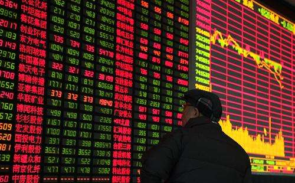

一直以来，人工智能领域最富盛名的猜想就是，它能预测股市吗？很多聪明人认为这是人工智能到底聪不聪明的试金石---这个检验实在是太完美了，因为号称万物之灵的人类，绝大多数一生中都被股市虐趴下；如果真有那么流弊，那它就应该能干得了这事儿！

好吧，DataFocus很实诚的告诉你，虽然说它拥有很多优秀的算法和预测效果，然而它真的对股市无能为力！这么多年来，能像股神巴菲特那样跑赢市场的人脑也是寥寥无几。

可能有人要说，人的计算能力远远补不上电脑，人工智能的强项就是可以对多如牛毛的因素进行计算，为什么人工智能不行呢？

我们知道，股市的预测，是对股票价格的预测，而不是对企业价值的预测。我们能从股市得到的信息，就是一段段随着时间变化的某只股票的价格，这种时序数据拿来做预测，输入是时间，输出是价格。股票的价格涨跌不仅仅只是依赖于时间，它的变化模式随着外部环境的变化会不停的变化，比如央行没事放点儿水；比如特朗普同学没事发发推特，这都是无法计入的输入变量。

可能又有人说了，充分市场理论认为，所有的影响因素都反应在趋势上了，不需要那么多输入变量。其实不是那么回事儿，长期来看，这种理论也许是对的，但是环境和时间不是静止不动的，股票的价格永远不可能停留在某处等待这种影响因素完全的反映出来，这种动态变化的系统，是根本无法预测的。再先进的预测算法，也只是对某一个系统进行函数模拟。这种预测模型的训练过程，就像是从结果逆推函数公式的过程，试问：这种函数本身都在时时刻刻发生变化，你又如何能够做出准确预测呢？

所以说，不仅仅是DataFocus不能对股市进行准确的预测，所有的人工智能都干不了这个事儿。以后如果有人告诉你它有很牛逼的人工智能，可以准确预测股市，让你投钱给他炒股的话，你得先想想：哪个SB会把自己赚钱的秘密满大街拿出来分享呢？
