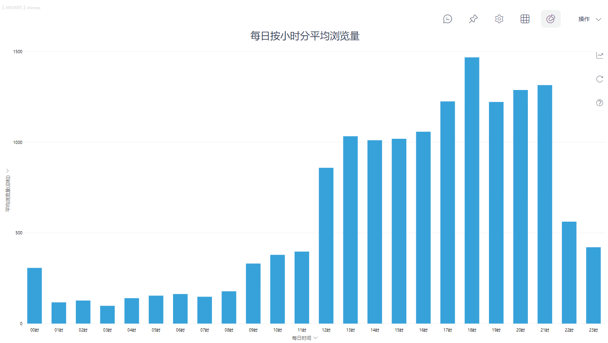

很多人不知道时间格式的数据，该如何转换成单个小时数、分数、秒数，因为微软悄悄把转换代码隐藏起来了。

而Excel的TEXT函数能做到提取时、分、秒的数字，但要进一步知道具体时间对应的数据就非常麻烦了。比如要知道前十分钟的销售量，或是每小时的销售量，Excel还是很难实现分析。

但这款**更智能更高效的国产数据分析BI工具DataFocus**，就能轻松get时间数据。

今天就和大家分享一下，如何快速获取具体时间对应的数据。

### 一、时间公式

公式：diff\_time

可以用于计算前后时间的秒数差，比如diff\_time(发货日期,订单日期)，就可以计算从订单日期到发货日期差了多少秒。

公式：hour\_of\_day

可以用于计算当日的几点，比如hour\_of\_day(订单日期)，就可以计算订单日期的小时数。

这两个公式都可以在datafocus系统中创建关键词字段后，再通过搜索框输入关键词字段进行分析。

### 二、分钟关键词

DataFocus的关键词系统，可以让你直接在搜索框输入关键词，系统就会自动数据分析。

以下是分钟关键词。

**前/最近/过去的/过去xx分钟/分**

它可以查看过去xx分钟的数据情况，例如：过去3分钟用户浏览量。

**上一分钟/前一分钟**

它可用于查看过去一分钟的数据情况，例如：上一分钟的用户浏览量。

**未来/接下来（的）xx分钟（的）**

它可用于查看未来xx分钟的数据，例如：用户接下来3分钟浏览量。

**下一分钟**

它可用于查看未来一分钟的数据情况，例如：下一分钟用户浏览量。

**每分/每分钟**

它可用于查看每分钟的数据情况，例如：每分钟用户浏览量。

**xx分/分钟前（的）**

它可用于查看过去xx分钟之前的数据。例如：5分钟前用户浏览量。

### 三、小时关键词

以下则是小时关键词。

**前/最近/过去的/过去xx小时/个小时**

它可用于查看过去xx小时的数据，例如：过去的3小时用户浏览量。

**上一小时/上一个小时/前一小时/前一个小时**

它可用于查看过去一小时的数据，例如：上一小时用户浏览量。

**未来/接下来（的）xx小时（的）**

它可用于查看未来xx小时的数据，例如：用户未来3小时浏览量。

**下一小时/下一个小时**

它可用于查看未来一小时的数据，例如：下一小时用户浏览量。

**每小时**

它可用于查看每小时的数据，例如：每小时用户浏览量。

**xx小时前（的）**

它可用于查看过去xx小时之前的数据。例如：5小时前用户浏览量。

在搜索框输入关键词，就能快速获取时间数据。怎么样？是不是更方便了呢？

快速掌握这些技巧，成为数据分析精英吧！

关注我，获取更多数据分析实用技巧！
