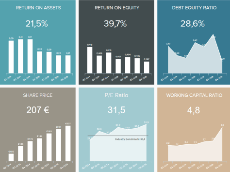

BI 仪表板软件是一个术语，用于描述收集、分析、呈现和有效共享数据的方法和技术的可视化。BI 仪表板工具可帮助企业获得可操作的新见解以提高绩效。

我们生活在一个知识就是力量，数据就是新石油的数字时代。访问这些数据、共享和生成快速见解已成为在这个竞争激烈的市场中蓬勃发展的任何企业最重要的引擎之一。IT 部门不再拥有对数据的专有访问权限，并且通过 BI 仪表板工具，知识在整个公司中传播，使每个业务用户能够利用数据可视化创建自己的交互式报告，并与内部和外部利益相关者传播知识。这是[仪表板软件](https://www.datafocus.ai/infos/best-dashboard-software-features)从任何业务中创造最多的地方，在这里我们将更详细地解释如何。

- **快速数据分析：**在我们残酷的信息时代，速度至关重要。收集信息、分析、处理和评估是费力的任务，需要花费每个相关利益相关者的时间、资源和精力。通常，负责决策的人没有时间进行大型研究或重大行业发展项目。小型企业没有能力在不丢失宝贵信息的情况下分析如此多的数据，而这些信息可以使它们与竞争对手区分开来并为增加收入提供基石。[这就是BI 报告工具](https://www.datafocus.ai/infos/bi-reporting)的速度所在：通过使业务用户能够生成自己的报告，不再需要等待数天甚至数周来获得特定业务相关问题的答案。
- **竞争优势：**随着竞争的加剧、预算的紧缩和更大的期望，大大小小的企业都需要一个可靠、直观且易于访问的商业智能仪表板来实现成功的分析和决策。在规模越来越大、利润率越来越小的行业中，资源比以往任何时候都更加紧张，并且收集到了前所未有的数据量，决策者、管理层和利益相关者能够访问、分析和解释其业务的各个方面是至关重要的及其按需性能。响应迅速的商业智能仪表板软件以华丽的方式处理这些需求，
- **数据可视化：**随着越来越多的数据源出现，非常需要编译一个集中的访问点，数据可以以一种清晰的方式呈现，并具有即时洞察力。传统的电子表格已经变得如此拥挤，以至于做出业务决策最终可能会无限期地滚动和搜索正确的信息。由于人类处理视觉数据的速度比书面数据快得多，因此图形正在成为使用专业商业智能仪表板工具呈现信息的商业标准。不仅仅是普通的图形和图表，而是交互式的，可视化企业拥有的每一个信息，预测结果，并为企业用户提供即时、可操作的见解。有很多[业务仪表板示例](https://www.datafocus.ai/infos/dashboard-examples-and-templates)这样做为小企业主和企业提供了广泛的可能性。
- **绩效管理：**跟踪业务目标的进度和绩效需要随时访问数据，如果数据杂乱无章、分散在多个来源和电子表格中，则跟踪和组织可能会影响获得有价值业务的决策时间信息，如前所述。[如果通过选择正确的KPI 模板](https://www.datafocus.ai/infos/kpi-examples-and-templates)在实时跟踪期间执行绩效管理，无论是销售周期长度等销售目标，还是零售订单概览，整体绩效都变得更加有效，业务机制也越来越富有成效。这使企业主、经理和员工能够可持续地发展他们的职能，同时立即发现问题，从而具有迅速有效行动的优势。
- **客户行为分析：**客户是每个组织和企业的心脏，无论是大型企业还是小型本地商店。因此，了解您的客户是每一项重大业务成功和可持续发展的关键部分。了解他们的行为，利用所有可用数据专注于他们与您的业务的交互，创建了一个强大的机制来预测结果并相应地调整业务战略。一个清晰的客户意图路线图和新的销售机会将出现，提供新的收入和提高客户满意度，适应业务运营的每一个利基和细微差别。

话虽如此，[在线 BI](https://www.datafocus.ai/infos/online-bi-tools)工具正在成为收集数据、分析和提供实时见解的业务标准。参加 PowerPoint 演示文稿的会议，或通过永无止境的电子表格搜索正确答案不再需要太多时间或精力。借助人工智能和智能数据警报的力量，整合所有不同数据源的可能性，以及利用在线数据分析，一个没有杂乱无章的工作环境和触手可及的数据，创建最强大的业务策略，提高效率和降低成本。

### 利用现代商业智能仪表板软件的优势

BI 中的仪表板工具是尖端解决方案，将传统商业智能的基本方面与其对用户体验的标志性承诺融为一体。必备的 SQL 知识已经一去不复返了，只对最有经验和最合格的 IT 专家才有意义的无数复杂方程式和语言也不见了​​。取而代之的是，专为从头开始使用而设计的商业智能仪表板功能强大，对于没有受过培训的实习生来说足够易用，对于拥有多年一线经验的 CEO 来说足够强大。

- **集中访问数据：**如前所述，投资商业智能仪表板软件的主要好处之一是它为所有数据源提供集中访问点。我们的专业[数据连接器](https://www.datafocus.ai/infos/data-connectors)让您只需单击几下即可将来自 MySQL、Oracle、Amazon、CRM 系统、第三方数据提供商的所有最相关的内部和外部数据源连接到简单的平面文件。连接源后，借助直观的拖放界面，您就可以开始创建令人惊叹的仪表板了。
- **访问实时数据：**为了在竞争中占得先机，在计划、分析和报告中拥有准确的数据也很重要。为此，我们的 BI 仪表板工具为您提供实时数据，因此您可以即时了解您的业务在运营或战略层面的表现。像这样，您不再需要经历手动更新数据源的痛苦，因为该工具会在新数据可用时立即自动显示。如果所有员工都在正确的时间和正确的时间得到通知，则完全消除了猜测，从而为做出明智的决定创造了实质。
- **生成预测：**借助预测分析等先进技术，BI 仪表板工具可以研究您的当前和历史数据以发现关系、趋势和模式，从而生成有关您未来绩效的预测。通过这种方式，您可以始终领先于数据，并根据准确的结果规划您的策略、资源和预算。
- **自动化报告：**使用 datafocus 的专业仪表板商业智能软件，执行[在线数据分析](https://www.datafocus.ai/infos/data-analysis-tools)从未如此简单。由于该工具将自动生成报告并在预定义的时间将其发送给特定的收件人，因此可以节省大量手动报告时间，同时显着降低人为错误的风险。
- **自定义仪表板：**白标功能允许您根据您的业务配色方案、字体和徽标自定义仪表板，以获得更专业的外观。从 25 多种图表和图形选项中进行选择，以最有效和最易于访问的方式讲述您的数据故事，并从高级图表选项中受益，让您的数据更进一步，并成功传递您想要传达的数据信息。
- **24/7 全天候访问：**借助这些[商业智能解决方案](https://www.datafocus.ai/infos/business-intelligence-bi-solutions)的 SaaS 环境，您可以在任何有互联网连接的设备上随时随地访问您的数据。如果您想在外部会议中显示您的仪表板，或者想在办公室外访问您的手机上的数据，您只需要登录您的 datafocus 帐户，您将立即拥有对所有数据的完全访问权限。
- **保护您的数据：**以安全的方式共享您的报告是您从 BI 仪表板软件获得的保证。您的[在线仪表板](https://www.datafocus.ai/infos/online-dashboard) 可以通过受密码保护的 URL 共享，您可以为特定收件人定义查看和编辑权限，以便他们只能查看或操作您希望他们拥有的数据。此外，仪表板可以多种格式（pdf、png、xls 或 csv）导出和共享。

### 为什么我们的 BI 仪表板软件很特别？

一些传统的[商业智能工具](https://www.datafocus.ai/infos/best-bi-tools-software-review-list)只能在 IT 部门手中充分利用，而我们的 BI 仪表板软件具有变革性。在其他解决方案需要 IT 输入的情况下，datafocus 完全无缝的工具使每个部门和部门负责人能够在需要时访问他们需要的数据。

[我们的SQL 报告生成器](https://www.datafocus.ai/infos/sql-report-builder)将团队从 IT 瓶颈中解放出来，不需要任何 SQL 知识。围绕易于使用的拖放界面构建，用户可以简单地选择他们需要的报告元素，然后将复杂的方程式留给我们的工具。

datafocus 的 BI 仪表板软件是在全球中小企业的帮助下开发和完善的。它的功能基于现实生活的需求和愿望，这意味着它了解业务功能从运营到战略、管理到营销的复杂多样的需求，并提供相应的支持。正是这个真实世界的应用程序让 datafocus 具有标志性的易用性，从创新的数据可视化到高级数据分析任务，这些任务曾经很复杂，现在只需点击鼠标即可轻松完成。不仅如此，我们的团队还可以创建[POC](https://www.datafocus.ai/infos/poc-datafocus)，向您展示自定义仪表板的强大功能以及您自己的数据和 KPI。

数据库可以在几分钟内集成，无需下载软件，任何位置的任何员工都可以立即开始使用动态实时商业智能仪表板、自动报告和数据可视化，包括移动、移动解决方案。由于不需要事先培训，使用业务分析工具要求（例如正式的 IT 培训和以前的 BI 经验）的障碍消失了。这种易于访问意味着可以按需创建和生成报告，允许每个业务部门响应日常甚至每小时的变化；工作流程变得更加高效，沟通得到改善，决策更加明智。

通过个人访问，一种基于云的结构，可确保从任何位置和企业级安全层进行 24/7 访问，通过 14 天免费试用了解 datafocus 的 BI 仪表板软件可以为您的业务做什么。
