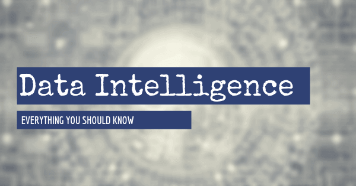

目前，53%的企业正在将大数据分析作为其核心战略的一部分——这并非巧合。

要在当今信息丰富的数字战场上获胜，必须将洞察力转化为行动，[在线数据分析工具](https://www.datafocus.ai/infos/data-analysis-tools)正是这样做的载体。数字化转型的内在崛起，加上当今消费者对万维网（以及所有连接到万维网或围绕它的实体）的胃口，现在是利用这些信息发挥优势的好时机。

但是有这么多的洞察力和如此少的时间来分析它，你要从哪里开始？通过数据智能，您将能够深入了解对公司真正重要的见解，并使用它们做出明智的决定，最终帮助您改善业务。

在这篇文章中，我们询问“什么是数据智能？”，探索智能技术，并考虑这些技术如何在现实商业环境中提供持续的价值。

让我们先看看定义。

## 什么是数据智能？

数据智能是使用分析工具为大量业务数据赋予意义的过程。多亏了人工智能和机器学习等智能技术，公司可以将数据转化为可操作的见解，以提高其性能。

这个宝贵的分析概念深入到信息分析中，以提取价值和意义，并促进整个组织加强[数据驱动](https://www.datafocus.ai/infos/data-driven-decision-making-in-businesses)的[决策](https://www.datafocus.ai/infos/data-driven-decision-making-in-businesses)。

在为情报目的收集和策划数字见解时，企业会求助于各种有价值的来源，例如绩效指标、以消费者为中心的周期性趋势和许多其他描述性信息集。

与[商业智能](https://www.datafocus.ai/infos/bi-skills-for-business-intelligence-career)不同，商业智能主要集中在对数据进行逻辑理解，并以可消化、可广泛访问的格式呈现，而[商业](https://www.datafocus.ai/infos/bi-skills-for-business-intelligence-career)智能更侧重于分析最纯净的信息。

因此，数据智能软件涵盖五个关键信息组件：_预测、决定性、描述性、规范性和__诊断数据__。_

通过在您的组织中采用智能软件和方法，您将获得您从未知道自己拥有的眼睛和感官——信息智能也是如此，这是一个类似的术语，但略有不同。

我们探索了数据智能定义。现在是时候看看信息智能的定义了。

## 什么是信息智能？

信息智能是以数据为中心的智能的一个分支，为将看似无法管理的数据转化为有利于业务持续成功的举措提供了更广泛的空间。

IGI Global的官方信息情报定义建议：

_\[信息智能\]将大量复杂数据转化为相关和可操作的智能的技术，以便更好地管理风险并提高盈利能力。_

这意味着，通过信息智能方法，可以从更广泛的见解中提取价值，以改善、增强和简化核心业务计划。您可以从与您的业务相关的各种[KPI示例](https://www.datafocus.ai/infos/kpi-examples-and-templates)中进行选择，或者继续阅读以深入了解利用智能和数据的好处和现实生活中的业务场景。但首先，让我们更详细地探索这两个概念。

## 数据、信息和智能之间的区别

如果您仍然对我们刚才提到的两个概念之间的实际区别感到困惑，别担心，我们已经为您介绍了。为了理解这两个复杂但实际上很简单的概念，我们首先需要研究数据、信息和智能之间的差异。

如果你在分析领域呆了一段时间，那么你可能被一堆概念轰炸，如大数据、BI、数据科学和分析等等。虽然这些概念在某些情况下都可以互换使用，但它们的意思并不相同。这就是数据、信息和智能的情况。让我们看看他们的主要区别以及他们是如何合作的。

- **数据**：这是从与您的业务相关的事件中量化的事实测量或统计数据的集合。在这里，我们谈论的不是分析或见解，而只是来自组织选择的各种内部和外部来源的原始数据。
- **信息**：另一方面，信息是将所有数据汇集并赋予其意义的方式。换句话说，抓取以与特定背景或叙述相关的方式组织的结构化数据。这些信息用于生成与组织发展相关的问题。
- **智能**：最后，智能是使用信息来推动成功商业决策的过程。与其像处理信息那样讲故事，不如画一幅画。它告诉你在预测分析和人工智能等高级方法的帮助下会发生什么。这里的重要收获是，智能不是结果，而是来自信息的过程，换句话说，是分析过程。

简而言之，这些概念的意思不一样，但它们具有相同的重要性。获取错误的数据，您将获得毫无意义的信息和情报，这将导致糟糕的决策。

## 数据智能的好处

我们已经深入研究了数据智能和信息智能的含义，并考虑了这两个概念是如何重叠的。现在，让我们看看数据智能工具和实践在商业世界中的主要好处。

- **适应性：**数字世界处于不断演变的状态，这意味着，如今，企业必须比以往任何时候都更适应变化。尽管如此，数据智能解决方案和实践提供了将原始数据转化为可操作见解、发现趋势并深入了解宝贵的消费者和[数据发现](https://www.datafocus.ai/infos/what-are-data-discovery-tools)过程的能力。因此，您将能够根据周围的环境进行持续改进，使您的业务具有指数级的适应性，进而增加您的长期成功机会。
- **可扩展性：**在前一点上扩展，这种对更智能分析的访问还将为您的组织提供适应性，以更好地应对商业增长，从而更容易随着时间的推移发展和扩展您的实践、流程和资源。
- **知识：**通过获得构建大数据集和深入挖掘业务特定领域的能力，智能流程将为您提供一定程度的知识，不仅可以简化您的内部和外部策略，还可以让您发现突破性的新见解，这些见解可能会促进您的商业成功。数据可访问性增加10%可能会导致财富1000强公司的净收入增加6500万美元——这证明了数据驱动知识的力量。
- **愿景：**如果明智地实施智能数据分析，也可以为当今的洞察力业务提供无与伦比的预测愿景。最近的一项研究表明，在商业中使用预测分析可以导致高达25%的投资回报率。通过提供分析特定数据段内的趋势、模式和特定变化的方法，数据智能服务提供了一种可行的方法来制定您的业务流程和营销策略，以改善潜在客户的产生，同时更深、更有意义的层面上了解您的目标消费者。

## 如何为您的企业实施成功的数据智能系统

在过去几年里，在商业环境中使用数据变得越来越流行。数据驱动不再是一种附加值，而是希望在这种快节奏环境中取得成功的企业的强制性要求。也就是说，分析之旅带来了许多挑战，包括采矿、清洁和分析等。这就是关于数据智能系统讨论的开始。有了正确的系统，公司可以优化流程，提高效率，推动创新。在这里，我们告诉你如何建造自己的系统！

### 1.明确的目标和预期结果

如前所述，数据智能涉及为大量非结构化数据提供环境和意义。考虑到这一点，系统或平台应该是做出更好业务决策的手段。因此，您需要采取的第一步是确定您希望从此流程中获得的明确目标和预期结果。这将帮助您清楚地了解自己的需求，并根据这些知识做出选择。例如，在选择投资哪种软件时，牢记您的需求至关重要，因为您最终可能会使用过于复杂或简化的服务。为了避免这种情况，您可以概述一个路线图，帮助您做出正确的决定。这就引出了我们的下一个观点。

### 2.制定治理路线图

数据治理和智能直接相关。治理已成为以高效、安全和可访问的方式管理大量信息这一日益严峻的挑战的答案。Gartner将其定义为_“决策权的规范和问责框架，以确保数据和分析的估值、创建、消费和控制方面的适当行为”。_

在实践中，有效的治理确保数据是可信的，不会被滥用。它规定了管理数据的明确责任和角色，并确保公司遵守隐私和安全法规。因此，当我们想从数据驱动的工作中提取最大潜力时，实施治理路线图是一项基本和有价值的做法。

### 3.从各种来源收集数据

一旦你概述了管理敏感信息的所有步骤和责任。是时候考虑一下您要用于决策的数据源了。组织从几个内部和外部来源收集数据，这些数据可以包括客户行为、营销、销售、财务和人力资源等。当你面对如此大量的数据并需要处理它时，问题就来了。为此，您应该考虑帮助您管理大量信息而无需繁重的手工工作的软件，因为手工需要时间，并且容易出现人为错误。我们将在稍后再讨论这个问题。

### 4.确保无障碍和识字率

一旦您整理好所有数据并分类，是时候为它提供环境并让整个组织参与该过程了。通过为每个数据集提供环境意义，您可以确保每个人都可以访问和理解这些信息，这将使整个组织的决策过程更加高效。

组织在分析方面面临的最大挑战之一是知识差距，也称为数据素养。组织有责任为其员工提供必要的工具和技能，以将数据驱动的实践集成到他们的工作流程中。为此，可以实施各种举措，如研讨会或数据词典。此外，该公司可以投资于[自助BI](https://www.datafocus.ai/infos/self-service-bi-tools)解决方案，使分析方法对每种类型的用户更加友好和直观。这把我们引向了下一个也是最后一点。

### 5.投资数据智能软件

确保您拥有成功的数据智能平台的一个基本步骤是使用正确的技术支持您的战略。在这里，你需要想出真正服务于智能目的的解决方案。例如，BI工具更专注于组织信息，并使任何类型的用户更容易访问。然而，数据智能主要侧重于对可用信息的分析，因此，您选择的工具应该涵盖这一方面。您应该在[数据分析工具](https://www.datafocus.ai/infos/data-analyst-tools-software)中寻找的一些属性包括：

- **数据连接器：**如上所述，选择要使用的数据来源是一个重要步骤，需要大量的人工工作。也就是说，现代[数据连接器](https://www.datafocus.ai/infos/data-connectors)等技术允许您只需点击几下即可连接各种内部和外部来源。这样，随着数据的更新，您就不必担心手动连接数据任务，让您有足够的时间专注于其他重要的分析任务。
- **云环境：**智能技术的另一个重要需求是云环境。云不仅为用户提供了从任何位置对其信息的完全访问，而且还为数据存储提供了一个安全和私密的环境，考虑到违规行为和网络犯罪的增加，这是至关重要的。
- **预测分析**：正如这篇文章中提到的，使用预测分析从您的业务绩效中推动有意义的见解是数据智能的基础。考虑到这一点，一个高效的工具应该包括由人工智能和机器学习驱动的预测技术，以帮助用户回答关键问题并做出更好的决策。
- **自动化**：当涉及到任何与数据相关的流程时，手动任务需要大量的时间和技能，这使它们会出现人为错误。考虑到这个问题，各种数据智能在线解决方案在收集、分类和报告等各个领域提供自动化选项。这样，流程以最低的错误率进行了全面优化。

## 现实世界中的数据智能示例

到目前为止，很明显，智能数据分析为那些接受它的人提供了大量有形的好处。在这里，我们根据行业或部门，在现实生活中使用数据驱动的智能。

### 1.旅行

旅游业长期以来一直依赖于使用数据来预测人们何时旅行，他们的旅行原因，以及他们的具体需求，以最优惠的价格提供最佳服务。

为了帮助提高服务水平并优化定价策略，许多旅游提供商使用智能信息来检查历史数据，以了解对机票的需求或多少时间，同时根据特定客户的要求定制他们的设施或套餐。通过利用特定的[客户服务KPI](https://www.datafocus.ai/infos/kpi-examples-and-templates-customer-service)，旅行提供商增强了他们的知识并调整了他们的策略，以便能够尽可能提供最好的服务。

### 2.教育

教育是世界上最大和最重要的部门之一。然而，教育工作者往往未能利用大数据智能来帮助他们为学生提供更有价值的学习体验。

当学生从一个教室迁移到另一个教室，并全天遇到不同的讲师时，跟踪单个学生的进度似乎是不可能的。但通过大数据智能，机构现在能够为教师提供更深入、更全景的对学生学术进步的洞察力，使他们能够发现潜在的弱点，在需要时提供支持，并根据个人量身定制学习体验。

### 3.医疗保健

在医疗保健行业，提供正确的治疗或采取正确的行动至关重要——有时，这可能意味着生死。分析复杂、实时数据集以改善决策的能力是急需的资产。

数据智能技术和[医疗保健分析工具](https://www.datafocus.ai/infos/healthcare-analytics)在改善医疗保健部门的一些关键领域方面发挥了关键作用，您可以使用我们的[医疗保健报告](https://www.datafocus.ai/infos/healthcare-report-benefits-and-examples)指南更详细地探索其中大多数领域。此外，医疗保健中数据智能技术的一个很好的例子是我们的[医院仪表板](https://www.datafocus.ai/infos/dashboard-examples-and-templates-healthcare)。

_\*\*点击放大\*\*_

**主要KPI：**

- 治疗费用
- ER等待时间
- 病人等待时间

特别是在过度扩张的医院，大量的见解被从一个部门转移到另一个部门，造成了碎片化，这导致了整个部门的效率低下。

医院KPI仪表板聚焦于治疗成本、急诊室等待时间和患者等待时间，提供来自一个中心位置的关键数据的有凝聚力的全景快照，提供了洞察力水平，显著提高了服务水平，同时提高了经济效率。

### 4.零售

零售业是供求的化身。长期以来，数据一直用于了解消费者行为，但有了正确的[零售KPI](https://www.datafocus.ai/infos/kpi-examples-and-templates-retail)和数据智能软件，理解水平呈指数级提高。

为了说明这一点，让我们看看我们的零售店仪表板——这是我们最全面的数据智能平台之一，其核心是阐述[零售分析](https://www.datafocus.ai/infos/retail-analytics)。

_\*\*点击放大\*\*_

**主要KPI：**

- 平均交易规模
- 每位客户的平均单位

这个数据智能平台有助于识别宝贵的客户模式，更深入地了解购买行为和交易价值。此外，这个直观的数据智能软件将帮助您衡量哪些项目在您的消费者群中最受欢迎——对于任何现代电子商务业务来说这都是无价之宝的信息。

### 5.能源

能源部门因在成本和服务之间取得最佳平衡而蓬勃发展。绝大多数发电厂或供应商都牢牢掌握需求的高低。然而，通过使用数据智能软件，公司可以提高能源供应的效率，同时降低成本。通过深入研究历史需求，发电厂现在可以根据季节和一天中的时间等因素，预测每分钟、每小时的能源需求，并使用这些信息提供特定目的所需的确切能源量。

为了展示数据智能技术在能源部门的价值，这是我们的能源管理仪表板，供参考。

_\*\*点击放大\*\*_

**主要KPI：**

- 停电和平均持续时间
- 按部门分列的消费

该仪表板是最先进的数据智能工具，帮助能源供应商制定可持续的举措，不仅有利于环境，还可以降低运营成本并加强[能源分析](https://www.datafocus.ai/infos/energy-analytics)流程。此外，通过能够更好地了解特定部门的消费以及停电和停机时间，可以使您的内部流程和实践大大提高效率和生产力。

### 6.网络安全

到目前为止，我们已经提供了一些例子，通过明智的决策，可以帮助企业更好地开展核心活动。现在，我们将介绍一个[IT仪表板](https://www.datafocus.ai/infos/dashboard-examples-and-templates-it)，以了解网络安全的内部视角。

在过去几年里，网络犯罪和数据泄露已成为各种规模企业的持续威胁。事实上，从2020年到2021年，网络攻击增长了15.1%，作案手法更复杂，这使得这个问题越来越受到组织关注。如前所述，数据智能软件为大量数据提供了安全的云环境，同时也提供了实时监控网络安全活动状态的工具。

_\*\*点击放大\*\*_

**主要KPI**

- 网络安全评级
- 入侵尝试的数量

该工具允许IT专业人员实时仔细监控其各种网络安全活动的表现。这种访问级别使他们能够在任何威胁或实际攻击出现时立即轻松发现，并在它们伤害组织之前对其进行处理。仪表板还提供了对常见威胁以及团队检测和解决这些威胁所需的时间的见解，以便提前做好准备应对这些问题。

## 现代数据智能技术的主要收获

毫无疑问：数据智能是当今企业的前进道路，无论您的行业或部门如何，通过采纳其力量，您将享受更光明、更繁荣的明天。

有关DataFocus如何将您的业务分析和智能提升到一个新的水平的更多信息，请尝试我们的软件，进行[为期30天的](https://www.datafocus.ai/console)完全免费的[试用](https://www.datafocus.ai/console)，只需点击几下即可探索您的数据！
