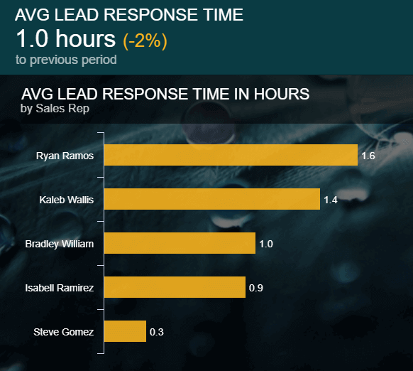
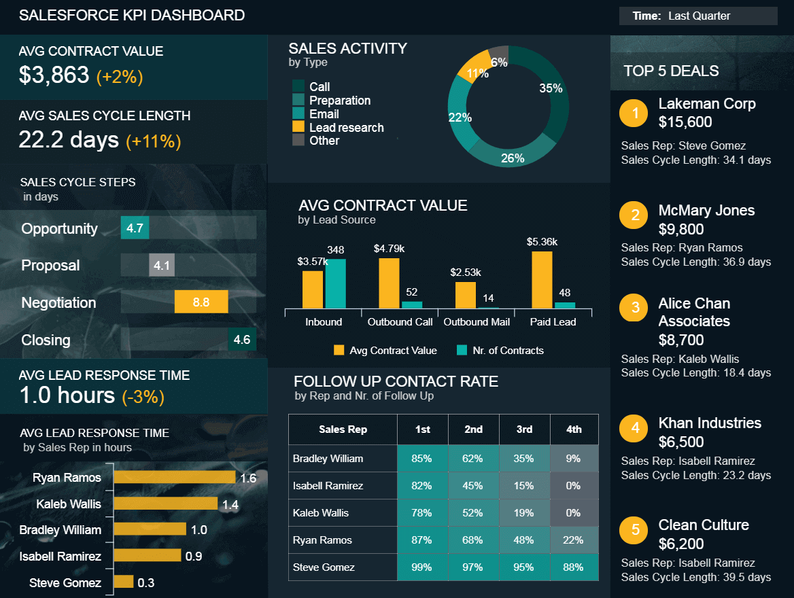
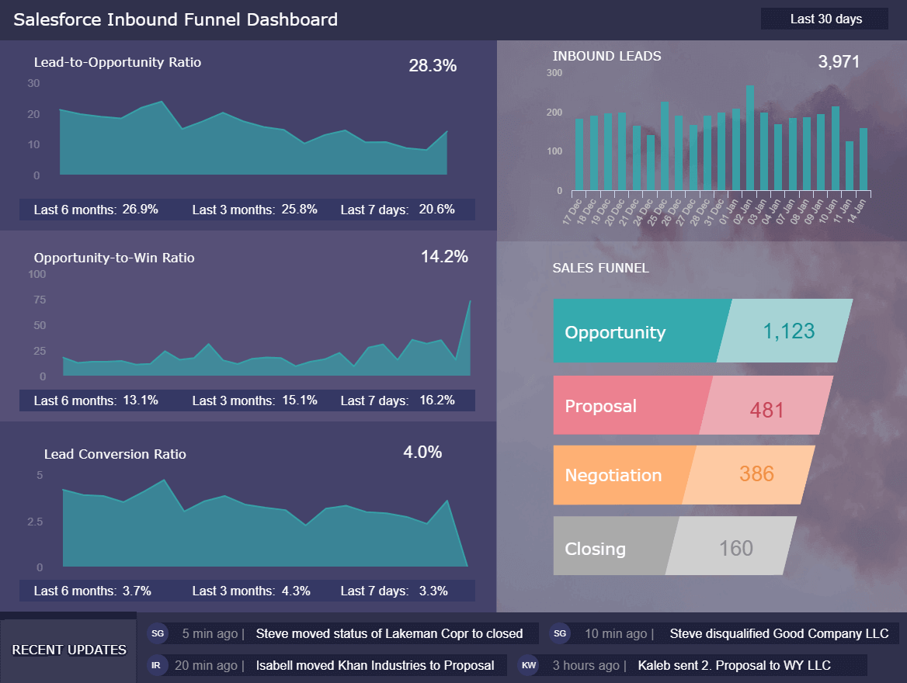
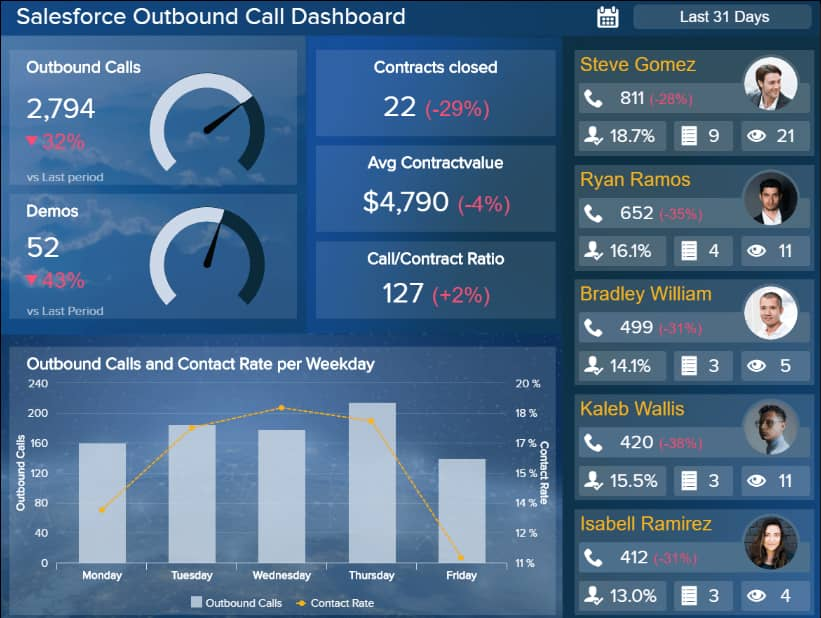

 

在一个数据驱动的时代，现代组织需要访问高级数据分析解决方案，以帮助他们在许多关键领域改善业务——Salesforce就是其中之一。

作为世界上最受欢迎的基于云的客户关系管理 (CRM) 平台之一，该软件旨在帮助跨部门的公司规划和优化其销售流程。

通过使用 Salesforce 报告，各行各业的企业提高了销售活动的效率，同时显著提高了用户参与度、收入和客户忠诚度。大部分的成功都归结于有效的报告。

为了帮助您实现基于 Salesforce 的成功报告，我们将一步步了解 Salesforce 报告是什么，您需要使用哪些工具和技术来实现成功的报告流程，并最终探索专业、交互式的Salesforce报告模板示例，然后您可以将这些示例应用到您自己的业务中。

但首先，让我们花点时间了解一下 Salesforce 报表在商业世界中的作用。

## 什么是 Salesforce 报告？

Salesforce 报告是一种管理工具，它通过一个基于云的集中报告平台，提供基于销售的基本数据的可视化表示。它的目标是增强企业的关键要素，包括市场营销、销售、商务和服务。

报告整合了来自多个来源的数据，帮助用户识别相关的 KPI，从而确定趋势，使他们能够制定提高效率和提高生产力的战略，加强全面的内部沟通。

[Salesforce 中的销售报告](https://www.datafocus.ai/infos/sales-report-kpi-examples-for-daily-reports)可帮助公司扩大规模和发展。虽然该平台作为一个独立的解决方案是有效的，但企业可以通过将其与其他工具（主要是可以产生宝贵的可操作见解的[仪表板创建者](https://www.datafocus.ai/infos/dashboard-creator)）相结合来进一步促进企业的成功。

## 基本 Salesforce 报告工具

目前有多种基于云的 Salesforce 报告工具可供企业使用，其中大多数都可以与平台无缝集成，在洞察力和功能方面提供额外的深度。

有各种内部插件，它们通常非常基础，缺乏高级分析功能和选项。外部工具（例如DataFocus）可将您的 Salesforce 报告工作提升到一个全新的维度，您可以在其中创建强大的[销售图表](https://www.datafocus.ai/infos/sales-graphs-and-charts-for-managers)，并在完整的仪表板概览中实施它们。

那么，我们使用哪些 Salesforce 报告工具？我们的 Salesforce 报告模板是集中的、交互式的、易于使用的，并提供 KPI 驱动的洞察，使企业能够在竞争中获得最重要的优势。

专注于销售活动、外拨电话和呼入机会管理等领域，我们专业的[Salesforce 仪表板](https://www.datafocus.ai/infos/dashboard-examples-and-templates-salesforce)将让您全面了解您的业务 ——一个促进创新、发展、进步和增长的愿景水平。

我们将在适当的时候查看其中一些 Salesforce 报告模板示例，但如果您想自己探索它们，您可以浏览到文章底部，找到一个交互式 Salesforce 报告模板列表。

_“我们不仅要用我们拥有的大脑，还应该使用我们可以借用的所有东西。”——_**_伍德罗·威尔逊_**

## 10 种有效的 Salesforce 报告技巧

就像任何数据驱动的工具或仪表板一样，要获得最大的成功，了解如何将 Salesforce 报告模板的关键功能发挥到最佳是必不可少的。

在这个简洁但内容丰富的 Salesforce 报告教程中，我们将向您展示如何使用先进的[仪表板](https://www.datafocus.ai/infos/data-dashboards-definition-examples-templates)，并探索基本的以平台为中心的报告技术，从您的 Salesforce 数据、指标和见解中榨取每一滴价值（以及更多） .

让我们从形成您的 Salesforce 数据报告工作的基础开始——定义您的业务的具体目标。

### 1）定义你的目标

我们的第一个 Salesforce 报告技巧是定义您的目标。这是在 Salesforce 中制作有效销售报告的基础。与组织内的主要利益相关者会面，共同设定目标和目的将帮助您清楚地描绘如何塑造仪表板以实现数据驱动的成功。

为自己设定切实的战略目标以及具体的销售目标，并了解要在您的销售团队报告模板中包含哪些数据，将帮助您开发一个[在线报告](https://www.datafocus.ai/infos/online-reporting)成功的框架。

### 2) 简化您的数据

尽管 Salesforce 报告工具旨在处理来自各种来源的大量数据，但如果您的仪表板中的信息过多，它们将几乎没有价值。

设定核心目标后，您应该查询所有的主要数据源，以确定哪些[指标](https://www.datafocus.ai/infos/operational-metrics-and-kpi-examples)和见解最符合您的目标。

为确保您为特定目标和需求选择正确的数据，您应该询问您的销售团队哪些信息可以帮助他们提高个人绩效以及部门的整体产出。

通过协作并获取每个人的数据驱动意见，您将能够有效地简化数据，并为您的报告工作选择正确的 KPI。这给引出了第三点。

### 3) 设置您的 KPI

关键绩效指标 (KPI) 是报告构建过程中不可分割的一部分。每个 KPI 代表一个特定的业务功能或流程，并以可视化格式呈现，提供对趋势、模式和绩效的洞察。因此，KPI 对于衡量基准化分析的成功和揭示关键业务领域的宝贵见解极为有用。[KPI 软件](https://www.datafocus.ai/infos/kpi-dashboard-software)将帮助您跟踪、衡量和分析特定的数据包。

这样做可以帮助您充分利用自己的优势，同时更好地了解您需要采取哪些措施来提高面向客户的业务领域的效率。

确定了目标并制定了框架后，您应该选择反映您的关键业务目标的[销售 KPI ，并将它们整合到您的报告中。](https://www.datafocus.ai/infos/kpi-examples-and-templates-sales)

### 4) 选择你的可视化

选择 KPI 后，我们的下一个 Salesforce 报告和仪表板分析技巧可以归结为设计和可视化。

作为人类，我们对视觉信息有一种亲和力，因为我们的大脑处理视觉信息的效率远远高于单纯的文本数据。

数据可视化对于用你的数据讲述一个故事，并以一种广泛可访问且受结果驱动的方式分享见解是不可或缺的。再加上正确的设计，您的 Salesforce 报表构建工作将被证明是非常有效的。

探索我们的指南，选择正确的[数据可视化](https://www.datafocus.ai/infos/how-to-choose-the-right-data-visualization-types)类型以帮助您完成工作。

### 5）深入研究细节

一旦您选择了最好的 Salesforce 报告可视化工具，您应该开始看到趋势和模式的可访问组合正在出现。

纵观全局是至关重要的——它能让你对自己的工作效率和工作表现有一个实际的了解——但在小事上流汗也很重要。

通过逐个查看特定的[Salesforce KPI](https://www.datafocus.ai/infos/kpi-examples-and-templates-salesforce)，并以历史、预测和实时的方式检查它们，您将能够发现有助于决策制定的微观见解。

例如，如下图所示，通过深入了解潜在客户响应时间 KPI，您将能够准确了解自己的优势和劣势所在。

根据特定的沟通渠道分析潜在客户的响应表现，同时比较长期和短期内的指标，您将生动地描绘如何全面减少响应时间，并为您的代理提供他们所需的支持以发挥其最佳能力。

### 6) 使用多个的仪表板

销售是任何组织车轮上的一个重要齿轮，因此，它在许多领域都引起了极大的关注。如果使用有效，Salesforce 报告将使您获得一定程度的清晰度，从而使您的销售部门更有效率、生产力和创新。但是，如果您想享受 Salesforce 报告的完整数据处理功能，使用多个仪表板是必不可少的。像这样，您可以从[仪表板工具](https://www.datafocus.ai/infos/online-dashboard)中受益，它将帮助您保持一切有序，并具有视觉吸引力，从而发挥其潜力。

例如，如果您创建了一个入站销售仪表板，并且您认为您的出站策略需要改进，那么您可以使用一些现有的仪表板自定义来创建一个新的报告工具。

这里的重点是：Salesforce 数据包罗万象。通过将您的数据细分为不同的功能（例如，入站、出站和绩效 KPI​​——稍后我们还将查看 Salesforce 报告示例），您将从最有价值的销售指标中提取更多的价值。

### 7) 画一幅画

除了为您的组织提供更高的业务视野外，Salesforce 报告还是促进协作、沟通和高层支持的有效工具。

如果您可以使您的数据得到普遍理解，您就能让人们更好地利用它。此外，通过您的可视化描绘出一副清晰且合乎逻辑的画面，您将说服高级决策者（内部和外部）购买您知道将有利于企业利润的投资或策略。

要使用您的指标绘制图片，创建可靠的叙述是前进的方向 - 我们的[仪表板故事讲述](https://www.datafocus.ai/infos/dashboard-storytelling-with-kpis-presentation-examples)实用指南将向您展示如何开始。

### 8) 提供更广泛的数据访问权限

最大化 Salesforce 报告工作价值的另一种有效方法是使用[在线分析工具](https://www.datafocus.ai/infos/data-analysis-tools)，让您的整个部门都可以访问与其角色最相关的仪表板。

在现代商业时代，透明度是持续增长和成功的关键因素之一。通过为您的销售团队的每个成员提供基于 Salesforce 的报告分析培训并授予他们正确的权限，您将确保部门中的每个人都能从数据中受益，并为他们的任务或目标提供直接价值。这样做将提高生产力、优化潜在客户响应时间、提高转化率，并最终增加您的底线。

幸运的是，DataFocus等现代[BI 仪表板软件](https://www.datafocus.ai/infos/bi-dashboard-tools)提供 24/7 全天候访问跨多个设备的动态仪表板。因此，您的销售团队不仅知道如何利用您的报告来发挥自己的优势，而且即使在旅途中，他们也能够跟踪、监控、衡量和响应。

### 9）考虑长期和短期

在与 Salesforce 报表软件进行交互时，许多销售团队或高管会犯这样的错误，只查看实时洞察或专门检查历史数据，以专注于了解趋势或模式。

这两种方法都是正确的（也是也是必不可少的），但要为了真正成功地报告，您需要一致地采用这两种分析方法。实际上，您应该采用三种[数据分析](https://www.datafocus.ai/infos/data-analysis-methods-and-techniques)策略：

- **历史分析：**比较过去的趋势和表现，从过去的错误中吸取教训，利用明显的优势，并发现您可能错过的见解。
- **实时分析：**在数据出现时对其进行探索和响应。使用实时数据将帮助您快速准确地应对任何问题或机会，同时抓住新出现的机会并做出快速、自信的决策。
- **预测分析：**使用预测分析风格通常需要结合历史分析和实时分析，发现未来可能出现的趋势、障碍或机会。获得预测性洞察力将使您能够制定基于销售的策略，以便在潜在商机出现时立即做出响应，或在任何潜在问题损失业务时间和金钱之前将其扼杀在萌芽状态。

考虑长期和短期将为您的报告工作指明方向，确保您从所有的分析活动中获得最佳的投资回报 (ROI)。

### 10) 跟踪、测量、改进、重复

在 Salesforce 提示中完成我们的基本报告后，我们进入最后的——也许是最容易被忽视的——活动：改进和细化。

今天可能有效的方法明天可能会被证明效果不佳，因此花时间改进和细化报告是您需要优先考虑的事情。

为此，您应该就报告的功能和设计征求定期反馈，并使用现有数据进行调整和改进，以确保您的努力获得最佳的投资回报。

_“知识已成为关键的经济资源和竞争优势的主要来源，即使不是唯一的来源。”——_**_彼得·F·德鲁克_**

## 现代 Salesforce 报告示例和模板

现在我们了解了这些在实际环境中最有价值的 CRM 工具的强大功能，以及如何充分利用 Salesforce 报告模板，现在是时候通过查看三个有效的 Salesforce 报告模板，将我们的 Salesforce 报告创建提升到一个新的水平了。

这些动态 Salesforce 报告工具旨在提高平台洞察力的价值，同时全面提高销售情报和战略。

让我们一起来看看吧。

### 1\. Salesforce KPI 仪表板

作为维护和提高整体销售业绩的重要工具，此 Salesforce 报告模板是任何现代企业工具包的基本组成部分。

该动态仪表板采用以销售为重点的 KPI 的平衡组合，不仅提供易于理解的视觉效果，使用户能够快速进行数据比较，而且还提供对销售周期、潜在客户处理时间和最高订单值的深入洞察。

这种宝贵的洞察再结合一系列其他来源的完整指标，将帮助您提高销售数据，并做出长期战略变革，使您在竞争中脱颖而出。一个兼备力量和熟练度的整洁包装。

**使用的 KPI：**

- 潜在客户响应时间
- 后续联络率
- 销售活动
- 平均合约金额
- 平均销售周期长度

### 2\. Salesforce 入站仪表板

在数字时代，销售艺术比以往任何时候都更加多维。在当今世界，入站销售和市场营销工作与出站潜在客户产生活动一样有价值——甚至可能更有价值。

如果您想长期取得成功，那么有效地管理您的入站计划是至关重要的。我们的入站 Salesforce 报告示例提供了一目了然的数据可视化的完美组合，可帮助引入线索、培养客户或客户关系以进行转换等。

[通过仪表板软件](https://www.datafocus.ai/infos/best-dashboard-software-features)的帮助，获取这些丰富的信息，您将能够更快地抓住机会，更有效地培养潜在客户，并最终提高品牌知名度和利润。

**使用的 KPI：**

- 入站线索总数
- 领先机会比
- 获胜的机会比
- 潜在客户转化率

### 3\. Salesforce 外拨电话仪表板

尽管在当今数字世界中有大量的消费者渠道和接触点，但陌生电话仍然为各行各业的公司提供了健康的转化率。如果您能明智地管理您的对外沟通策略，它仍然是一个相关且有效的潜在客户生成工具。

我们的[外拨电话仪表板](https://www.datafocus.ai/infos/dashboard-examples-and-templates-salesforce#outbound-calls-dashboard)是我们最好的 Salesforce 报告工具之一。它提供了有关如何在设定的时间范围内管理外拨电话的丰富见解，同时提供了各个销售代理的生产力和绩效的全面表现。

动态 KPI，包括呼出电话和演示数量，可平衡地显示拨打电话的数量和成功的通信数量。

通过定期跟踪这种外呼指标的组合，您可以确定需要在哪些方面支持或培训您的销售代理，进行明确的外呼绩效比较，并确定您需要改进策略的地方。因此，您将提高整体生产率，同时持续提高外拨电话转换率。

**使用的 KPI：**

- 呼出电话
- 外拨电话联系率
- 演示数量

## 关于 Salesforce 报告的最终想法

_“数据只是数千个故事的总结——讲述其中的一些故事有助于使数据变得有意义。”——_ **_Chip & Dan Heath_**

Salesforce 是一种强大的分析工具，能够帮助各种形式和规模的企业始终如一地实现甚至超越其目标。

如果您深入挖掘平台的表层，并从最相关的数据中榨取每一滴价值，您就会一些之前从未意识到的洞察。Salesforce 报告工具是帮助您做到这一点的工具。

一旦您整合了促进销售、改善沟通和精确管理客户关系所需的所有洞察力，您将加速业务成功，在竞争中获得至关重要的优势。Salesforce 报告是领先并保持领先的方式_。_

**那么，哪些工具对 Salesforce 报告最有效？**答案是DataFocus基于云的仪表板技术。将您现有的数据迁移到我们最先进的可视化工具，不仅受益于更好地获得最重要的洞察，还将见证超出您的想象的业务增长速度。

**注册DataFocus** [**的 30 天免费试用**](https://www.datafocus.ai/console/)**，亲身体验 Salesforce 报告和仪表板的业务促进能力。**
