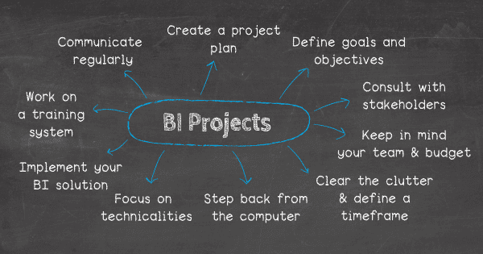

商业智能项目不再是海洋中大鱼的专利；这项技术发展迅速，软件变得更容易访问，而商业智能和分析项目定期在各个行业实施，无论是小型企业还是大型企业。在在线数据分析工具的帮助下，这类项目变得易于管理，性能灵活。

但有时，它们也可能很棘手：这不仅仅是按下一个按钮就期望您的[商业智能](https://www.datafocus.ai/infos/bi-skills-for-business-intelligence-career/)飞越彩虹。为了真正利用成功的 BI 项目的力量，公司必须制定一个可靠的行动计划，在这篇文章中，我们将提供在 BI 工具的帮助下开发和执行分析和 BI 项目的重要技巧，然后是来自不同行业的[商业智能示例](https://www.datafocus.ai/infos/analytics-and-business-intelligence-examples/)。最终，这将带来坚实的理解水平和业务用户可以在自己的工作环境中实现的不可或缺的潜力。从财富 100 强公司到小企业主，BI 工具和技术正在成为监督业务运营历史、现在和未来数据的标准。但是，是什么让这些项目成功，又需要注意什么？我们将讨论这个问题以及更多内容，但首先，让我们从一些背景知识开始。

## 什么是 BI 项目？

BI（商业智能）项目是一个术语，用于描述公司中商业智能的规划、评估、开发和实施，主要是帮助管理人员解决业务问题并获得可操作见解的 BI 工具。

这些项目需要不同公司的流程、技术目标和数据之间的合作，同时有助于设定业务目标，通常由详细的商业智能战略定义。

## 创建现代 BI 和分析项目的最佳技巧

为了开始这一旅程并确保在长期内产生最大价值，以下是成功创建 BI 项目的 10 大技巧。

### 1.创建一个可靠的BI实施项目计划

创建一个紧凑的 BI 项目计划至关重要，您可以定期参考并跟踪您的进度。在进行商业智能项目时，您在起点收集的信息越多，您在此过程中的控制就越好。也就是说，您需要将策略转化为具体的运营报表和计划，以解决您所有的数据问题并提高效率。在实践中，这可能意味着回答以下问题：

- 我们在报告流程上花费了多少时间？
- 我们是否需要一个可供整个公司或特定部门使用的工具？它将如何影响它？
- 谁将负责 BI 项目的实施？
- 期望的结果是什么？

这些只是一些商业智能项目的想法，您可以根据您的特定业务需求进行调整。在接下来的步骤中，您将了解更多细节，但基础需要有良好的结构，以避免潜在的瓶颈。如前所述，事先收集尽可能多的信息将确保您拥有稳定的 BI 项目管理流程并预测潜在的陷阱。记住结果与现实一致并且您有足够的[敏捷 BI](https://www.datafocus.ai/infos/agile-business-intelligence-analytics/)资源来根据需要调整流程也是有意义的。虽然您无法预测未来，但您需要知道如何适应。

### 2\. 定义目标和目的

与规划流程相关联，定义您的最终目标并设置正确的 KPI 将创造成功。虽然您可以从众多[KPI 示例](https://www.datafocus.ai/infos/kpi-examples-and-templates/)中进行选择，但其中只有少数可以帮助您回答特定的业务问题。如果您从事金融工作，那么[财务分析](https://www.datafocus.ai/infos/finance-analytics)将是您运营的基础。另一方面，如果您从事人力资源行业，那么[人力资源仪表板](https://www.datafocus.ai/infos/dashboard-examples-and-templates-human-resources)可能是您正在寻找的最佳答案。此步骤的基本要素是能够回答您的公司或组织以何种方式做出业务决策，以及如何衡量这些决策的质量。另一个有用的建议是从小处着手；你必须先走路才能跑。

### 3\. 与主要利益相关者协商

让利益相关者参与至关重要，因为您需要确定具体的需求和愿望，以及他们将如何使用数据来产生可操作的见解。对每个部门的利益相关者进行彻底分析可以为您在未来的流程中节省大量时间，并决定商业智能项目的成功与否。

让相关利益相关者参与并回答问题，例如谁将与 BI 合作？它是为分析师、C 级主管或部门经理准备的吗？在项目和[在线 BI 工具](https://www.datafocus.ai/infos/online-bi-tools)已经实施后，您也可以进行访谈并直接询问每个相关人员，以避免部门之间的沟通问题。这种结构将确保正确的基础，因此以后您将不必面对陷阱和误解的信息。

### 4\. 记住你的团队和预算

即使是在传统项目中，找到合适的团队也是相当具有挑战性的。技术专长是不够的，每个成员都需要提供特定行业的知识，因此，给自己一些额外的时间来确定高质量的候选人，并确保您的 BI 实施项目计划符合要求。

根据项目的规模和范围，记录责任和所需的资源，计划涉众的参与，并引入专家，如数据分析师、业务分析师、主题专家或ETL开发人员。

项目角色和职责因公司而异，以下是一些商业智能项目提示的概要，请牢记：

- [在实施BI 解决方案](https://www.datafocus.ai/infos/business-intelligence-bi-solutions)之前确定项目预算
- 确定项目资源和人员配置要求
- 包括每个团队成员的具体职责

### 5.清除杂乱并定义时间范围

在您制定了计划和明确的目标之后，是时候清理所有杂乱的信息并定义一个时间表了。为了能够充分获得分析项目和 BI 可以为您的组织带来的回报，拥有[KPI 管理](https://www.datafocus.ai/infos/kpi-management-and-best-practices/)流程是非常重要的。到现在为止，您应该已经确定了需要回答的业务问题，是时候动手了。正如老话所说，时间就是一切，因此请确保您制定了实施和批准所有相关流程的时间表。您需要 1 个月还是 6 个月才能完成项目并开始使用 BI 工具？如果您遇到挫折，为了安全起见，与其它[商业智能咨询公司合作可能会很有用](https://www.datafocus.ai/infos/bi-consulting-and-coaching)。

### 6.远离电脑

完成研究、确定关键业务问题、组建团队并确定时间框架后，就有必要开始构思您的[BI 仪表板](https://www.datafocus.ai/infos/bi-dashboard-best-practices)了。

为了更清楚地了解 BI 中的项目，您需要将仪表板作为需要考虑和深思熟虑的开发的关键组件来实现。退出计算机并起草必要的仪表板元素应该是商业智能项目步骤之一，它将为您提供更广阔的视角和模型，以便根据项目范围和需求对仪表板进行建模。

[此外，创建项目管理仪表板](https://www.datafocus.ai/infos/project-management-dashboards-examples-and-templates/)以便随时更新您未来的监控流程，可能是有意义的，但在此步骤中，起草和可视化您想要实施的元素很重要。这样，您将更清楚地了解预期的内容以及如何处理技术细节、将使用的工具以及需要与之沟通的人员。我们再怎么强调准备工作的重要性都不为过，如果您今天[做得正确且详细](https://articles.bplans.com/seven-steps-to-successful-project-planning/)，明天您将获得丰厚的回报。

### 7\. 专注于技术

在这个阶段，您已经制定了计划、设定了时间框架、确定并与相关利益相关者进行了沟通，现在是时候选择合适的[仪表板工具](https://www.datafocus.ai/infos/online-dashboard)了。由于每个项目计划都不同，因此明智的做法是根据您对工具的需求建立一个框架。您当前正在使用哪种数据库，是否需要各种[数据连接器](https://www.datafocus.ai/infos/data-connectors/)统一您所有的平面文件、数据库、营销分析、社交媒体等。与能够满足您所有要求的合作伙伴合作是一个非常宝贵的选择，您应该能够根据您的预算和项目范围进行选择。请记住，BI 和分析项目的核心是业务程序。您将需要 IT 部门的帮助，但“业务第一”的观点将使您的生活更轻松，并专注于大局。

### 8\. 实施您的 BI 解决方案并衡量成功程度

我们开发适当的 BI 和分析项目的最后一个技巧侧重于实施和衡量您的计划的成功程度。通常很难评估和量化使用 BI 解决方案的成功程度，但如下所示的简单计算器可以让您了解每年可以节省多少：

要查看计算的全部范围，您可以访问我们的[业务报告](https://www.datafocus.ai/infos/business-reporting-software)页面。

### 9\. 建立支持和培训系统

正如我们将在本文下面的业务分析项目示例中看到的那样，如果您碰巧开发了一个企业 BI 项目，那么为了让团队中的每个成员熟悉新的[企业应用程序](https://www.datafocus.ai/infos/enterprise-software-applications-tools)和技术，培训对于开发相关的培训和支持系统是必要的。正如我们所提到的，BI 实施项目计划需要充分研究、正确分析，但支持和培训同样重要。这个阶段需要仔细处理，因为即使你碰巧有最好的团队和管理人员，如果他们没有适当的培训知识和技术支持，项目将无法得到充分利用，你可能会误解所需的适当能力，从而导致决策过程不好。

在这种情况下，无论您是使用[医疗保健 BI 软件](https://www.datafocus.ai/infos/healthcare-analytics)还是为您的数据团队编译一系列[数据科学工具](https://www.datafocus.ai/infos/data-science-tools-and-software/)，要记住的重要概念是每个人都必须知道他们在做什么，以及他们试图达到什么样的目标。这样，您就有更好的机会让您的商业智能项目实施计划能够无缝、高效地运行，并具备相关的支持系统。

### 10\. 最后，定期沟通

我们已经多次提到，采访利益相关者、召集最好的团队以及全面规划业务分析项目的重要性。在这些步骤之间，定期沟通很重要，以减少可能危及您的计划和实施过程的任何疑虑或沟通不畅的风险。在开始、中间和结束时要求定期反馈，这与为工作选择正确的工具一样重要。[在开发数字仪表板](https://www.datafocus.ai/infos/digital-dashboard-definition-and-examples/)时，定期开会、回答问题或寻求帮助，是取得成功的必要条件。

此外，让用户在项目的规划和发展中表达自己的意见，可以确保健康的沟通交流，这对于商业智能小型项目和更大项目的成功至关重要。

总而言之，您的商业智能和分析项目需要详细的规划、与您的业务（和项目）范围相对应的最佳工具，以及团队内部和与利益相关者之间的清晰的战略和运营沟通。

我们已经回答了什么是 BI 项目的问题，提供了成功实施此类计划所需遵循的技巧路线图，现在我们将专注于使公司流程更有效率、节省成本和提高效率的真实商业智能项目示例和模板。

## 现实生活中的 BI 项目示例和模板

以下是真实业务场景的出色的示例，在这些场景中，BI 和分析项目用于提高效率和生产力，并在其运营和战略工作中实现更智能的决策过程。

### 1\. 美国金融服务提供商

要求：

- 实时访问海量数据
- 快速实现
- 所有经理均可使用
- 最大程度的安全性和数据隐私
- 减少报告时间

挑战：

- 减少 IT 参与
- 将决策过程从 1 人分散到 10 人

面对分散在多个电子表格和数据库中的数据质量差的挑战，这家金融公司无法实时跟踪财务数据，并生成所需的宝贵见解，以确保其由应付账款部门管理的供应商付款准确、快速。他们已经经历了一些商业纠纷，希望以后避免这种情况。此外，他们希望更好地控制其营运资金和现金转换周期数据，以提高管理生产力和运营。

在决定借助[数据仪表板](https://www.datafocus.ai/infos/data-dashboards-definition-examples-templates/)实施业务分析项目后，他们的效率突飞猛进。我们还可以在下面看到可用于任何财务部门或公司的可视化商业智能项目模板：

 

最终结果是减少了综合[财务报告](https://www.datafocus.ai/infos/financial-reporting-and-analysis/)流程的时间、自动计算，并在一个单一的中心位置获取数据。这证明了使用[财务仪表板](https://www.datafocus.ai/infos/dashboard-examples-and-templates/finance)来提高内部绩效的优越性。

### 2\. 企业的人力资源部门

要求：

- 改进招聘方法
- 自助获取信息
- 预算友好
- 多维分析
- 自动化流程

挑战：

- 全面了解整个招聘流程
- 应每周跟踪团队的绩效
- 为每周例会奠定基础

这是我们的商业智能项目示例之一，阐述了美国公司环境中的人力资源水平。该公司在招聘渠道上举步维艰，没有关于成本、流动率和表现最好的代理人的最新信息，无法分享他们的知识并教育团队的其他成员。最终的 BI 项目模板与此视觉效果类似：

_\*\*点击放大\*\*_

[经理通过使用强大的 BI 解决方案对部门绩效和人力资源关键绩效指标](https://www.datafocus.ai/infos/kpi-examples-and-templates/human-resources)有了清晰、深入的了解。他们的报告过程非常耗时，员工们面临着每周开会的挑战，因为他们需要提供准确的数据和快速的响应。通过使用综合的人力资源仪表板，每个利益相关者都可以随时从任何设备访问交互式可视化界面，并减少生成人力资源报告所需的时间。报告流程的自动化实现了更有效的[时间管理](https://lattice.com/library/7-must-know-time-management-tips-for-hr-leaders)，员工可以利用这些时间来执行其他相关的人力资源任务。

这也证明了[使用人力资源分析工具](https://www.datafocus.ai/infos/business-intelligence-human-resources)的强大。

### 3\. 销售部门分布在多个大洲

要求：

- 整合三大洲的数据
- 实时获取信息
- 基于公司发展的可扩展基础设施
- 与 Salesforce 轻松快速集成

挑战：

- 数据分布在多个来源
- 结合数据开发[实时仪表板](https://www.datafocus.ai/infos/live-dashboards)
- 多个销售接触点和整个销售漏斗的概览

另一个业务分析项目示例来自一个不同的销售部门，该部门需要一个集中的访问点来管理他们的销售机会，以及在出现问题时深入到每个[销售图表的可能性。](https://www.datafocus.ai/infos/sales-graphs-and-charts-for-managers/)在创建 BI 项目计划模板之前，该团队使用传统方法来管理大量数据，例如静态电子表格和 PowerPoint 演示文稿。当公司成长和团队变得分散时，问题就出现了——手工工作花费了他们无数的时间，并影响了漏斗中最有希望的潜在客户的管理质量。

_\*\*点击放大\*\*_

[销售仪表板](https://www.datafocus.ai/infos/dashboard-examples-and-templates-sales)的开发考虑了所有需求，甚至更多。区域和国家经理有机会深入了解重要指标的详细信息，例如当前机会的数量、购买价值、失去的机会或流失原因。最新机会的详细信息使经理能够按销售代表、国家/地区、公司检查机会的状态，并查看团队是否提出了任何意见。

这是快速高效实施的 BI 项目示例之一，尽管提供商必须整合来自多个大洲的数据。最后，连接[Salesforce 仪表板](https://www.datafocus.ai/infos/dashboard-examples-and-templates-salesforce)并管理这个流行的 CRM 解决方案中的数据，使团队能够创建一个更高效的工作环境并在任何时间或地点分析数据。

如您所见，管理商业智能软件项目并不一定很复杂或要求很高。通过正确的准备、工具和团队，公司现在可以创建 BI 项目模板并分别调整每个部门的要求，同时保持预算并将知识用于未来的项目。我们的商业智能项目计划示例准确地展示了如何使用它，以及您可以将其用作构建自己的 BI 成功的路线图。

## 轮到你了！

总而言之，以下是创建成功 BI 项目的最佳技巧：

1. 创建可靠的 BI 项目计划
2. 定义目标和目的
3. 清除杂乱并定义时间范围
4. 专注于技术性
5. 实施您的 BI 解决方案并衡量是否成功

现在我们已经提供了 BI 项目示例和模板，专业人员和经理可以将其用于自己的目的。[通过自助式 BI](https://www.datafocus.ai/infos/self-service-bi-tools)创建业务分析项目，并遵循我们的提示，充分利用这些示例，可以创建更稳定的业务和更好的性能水平。要想在实践中看到它，您可以使用我们的 BI 工具开始创建自己的项目，免费[试用30天](https://www.datafocus.ai/console/)！
