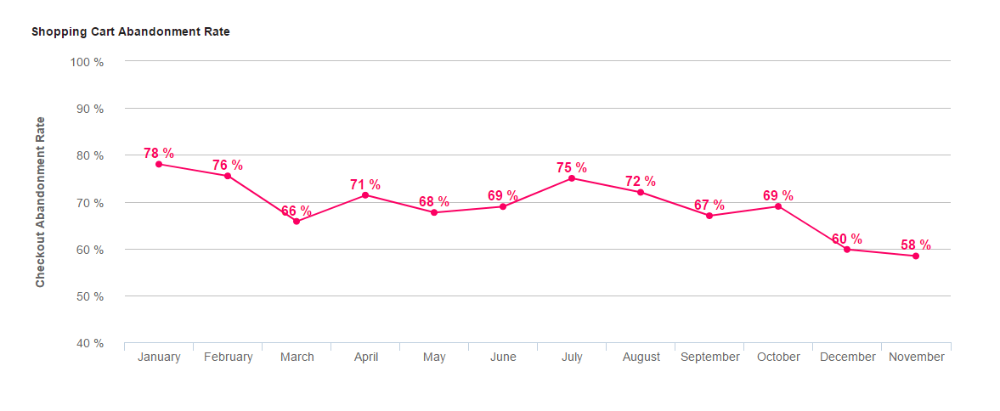
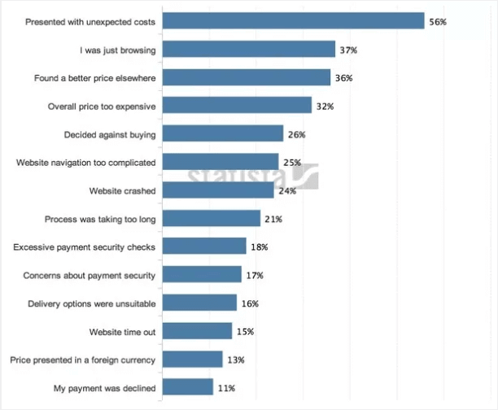
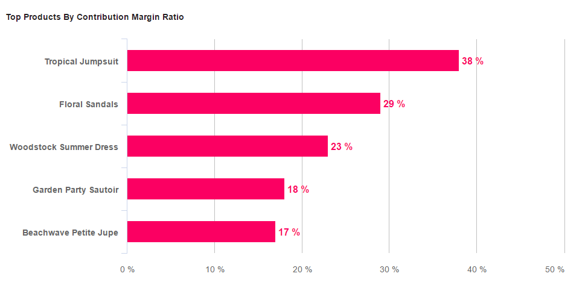

_“你衡量的东西通常会得到关注，而你关注的东西通常会变得更好。” —_ 塞思·戈丁

我们不能比独立营销的教父说得更好 - 如果您希望业务的某些方面变得更好，则需要衡量这些方面。从表面上看，这似乎是常识。您甚至可能会翻白眼 - 当然，您是在衡量业务的事情。你有指标，你知道你的电子商务业务有多少电子邮件订阅者，你知道你的收入数字……。难道这还不够吗?这要看情况了。我们不想对你们说教，毕竟，您是建立业务的人，而不是我们。你是那个为你的决定承担后果的人。我们所建议的只是，如果您有一些电子商务[关键绩效指标](https://www.datafocus.ai/infos/kpi-examples-and-templates) （KPI），您将更容易（并且更有可能）实现业务目标。虽然所有公司都有增加收入和利润的总体目标，但有很多很多方法可以实现这些由底线驱动的目标。

## 指标和 KPI 之间的区别

指标是您可以衡量的业务的任何方面。有些指标很重要，有些则不重要。KPI是一种指标，可准确衡量您在执行业务计划的关键部分方面的成功程度。有很多不同的KPI，但是您不应该跟踪一些反映您的电子商务业务独特特征的关键绩效指标。在实时[业务仪表板](https://www.datafocus.ai/infos/dashboard-examples-and-templates)中编译它们将对您的工作有很大帮助。

例如，如果您主要使用 Facebook 广告来获取新客户，那么您的 KPI 将与使用内容营销进行销售时大不相同。而且，如果您长期以来严重依靠电子邮件营销来进行电子商务销售，那么就需要一些与这种商业模式相伴随的kpi。但是，在这里，然而，在这里，我们将重点关注一旦客户已经在您的网站上的重要的电子商务指标。这样，无论您对电子商务业务的收购渠道如何，您都可以从这篇文章中获得很多有价值的信息。

在本文中，我们将介绍5个衡量业务关键方面的电子商务指标。我们还将就如何随着时间的推移改进每个 KPI 为您提供一些有针对性的建议。这是我们将要讨论的5个kpi：

1. 平均订单价值 (AOV)
2. 客户终身价值 (CLV)
3. 购物车弃置率
4. 退货占销售的百分比
5. 边际贡献率高的产品

## 我们的前5个电子商务KPI和指标

### 1）平均订单值（AOV）

\*\* 点击放大 \*\*

**AOV 向您展示的内容：**

您平均完成的交易有多大。

**如何计算 AOV：**

平均订单价值 =（一个时间段内产生的收入总和）/（该时间段内的订单数）

平均订单值非常简单， KPI越高越好。也就是说，在某些情况下，以牺牲AOV为代价来强调其他KPI（例如购物车弃置率）实际上会更有意义。

**如何提高 AOV：**

提高 AOV 说起来容易做起来难，但最好的方法之一是为比当前 AOV 稍贵的订单提供免费送货服务。让我们分解一下。

假设您的AOV现在为$ 23美元。如果您的客户花费25美元或以上，您可以免费送货，那么您很有可能会增加您的AOV，而不会在其他指标上产生任何负面影响，因为人们喜欢免费送货，并会为了获得免费送货而花费更多钱。

心理学作者丹·阿里利（Dan Ariely）在他的《无可预言》一书中谈论了这种现象：“免费”的价格对消费者行为具有非常强大和独特的影响。但是，无论价格如何，您都需要在特定价格点模型上用免费配送进行A/B测试，因为还有另一个关键指标:购物车弃置率。如果客户看到他们必须支付运输费用，除非他们花费3美元，否则他们可能会决定根本不下单。当您增加免费送货的“门槛”时，这种效应就会上升。在一定程度上，这是可以的。但通过A/B测试，你将能够知道什么策略能让你达到最终的kpi——收入和利润。

以下是增加您的AOV电子商务指标的其他方法：

- 对那些有意义的商品提供大量折扣。
- 提供包裹交易。
- 复制亚马逊的交叉销售策略，展示与客户当前正在购买的产品有关联的物品。例如，当您看一件猫家具时，看看亚马逊所有的交叉销售商品。
- 提供向上销售，也就是稍微贵一点的版本/升级，你的客户正在同一页面上查看的项目-让客户很容易切换。

### 2) 客户终身价值 (CLTV)

**CLTV代表的是：**

您在与每个客户建立关系的过程中，你从每个客户身上赚了多少钱。

**如何计算 CLTV：**

CLTV = \[（平均订单价值）x（重复销售数量）x（平均保留时间）\] - CAC

CAC代表[客户获取成本](https://www.datafocus.ai/infos/kpi-examples-and-templates-management#customer-acquisition-cost)，这是必须考虑的，因为它是将潜在客户转变为客户的资金。让我们来说明这个公式。我们假设你的公司去年有50个客户重复购买 - 每年3次。这些购买的平均价格为42美元。您希望这些客户至少在今年还会有相同的行为 - 因此我们以 2 年的留存时间来进行计算。但是，为了吸引这些客户，您必须平均为每个客户投资28美元。

您的 CLTV = (42$ x 3 x 2)-28$= **$224**

如果您的业务只能使用一种电子商务 KPI（销售额或收入除外），我们建议您使用 CLTV。为什么？因为如果您在CLTV上做得很好，那么您实际上可以保证带来大量的收入和利润。考虑一下：出售给老客户比新客户容易得多（并且便宜得多）。而且，如果您的CLTV很高，则意味着您有能力在客户获取上花费更多的钱，以确保您获得正确的客户（会坚持您的客户）。

最后，您可以使用 [客户终身价值](https://www.datafocus.ai/infos/kpi-examples-and-templates-management#customer-lifetime-value) 作为一个细分当前客户并集中精力的好方法。如果您按 LTV 对客户进行细分，并且您还拥有有关从何处获得每个客户的数据，则可以使用这些信息加倍关注为您提供最高 LTV 客户的获取渠道。

**如何增加CLTV：**

增加CLTV的最佳方法是提供出色的客户服务。两家哈佛商学院MBA在一篇名为“电子企业的经济学”的文章中解释原因。哈佛商学院毕业生在1990年的一篇论文中发现，在许多不同行业中，客户保留率每提高5％，利润就会增加25％至95％。他们还发现，许多企业由于高客户获取成本而遇到了早期挣扎的模式，而幸存的企业则是因为重复经营。

在后续研究中，他们发现这些模式只是在网络上被放大了。正如文章所述：“在服装电子零售中，回头客在24-30个月的消费是前六个月的两倍以上。” 要点是:出色的客户服务是企业长期成功的秘诀。

### 3）购物车弃置率

\*\* 点击放大 \*\*

**购物车弃置率的电子商务指标代表什么：**

将商品放入购物车中的人，其中有多少人在没有完成交易的情况下离开您的网站？

**如何计算购物车弃置率：**

购物车弃置率（％）=（未完成结帐的人数 /开始结帐的人数） \* 100%

例如，如果1000人将物品添加到购物车中，但实际上只有200人购买，那么您的购物车弃置率为80％。这是一个至关重要的电子商务KPI，因为很可能你已经花了很多钱让客户进入你的购物车。如果你能够进一步推动他们的发展，你便能够获得更大的投资回报，而不只是弥补这些用户获取成本。

**如何降低购物车弃置率电子商务指标：**

首先，你必须明白人们总是会丢弃购物车，原因完全超出你的控制范围。这就是生活的事实。在Statista的以下数据中，这至少 代表37% 的人：

然而，在您的控制范围内，有很多事情会降低您的被放弃率：

- 让您的结帐过程尽可能简单
- 拥有专门为废弃的购物车设计的商品列表，“保存”它们的内容，等待客户完成它们
- 在页面上添加退款保障(提高转化率的一种文案策略)
- 使运输成本真正透明，因为客户讨厌隐藏的费用

### 4) 退货占销售的百分比

\*\* 点击放大 \*\*

**退货占销售额的百分比**：

客户退货的频率。

**如何计算退货占销售的百分比：**

退货占销售的百分比= （一段时间内退货的产品数量） /（一段时间内订购的产品数量）x 100%

显然，在退货方面，越低越好。这个电子商务 KPI （ 对零售行业也很有用 ）首先是一个“警告信号”，让您知道您的回报是否会上涨。如果是这样，可能有以下几个原因:

1. 您的流量不佳。例如，如果在你开始一个新的广告活动或一个新渠道后，你的回报率猛增，这可能意味着你吸引了错误的流量/买家。
2. 新产品质量低。所以，如果你推出了一款新产品，而这个指标出现了跳跃，这是一个不好的信号。
3. 某种新产品的营销并没有准确地描述该产品的功能。

**如何降低退货占销售量的比例:**

你总是会得到一些退货，就像你总是会有一些“橱窗购物者”放弃你的购物车，而不是因为你自己的过错。所以这个指标并不一定是你应该考虑的尽可能低的指标。然而，当你在业务上做出改变时，你可以并且应该使用这个电子商务KPI作为一个警告信号。如果您的回报率飙升，这表明事情出了差错——您需要进一步努力找出原因。

### 5）按边际贡献率排名靠前的产品

**按边际贡献率排名靠前的产品代表什么:**

您的哪些产品对您的利润贡献最大。

**如何按边际贡献率计算产品：**

边际贡献率 = \[（销售价格 - 可变成本）/销售价格\] x 100%

可变成本可以是人工、间接费用或材料。要获得每单位的比率，您必须将单位贡献保证金除以单位销售价格。这样，您将知道每一美元收入中有多少百分比用于支付您的固定成本。例如，您的公司以100美元的价格出售手机。每单位的人工费用为 28 美元，材料成本为 34 美元，可变间接费用为 5 美元。边际贡献率为：\[(100$-28$-34$-5$) / 100$\] x 100 = 33%。

**如何按边际贡献率使用靠前的产品：**

这个电子商务KPI向您展示了哪些产品在利润方面对您最有利，，从而让您了解您应该关注哪些产品的营销或主页上的功能。而且，因为它涉及到利润率，所以这比只看最畅销的产品要有用得多。例如，如果你最畅销的商品的利润率很低，那么你可能不想让人们看到该产品！

此 KPI 也是一种客户研究形式，因为它向您展示了哪些潜在的新收入/利润机会。如果你发现某个产品带来的利润超过了它的合理份额，你可以利用这个信息，推出类似的产品进行交叉销售或提供升级版本的升级销售。

KPI能够量化您需要表现良好的业务中最关键的方面。您不必立即开始跟踪我们在本指南中列出的所有5个电子商务KPI，但我们建议您至少选择1-2个立即使用。随着时间的推移，您获得的洞察力将比你投入的时间和精力更有价值。为了充分发挥kpi的作用，您可以使用实时仪表板，使您可以跟踪和可视化对您业务最有价值的电子商务指标：[仪表板软件](https://www.datafocus.ai/infos/best-dashboard-software-features)在此问题上是一个很好的助力。尝试 [DataFocus的免费试用版](https://www.datafocus.ai/console/) 作为第一步！
