监控、可视化和分析相关数据的能力使当今各行各业的企业能够了解其前景、做出明智的决策、提高效率并努力实现一系列有益的长期目标。

当今的品牌和企业拥有如此多的数据，从不断增长的数字洞察中提取最后一滴价值，同时设置大量促进业务发展的 KPI，需要一个易于使用、引人注目的数字仪表板。

 

在当今的数字驱动世界中，有很多很酷的仪表板创意和设计可供选择，我们将向您介绍 21 个最好的，每个都是从我们不断增长的仪表板设计示例中精心挑选的。

为获得最大的仪表板设计灵感做好准备。

您的机会：[准备好将您自己的仪表板想法付诸实践了吗？](https://www.datafocus.ai/console/)探索我们的现代仪表板软件 14 天，完全免费！

## 不同仪表板创意和设计的价值

我们将介绍仪表板灵感的想法，以引人入胜、易于访问的方式传达数据分析。按照一些[仪表板设计原则](https://www.datafocus.ai/infos/dashboard-design-principles-and-best-practices)构建有效的报表对于全面的 BI 流程至关重要。也就是说，以下是数据驱动设计对业务成功如此不可或缺的主要原因：

1） 可视化：在使用分析并从数据中挖掘见解时，理解它的最佳方式是通过可视化。使用现代[仪表板制造商](https://www.datafocus.ai/infos/dashboard-creator)创建的出色设计将确保您的数据驱动型见解变得更容易访问，从而帮助您做出更明智、更强大的业务决策。相反，设计不佳的仪表板不仅无法传达基本信息，而且会使您的数据完全无法理解，因此是多余的。

2）重点：有各种类型的[报告](https://www.datafocus.ai/infos/types-of-reports-examples)涵盖了不同的目标和领域。精心设计的仪表板特别有效，因为它们可以更加关注业务的特定领域。一个很酷的仪表板不仅在视觉上令人愉悦，而且还提供了一定程度的逻辑组织，可以更轻松地深入了解特定的关键绩效指标 （KPI）、趋势或模式。反过来，您将改善整个组织的沟通和数据驱动能力，从而促进您在此过程中取得成功。

3）协作：如前所述，酷炫的仪表板设计改善了战略层面的沟通，因为它们以组织内每个人都可以理解和消化的方式呈现信息。通过改善内部沟通，顶级仪表板设计也鼓励协作。如果您遵循最佳实践并在一个中心位置展示公司最宝贵的见解，您将使各部门能够轻松分享他们的发现、设定基准并朝着共同目标凝聚力工作。结果呢？增加创新以及生产力的提高 - 最有可能的是盈利能力。如果您想了解有关战略沟通对业务成功的力量的更多信息，请查看有关该主题的深刻指南。

4）响应能力： 通过充分关注制作出色的[在线仪表板](https://www.datafocus.ai/infos/online-dashboard)，您将提高响应能力水平。酷炫的仪表板设计使用户能够一目了然地提取有价值的见解，并在出现时快速开发解决方案。此外，如果您能够在出现时识别出积极的趋势，您将能够猛扑并充分利用它 - 创建出色仪表板的另一个明显好处。

5）终身创新：投资可靠的数字仪表板设计的另一个原因是不断访问以前隐藏的见解。呈现良好的交互式数据可视化工具将帮助您发现您通常错过的趋势、模式和见解。通过与这些见解建立联系，您将能够制定战略和计划，使您在内部（从组织和人才培养的角度来看）和客户眼中都比竞争对手更具优势。

这些顶级仪表板灵感跨越一系列核心行业、部门和部门，不仅非常高效和实用，而且不会让您厌倦每天查看它们。请记住，您的品牌应该在您的视觉工作中保持一致 - 图形设计软件，无论是免费还是付费，都可以对您的图形设计和整体品牌标识产生不可估量的影响。

“设计是看得见的智能”——阿丽娜·惠勒，作家

## 您可以从中获得灵感的最佳仪表板创意

良好的仪表板灵感对于指导公司的数据分析工作至关重要。从财务仪表板设计到分析设计等等，这些最好的仪表板设计灵感不仅将展示以正确方式完成的现代数据分析的力量，而且还将塑造您自己的计划和想法。

让我们首先看看很酷的仪表板如何帮助简化公司的促销工作。

### 1） 营销关键绩效指标仪表板

营销 KPI 仪表板是我们的第一个仪表板设计示例，是希望接触并与新潜在客户建立联系的营销经理、高管和崭露头角的企业主的完美伴侣，[营销仪表板](https://www.datafocus.ai/infos/dashboard-examples-and-templates-marketing)提供了关键 KPI 的可导航概述，可以全面了解每次获取成本、客户生命周期价值、 最重要的是，投资回报。

\*\*点击放大\*\*

此仪表板不仅可以帮助您改进、个性化和增强企业最重要的持续促销活动，而且由于它是我们最直观的设计之一，因此获取相关数据的快照既快速又容易。一个很酷的仪表板，拥有引人注目的显示屏和可操作的功能。

主要关键绩效指标：

- 每次获取费用
- 客户终身价值
- 投资回报率

### 2） 网站分析仪表板

当您谈论数据驱动的设计时，除了逻辑上、美观的布局外，还提供易于理解的关键[营销 KPI](https://www.datafocus.ai/infos/kpi-examples-and-templates-retail)概述，我们的网络分析仪表板肯定会提供。

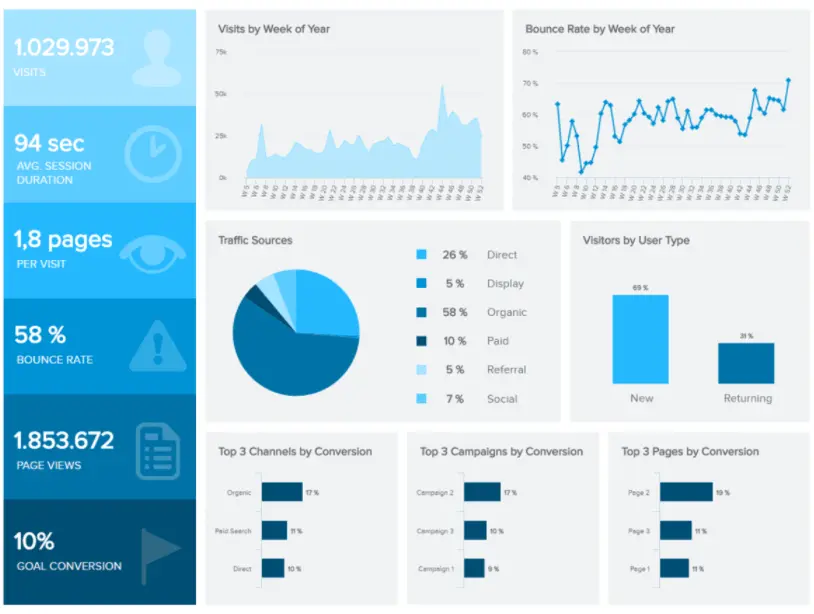

\*\*点击放大\*\*

除了令人难以置信的设计之外，这个宝贵的仪表板是跨广泛行业进行营销活动和活动的强大工具，因为它使您能够更深入地了解用户的行为，进而使您能够在更有意义的层面上与目标受众建立联系，同时显着改善您网站的用户体验 （UX）。

主要关键绩效指标：

- 跳出率
- 平均会话持续时间
- 目标转化率
- 着陆页转化率

### 3） 销售业绩仪表板

我们最佳仪表板设计示例清单中的下一个是以销售为重点。我们的动态销售绩效仪表板提供了部门进度、目标、优势和劣势的清晰顶层视图，一目了然。

\*\*点击放大\*\*

这个视觉平衡的仪表板理念配备了五个有凝聚力的 KPI，这些 KPI 提供了对重要功能的丰富见解，包括销售增长、特定基准、每单位平均收入 （ARPU）、收购成本和客户生命周期价值 （CLV）。

使用这个易于理解的仪表板，高级销售主管可以在出现任何潜在的绩效问题时减轻它们，同时做出明智、自信的决策，最终提高转化率并全面提高投资回报率 （ROI）。

此[销售仪表板](https://www.datafocus.ai/infos/dashboard-examples-and-templates-sales)最有效的功能之一是它提供了进行有针对性的战略调整的工具，并通过为您的业务带来更多收入的策略最终提高客户忠诚度。作为任何现代企业跳动的心脏之一，您的销售部门必须具有凝聚力、适应性和创新能力。这个最强大的数据仪表板创意将使您能够做到这一点。

主要关键绩效指标：

- 销售增长
- 销售目标
- 阿普
- 购置成本
- 中新社

### 4） 管理关键绩效指标仪表板

对于那些负责其业务的持续销售转换、优化和战略的人来说，这个特殊的仪表板在一个整洁的地方拥有对购置成本、管理指标、目标收入等的丰富见解。

\*\*点击放大\*\*

此外，这款[受销售报告](https://www.datafocus.ai/infos/sales-report-kpi-examples-for-daily-reports)启发的仪表板采用市场上最好的设计之一，通过完美颜色编码的图形和图表的组合可视化关键数据，不仅赏心悦目，而且可以快速简单地提取重要信息。对于高层管理人员来说，这是获得概览的良好仪表板示例之一，也是为其业务做出最佳数据驱动决策的强大工具。

主要关键绩效指标：

- 客户获取成本
- 客户终身价值
- 销售目标

### 5） 财务业绩仪表板

当谈到您公司的持续财务状况时，需要关注的最关键领域之一是您的支出效率，从长远来看，如果不这样做，您的组织可能会损失大量不必要的费用。

\*\*点击放大\*\*

作为出色的仪表板设计灵感之一，我们的[财务仪表板](https://www.datafocus.ai/infos/dashboard-examples-and-templates-finance)跟踪绩效并深入了解权益和资产回报率，其线性但有吸引力的资产负债表加上其精心排列的指标图表，使其使用起来很愉快。

主要关键绩效指标：

- 资产回报率
- 股本回报率
- 营运资金比率
- 债务权益比率

您的机会：[准备好将您自己的仪表板想法付诸实践了吗？](https://www.datafocus.ai/console/)探索我们的现代仪表板软件 14 天，完全免费！

### 6） 员工绩效仪表板

您的业务效率取决于员工队伍，这就是监控个人和集体员工绩效如此重要的原因。下一个仪表板灵感是使用现代[人力资源分析软件](https://www.datafocus.ai/infos/business-intelligence-human-resources)创建的。

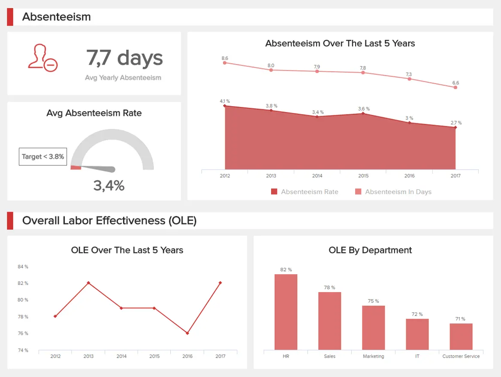

\*\*点击放大\*\*

员工绩效仪表板是人力资源经理和负责特定部门的人员的理想选择，是我们顶级仪表板设计示例之一，具有可扫描的屏幕排列和引人注目的配色方案。通过了解员工的优势、劣势和行为，您将能够做出激励、激励和吸引团队取得成功所需的改变——而此[人力资源仪表板](https://www.datafocus.ai/infos/dashboard-examples-and-templates-human-resources)将帮助您做到这一点。

主要关键绩效指标

- 缺勤率
- 加班时间
- 培训费用
- 员工生产力

### 7） 内容质量控制仪表板

现在，内容比以往任何时候都更加重要。除了跨各种数字渠道或接触点的价值驱动型消息传递和文案组合外，思想领先的品牌内容是吸引、激励和留住有价值客户的最有效方式之一。就内容性能监控领域的出色仪表板而言，我们的动态质量控制仪表板是其中最好的。

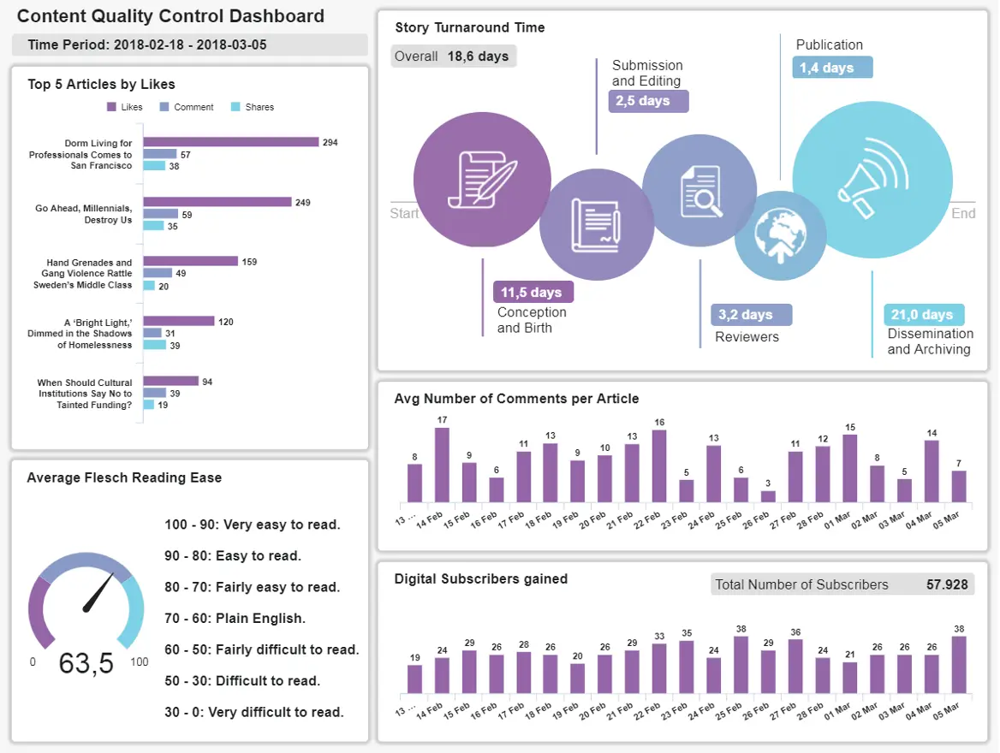

\*\*点击放大\*\*

通过提供持续混合富有洞察力的内容，回答紧迫的消费者问题或正面满足受众的需求，您将推动组织的发展达到新的商业高度。如果您的内容营销工作和品牌传播正确，您将受益于更好的搜索引擎定位、更高的品牌知名度和显着提高的品牌声誉。

我们流畅的内容质量控制仪表板将为您提供工具，以确保您的所有内容都能唱歌，丰富消费者的生活并在此过程中促进组织增长（以及健康的投资回报率）。

作为我们最好的内容仪表板示例之一，这个动态数据驱动的中心配有 Flesch 阅读测试分析工具，以确保您提供的每一条内容都是包容、自然、清晰和可理解的。

除了量化内容的可读性外，您还可以根据整体消费者参与度（每篇文章的评论）、获得的订阅者和表现最佳的文章，更深入地挖掘特定内容营销工作的影响。在这里，您拥有在一个整洁的空间中优化内容营销工作所需的一切 - 这是我们最喜欢的优秀仪表板示例之一。

主要关键绩效指标：

- 肉体阅读轻松
- 每篇文章的平均评论数
- 故事周转时间

### 8） 客户满意度仪表板

在当今高度互联的数字世界中，消费者占据了至高无上的地位，他们最信任同行的意见和推荐。也就是说，让您的客户始终如一地满意对任何现代企业都至关重要。

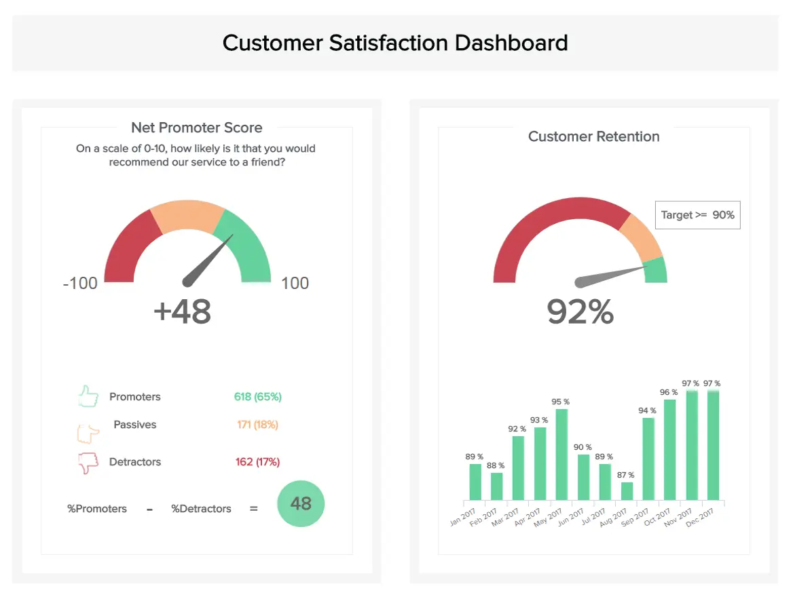

\*\*点击放大\*\*

我们最受欢迎和最有效的仪表板模板之一，专注于[客户满意度指标（如客户努力分数](https://www.datafocus.ai/infos/customer-satisfaction-metrics-effort-score-nps-csat)），旨在保持稳定的 NPS 分数、留住有价值的客户并优化您的服务级别，以便在残酷的商业环境中保持竞争力。该仪表板具有易于理解的颜色协调键和对称设计，专为快速分析关键消费者信息而开发，是满足现有客户并吸引新人加入您的业务所需的仪表板。

主要关键绩效指标

- 客户满意度
- 净推荐值
- 客户努力得分
- 客户保留

### 9） 客户服务团队仪表板

基于我们之前的观点：为了向您的客户提供卓越的服务水平，您的客户服务团队必须快乐、高效、有凝聚力并全力以赴。

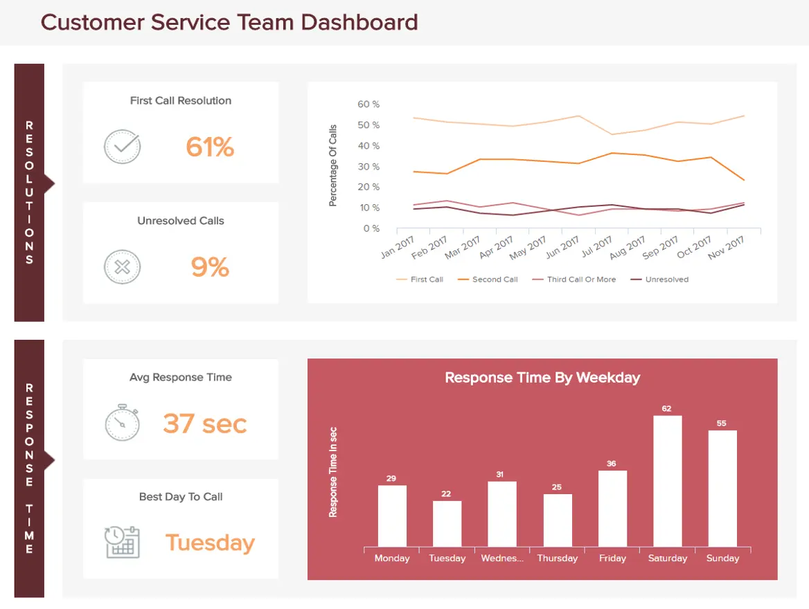

\*\*点击放大\*\*

就出色的仪表板安排而言，这是其中最好的，它提供了改善部门、发展员工技能并丰富面向消费者的策略所需的所有[客户服务 KPI](https://www.datafocus.ai/infos/kpi-examples-and-templates-customer-service)和指标。此外，这种最史诗般的数据驱动设计将使改善客户服务工作和发现关键趋势成为真正的乐趣，而不是不受欢迎的苦差事。

主要关键绩效指标

- 平均响应时间
- 首次呼叫解决
- 顶级代理商
- 问题数量

### 10） 采购 KPI 仪表板

无论您的行业或利基市场如何，您都可能有一个采购流程或部门来确保产品、服务和资产的有效交付。在许多方面，这是您整个运营的支柱之一。

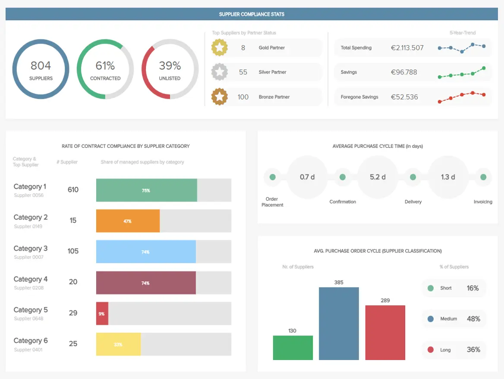

\*\*点击放大\*\*

作为该系列中的顶级设计灵感之一，我们的采购概览平台提供了重要采购 KPI 的详细概览，例如[采购](https://www.datafocus.ai/infos/kpi-examples-and-templates-procurement)订单生命周期、供应商绩效、供应商数量和合规率。除了提供使您的采购流程尽可能顺畅和具有成本效益所需的见解外，该设计还允许您在逻辑段中查看所有相关的信息孤岛，从而直接加快决策过程。

主要关键绩效指标

- 合规率
- 供应商数量
- 采购订单周期时间

### 11） IT 问题管理仪表板

无论您从事哪个行业，IT 部门都需要卓越的效率和组织水平，以确保公司的基础架构正常运行。如果不这样做，可能会导致灾难。

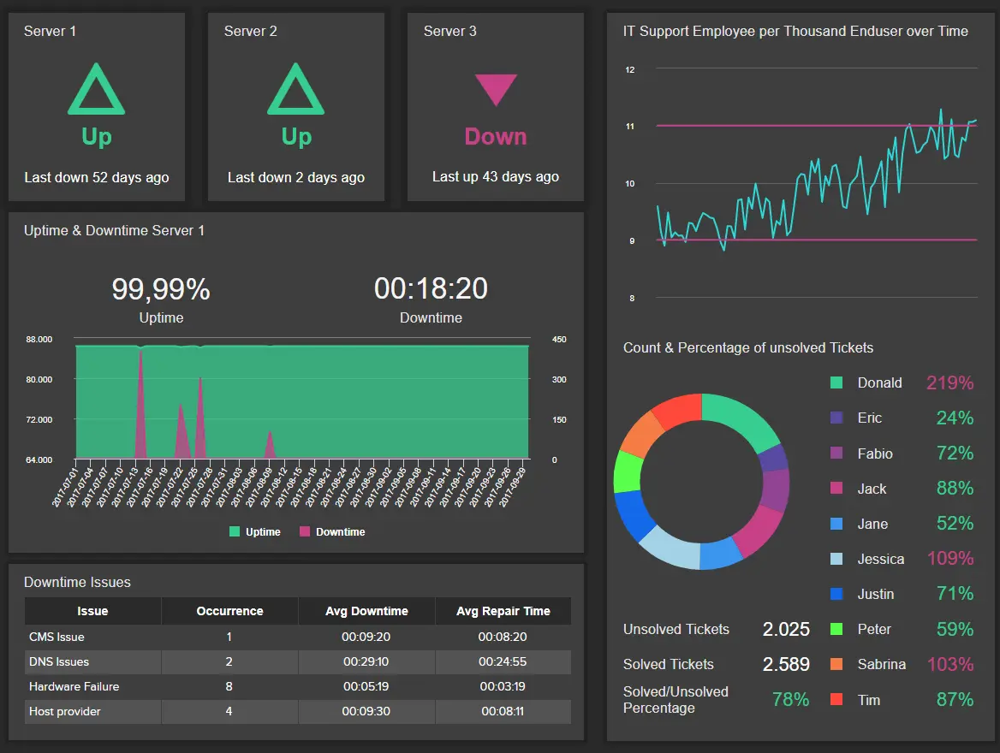

\*\*点击放大\*\*

为了帮助避免此类有害问题，我们开发了一个 IT 问题跟踪器，它是我们迄今为止最全面的仪表板之一。凭借不可抗拒的界面，此[IT 仪表板](https://www.datafocus.ai/infos/dashboard-examples-and-templates-it)不仅可帮助技术人员对基础架构和任务完成时间进行关键改进，而且其引人注目的设计有助于轻松管理未解决的工单、问题和关键服务器信息。

主要关键绩效指标：

- 服务器停机时间
- 同时修复
- 每位员工的未解决工单
- 每个最终用户的 IT 支持员工

### 12） Salesforce Pipeline Dashboard

Salesforce是全球最受尊敬的CRM平台之一 - 原因很容易理解。这个全面的平台为各行各业的组织提供了增强其运营流程中每个可能方面所需的基本见解。

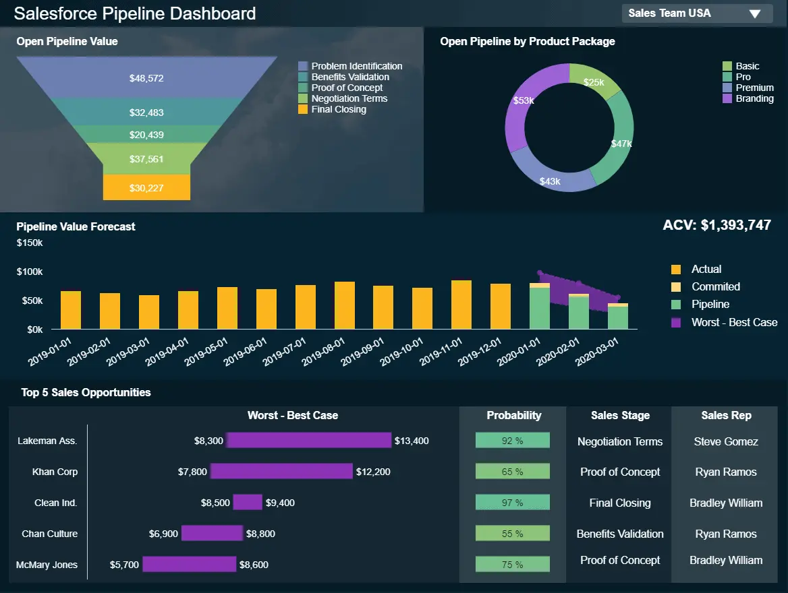

\*\*点击放大\*\*

作为财务仪表板设计和销售计划可视化中心之间的交叉，我们的[Salesforce 仪表板](https://www.datafocus.ai/infos/dashboard-examples-and-templates-salesforce)配备了易于理解的可视化 KPI，可以告诉您有关销售渠道精确价值的所有信息。

有了我们为销售经理提供的出色的仪表板示例之一，您可以一目了然地磨练您的最佳销售机会，同时根据收入可视化您的最佳和最坏情况。通过这样做，您可以将精力投入到最温暖的潜在客户中 - 那些可能提供最佳投资回报的潜在客户。

还可以在开放式销售漏斗的每个关键阶段清楚地掌握货币价值，同时进行详细的预测，为您的销售和营销计划提供明确的方向。如果您希望进一步提升 Salesforce 见解并在竞争中获得真正的优势，那么这种出色的仪表板设计正是您完成工作所需要的。

主要关键绩效指标：

- 年度合同价值 （ACV）
- 开放管道价值
- 按产品包打开管道
- 管道价值预测

您的机会：[准备好将您自己的仪表板想法付诸实践了吗？](https://www.datafocus.ai/console/)探索我们的现代仪表板软件 14 天，完全免费！

### 13） 投资者关系仪表板

对于高级人员和关键部门经理来说，这些最优秀的数字设计提供了与公司投资和投资者相关的所有活动、趋势和模式的功能快照。这个[财务报告示例](https://www.datafocus.ai/infos/daily-weekly-monthly-financial-report-examples)对任何想知道他们把钱放在哪里的投资者都非常有帮助。

\*\*点击放大\*\*

该工具协助管理和持续发展，优化所有基于投资的追求，非常宝贵，作为我们最好的灵感仪表板之一，您需要的所有信息都以您想要每天参与的图形显示。

主要关键绩效指标

- 资产回报率
- 股本回报率
- 市盈率
- 股价
- 债务权益比率

### 14） 运输仪表板

您的公司做什么或您专注于哪个领域并不重要。为了取得真正的成功，物流应始终是重中之重。作为运输物流的最佳仪表板，此动态分析仪表板设计示例在视觉上既平衡又功能合理。

\*\*点击放大\*\*

这个最好的仪表板插图专注于运输物流的两个关键领域，提供了对交货时间和运输成本的丰富见解。凭借平衡的颜色、可扫描的屏幕排列和 KPI 图表，可以清晰地洞察趋势和模式，这个特殊的[物流仪表板](https://www.datafocus.ai/infos/dashboard-examples-and-templates-logistics)一目了然地提供了简化流程所需的一切，同时使其更经济。

这是我们最好的物流运营仪表板设计示例之一，可以为您的组织节省大量时间和金钱。

主要关键绩效指标：

- 交货时间
- 运输费用

### 15） 医院绩效仪表板

对于医院和医疗机构，选择正确的仪表板创意可以决定生死。由于职能和部门如此之多，一天中的工作时间如此之短，如果没有合适的工具和流程，医院数据就会变得支离破碎，从而导致稀释。鉴于医院的关键性质，碎片化、淡化的数据根本行不通。

\*\*点击放大\*\*

正确的 BI 工具和卓越的 KPI 仪表板设计的结合将使医院更流畅、功能更强大，并且更有能力照顾患者。我们的[医院仪表板](https://www.datafocus.ai/infos/dashboard-examples-and-templates-healthcare)就是这一概念的证明。

这款使用现代[医疗保健分析软件](https://www.datafocus.ai/infos/healthcare-analytics)创建的强大示例仪表板设计充满了明确的目标和可视化基准，是任何繁忙医疗机构的持续可扩展性、成功和凝聚力不可或缺的一部分。该仪表板拥有完美排列的可视化界面，可让您一目了然地访问集成的运营和经济数据。

从平均住院率和再入院率到付款人的成本，此动态[BI 仪表板](https://www.datafocus.ai/infos/bi-dashboard-best-practices)中提供的信息将确保您减少不必要的支出，同时从各种资源中榨取最后一滴价值。

主要关键绩效指标：

- 平均住院时间
- 再入院率
- 按付款人划分的成本

### 16） 制造成本管理仪表板

对于实际制造或加工产品产品的公司来说，我们的成本管理制造仪表板是我们最好的[仪表板](https://www.datafocus.ai/infos/dashboard-examples-and-templates-manufacturing)示例之一，将帮助您可持续地处理持续支出。

\*\*点击放大\*\*

一个易于在任何屏幕或设备上理解的示例仪表板设计，这是我们为具有基于制造的流程的企业提供的最强大的示例之一。作为一个资产密集型行业，要真正蓬勃发展，您必须能够不断发展并应对不断变化的情况。通过旨在管理资产周转和维护以及单位成本的[制造指标](https://www.datafocus.ai/infos/kpi-examples-and-templates-manufacturing)，在这里，您拥有进行重要改进所需的一切，并自信地推动自己领先。

主要关键绩效指标：

- 资产周转
- 单位成本
- 资产回报率
- 维护成本

### 17） 挑选和包装记分卡

如果您正在寻找很酷的仪表板设计来改善您的物流工作，那么我们的动态拣货和包装[绩效记分卡](https://www.datafocus.ai/infos/kpi-scorecard-examples-templates-to-track-performance)就是您的最佳选择。

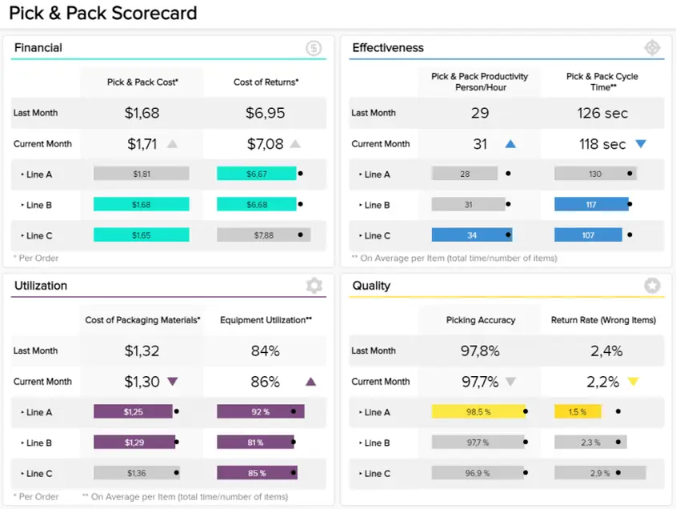

\*\*点击放大\*\*

我们的拣货和包装记分卡充满了可扫描的仪表板灵感，非常适合任何希望在整个订单处理过程中最大限度地提高效率的企业。凭借线性但视觉上引人注目的设计，您可以深入了解相关的拣选和包装成本以及四个关键性能类别的周期时间。

使用这个充满有价值的[物流指标](https://www.datafocus.ai/infos/kpi-examples-and-templates-logistics)的特定仪表板，还可以确定您可能需要在哪些方面提供支持或简化处理计划，以提高准确性，同时监控退货率并跟踪包装材料的使用情况。

作为我们最先进的基于物流的仪表板灵感之一，此交互式记分卡最终将帮助您减少浪费，缩短拣选时间，加强部门间沟通，并为您的工作获得更好的回报。

结果呢？更好的品牌声誉，更高的财务效率，以及在变化或挑战发生时保持稳健和适应的能力。

主要关键绩效指标：

- 拣货和包装成本
- 拣货和包装周期时间
- 拣选精度
- 包装材料的使用
- 设备利用率

### 18） 品牌分析仪表板

您的品牌是您持续商业成功或发展不可或缺的一部分。撇开利基或行业不谈，您的品牌让潜在客户和现有客户或客户了解您的业务价值、声音和在市场中的地位。

\*\*点击放大\*\*

如果您想在竞争中脱颖而出，那么照顾您的品牌声誉、提高知名度以及了解人们如何看待您的业务至关重要。幸运的是，这个最令人难以置信的仪表板设计示例涵盖了所有基础。

这个创新的仪表板具有大量易于理解的数据可视化功能，可帮助您自信地衡量受众在品牌中寻找的内容，以及他们与某些产品相关联的品牌。

您还可以监控您获得独立品牌知名度的实例，利用这些无价的见解来增强您在其他渠道或接触点的声誉。仪表板的名人分析 KPI 对于大型促销活动或影响者营销活动特别有效，因为您可以一目了然地发现哪些公众人物与您的品牌（或像您这样的品牌）相关联。

在这里，您拥有保存、改进和了解您的品牌形象所需的一切 - 在必要时进行明智的调整、更改或更新。这是一个品牌提升的仪表板示例设计，将为您的业务创造奇迹。

主要关键绩效指标：

- 独立品牌知名度
- 辅助品牌知名度
- 品牌形象
- 名人分析

### 19） 日常运营 Zendesk 仪表板

如果您的公司在很大程度上是基于云的，并且使用 Zendesk 来管理一些面向客户的核心运营，那么这对您来说是最好的仪表板示例之一。虽然 Zendesk 是一个强大的工具，但如果没有深入挖掘特定数据的能力，您将无法体验该平台的全部好处。

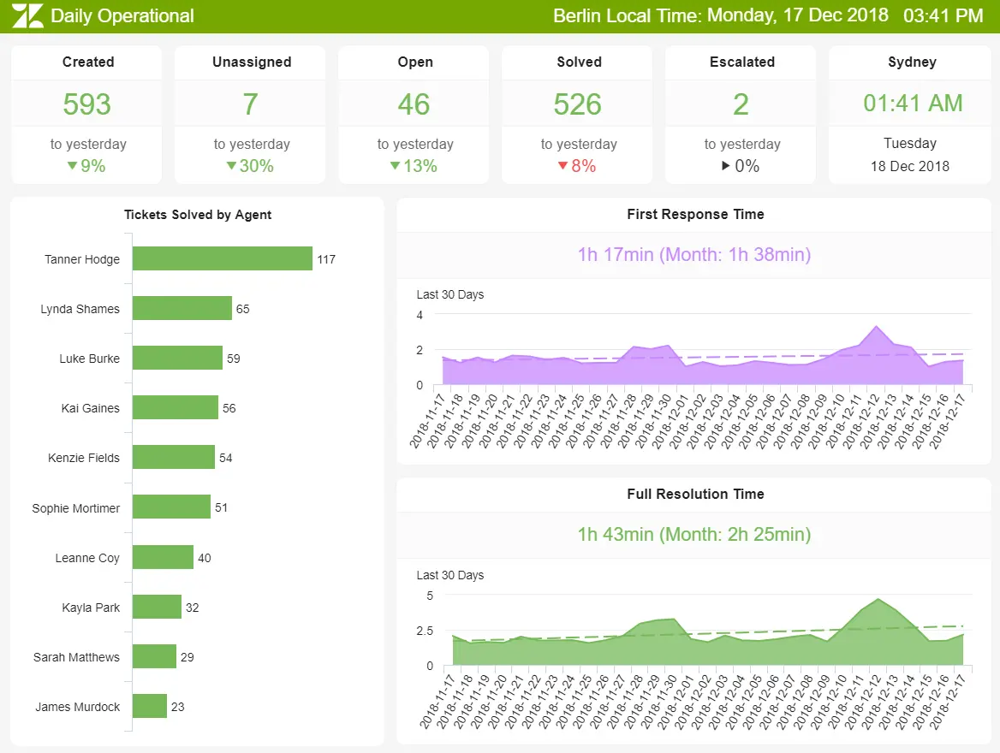

\*\*点击放大\*\*

我们基于运营的[Zendesk 仪表板](https://www.datafocus.ai/infos/dashboard-examples-and-templates-zendesk)除了提供对实际趋势和指标的可访问见解的数据可视化外，还拥有平衡的配色方案。

仪表板的顶部根据已解决或正在进行的问题和票证提供可扫描的[呼叫中心报告](https://www.datafocus.ai/infos/call-center-dashboard-reports-and-data-analytics)指标，而下半部分提供可视化数据，提供指定时间段内的绩效趋势。

通过在一个易于访问的空间中访问这些不可或缺的信息，您可以快速改进您的客户服务计划，同时支持可能需要在特定业务领域获得一些帮助或培训的座席。通过这样做，您将加速您的业务成功，在商业战场上赢得一次一个客户。

主要关键绩效指标：

- 门票和门票状态
- 第一响应时间
- 平均解决时间

### 20） LinkedIn公司页面仪表板

在专业领域，LinkedIn是一个社交平台，无论您的行业或部门如何，都能提供宝贵的交流机会。了解如何充分利用它将有助于您提高品牌知名度，同时建立联系，从而提供丰富的业务促进潜力。

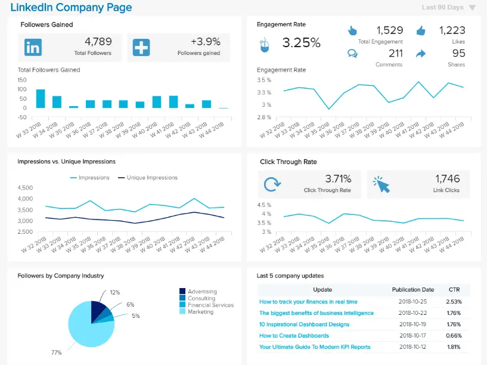

\*\*点击放大\*\*

通过专业安排的 5 个有凝聚力的 KPI 可视化组合，这个一流的[社交媒体报告](https://www.datafocus.ai/infos/social-media-reports-examples-and-templates)设计使您可以深入了解各种帖子的表现，同时让您一窥关注者人口统计数据的皮肤。

通过牢牢掌握表演后和参与度以及内容覆盖面，您将能够制定想法和策略，帮助您在个人层面上与合适的受众建立联系。通过这样做，您将创造更广泛的品牌知名度，同时以有利于您业务持续成功的方式增加您的受众。

主要关键绩效指标：

- 查看者信息
- 联系和网络增长
- 按职位划分的个人资料视图
- 发布视图和参与

在数字时代，以真正引起他们共鸣的方式与潜在合作伙伴或潜在客户互动非常重要——通过每封信件消除噪音。我们的[数字仪表板](https://www.datafocus.ai/infos/digital-dashboard-definition-and-examples)将帮助您做到这一点。

### 21） 页面跟踪仪表板

假设您负责为企业客户开发无缝的用户体验 （UX），或者您是一名希望基于您的 Google Analytics（分析）洞察进行构建的营销人员。在这种情况下，此页面跟踪仪表板适合您。

\*\*点击放大\*\*

有了这个完美的图表、图形和见解风暴，您将受益于对性能最佳的网页的深入了解，同时更深入地了解您的页面内容吸引用户的程度（或数量）。

作为我们为UX设计师和营销人员提供的最佳仪表板示例之一，这个尖端的数据可视化中心除了根据不同浏览器（Chrome，资源管理器等）的页面跳出率外，还提供了对页面时间的简要见解。这个宝贵的信息大熔炉不仅将为您提供优化页面设计或内容以提高参与率的情报，而且还将为您提供跨地区、国家和 Web 浏览器工具优化性能所需的方向。

加载时间是有关页面性能的重要因素 - 在这里，您可以监控每个县的不同加载时间，让您深入了解任何潜在的技术问题，这些问题正在增加您的跳出率并阻碍您的业务增长。

主要关键绩效指标：

- 页面上的时间
- 平均页面加载时间
- 浏览器的跳出率

您的机会：[准备好将您自己的仪表板想法付诸实践了吗？](https://www.datafocus.ai/console/)探索我们的现代仪表板软件 14 天，完全免费！

## 用于数据驱动决策的交互式仪表板！

无论您是在谈论财务仪表板设计、物流分析、营销策略还是您能想到的任何其他重要业务功能，通过使用最适合工作的仪表板并创建视觉平衡的数据驱动安排，您将使您的组织比以往任何时候都更精简、更卑鄙、更智能。

数据仪表板使您能够以可访问且方便的方式为您的业务做出最佳选择。通过根据最佳设计实践自定义仪表板，您将从可用的指标和见解中榨取最后一滴价值。这就是您将如何在当今高度互联的数字战场上获胜的方式。

我们希望这份特别策划的 21 个伟大的仪表板设计灵感和想法列表能够启发和启发您数据驱动的业务发展方式。

如果您想详细了解我们全面的关键绩效指标，同时更深入地了解我们许多部门特定的指标、工具和平台，请探索我们强大的现代[业务仪表板示例](https://www.datafocus.ai/infos/dashboard-examples-and-templates)组合。

您准备好将业务的分析工作提升到新的高度了吗？试用我们的尖端 BI 仪表板软件 14 天，这要归功于我们的[免费试用](https://www.datafocus.ai/console/)版。
