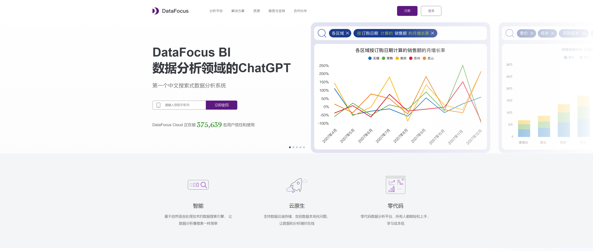

随着大数据时代的来临，数据分析行业正以前所未有的速度蓬勃发展，成为推动各行各业数字化转型的关键力量。在这一浪潮中，DataFocus作为一款集成了chatBI技术的数据分析工具，以其强大的数据处理能力、直观的可视化效果及自然语言交互的便捷性，正引领着数据分析行业的新风尚。DataFocus的出现，不仅简化了数据分析流程，更提升了决策效率，为企业的智能化转型注入了强劲动力。

借助DataFocus的ChatBI技术推动开源项目发展

在当今科技飞速发展的时代，开源项目已经成为推动技术进步的重要力量。开源项目的开放性和协作性，吸引了大量开发者的参与和贡献。如何有效管理和发展开源项目仍然是一个重大挑战。DataFocus推出的ChatBI技术，为开源项目的发展提供了全新的解决方案，本文将详细探讨DataFocus如何借助ChatBI技术推动开源项目的发展。

## DataFocus的ChatBI技术简介

DataFocus是一款专注于数据分析和商业智能的软件，近年来推出的ChatBI技术更是为开源项目提供了强有力的支持。ChatBI（Chat-based Business Intelligence）通过自然语言处理和数据分析技术，使用户可以通过对话的方式获取数据洞察和分析结果。这种技术的优势在于用户无需掌握复杂的编程技能，只需通过对话即可完成数据查询和分析，从而大大降低了数据分析的门槛。

## 解决开源项目管理难题

开源项目的管理面临诸多挑战，包括但不限于代码质量控制、开发进度监控、社区互动和贡献者管理等。DataFocus的ChatBI技术通过以下几个方面有效解决了这些问题：

### 1\. 提高数据可视化和分析效率

传统的开源项目数据分析通常需要开发者编写复杂的查询语句，并通过各种工具进行数据可视化。而借助DataFocus的ChatBI技术，项目管理者只需通过简单的对话即可获取所需的分析结果。例如，项目管理者可以询问“过去一个月有多少新的代码提交？”或“当前最活跃的贡献者是谁？”等问题，ChatBI技术会即时提供可视化的数据分析结果，帮助管理者更好地掌握项目的运行状况。

### 2\. 增强团队协作和社区互动

开源项目的成功离不开团队的协作和社区的支持。DataFocus的ChatBI技术可以通过分析开发者的贡献数据，识别出积极贡献的成员，并为他们提供相应的奖励和激励措施。ChatBI技术还可以通过分析社区互动数据，识别出潜在的问题和机会，帮助管理者及时调整策略，增强社区的活跃度和凝聚力。

### 3\. 优化开发进度和资源分配

开源项目的开发进度和资源分配是项目成功的关键。DataFocus的ChatBI技术可以帮助管理者实时监控开发进度，识别出可能的延误和瓶颈，并提供相应的优化建议。例如，通过分析任务完成情况和开发者的工作量，ChatBI技术可以帮助管理者合理分配资源，确保项目按时完成。

## DataFocus在开源项目中的应用案例

DataFocus的ChatBI技术已经在多个开源项目中得到了成功应用。例如，某开源软件项目通过引入DataFocus的ChatBI技术，实现了对代码库的全面监控和分析，显著提高了代码质量和开发效率。该项目的管理者表示，ChatBI技术不仅帮助他们更好地管理项目，还增强了团队成员之间的协作和信任。

## 未来展望

随着开源项目的不断发展，DataFocus的ChatBI技术也将不断迭代和进步。未来，DataFocus计划进一步提升ChatBI技术的智能化水平，增强其数据分析和预测能力，为开源项目的发展提供更加全面和深入的支持。通过不断创新和优化，DataFocus致力于成为开源项目管理的最佳合作伙伴，推动开源技术的繁荣与进步。

## 结语

DataFocus的ChatBI技术为开源项目的发展提供了全新的解决方案。通过提高数据可视化和分析效率、增强团队协作和社区互动、优化开发进度和资源分配，DataFocus帮助开源项目克服了管理中的诸多难题。未来，随着ChatBI技术的不断进步，开源项目的发展将迎来更加美好的前景。DataFocus将继续致力于为开源项目提供先进的技术支持，推动开源技术的不断创新和进步。

数据分析行业的蓬勃发展，离不开像DataFocus这样创新工具的涌现。DataFocus以其chatBI技术的独特魅力，不仅优化了数据分析的各个环节，更让数据洞察变得触手可及。随着技术的不断进步和应用场景的持续拓展，我们有理由相信，DataFocus将继续在数据分析领域发光发热，携手更多企业共同迈向数据驱动的未来，实现更加精准、高效的决策与行动。
