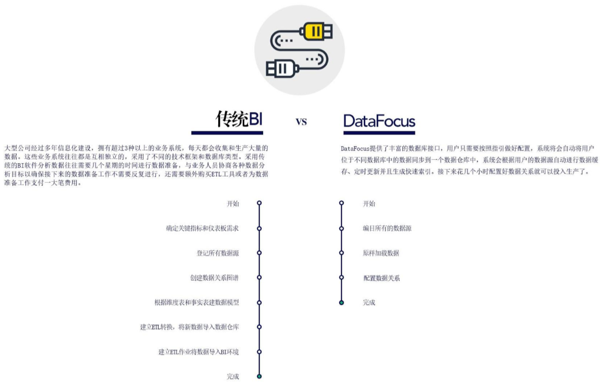

因为工作和学习的缘故，接触过比较多的可视化工具，今天想要和大家安利几款做数据可视化，必学的工具，有国内的也有国外的，有价格贵的还有免费的。

1、Excel

相信大家对这款工具应该不会陌生，我们从小学接触电脑开始就开始使用这款工具，这也是进行数据分析最简单的一款工具，属于入门级工具。也可以说是我第一次接触的可视化工具就是这个，Excel虽然简单，但操作方面并不简单，很多时候都需要你自己先计算出最后结果才能得出图表，而且Excel处理的数据量有限，已经远远不能满足企业大数据的需求。需要进一步选择更加专业的bi可视化工具。

2、Datafocus

Datafocus是国内自主研发的一款敏捷BI，在使用操作上更加符合中国人的使用，而且对电脑配置要求不高，不用安装任何软件，打开电脑就直接能用。系统页面简洁明了，响应速度也非常快，能处理的数据量相当大。产品上手操作十分简单，同时官网还配有很多学习操作的视频教程，有问题不懂还可以上论坛进行咨询，很快或有人进行作答。相当不错，推荐推荐。

3、Qlikview

Qlikview也是国外一款很常用的工具，它的优点是开发和使用简单，缺点是和其他bi产品相比，操作性能差一些，且会受限于用户数（也就是说价格）和设计报表的复杂程度，只能用于少数几个管理层人员。

4、Tableau

Tableau是现在风很大的一款可视化工具，可视化能力相当强大，制作出的图表也是非常精美，令很多人赞叹不已。但是Tableau的缺点也非常明显，Tableau对于计算机的硬件要求非常高，而且部署起来很复杂，最主要的是价格太高了，普通用户根本无法负担。

对于BI产品，我就了解这么多啦，希望对你有用~~~

