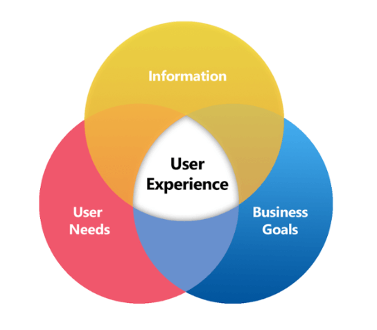
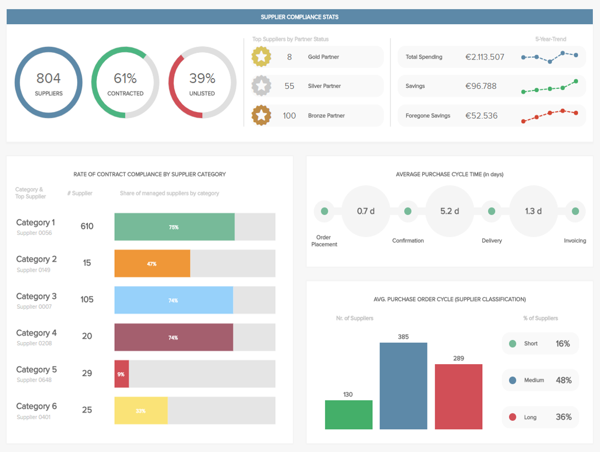
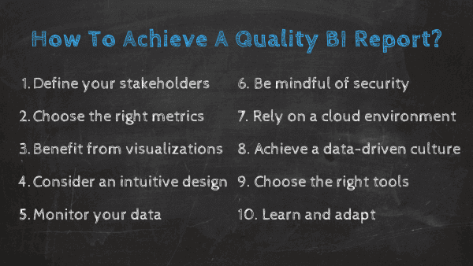
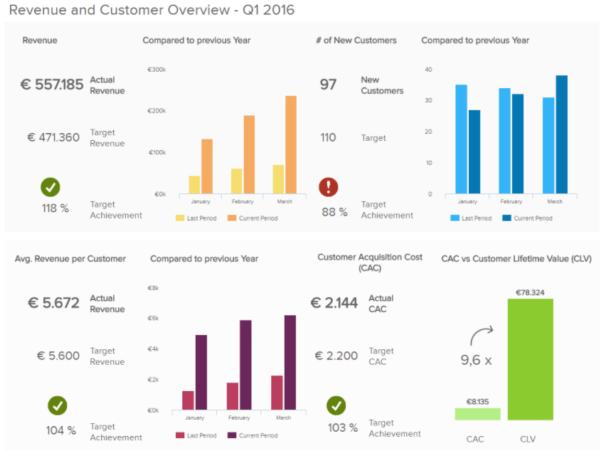

[大数据在在线数据分析](https://www.datafocus.ai/infos/data-analysis-tools)、组织信息和智能报告中发挥着至关重要的作用。在我们快节奏的数字时代，公司必须适应数据的模糊性并采取相应的行动。BI 报告就是答案。

对于希望准确分析和利用所收集的每一条相关信息的组织来说，电子表格不再能提供足够的解决方案。

因此，这正是商业智能报告发挥作用的地方——事实证明，它在增强组织有效收集数据并将洞察力转化为行动方面发挥了关键作用。

[商业智能报告提供了在现代BI 报告工具](https://www.datafocus.ai/infos/bi-reporting)的帮助下创建智能报告的可能性，并开发了全面的智能报告实践。因此，无论利基市场或行业如何，BI 都可以使企业的整体发展和盈利能力受益。

为了从商业智能促进业务发展的角度出发，我们将探讨智能报告的优势、核心 BI 特征以及公司在当今竞争日益激烈的数字市场中保持领先地位的基本功能。最后，我们将提供一些有关如何创建最佳 BI 报告并超越您的业务目标的关键技巧。

_让我们从“什么是商业智能报告？”_这个问题开始。

## 什么是 BI 报告？

商业智能报告是借助现代 BI 工具收集和分析数据的过程。在交互式数据可视化的支持下，企业可以从数据中提取可行的见解并优化其绩效以实现持续增长。

DataFocus大屏

[在线商业智能](https://www.datafocus.ai/infos/online-bi-tools)和报告密切相关。如果您收集数据，则无论您在哪个行业或部门运营，都需要有效地分析和呈现它。

因此，您可以为您的各种组织决策制定更具战略性的方法，并收集在其他方面会被忽视的见解。除此之外，让我们更详细地了解这些报告实践的好处，以及企业（无论是小型企业还是企业）如何实现盈利。

## 商业智能和报告的好处

现在我们已经解释了数据报告在商业智能中的作用，让我们看看它的好处。

如果组织正确和战略性地处理报告，他们可以获得许多优势。BI 报告的主要目标是提供易于访问、解释并提供可操作见解的综合数据。

让我们看看关键的好处是什么：

### 1.提高工作流程速度

经理、员工和重要的利益相关者通常会因等待 IT 部门或 SQL 开发人员提供全面的 BI 反馈演示而陷入困境。特别是如果企业连接来自不同数据源的数据。该过程可能需要几天时间，这会减慢工作流程。做不了决策，做不了分析，每个部门都受影响。

将所有数据源集中到一个地方，使用[数据连接器](https://www.datafocus.ai/infos/data-connectors)可以为组织中的所有非技术用户提供一个访问点，这是公司可以获得的主要好处之一。数据驱动的世界不一定是压倒性的，使用正确的[BI 工具](https://www.datafocus.ai/infos/best-bi-tools-software-review-list)，只需单击几下即可轻松管理整个过程。

### 2.在任何行业或部门实施

创建一个全面的 BI 仪表板或工具对于任何部门、员工或经理来说都是一项艰巨的任务。编写成功的智能报告的目标包括降低成本和提高效率。一个[商业报告示例](https://www.datafocus.ai/infos/business-report-examples-and-templates)可以关注财务，另一个关注销售，第三个关注营销。这取决于网络或部门的具体需求。

例如，[销售报告](https://www.datafocus.ai/infos/sales-report-kpi-examples-for-daily-reports)可以作为导航帮助，使销售团队保持在正确的轨道上。

_\*\*点击放大\*\*_

如上图所示，此[销售绩效仪表板](https://www.datafocus.ai/infos/dashboard-examples-and-templates/sales#sales-performance-dashboard)可以让您全面了解销售目标以及团队是否完成了各自目标。当然，主要目标是在降低购置成本的同时增加客户的生命周期价值。让我们看另一个例子。

[财务分析](https://www.datafocus.ai/infos/finance-analytics)可以通过其众多功能进行控制，这些功能可以消除复杂性并为组织管理的所有财务信息建立健康、全面的概览。

 

在上面的[财务仪表板](https://www.datafocus.ai/infos/dashboard-examples-and-templates/finance)模板中，财务概览集中在资本的总体支出效率上。资产负债表概述了可以轻松定义趋势和关键资产管理方式的主要指标。

不止于此，另一个商业智能报告示例，是可以应用于物流，这是可以充分利用[商业智能和分析](https://www.datafocus.ai/infos/difference-between-business-intelligence-and-analytics)的行业之一，因此可以轻松跟踪发货、退货、尺寸或重量等等。

[使用人力资源分析工具](https://www.datafocus.ai/infos/business-intelligence-human-resources)增强招聘流程可以将动态数据纳入 BI 的保护伞下，使反馈、面试、求职者体验和人员配备分析更易于处理和获取解决方案。这只是一个商业智能报告示例，可以通过建立正确的 KPI ，并制定战略和目标来更详细地开发。

### 3\. 实时和历史数据的利用

使用传统的报告方式，很难利用和理解大量收集的数据。即使是最有经验的经理，用大量信息创建一个简单的演示文稿，也可能是一项挑战。BI 中的报告是一个无缝过程，因为[在线报告工具](https://www.datafocus.ai/infos/online-reporting)中还提供了历史数据，该工具可以处理和生成所需的所有相关信息。

另一个需要考虑的关键因素是利用实时数据的可能性。[BI 项目](https://www.datafocus.ai/infos/analytics-and-bi-projects-examples-templates)中报告的复杂程度无法与传统报告相比。以 Word 文档形式编写的演示文稿无法提供与实时数据分析相同的信息量和收益，并实现可以预先警告任何组织异常的警报，这种支持软件将因此提高运营效率并降低成本。建立一个完整的部门来管理和实施这一过程并不是至关重要的——许多演示软件可以在此过程中提供帮助。

### 4.客户分析和行为预测

世界上没有不专注于客户的品牌或企业。他们归根结底，是提供收入并决定企业是否能够在市场中生存的人。

客户在购买和决定他们应该信任的品牌方面也变得更加挑剔。他们更喜欢“能够在感性产品和自我心理需求之间产生共鸣”的品牌。如果您能够解决他们的情感需求并预测他们的行为，您将刺激购买并提供流畅的客户体验。BI 报告可以结合这些资源并提供令人兴奋的用户体验。关键是收集信息并根据用户需求和目标进行调整，如下图所示。

_\*来源：__newgenapps.com_ _\*_

如今，客户可以通过多种方式与特定机构或组织进行交互。聊天机器人、社交媒体、电子邮件或直接互动；可能性是无止境。

这种接触的增加使通信接触点的数量增加了，从而增加了数据来源。收集到的所有信息都可以提供客户的整体概况，评估某个策略成功或失败的原因，将[客户服务报告](https://www.datafocus.ai/infos/customer-service-reports)的因果关系联系起来，从而改善业务运营。

### 5\. 运营优化和预测

每个正规企业都会使用 KPI 来衡量和评估成功。战略中有无数的[KPI 示例](https://www.datafocus.ai/infos/kpi-examples-and-templates)可供选择和采用，但只有正确的跟踪和分析才能带来有利可图的结果。[商业智能](https://www.datafocus.ai/infos/bi-skills-for-business-intelligence-career)和报告不仅关注跟踪部分，还包括基于预测分析和人工智能的预测，可以轻松帮助避免做出代价高昂且耗时的决策。因此，BI 中的报告从多个角度突出显示，可以提供可能会被忽视的见解。

### 6、成本优化

另一个需要考虑的重要因素是成本优化。由于每家企业都需要认真考虑费用和 ROI（投资回报率），因此成本和节约往往难以衡量。在下面的示例中，您可以看到一个交互式计算器，该计算器通过投资[商业报告软件](https://www.datafocus.ai/infos/business-reporting-software)来实现每年的节约。

您可以清楚地看到，在此示例中，每年节省的费用超过 75.000 欧元 - 小型企业和大型企业只需单击几下即可轻松计算出明显的数据。

### 7\. 明智的战略决策

无论您是 CEO、高管，还是管理一个小团队，权力越大，责任越大。作为具有企业资历的人，您将需要制定关键战略并做出对业务有重大影响的重要选择。自然，如此重大的决定和举措不可轻率做出。这就是基于BI的报告工具的用武之地。

关于高级决策或战略制定，必须利用数字数据来指导您完成整个过程。BI 报告仪表板直观、可视，并提供大量相关数据，使您能够发现趋势、识别潜在优势或劣势，并轻松发现突破性见解。

无论您是需要精简预算、组织有针对性的营销活动、改进内部流程，还是您能想到的任何其他事情，利用 BI 都将使您能够做出迅速、明智的决策，并根据可靠的信息设置可操作的里程碑或基准。

现代数据分析工具的可定制性意味着可以创建适合您的确切需求、目标和偏好的仪表板，从而显着改进高级决策过程。

有关 BI 工具优点的更多信息，请浏览我们的[执行仪表板报告](https://www.datafocus.ai/infos/executive-dashboards-and-reports)完整指南。

### 8\. 简化采购流程

基于 BI 的报告的主要优势之一是，如果它们以易于理解的格式排列，它们可以提供对逻辑模式和见解的访问，从而使您能够提高公司的关键领域的效率。如果你经营的是高周转率的商品或服务，情况尤其如此。如果是这样的话，很可能你有某种形式的采购部门。

您的采购流程对于您的业务的整体成功和可持续性至关重要，因为其功能将渗透到组织的每个核心方面。商业智能报告将根据部门内的所有关键职能提供清晰的可视化，从而帮助您简化采购战略。

 

我们上面的[采购仪表板](https://www.datafocus.ai/infos/dashboard-examples-and-templates/procurement)不仅在视觉上保持平衡，而且一目了然地为您改进采购流程所需的每个重要指标提供了清晰的快照。

通过使用三个主要 KPI（_合规率、供应商数量和采购订单周期时间_），这个宝贵的 BI 仪表板专注于改善供应商关系、降低不必要的成本和简化采购周期，以及一系列额外的举措。

使用交互式仪表板将使您能够自信地总结采购部门的活动，进而帮助您在建立品牌知名度的同时促进您的成功。在数字时代，品牌知名度对于企业的持续发展是无价的。

这是BI 在现代的另一个不可否认的好处。

### 9\. 提高数据质量

智能数据分析对企业来说最明确和最强大的好处之一是它使用户能够从他们的数据中榨取每一滴价值。

在快速创建新数据的数字商业环境中，了解哪些见解和指标具有真正价值是一个雷区。拥有如此多的信息和如此少的时间，智能数据分析似乎是一项不可能的壮举。

在这篇文章中，我们已经谈到了这个主题，但增强数据质量是一个非常强大的好处，它本身就值得探索。要将这一概念付诸实践，重要的是要考虑现代 BI 仪表板的核心特性和功能：

- **非限制性数据访问：**通常，可以通过各种移动设备访问最先进的数据仪表板，以便不受限制地 全天候访问基本趋势、指标和见解。这使得随时随地做出明智的数据驱动决策成为可能，从而提高了流程中的生产力。
- **纯度：**由于现代 BI 工具使用高度可视化和集中的 KPI 运行，您可以掌控自己的数据，确保为您提供的指标与您业务的持续成功 100% 相关。这些直观的工具可作为非常有效的数据管理和过滤系统。因此，您的决策将是准确的，您将永远不会再将时间浪费在冗余数据上。
- **组织包容性：** BI 工具的可访问、无缝功能意味着您不必具备技术头脑即可获得智能数据管理的回报。由于可以根据用户的特定需求轻松自定义每个仪表板，并从大量动态 KPI 中提取有意义的见解，因此组织内的每个人都可以通过数据分析提高他们的直接成果和能力——这将使整个组织受益匪浅. 今天的仪表板具有包容性，可以提高组织数据的整体价值。
- **数据讲述故事能力：**如果您能够用数据讲述一个鼓舞人心、相关的故事，您就可以以一种与您的受众产生共鸣的方式提供重要信息，无论是员工还是外部利益相关者。智能仪表板使讲故事的数据可以广泛访问。有一些实用的[数据讲故事示例](https://www.datafocus.ai/infos/data-storytelling-examples-with-data-visualization)，它们证明了 BI 仪表板的叙事能力。

### 10\. 人力资源与员工绩效管理

最后但并非最不重要的一点是，在我们对 BI 好处的最终总结中，我们将考虑以 BI 为中心的报告如何帮助绩效管理。

通过集中访问基于能力或结果的KPI，可以轻松确定生产力趋势，比较相关指标，关注个人成果。这样做，您可以极大地促进组织的成功。为了更好地理解这一点，我们来研究人力资源和员工绩效管理。

在许多方面，员工是整个企业的命脉。如果您企业内的人才正在遭受痛苦，那么您的企业也会遭受痛苦。保持员工的参与度和积极性至关重要。

撇开角色或部门不谈，如果您的员工投入到他们的工作、彼此以及核心使命中，您的公司将继续蓬勃发展。但是，报告商业智能软件如何帮助提高员工敬业度和积极性呢？

通过访问基于个人和集体一致性的动态可视化数据，可以在需要时为您的员工提供培训和支持，同时实施排行榜以激励每个人尽其所能地工作。

为您的员工提供量身定制的支持和成长机会，表现出您的关心，并提供激励措施，将帮助您成倍地增加动力。

 

作为现代人力资源部门的主要职责，拥有管理内部人才的洞察力是至关重要的。我们基于人力资源的[员工仪表板](https://www.datafocus.ai/infos/dashboard-examples-and-templates/human-resources)提供了深入了解基本关键绩效指标的机会，包括出勤率、生产力、培训成本和加班时间，所有这些都是可持续成果管理举措的宝贵见解。

与重点员工数据进行交互的能力将使您能够制定提高绩效、员工满意度和内部凝聚力的策略，从而使您在竞争中获得最重要的优势。

改善内部沟通在员工产出和激励方面发挥着关键作用。[通过我们的办公室仪表板权威](https://www.datafocus.ai/infos/tv-dashboard-software-for-office-display-design)指南，了解大屏幕仪表板如何帮助提高部门凝聚力。

## 如何获得高质量的 BI 报告

我们探索了商业智能报告的主要优势。现在，我们将通过查看报告最佳实践来更深入地挖掘。

### 1\. 定义你的利益相关者

第一步是回答这个问题：**我的报告是写给谁的？**为此，您应该首先列出需要使用报告的所有利益相关者，并根据他们的需求和技术技能，列出与他们相关的信息。当使用您的 BI 报告作为讨论工具时，精确度是关键。如果您包含的 KPI 比所需的多，则您可能会浪费时间和资源，甚至在分析过程中考虑不必要的指标而得出错误的结论。

除了正确的信息之外，您还应该考虑对每个利益相关者更有用的 BI 报告类型。也许有些人会受益于基于绩效的报告以及他们可以每天检查的实时数据，而另一些人会受益于具有更详细指标的月度报告。这样，您还可以提前计划您的报告时间表，并确保每个人都能及时得到他们需要的东西。为此，[自动报告](https://www.datafocus.ai/infos/automated-reporting-system-and-tools)工具（例如 DataFocus）包含可以轻松安排报告的功能。以下是一段视频，为您演示：

【视频】

### 2\. 选择正确的指标

[一旦您选择了您的受众，就该在KPI 工具](https://www.datafocus.ai/infos/kpi-reporting)的帮助下为您的分析选择正确的KPI 。每项业务都是不同的，因此对某些人可能有用的方法对其他人可能完全不同。为 BI 报告选择正确指标时应考虑的以下方面：

- 您的业​​务目标是长期的还是短期的？
- 你的听众，他们在决策中扮演什么样的角色？
- 您的分析活动的背景，哪些指标将帮助您讲述全面的数据故事并允许您采取适当的行动？

尽管利用许多来源创建报告的可能性是BI 报告不应忽视 的好处，但很容易在不相关的信息上浪费时间。专注于您的核心目标将帮助您从各种视觉基准中受益，以准确跟踪您的进度。重要的是要考虑到，如果您发现隐藏的机会，或者它可以在关于您的主要指标的讨论中提供上下文，您可以不时尝试在报告中包含其他 KPI。

### 3\. 利用数据可视化

正如我们在前一点所说的，选择如何可视化数据与选择正确的指标一样重要。考虑到人类处理视觉信息的速度比文本快 60.000 倍，因此我们不能忽视使用强大的可视化来讲述数据故事的潜力。

与任何其他过程一样，选择数据可视化也具有您需要考虑的一些方面。例如，如果您正在制作一份[客户报告](https://www.datafocus.ai/infos/client-dashboard-report-examples)，您可以使用您品牌的颜色和徽标对其进行个性化设置，让您看起来更专业。您还需要考虑空间。有时，为了获得更大的洞察力，您可能会在报告中添加太多的指标，从而使报告变得杂乱无章，难以解读。因此，您应该始终依赖具有数据过滤等功能的 BI 工具。这样，您可以在一个屏幕上显示所有信息，并根据讨论情况使用图表。最后，借助[BI 仪表板工具](https://www.datafocus.ai/infos/bi-dashboard-tools)，您应该使您的视觉效果适应不同的设备，例如台式机、平板电脑或移动设备。这将使每个人都更容易访问您的报告。

使用交互式实时可视数据形式的 BI 报告可以显著增加您的业务工作流程。每个信息都可以收集到一个单独的[实时仪表板](https://www.datafocus.ai/infos/live-dashboards)中，最终确保快速、清晰、简单和有效的工作流程。这种 BI 演示工具将变得可视化、易于访问，并且在收集见解方面稳定。

### 4.考虑直观的设计

当谈到卓越的 BI 报告仪表板时，确保您的数据可视化尽可能易于理解是关键。

一旦您仔细选择了能够以最佳方式展示您的数据的可视化和图表类型，您应该专注于以一种无摩擦、直观的格式来安排它们。最好的商业智能报告不仅描绘了一幅生动的分析图，而且还具有逻辑性并且易于交互。

要实现完全直观的仪表板设计，需要考虑以下一些原则：

- 不要让您的报告中的信息过多。使用最相关的见解和可视化，在必要时修剪信息脂肪
- 自定义您的仪表板和可视化，使其遵循一致且有凝聚力的配色方案或图形格式。这样做将使它们更易于导航
- 尽可能在图表、图形、表格和视觉效果之间留出空白，以营造秩序感
- 利用下拉框、过滤器和其他直观的功能，让用户更容易深入挖掘特定的信息包

通过遵循这些直观的[仪表板设计](https://www.datafocus.ai/infos/dashboard-design-principles-and-best-practices/?msclkid=7b5ad87fc53b11ec9add6335177dd3ee)原则，您将确保每一个相关数据链都优化到您的组织的优势，从而为持续监控做好准备。这将我们带到了下一点。

### 5\. 监控您的数据

使用人工智能和机器学习算法是您可以添加到 BI 报告中的最终价值。正如我们一再声明的那样，管理大量数据并非易事。这很耗时，并且需要持续监控以捕捉任何可能影响业务的异常情况。为了解决这个问题，DataFocus 使用神经网络开发了智能[数据警报](https://www.datafocus.ai/infos/business-intelligence-data-alerts)，以发现数据中的任何相关变化，并立即向您发送通知，以便您能够快速处理。

### 6\. 注意安全

当您处理有价值或敏感的数字信息时，优先考虑安全性至关重要 - 这里没有妥协的余地。

在大规模数据泄露和网络犯罪行为使各行各业的公司平均损失 424 万美元的时代，强化报告是一种最佳实践，可以将您的组织从毁灭的边缘拯救出来。

考虑到这一点，为了保护您的内部情报和敏感的消费者数据（如果您不站在消费者数据合规性的右侧，您会发现自己陷入困境），您需要使用正确的 BI 报告工具。

通过使用允许您设置具体用户权限的工具，您将确保正确的人员可以在正确的时间访问正确级别的信息，从而最大限度地减少在此过程中发生数据泄露的可能性。

例如，管理员可以无限访问您的 BI 报告，而查看者可以访问他们需要的信息，而无需保存、提取、共享或更改页面上显示的任何数据。为不同的用户分配不同的层级，并尽可能保证您的数据安全。

### 7\. 考虑云环境

除了优先考虑安全性之外，还建议为您的商业智能报告考虑动态云环境。

在基于云的环境中进行商业智能报告最显著的好处之一是易于使用。在云中操作将使您的 BI 工作快速、无缝且易于在众多设备上导航，同时让您能够全天候无休止地了解情况。

借助以云为中心的工具，无论您身在何处，都可以使用移动设备继续通信并进行强大的分析活动。考虑到我们生活在一个远程工作已成为常态的时代，这是一个特别突出的优点。

将信息带回家：现代 BI 工具允许您从任何设备访问任何格式的报告。此外，通过访问完全优化的移动报告，您可以轻松深入了解重要信息部分，即使在旅途中也能监控新兴趋势并做出明智的实时决策。

这种巨大的无摩擦效率意味着您的组织将全面提高生产力、凝聚力、响应能力和适应性，同时确保您的员工始终掌握最佳绩效所需的洞察力。

### 8\. 在您的企业中实施数据驱动的文化

成功使用商业智能报告的终极技巧之一就是更进一步。我们已经提到了 BI 报告在团队协作方面可以提供的强大功能。现在我们想告诉您，在内部实施永久的数据驱动文化将如何确保其长期成功。在这里，我们解释了三点，以便您公司中的每个人都可以使用 BI 报告根据事实而不是简单的直觉做出决策。

- **授权您的团队：**使用数据做出决策时要考虑的最重要方面之一是授权您组织中的每个人做同样的事情。告诉您的员工无需专家即可将数据应用到他们的工作流程中。您可以首先鼓励他们回答问题，例如_为什么会发生某事、它是如何发生的以及前进的最佳方式是什么_。
- **投资数据素养：**在激励您的团队并向他们介绍[数据分析](https://www.datafocus.ai/infos/data-analysis-methods-and-techniques)的力量之后，您应该教他们如何去做。数据素养是分析、阅读和利用数据做出决策的能力。具有交流数据、理解结果并将信息置于上下文中以避免误导性结论的能力。过投资于此，可以确保组织中的每个人都会讲数据语言。
- **促进可访问性**：一旦组织中的每个人都了解数据的重要性，您就应该实施对用户友好且可供所有人访问的技术。[DataFocus等数据分析工具](https://www.datafocus.ai/infos/data-analyst-tools-software)提供了易于使用的界面和交互式功能，无需高级技能即可创建强大的 BI 报告。
- **保持对话：**一旦您建立了数据驱动的文化，您应该定期举办研讨会，提供经常性的进度更新，并为员工提供一个表达想法和反馈的渠道。

### 9.根据您的需要选择合适的工具

为了将您的所有规划、设计和开发需求联系在一起，并确保每个部门的每个人都能够使用数据驱动的商业智能，必须为您的需求选择完美的商业智能报告模板。

幸运的是，我们生活在一个技术飞速发展的时代。因此，有无数的 BI 工具可以通过智能数据分析的艺术为您提供支持。

但是，虽然情况可能如此，但仍有许多工具或平台运行缓慢、耗时，并且没有完全达到目标。

为了发现新的趋势并获得更具创新性、适应性和协作性所需的洞察力，您必须选择一种工具来帮助您确保数据安全，提供云的自由，并使可视化和设计可视化完全无缝。

最好的工具无需大量技术知识即可提供丰富的 BI 增强功能。因此，当您做出选择时，请考虑此处提到的所有最佳实践以及您的特定业务需求。与平台连接将显着提升您的 BI 前景。此外，任何物有所值的工具都可以让您根据周围不断变化的环境进行调整和更改，这将为我们带来最终的最佳实践。

### 10.愿意学习和适应

我们关于如何获得高质量 BI 报告的最后一点是永远不要停止学习。即使您可能已经为您的策略创建了完美的 BI 报告，但明天或一周后它可能并不相关。出于这个原因，您应该始终适应变化，不断监控您的流程，并确保您快速发现问题并准备好解决它们。

随着每年产生越来越多的数据，BI 行业从未停止发展。这就是为什么报告流程的另一个重要部分应该是愿意适应新技术，这将确保您不断从数据中提取最大价值并超越竞争对手。

## BI 报告仪表板示例

现在我们来看看现实世界 BI 报告示例的强大组合。这些动态仪表板将交互式数据可视化的力量转化为生动鲜活的视角 - 为“什么是 BI 报告？”这个问题提供了真正实用的答案。

### 管理 KPI 仪表板

在快节奏的商业环境中，高层战略决策是管理人员的日常职责。这就是我们的全交互式仪表板发挥作用的地方，这要归功于现代[管理报告工具](https://www.datafocus.ai/infos/management-reporting-tools)。

 

这个富有洞察力的可视化工具以直观且非常合乎逻辑的方式呈现大量复杂数据。每个基于图表的 KPI 旨在提供对客户获取成本、客户生命周期价值和特定销售目标的深入洞察。

有了这个交互式信息的大熔炉，您可以做出有价值的决策，同时制定有针对性的策略，以提高财务效率、提高客户忠诚度并增加跨渠道的销售转化率。商业智能报告是每个高级决策者都需要的示例。

**主要 KPI：**

- 客户获取成本
- 客户终身价值
- 销售目标

### 客户服务团队仪表板

我们的商业智能报告示例以消费者为中心。客户服务和经验是持续商业成功的关键驱动因素之一，围绕面向消费者的活动制定明智的策略将推动您领先一步。

 

我们的[客户服务仪表板](https://www.datafocus.ai/infos/dashboard-examples-and-templates/customer-service)是一个信息中心，可提供大量基于 KPI 的目标信息，这些信息与您的响应和解决时间、表现最佳的代理以及未解决呼叫或重复问题的主要趋势相关。

这种具有凝聚力的视觉效果将使您能够在需要时提供培训和指导，通过奖励和认可激励您的座席，并根据新兴模式进行分析探索，最终使您能够改善客户服务沟通、战略和问题解决率。

**主要 KPI：**

- 平均响应时间
- 首次呼叫解决
- 顶级代理
- 问题数量

### 营销 KPI 仪表板

如今，为了从营销工作中获得回报并享受持续健康的投资回报 (ROI)，您必须在营销活动和沟通中采用以 BI 为中心的方法。

 

[我们的营销仪表板](https://www.datafocus.ai/infos/dashboard-examples-and-templates/marketing)旨在使您的营销活动在每个渠道和接触点都以价值为导向，配备详细的活动指标，使您能够准确了解哪些渠道产生最佳结果以及最能引起受众共鸣的内容.

该仪表板旨在为实时决策提供快速“一目了然”的见解，并为活动改进和战略演变提供一系列全面的、可比较的信息，该仪表板将帮助您优化每一项举措，以获得最大的成功。

这种动态工具可以发现投资回报率、点击率、客户生命周期价值和获取成本之间的相关性，并最终提高消费者参与度，让您在竞争中保持持续优势。

**主要 KPI：**

- 每次获取成本 (CPA)
- 客户终身价值 (CLTV)
- 投资回报率 (ROI)

## 商业智能报告：可持续发展公司的未来

在当今数字驱动的世界里，收集数据很重要，但如果企业想要在不断变化的环境中获得可持续的成功，那么分析数据以达到其最佳容量就更为重要。

报告和商业智能在获取基础数据以解释决策和以对业务直接有利的方式呈现数据方面发挥着至关重要的作用。正如我们之前提到的，目前没有一个行业不受数据和分析重要性的影响。我们只是用我们的最高利益触及了皮毛，任何公司都可以利用这些利益并带来积极的结果。

在另一份指南中，我们深入探讨了未来几年[商业智能的样子。](https://www.datafocus.ai/infos/business-intelligence-trends)在这个大胆的数据智能新世界中，各种规模的企业都可以使用 BI 工具将洞察力转化为行动，推动自己走在前列，成为所在领域的领导者。

[通过提供详细商业智能报告的BI 解决方案](https://www.datafocus.ai/infos/business-intelligence-bi-solutions)发现业务问题，只能为未来的发展、降低成本和对公司战略和运营状态的全面探索创造空间。

**总而言之，以下是商业智能报告的主要好处：**

1. 提高工作流程速度
2. 在任何行业或部门实施
3. 利用实时和历史数据
4. 客户分析和行为预测
5. 运营优化和预测
6. 成本优化
7. 明智的战略决策
8. 简化采购流程
9. 提高数据质量
10. 人力资源和员工绩效管理

**以及获得高质量 BI 报告的最佳实践：**

1. 定义你的利益相关者
2. 选择正确的指标
3. 利用数据可视化
4. 考虑一个直观的设计
5. 监控您的数据
6. 注意安全
7. 考虑云环境
8. 在您的企业中实施数据驱动的文化
9. 根据您的需要选择合适的工具
10. 愿意学习和适应

_“如果你愿意倾听，数据会说话。” ——__吉姆·伯格森_

在本指南的整个过程中，我们对商业智能的概念进行了实用的介绍，考虑了 BI 报告在现代商业环境中的作用，并探索了使用正确的工具来改进数据分析工作、流程和策略的不可否认的好处。

通过使用适合工作的工具，您将使整个组织变得更强大、更高效，当然也更智能。无论您是否专注于 SaaS 软件、服装零售商、电子产品销售商、移动应用程序提供商，还是其他任何相关行业，如果你今天在商业中采用智能分析，明天您将收获更美好的回报。

我们都可以接触到数据，但那些将信息转化为可操作的 BI 驱动洞察的人，不仅能够生存下来，而且能够在长期内茁壮成长。如果您想加速您的组织取得成功，那么现在是时候出击了。

**交给您：**如果您渴望改进您的内部数据分析计划，请试用我们先进的 BI 报告软件，免费[试用30天](https://www.datafocus.ai/console/)。
