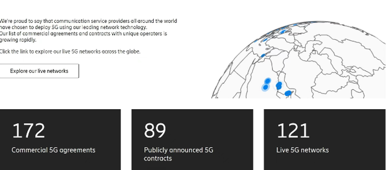
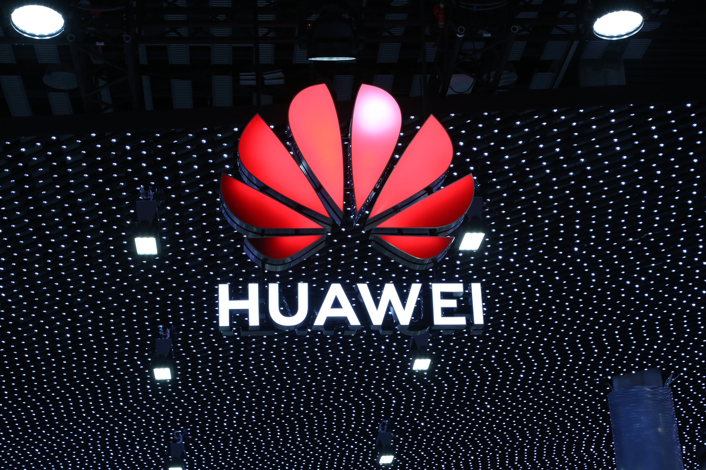

5G时代到来，华为算是站在了这个时代的风口浪尖。掌握了核心技术的华为在美国单方面的抵制打压下，引来了不少国人的关注和支持。

而就在国人热议5G时，原本被认为淡出手机市场的老大哥诺基亚，倒在这一次全球订单5G中更新了新数据。根据诺基亚在官网发布的数据，诺基亚的5G商用订单数量达到了214份。

诺基亚财报显示，2021年诺基亚实现了222亿欧元的销售额，净利润14.45亿欧元。而在2020年诺基亚亏损了25.16亿欧元。看来，遍布全球的5G 通信业务帮助诺基亚实现扭亏为盈。

同样曾经坐上全球第一宝座的知名通信设备商爱立信，也公布了最新5G商用合同数量。据爱立信的官网数据来看，除了达成172份商用5G合同之外，还包括了与121个已经运行的5G商用网络提供设备。

爱立信此次的合作范围在全球中涉及到了54个国家和地区，由此也可以看出，爱立信的5G发展是不断向前的。

诺基亚和爱立信都更新了5G订单的最新数据，那么华为呢？

其实华为一直以来都是比较低调，5G商用订单数量都已经2年多没有更新了。这倒是让不少国人纷纷猜测其原因，有人说是怕引起其它国家不必要的争端，也有人说可能没有拿出很好的成果，真可谓是众说纷纭。

可就在2022年世界电信和信息社会日大会上，华为公开了5G商用合同的最新数据。

据华为副总裁蒋亚非表示，华为已经获得100+个5G商用合同，基站出货量已超120万。

他还提到，全球已经建成超200张5G网络，开通156万5G基站，建成全球最大5G网络。而华为5G服务的行业，已经包括钢铁、港口、矿山、制造等等。

能看得出来，华为更多的是在脚踏实地地落地5G核心技术，并且在很多行业中都得到了实际的应用。在5G订单数量方面的公布就还是显得一如既往的低调，不过不管怎么说，华为5G商用合同的更新终归是件好事。

何况华为合同数量一点也不差，各国的5G建设也都才刚刚开始。更重要的是，华为5G技术市场还是非常广阔的。

正如会上透露，目前华为5G就已经在各个行业开始助力数字化转型了。

如钢铁行业实现天车无人化以及远程自动控制，并通过5G回传视频；港口行业，实现5G龙门吊远程操控；矿山行业实现井下自动巡检，综采面远控。这些都是高新技术在各行业中的实际应用。

相信华为已经感受到了数字经济这片蓝海的广阔，构建的蓝图可谓宏远。其实仍有很多像华为这样优秀的企业都在助力中国数字化转型。

像这款良心国产无代码搜索式BI平台**DataFocus**，也在不断突破核心技术，走向国际舞台。

目前**DataFocus**掌握**数据仓库、内存计算引擎、机器学习引擎、智能分析引擎、分布式集群、语义解析引擎**等等核心技术，正如华为作为全球5G的领导者一样，它也是**目前搜索式BI平台的领导者**。

在它的支持下，企业业务精英不需要学习代码知识，通过像百度搜索一样就可以自主数据分析。目前DataFocus也已成为知名5G供应商，同时也为万向集团等众多国内知名企业服务。

同样，在华为的支持下，全球多个国家的运营商都成功部署了领先的5G网络，而且用户体验均为最佳。

所以真的完全不需要纠结5G商用合同数量谁高谁低，自主研发的科技水平才是硬道理。华为已经找准了未来5G市场机遇，相信华为一定能取得更大的科技进步。未来科技市场终将会是中国的！

对此，你怎么看？欢迎评论、转发。
