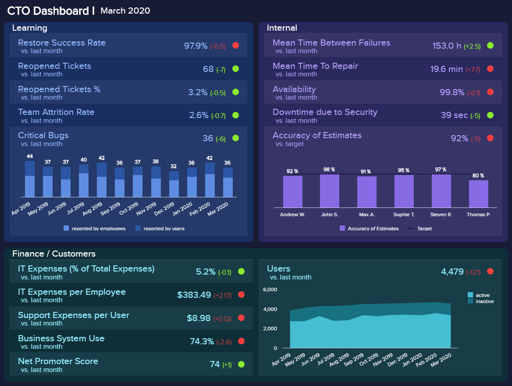
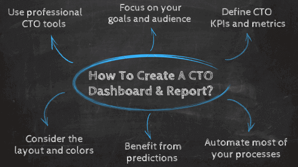

首席技术官（CTO，也称为首席技术专家）肩负着推动组织前进，领导技术进步，研究、开发和管理以创造业务价值并增加投资回报（ROI）的巨大责任。

为了成功控制并改善公司的技术需求，需要 CTO 仪表板和报告作为宝贵的工具来整合多个数据点，并在战略发展和[在线数据分析](https://www.datafocus.ai/infos/data-analysis-tools)工作中支持技术官员，从而使他们成为新解决方案的拥护者。作为公司最高管理层的最高技术执行职位，CTO 需要使技术相关的决策与公司的目标保持一致。通常，这项任务并不容易，需要同时使用现代 CTO 报告软件和工具，使业务和技术或 IT 挑战混合在一起。

从长远来看，我们将重点关注 CTO 仪表板和报告，从定义开始，继续介绍可用于您自己的业务需求的示例，最后介绍这些仪表板和报告提供的最突出的好处。话不多说，让我们开始吧。

## 什么是 CTO 仪表板？

CTO 仪表板是一种可视化工具，可帮助监控和分析关键的高级[IT 指标](https://www.datafocus.ai/infos/kpi-examples-and-templates-it)，例如支持费用或严重bug。这些交互式工具使 CTO 和其他 IT 主管能够获得所有相关 IT 数据的集中和动态视图。

此外，这类仪表板提供简洁的视觉效果，易于c级管理层的其他成员访问和共享，同时使数据管理流程对所有相关人员都更易于理解和完善。从本质上讲，IT 领导仪表板是高度可定制的，使其可用于任何 CTO 具有重要意义的技术和非技术行业，例如游戏开发、生物技术、汽车等。

也就是说，这些仪表板也可以用作 CTO 报告。

## 什么是 CTO 报告？

CTO 报告基于仪表板中存在的数据和统计数据的精选集合，并根据可以轻松自动化并全面共享的既定KPI 提供大量信息，以监控相关的 IT 绩效。

CTO 报告重点关注 CTO 需要收集的相关数据，以便能够产生可操作的见解，并提高公司的技术底线。诸如管理 IT 基础架构、规划技术战略、分析目标市场和创建业务模型等职责需要适当的[管理报告工具](https://www.datafocus.ai/infos/management-reporting-tools)，CTO 可以利用这些工具并为组织获取短期和长期价值。

通过促进可视化指标和混合交互功能，这些报告确保了组织内的运营和战略开发（如自动化）的优势。因此，时间大大节省，生产力水平也很容易提高，但我们将在本文后面重点讨论具体的好处。现在我们将展示一个全面的 CTO 仪表板示例，将我们的概念置于一个可视化的角度，并解释简单性和复杂性如何在单个屏幕上协同工作。

## CTO 仪表板和报告的好处

我们已经介绍了这两种分析工具的定义。现在，是时候看看它们可以为首席技术官及其团队的日常工作流程带来哪些好处了。仪表板和交互式报告促进了企业处理重要数据的方式，它们允许快速访问可以显著增强决策过程的相关见解。让我们更详细地了解一些关键优势。

- **集中的数据视图**：如上所述，技术人员处理业务的各个领域，例如市场营销、产品、财务和 IT。这意味着他们需要考虑来自多个来源的数据，以便为组织做出最佳决策。现代 CTO 仪表板在一个屏幕上提供了最重要 KPI 的集中视图。这种级别的交互性允许用户在直观的过滤器的帮助下浏览数据，并找到可能出现的任何问题的答案。
- **改善沟通**：根据 STX next 进行的一项调查，39.9% 的 CTO 有 1-5 人向他们汇报工作，其次是 32% 的人最多有 10 个。考虑到这一点，CTO 的工作已经饱和了，这并不是什么秘密了。跟踪在不同领域工作的每位员工的表现既困难又耗时。现代仪表板通过提供多个共享选项，让每个相关涉众保持联系和协作，从而促进了任务的完成。
- 加强**问题管理**：保持对任何问题的关注是 CTO 需要确保的另一项重要任务。现代仪表板提供了掌握任何问题所需的可访问性。借助 AI 支持的智能[数据警报](https://www.datafocus.ai/infos/business-intelligence-data-alerts)等技术，一旦数据出现任何问题，CTO 可以立即得到通知。这将允许进行有效的风险管理，并有机会找到可能尚未开发的改进机会。
- **24/7**[**在线报告**](https://www.datafocus.ai/infos/online-reporting)**访问**：扩展上述观点，仪表板提供对相关数据的 24/7 访问。您唯一需要做的就是联网。这使 CTO 可以随时随地访问他们的最新信息，从而提高他们的数据管理流程的效率。24/7 全天候访问实时信息还可以高效地开展日常业务运营。

## 专业的 CTO 仪表板示例

当我们谈到在一个保护伞下收集所有相关数据点时，CTO[仪表板工具](https://www.datafocus.ai/infos/online-dashboard)提供了一个强大的解决方案，它将构成您基于技术的决策的基础，在这里我们将借助我们的两个可视化示例准确解释如何进行。

### 1\. CTO 仪表板模板

上面描述的 CTO 报告示例是为每月概览创建的，但包含与上个月（在本例中为 2 月）的快速比较。我们可以看到4个高级指标，它们侧重于学习、内部流程、财务和客户，最后是用户。

学习方面涵盖了与上个月相比的关键指标，例如重新开票、团队流失率和严重的bug，以及一年来的可视化表现。这种 CTO 报告结构使首席官能够快速识别部门或公司能力范围内的主要瓶颈，从而有效地从错误中学习，并避免 IT 运营中的潜在滞后。

其次，内部支柱以及修复、可用性、安全性停机时间和估计的准确性将帮助团队更好地预防和计划优化和提高绩效所需的措施。例如，我们可以看到 Thomas 没有提供令人满意的准确度，因此开始提问以避免将来出现此类情况是有意义的。

第三，每个 CTO[仪表盘软件](https://www.datafocus.ai/infos/best-dashboard-software-features)都需要使用户能够轻松跟踪财务和客户相关数据。在我们的模板中，数据故事侧重于关注 IT 费用占总费用百分比，每位员工、每位客户以及净推荐值和业务系统使用情况。我们可以立即发现一些由[IT 仪表板](https://www.datafocus.ai/infos/dashboard-examples-and-templates-it)自动触发的问题，并将其设置为红色以立即引起注意。首席执行官有一个明确的信号，即财务需要更多的关注和监控，以避免潜在的问题。

最后，对活跃用户和非活跃用户的清晰概览可以让您快速了解本月的表现，以及随着时间的推移（在本例中为一年）的发展。所有这些功能将使您能够立即发现工作范围内的低效率，并确保您的战略计划遵循有效的运营管理和努力。这样，在现代[IT 分析](https://www.datafocus.ai/infos/business-intelligence-it)的帮助下，您可以提供真正的业务价值和出色的性能。

**主要 KPI：**

- 严重bug的数量
- 重新开票
- 估计的准确性

### 2\. 网络安全 CTO 报告模板

我们的第一个示例提供了 CTO 需要管理的所有领域的总体概述。第二个例子更多地关注内部支柱，特别是网络安全战略。随着数据泄露变得越来越普遍，对强大的网络安全策略的需求变得至关重要。也就是说，根据 STX Next 的《2021 年 CTO 调查》，令人惊讶的是，42% 的 CTO表示他们的公司根本没有网络安全。因此，对上述分析工具的需求变得至关重要。

进入仪表板，我们首先了解按周和攻击类型划分的入侵尝试。这是一个有用的概述，因为它可以告诉 CTO 和 CIO 业务被攻击的频率，以及寻找预防措施的最常见威胁是什么。此信息由备份频率和网络安全评级进行补充。该评级先前由组织强加的标准定义，并且应始终尽可能高。

接下来，我们概述了检测时间和解决时间。顾名思义，这两个 CTO 绩效指标表示 IT 部门检测和攻击然后解决问题所需的时间。自然，检测时间应尽可能短，因为检测攻击所需的时间越长，攻击者对系统造成的损害就越大。另一方面，解决的时间也取决于攻击的类型，因为其中一些更难解决。

最后，仪表板显示跟踪网络钓鱼测试成功率的图表。这些测试主要衡量您的员工遭受网络钓鱼攻击的可能性有多大，例如带有可疑链接的电子邮件。深入了解这一点可以让您找到薄弱环节并实施培训机会，以避免员工遭受任何攻击。最后，这些网络钓鱼测试被证明是非常有用的，特别是考虑到我们上面提到的CTO报告的受访者认为人为错误是最大的网络安全威胁。

**主要 KPI：**

- 网络安全评级
- 入侵次数
- 同时检测
- 同时解决
- 备用频率
- 钓鱼测试成功率

## 如何创建 CTO 仪表板和报告？

既然您已经看到了自动化、动态可视化以及现代 CTO 报告软件的所有功能和优势所带来的宝贵机会，那么我们将在此介绍一些有关如何创建此类仪表板的基本技巧，以及在此期间要记住的注意事项。

**1.使用专业的CTO工具和软件**

当您想从 CTO 工具中提取价值时，选择正确的软件是您的首要任务，这一点至关重要。尤其是在技术领域，CTO面临着管理组织整个技术周期的艰巨任务，包括优化和未来发展。专业的工具使您能够创建可自定义的指标（例如[财务图表](https://www.datafocus.ai/infos/financial-graphs-and-charts-examples)），并将它们合并到交互式可视化中，有助于您无缝理解您的 CTO 数据收集和管理。

**2.关注目标和受众**

另一个需要考虑的关键点是最终目标。CTO需要掌握各种与技术相关的数据，无论他们是自己构建仪表板还是让团队成员来做，重要的是要关注最有价值的指标和普通受众。团队会议和运营活动的报告将具有不同于 CEO 或董事会会议指定的指标。另外，别忘了做好准备！

**3\. 定义 CTO KPI 和指标**

一旦您确定了业务的总体目标和需求，就该选择正确的 CTO KPI 和指标，这将帮助您衡量活动的进展和成功。就像任何其他业务领域和职能一样，您衡量的 CTO 指标将取决于公司和行业的规模。对某些组织有效的方法，对其他组织可能不起作用。因此，花时间评估哪些关键绩效指标对您最有帮助是很重要的。如果您想获得所有必要的信息来为您的业务选择最佳绩效指标，请查看我们的[KPI 与指标](https://www.datafocus.ai/infos/kpis-vs-metrics-differences)指南。

**4.考虑布局和颜色**

虽然将尽可能多的信息放在单个[数字仪表板上](https://www.datafocus.ai/infos/digital-dashboard-definition-and-examples)可能是一种直观的做法，但重点是建立叙述并扩展某些流程和问题。使用简单的布局并尊重公司的颜色可能看起来很容易，但有时会带来挑战。如前所述，无论谁构建仪表板，重要部分是要记住定义一个不会使仪表板负担过重并造成混乱的布局和颜色。

**5\. 从预测中受益**

除了解决与 IT 相关的问题外，首席技术官还需要开发、实施和管理组织的技术资源。为了做到这一点，他们需要用数据驱动的技术来支持自己，这将帮助他们做出最明智的决策。预测分析和人工智能技术使 CTO 能够通过分析当前和历史数据来发现趋势和模式，从而生成有关用户行为的准确预测。通过这种方式，他们可以确定最有可能导致转化的行动，并结合战略来提高盈利能力和提供优质服务。

**6\. 自动化大部分流程**

使用 CTO 报告工具的主要好处之一是有机会安排和自动化仪表板以及每周或[每月报告](https://www.datafocus.ai/infos/monthly-reports-templates)。在运营层面上，每周安排一次可能是有意义的，但在战略层面上，您将需要更长的时间框架。无论在何种情况下，当您考虑创建每周、每月、每季度或所有这些仪表板时，无需手动即可安排和交付实时更新的仪表板的可能性是一个关键因素。

要了解有关此综合主题的点点滴滴的所有信息，我们建议您阅读有关[如何创建仪表板](https://www.datafocus.ai/infos/how-to-make-a-dashboard-with-ease)的指南。

## 总结

作为一名CTO，不​​是在公园里闲庭信步，而是充满挑战的，同时也是一个回报丰厚的领域，可以为组织的技术进步和管理提供深刻的见解。

我们已经解释了首席技术官仪表板和报告的定义，提供了一个真实的示例，并向您展示了一些要遵循的技巧，以便在仪表板和报告创建中变得更加有效。现在轮到您将阅读内容带入一个真实场景，并开始使用DataFocus创建您自己的首席技术官仪表板，并使用我们完全免费提供的30 [天试用版](https://www.datafocus.ai/console)！
