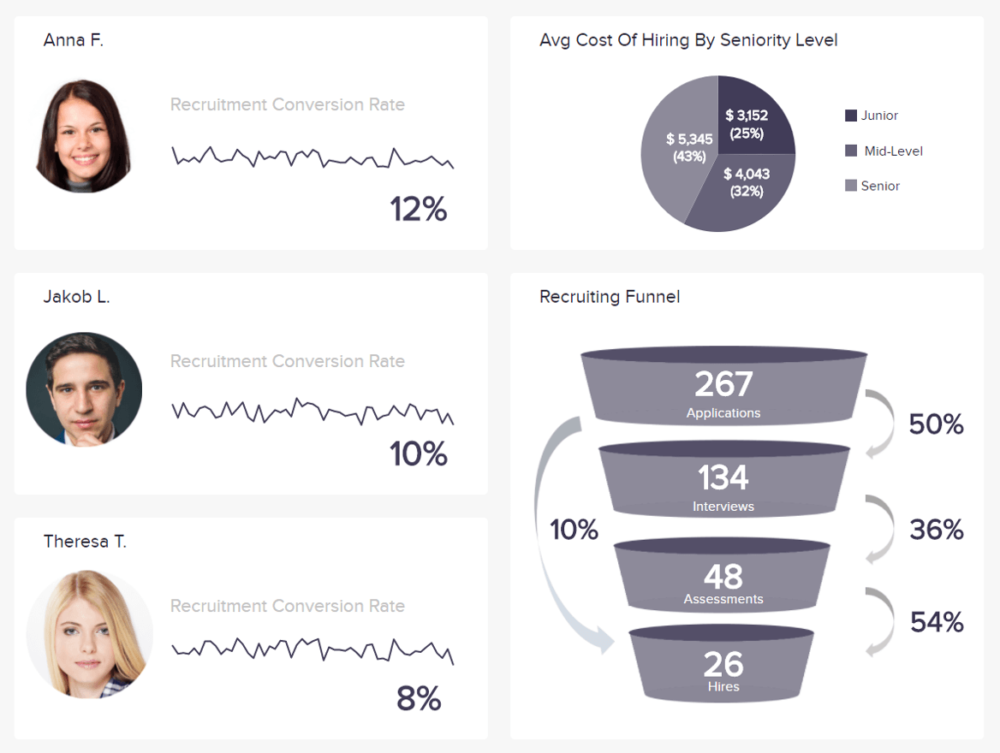
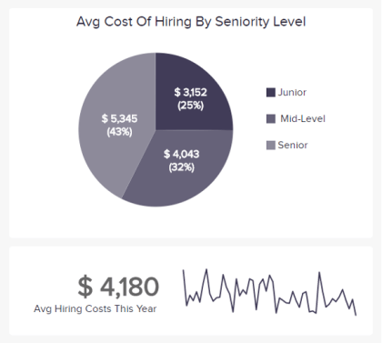

人力资源分析软件用于处理原始人力资源数据，旨在产生有价值的见解、改善工作场所管理、增强招聘流程、员工保留率，并提供更好的人员配备分析，同时通过简化人力资源流程节省资金。人力资源在每家公司都非常重要。他们是负责人的人，为每个人培养公司的文化和价值观。从招聘到留任，人力资源部要处理许多不同的因素，这些因素对于将合适的人分配到合适的职位至关重要。datafocus 的 HR 分析为您提供所有 HR 数据的独特全球视图，帮助您掌握劳动力的脉搏。

1）工作场所管理工作场所管理

真实地了解您的工作场所的特殊性和需求状态，以及您的劳动力规划，并不是一件容易的事。借助我们面向人力资源专业人士的商业智能软件，在一个地方管理所有这些数据，同时允许其他人对其进行处理，并在任何情况下都保留一个独特的真实版本。

2）加强招聘工

最难衡量的指标可能是人类的主观指标。面试、反馈、应聘者的经验，你必须收集重要的动态数据并与他们进行智能交互。这样，您可以为正确的职位聘用合适的候选人，并随着时间的推移减少公司的营业额。

3）留住员工

人力资源数据在各种系统中传播；但 datafocus 可以帮助您将所有这些结合起来，并可视化保留计划对员工生产力或整体满意度的影响。识别高流动率领域并尝试了解原因，以便在未来提高内部参与度。

4）人员配备分析

了解您拥有的人力资源并随时了解招聘需求。通过提供培训、技能评估或加薪来促进员工的职业发展。通过现代 HR 分析衡量您的劳动力价值，并通过交互式仪表板提高业务绩效。

## 查看这些令人惊叹的人力资源分析示例

- [员工绩效](https://www.datafocus.ai/infos/business-intelligence-human-resources#)

作为人力资源主管，您需要对公司最大资产的不同方面有一个概览：您的员工。datafocus 的专业人力资源分析软件可确保您跟踪您的劳动力绩效和活动，从保留率、整体劳动力效率到缺勤率。然后，您可以分析哪些有效，哪些无效，从而实施快速响应决策，激发员工的最佳潜能，并发展您的公司或部门。

- 招聘

将人才管理所需的所有数据收集在一个地方：申请数量、进行的面试和招聘人数、招聘漏斗中的转化率和表现最好的代理，以及平均招聘成本。考虑到所有这些人力资源数据，您可以更好地了解您的申请人并改进您的招聘流程，从而确保您拥有与正确职位匹配的正确个人资料。

- 劳动力概览

修改您的劳动力战略，同时确保您的员工有机会在您的公司或部门内发展。密切关注员工的全职或兼职概况、女性或男性比例或他们的通知期，以获得更好、更充实的工作环境。借助 datafocus 的 HR 分析软件，您可以以清晰、简单的方式管理所有这些 HR 指标，从而使您能够改善与员工的关系、他们在工作中的幸福感和保留率。

## HR如何使用分析软件？

证明劳动力费用的合理性从来都不是一项简单的任务。然而，随着数据分析的收集和使用越来越多，今天人力资源从业者更容易了解资金的去向和原因。它不仅仅是普通的钱。了解 HR 分析软件是推动业务发展的重要一步。事实上，招聘、培训和留住对组织的绩效有重大影响，所以正确地做是关键。这也是更好地了解员工并了解人力资源如何推动业务而不是仅仅与业务保持一致的绝好机会——这一切都要归功于专业的[人力资源仪表板](https://www.datafocus.ai/infos/dashboard-examples-and-templates-human-resources)，它可以实现更好的数据驱动的劳动力决策。

但是，与任何业务部门一样，劳动力分析也存在挑战；不仅在实施它们时，而且在管理它们时。我应该集中在哪里收集数据？我怎样才能提高人才分析在公司内的影响力，让他们更可信？在现代人力资源分析工具的帮助下找到这些问题的答案将帮助您的部门在劳动力智能的开发和实施方面更进一步，并最终帮助您公司的决策者制定战略。

## 现代人力资源商业智能的影响

正如我们所说，良好的人力资源管理的目标是借助现代[人力资源报告](https://www.datafocus.ai/infos/monthly-and-annual-hr-report-templates)为公司提供有关劳动力的见解。这些见解应该为您已经知道的（员工人口统计、教育历史、培训记录……）增加价值，以推动您的业务向前发展。通过期望每个关键任务工作的量化输出，人力资源部门可以使用这些数据来识别直接影响或影响生产力的元素（开发方法、奖励、激励因素等）。借助人力资源分析工具，您可以量化由于更好的培训等而提高生产力所产生的美元影响。通过使用正确的[HR KPI](https://www.datafocus.ai/infos/kpi-examples-and-templates-human-resources)，整个部门和整体劳动力管理的数据分析过程将更快，更容易。

在 datafocus，我们认为使用 HR 商业智能是解决公司保留问题的一种聪明方法。它们可以启发您了解员工留下或离开的原因、招聘、流动或平等。今天，由于全球知识经济中工作流动性的增加，加上“婴儿潮”一代开始退休并被较小的工人群体取代，留住人才的挑战比以往任何时候都大。使用我们的人力资源分析软件，您将拥有正确的工具来理解您的数据并提高您的保留率，同时降低您的员工流动率。

## 如何在您的公司实施人力资源分析工具

首先，在实施 HR 分析工具时，将其介绍给团队的所有成员并为所有需要它的人提供访问权限非常重要。根据您公司的规模，仅一两个人无法生成每个经理都需要的劳动力报告。选择[自助式 BI 工具](https://www.datafocus.ai/infos/self-service-bi-tools)是一个不错的选择，因为它使没有 IT 背景的任何人都可以轻松地进行分析。为您的同事提供适当的工具以做出更明智的数据驱动决策是从数据中提取价值的高速公路。

找到一个目的并阐明您的组织采用 HR 分析工具作为业务方法的原因背后的愿景。选择一个或两个项目来解决您的组织面临的业务挑战，并提取有助于解决这些挑战的 HR 数据。最后，不要忘记衡量您的努力成果，以便之后能够推广它们：它为未来对人力资源分析软件的投资创造了商业案例。当然，另一个最佳实践是在分析火车上加入您的 C 级套件。为此，请谈论业务战略并指出人们如何改变该战略。从那里，您可以选择正确的指标进行分析，并一起监控风险和进展。这比仅仅向他们展示一堆无法有效吸引他们的数字更好也更容易。
