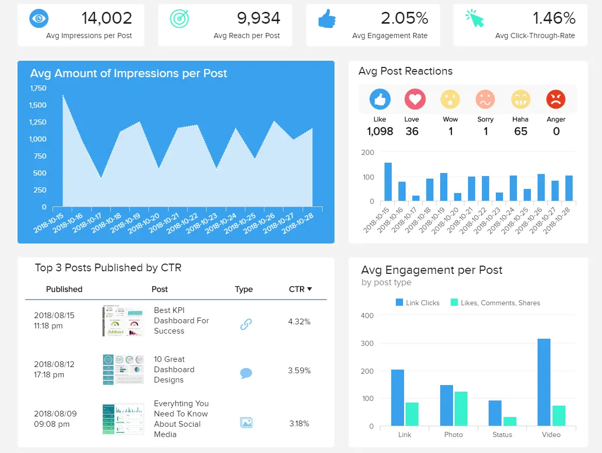
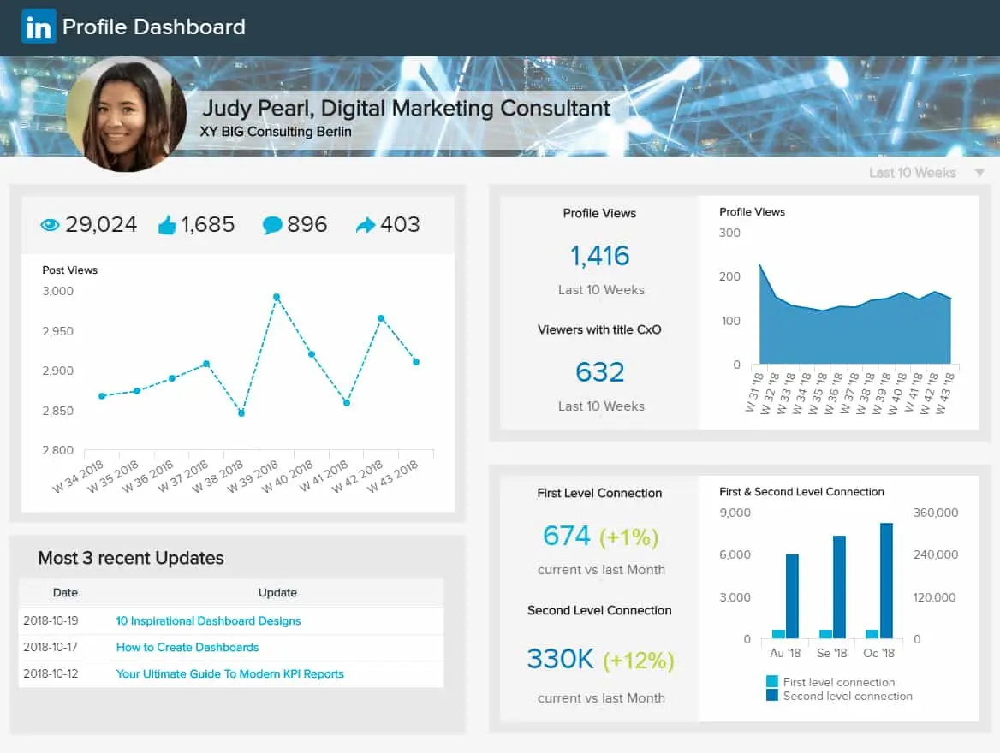
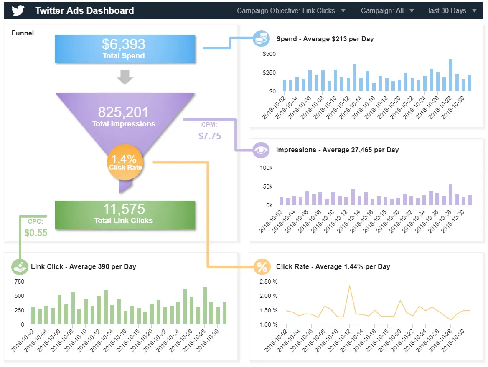

“在社交媒体中，”吱吱作响的轮子“得到了油。你必须把自己放在那里，找到会与你联系甚至辩论的人，这取决于你在寻找什么。

全球有数十亿社交媒体用户，其中大多数人与朋友和家人分享他们的想法、感受、意见和建议。作为一个品牌或企业，如果您在目标客户参与度最高的平台上与他们会面，您就可以增加受众并成倍地提高您的底线。

 

通过引发有意义的对话，并在潜在客户最有可能做出回应或反应的时候与他们提供有价值的内容，您将确保您的社交成功——进而帮助您的公司在这个残酷的数字时代扩大规模、发展和繁荣。

但是你怎么知道在哪里定位你的受众呢？什么时候与他们联系最好？您最应该关注哪些平台？整理社交驱动的事务似乎是一项不可能完成的壮举，但通过社交媒体报道，您将能够获得获得应得结果所需的洞察力。当您将现代技术和专业报告工具加起来时，您在社交领域的[报告](https://www.datafocus.ai/infos/online-reporting)流程将获得许多回报。

在这里，我们探讨了社交报告的意义和价值，以及社交媒体[营销报告](https://www.datafocus.ai/infos/daily-weekly-monthly-marketing-report-examples)的价值，以及正确完成工作所需的工具 - 首先考虑这些报告是什么以及它们在当今高度互联的商业世界中的角色。之后，我们将介绍这些报告提供的好处，并以实际业务场景中的示例和模板结束。事不宜迟，让我们开始吧。

您的机会：[想免费测试社交媒体报道软件吗？](https://www.datafocus.ai/console/)我们提供 14 天免费试用。受益于出色的社交媒体报道！

## 什么是社交媒体报告？

社交媒体报告提供了一种从基于各种社交网络（Facebook、Twitter、LinkedIn、YouTube 等）和指标（关注、喜欢、覆盖、增长、意识、后期表现、参与度等）的数据中提取价值的方法。

社交媒体营销报告基于精选的数据和统计数据集合，这些数据和统计数据是根据您企业的社交营销活动和目标定制的。

通过使用社交媒体[管理报告软件](https://www.datafocus.ai/infos/management-reporting-tools)来跟踪、衡量和完善您的社交驱动工作，您将做出更好、更快、更明智的决策，同时通过您所做的每项计划或互动最大限度地提高投资回报率。

## 为什么社交媒体报道很重要？

社交平台营销涵盖广泛的平台、计划、活动和战略计划。能够做出明智的决策来简化您的工作将带来回报。

也就是说，社交媒体报道将让您大开眼界，了解丰富的信息，这些信息将帮助您产生潜在客户，培养持久的客户关系，并创建值得分享的材料，并提高您的品牌知名度。

在数字时代，在黑暗中拍摄并希望得到最好的结果是行不通的。您必须利用数据来发挥自己的优势，并通过选择正确的[数字营销 KPI](https://www.datafocus.ai/infos/best-digital-marketing-kpis-and-metrics)来充分利用它，这将有助于您的整体社交策略。无论是Facebook的社交媒体报告还是任何其他渠道的社交媒体分析报告，以下是您应该使用[数字仪表板](https://www.datafocus.ai/infos/digital-dashboard-definition-and-examples)进行社交媒体报告的主要原因：

- 更智能的内容创建：内容创建是任何社交媒体策略的基础。但是，仅仅凭直觉发布材料并不是实现策略的最明智方法。借助社交媒体报告，您可以识别相关信息，例如效果最佳的帖子、目标是否喜欢视频或图片、帖子或故事以及其他一些见解。这将帮助您根据真实信息在每个社交渠道上创建和推广更有价值和引人入胜的材料。
- 以结果为导向的日程安排：每月的社交媒体报告可以提供宝贵的见解，了解一天、一周或一个月中与受众互动或分享内容的最佳时间，以及哪些主题可能会引起潜在客户的共鸣。通过了解这些信息，您将能够战略性地安排帖子和投放活动，从而从所有社交营销工作中享受最大的结果。这应该通过选择准确的[社交媒体 KPI](https://www.datafocus.ai/infos/social-media-kpis-and-metrics)来完成，我们将在后面更详细地解释。
- 量身定制的定位：社交媒体报告为您提供一定程度的洞察力，使您能够深入了解特定于平台的数据，并最终规划针对每个平台量身定制的战略工作和活动，而不是采用一刀切的方法来进行促销工作。在[在线数据分析工具](https://www.datafocus.ai/infos/data-analysis-tools)的帮助下，可以显着建立这种定位。
- 自定义跟踪和绩效衡量：跟踪您的努力和目标设定是持续增长和成功的关键，这些类型的报告提供了大量见解，可帮助您解决特定障碍、克服挑战并发现有助于推动组织前进的新信息。
- 识别趋势和新机会：社交媒体是关于对话的，客户希望品牌成为其中的一部分。在社交媒体报道的帮助下，您可以进行在其他渠道中可能找不到的研究，例如您的客户正在谈论的主题，并与其他国际市场建立联系，同时将支出保持在最低水平。发现新的消费者行为并发现潜在卖点的新领域，可以而且将会增加品牌的影响力。
- 为受众提供附加值： 跟踪社交平台活动的另一个不可否认的好处是，您将有更大的机会利用趋势标签、病毒式运动和趋势，找到独特的方法来激发、娱乐和为您的受众提供价值。
- 证明您的策略的价值：相反，如果您正在为客户或您自己的品牌工作，那么没有比社交媒体报告更好的方法来了解您的社交媒体策略是否成功。通过理解您的社交指标，您可以证明您的帖子是否成功，如果您的预算被有效使用，最重要的是，对您的策略的投资是否值得。
- 确定季节性影响：我们的最后一个好处谈到季节性，在营销中，季节性是由一年中特定季节或几天发生的波动定义的。例如，复活节、圣诞节、黑色星期五和网络星期一等。这些活动对企业具有商业意义，因为它们代表了增加销售额和获得新客户的机会。为了实现季节性目标，品牌需要进行详细的分析，并使用与目标受众一致的内容来规划高质量的营销活动。为此，社交媒体报道是一种宝贵的工具。您可以使用前几年的数据来了解您的客户与哪些类型的假期互动最多，哪些类型的策略有效，哪些策略无效，并做好相应的准备。

“通过投资于社区和其中的人，你永远不会出错。”

正如我们刚刚建立的那样，跟踪和衡量您的活动对于成功至关重要，而报告是一个很好的工具。如果您始终如一地跟踪您的社交活动，您不仅可以增加受众群体，还可以培养客户忠诚度，将一次性买家转变为长期品牌拥护者。

此外，这些类型的报告，当根据您的特定需求和目标进行定制时，将帮助您更容易接近潜在客户，因为它可以让您为每个平台建立完美的品牌声音，同时帮助您提高响应率和基于社交的客户服务水平。

71%的消费者表示对某个品牌有积极的社交体验，他们可能会向其他人推荐该品牌。跟踪和衡量您的努力，您将满足您的客户，并在此过程中获得增长、忠诚度和繁荣的回报。需要我们多说吗？

## 成功社交媒体报告的最佳实践

没有一种单一的黑白方法来创建报告。根据具体的用例和您要跟踪的指标类型，各种社交渠道的报告流程会有所不同。在创建报告之前，您需要回答一些核心问题，并且需要遵循一些最佳实践，以便为您的社会工作创建最佳报告。在这里，我们将命名一个标准流程，使您的实践更容易：

### 1\. 定义您的利益相关者

开始创建最佳社交媒体报告的第一步是回答一个简单的问题：我向谁发送报告？由于社交媒体是一种如此通用的工具，您可能需要根据不同的目标考虑不同部门的结果。为了正确看待所涉及的每个利益相关者的数据，无论是来自销售、营销还是外部客户，您都可以创建仅包含与该特定利益相关者相关的指标的特定报告。尽量始终只包含您的 KPI，以避免在分析无用的数字时浪费时间和资源。如果您发现隐藏的机会，或者它可以为您的主要 KPI 提供上下文，则可以不时包含其他指标。

### 2\. 选择正确的指标

您选择的指标应根据社交平台进行调整。虽然它们都是社交的，但每个网络都有自己的一套规则和最佳实践。借助 KPI 工具，您可以更好地了解要跟踪哪种运营指标，是需要专注于战略和高级[KPI](https://www.datafocus.ai/infos/kpi-reporting)，还是需要两者的结合？除了为每个平台考虑不同的参数外，您还应该考虑选择与您的策略主要目标一致的指标。例如，如果一个广告系列的创建目标是提高销售量，那么关注者或喜欢将不是跟踪、更好的潜在客户或转化的有用参数。

### 3\. 提供竞争环境

虽然您的SM报告显然应该概述有关您在各种平台上的策略绩效的每个关键方面，但它不应该只与您有关。要进行有效的社交媒体报告，最佳做法是还包括有关竞争对手的信息。现在，当我们谈论竞争对手时，我们并不意味着您将自己与您所在行业中排名第一的业务进行比较，当然，除非您处于该水平。在查看竞争对手分析时，请确保选择与您处于同一级别的企业。这将帮助您保持基准和目标的现实性和可实现性。从这种做法中，您可以提取见解，例如竞争对手的受众以什么速度增长，他们的内容获得的共享程度以及什么对他们最有效，以及其他有价值的东西。

### 4\. 专注于有影响力的数据

定义和分析正确的 KPI 并不是您在创建社交媒体报告时应考虑的唯一决定因素。您应该始终尝试从不同的角度查看您的信息，并探索和筛选数据，以发现可以优化绩效的隐藏见解。例如，如果您按国家/地区过滤数据，并意识到 70% 的流量来自某个特定国家/地区，那么您可以为该国家/地区制定有针对性的策略，或者将预算更多地集中在该国家/地区。请务必考虑到，在筛选数据时需要小心，以免创建误导性报告。

您的机会：[想免费测试社交媒体报道软件吗？](https://www.datafocus.ai/console/)我们提供 14 天免费试用。受益于出色的社交媒体报道！

### 5\. 受益于文本分析

文本分析是分析文本源（如社交媒体评论、支持票证、客户评论等）并从中得出有意义的结论的过程。在社交媒体方面，这是一种非常有用的做法。显然，您无法浏览客户在您的社交渠道上留下的每一条评论或文本，因此，文本分析工具已经出现，可以自动化流程并为企业提供有价值的见解。通过在SM平台上使用此技术，您可以了解有关特定产品或内容的情绪，衡量您的声音份额，确定客户正在谈论的关键主题，甚至确定购买意图等。这提供了一种比仅仅查看数字更广泛、甚至更有价值的数据方法。

### 6\. 在一个位置可视化所有数据

如果您在策略中使用多个社交媒体平台，这意味着您将需要从许多来源提取数据，从而使报告过程变得乏味且耗时。DataFocus 等现代[商业智能工具](https://www.datafocus.ai/infos/best-bi-tools-software-review-list)提供数据连接器，帮助您在一个地方可视化所有相关指标，这样您就可以比较策略在不同平台上的表现，并提取有意义的见解以进行改进。此外，该工具将自动更新社交媒体报告中的数据，这样您就可以花时间分析您的信息而不是提取信息。我们将在文章中举例说明如何将您的所有社交媒体数据展示到一个自动报告中。

### 7\. 确定您的报告时间表

虽然社交帖子可以立即传播开来，但保持对大局的概述也很重要。建议在每天连接到您的社交帐户时安排定期报告（不要忘记社区管理，尽管这本身就是一个主题）。报告可以每周、每月或每季度发送一次，但您需要根据您的社交日程安排来决定。借助自动报告技术，您可以按特定时间间隔安排[报告](https://www.datafocus.ai/infos/automated-reporting-system-and-tools)，而无需每次都手动更新信息。更多关于这一点的内容见下文。

### 8\. 自动生成报告

继续我们的最佳实践列表，我们有报告自动化。如上所述，自动报告技术允许您安排在选定的时间范围内将报告发送给特定收件人。但不仅如此。相反，您是与多个客户合作的机构或为组织工作的社交媒体团队，生成报告既乏味又耗时。幸运的是，自动化工具通过自动生成报告并在出现新信息时立即更新它们来减轻您的这种痛苦。这样，您不仅可以节省无数小时的工作时间，还可以在任何问题发生时立即做出反应。这些解决方案还包括智能[数据警报](https://www.datafocus.ai/infos/business-intelligence-data-alerts)，一旦达到目标或检测到异常，就会通知您，因此您无需手动检查。

### 9\. 选择合适的社交媒体报告工具

市场上有许多[数据报告](https://www.datafocus.ai/infos/data-report-examples)工具可以帮助您呈现信息，但只有少数工具提供的功能将使您的工作非常简单明了。特别是如果您需要组合众多社交网络，则需要谨慎选择合适的软件。一个使您能够访问实时数据、自动化报告和简化共享过程的工具可能是比传统电子表格更好的解决方案。DataFocus 是一种[BI 报告工具](https://www.datafocus.ai/infos/bi-reporting)，可让您创建功能强大的交互式报告来执行高级数据分析。其用户友好的界面使组织中的任何人都可以轻松使用。由于其自动报告功能和数据连接器，您可以在一个地方实时查看所有数据，使其成为社交媒体报告的完美解决方案。

### 10\. 在报告中集成预测

除了跟踪策略的进度外，您还应该使用社交媒体报告作为预测数据未来结果的工具。与市场上的许多其他[BI 解决方案](https://www.datafocus.ai/infos/business-intelligence-bi-solutions)不同，DataFocus 提供了用户友好的预测分析功能，允许您通过识别数据中的趋势和模式来提取高级见解，这是传统报告技术无法获得的。通过使用预测，您可以了解客户需求、促销等内容。现代企业正在使用越来越多的预测分析技术来在竞争中获得优势。

为了继续探索社交媒体报道在实践中的价值，我们选择了9个例子，这些例子不仅会向您展示月度社交媒体报告的内容，还会向您展示每个例子的特殊性。您将拥有足够的见解来开始创建自己的报告并使用这些模板来发挥自己的优势。

## 社交媒体报告中应该包括什么？

我们介绍了构建高效社交媒体报告的 10 个最佳实践。现在，为了补充这些信息，我们将概述您的SM报告中不应错过的一些关键要素。当然，您添加的数据将取决于分析类型以及受众。你的老板或客户可能需要一种更通用的方法来理解你的策略是否成功，而你的队友可能需要更详细的东西来作为他们自己工作的支持。也就是说，无论如何都应该有一些元素，我们在下面列出它们。

- 目标和指标：社交媒体报告中不能错过的第一个元素是您的总体目标和指标。这代表了您将要采取的实现最终战略目标的旅程。它会让你了解你需要改进的地方，以及你是否走在正确的道路上。现在，设定目标和目标并非易事。它们对组织来说应该是可以实现的和现实的。如果您想更深入地了解这一点，请查看我们的[KPI 目标](https://www.datafocus.ai/infos/kpi-targets-goals-examples)博客文章。
- 内容指标：可以说，社交媒体报告中要包含的最重要元素之一是内容指标。您的受众接收您的内容的方式将是他们与您的品牌互动的指标。通过查看这些类型的指标，您可以了解他们是否喜欢视频、音频或图像，如果他们喜欢影响者等等。您还可以比较付费内容与自然内容的互动。我们在下面列出了其中一些指标。
- 覆盖面：关注内容，包括您的覆盖面也是一个非常重要的因素。从本质上讲，覆盖面是指看到您的帖子的唯一身份用户数量。高覆盖面意味着您在受众活跃时发布相关内容。商家使用以下公式计算特定帖子的覆盖面：帖子覆盖人数÷关注者总数 x 100 = 帖子覆盖面。
- 展示次数：展示次数是指您的内容的展示次数。与仅考虑独特视图的覆盖面不同，每次看到您的帖子时都会考虑展示次数。一个人可以为帖子提供多次展示，甚至无需与之互动。这是了解内容价值的宝贵信息。如果您有 1000 次展示但没有互动，则可能需要进行一些优化。
- 参与度和互动： 您的参与率是另一个重要因素，因为它会告诉您受众的满意度和忠诚度。参与度可以分解为称为交互的较小指标。互动可以是点击、喜欢、分享或评论帖子的任何内容。当然，这是关键数据，因为它可以帮助您在自己的策略中找到改进机会。
- 成就：既然你概述了你的目标和指标，那么自然而然地也要展示你何时实现了它们。这是基本信息，因为它将作为了解整个SM战略成功以及您实现目标的速度的概述。您可以包括任何类型的成就，以实现您的总体目标，而是积极的评论或关注者的增加。这对于进行客户报告的机构特别有用，因为您需要定期向[客户](https://www.datafocus.ai/infos/client-dashboard-report-examples)展示进度。
- 机会：就像您包括您的胜利一样，您的 SM 报告也应该包括通过分析您手头的所有数据发现的机会。例如，您可以通过分析您的评论部分看到客户希望有一个 Instagram 亮点故事来回答有关您的产品或服务的关键问题。这为他们提供了一个很好的机会，可以为他们提供更加个性化的体验并提高参与度。
- 客户人口统计数据：要包括的另一个关键因素是客户人口统计数据。这包括有关目标受众的任何重要信息，例如他们所说的语言、年龄范围、性别、位置等。掌握这些知识后，您可以细分客户并提供符合其需求和偏好的有针对性的广告系列。这也是选择吸引观众的影响者的好方法。
- 客户评论：客户是任何组织的支柱。如果他们对做事的方式不满意，这将显着影响您的表现。考虑到这一点，在您的社交媒体报告中包括客户评论或反馈非常有价值。这些评论可以在文本分析的帮助下进行分析，并提取有关一般情绪的结论。在这里，您可以查明客户不完全满意的特定领域，并利用他们所在的领域。对于通过社交渠道销售的企业来说尤其如此。

您的机会：[想免费测试社交媒体报道软件吗？](https://www.datafocus.ai/console/)我们提供 14 天免费试用。受益于出色的社交媒体报道！

## 了解我们的顶级社交媒体报告示例

到目前为止，很明显社会报告对于希望通过营销工作产生真正影响的现代企业来说是多么有价值。为了帮助正确看待这一点，这里有一些现实生活中的社交媒体报告示例供您查看。使用这些用户友好的[在线仪表板](https://www.datafocus.ai/infos/online-dashboard)，您将看到每个界面如何直观、可导航且易于自定义。

### 1\. 社交媒体营销报告示例

在深入探讨每个社交媒体渠道的具体示例之前，我们想更深入地了解在一个地方显示所有数据的好处，这个强大的 KPI 记分卡展示了四个平台上的相关指标：Facebook、Twitter、Instagram 和 YouTube。

在上面的示例中，我们看到图表跟踪每个平台的一组相关指标，例如关注者、观看次数/展示次数、互动和参与度。这些指标中的每一个都针对一个目标以及与上一时期的比较执行。在每个图表的底部，您还有一个图表，显示 6 个月内的点击率波动。通过查看这些数字，您可以看到您实施的特定策略是否有助于实现您的目标，例如，我们看到 Twitter 在点击次数方面存在问题，在这里您可以更深入地调查并查看内容是否对您的受众不感兴趣，或者它是否会在其他类型的渠道中效果更好。

此社交媒体活动报告示例可用于社交媒体报告中的多种方案。首先，它可以作为向希望访问其社交媒体现场表演的客户或经理展示的工具，为此，红色和绿色的简单视觉效果可以立即提供有关积极或消极目标实现的见解。其次，正如我们之前提到的，在一个地方概述所有这些平台的进度将节省您的时间，您可以投资于更深入的分析以改进您的策略。最后，此[KPI 记分卡](https://www.datafocus.ai/infos/kpi-scorecard-examples-templates-to-track-performance)对于举行会议以跟踪其战略进度的 SMM 部门也很有用，因为仪表板为他们提供了指标的快速摘要以支持他们的讨论。

### 2\. 脸书的社交媒体报道

Facebook是世界上分布最广泛的社交渠道。全球有数十亿用户，跟踪和分析该频道上的社交活动至关重要。在这里，我们为您的Facebook页面提供一份社交媒体报告样本，并为Facebook后期管理提供另一份报告。

### a） 脸书页面仪表板

此报告模板专用于世界上最大的社交网络 - Facebook。每天有 14.7 亿人登录，这个网络仍然在搜索引擎上名列前茅，78% 的美国消费者已经发现了仅在该网络上购买的零售产品。这是一个惊人的潜力，如果使用得当，可以确保公司的可持续发展。出于这个原因，报告实践变得更加重要，因为它可以提供贵公司在此社交网络上如何发展的确切数字。

由于 Facebook 有自己的一套规则、实践和指标，这个宝贵的报告模板提供了对页面浏览量、行为、互动、无价的关注人口统计数据、喜欢、参与度以及许多其他基本信息的真正见解，这些信息将帮助您完善您的 Facebook 营销策略。

主要关键绩效指标：

- 风扇数量
- 关注者人口统计
- 按来源划分的页面浏览量
- 页面上的操作

要了解有关此社交媒体报告模板的更多信息，请更详细地浏览我们的[Facebook 仪表板](https://www.datafocus.ai/infos/dashboard-examples-and-templates-facebook)。

### b） 脸书帖子仪表板

如果不仔细查看该社交网络的帖子级别，我们对社交媒体报告仪表板的概述将是不完整的。虽然监控整个Facebook页面的大局至关重要，但分析帖子将为您的社交策略带来更多价值。

我们的模板首先简要概述了展示次数，以及每个帖子的覆盖人数、参与率和点击率等指标的平均值。这样，您就可以大致了解帖子的效果，但您可能希望跟进更多详细信息。因此，在此示例中，您可以看到以简洁直接的方式可视化的其他[Facebook KPI](https://www.datafocus.ai/infos/kpi-examples-and-templates-facebook)：每个帖子的平均展示量、帖子反应、点击率排名前 3 的帖子以及每个帖子的平均参与度。这些指标可以告诉您很多事情：哪种类型的帖子效果最好，您从受众那里产生的反应，以及有多少人看到您的帖子，以及其他创建全面的社交数据故事的重要元素。

主要关键绩效指标：

- 按帖子类型覆盖
- 帖子参与率
- 点击率 （点击率）

### c） 脸书广告仪表板

我们的第三个也是最后一个Facebook示例是跟踪有关广告开发的相关细节。截至 2021 年初，Facebook 被公认为最受欢迎的广告营销社交媒体平台，93% 的 SM 经理使用它来推广他们的业务。也就是说，使用这个Facebook做广告并不是一件容易的事。它需要不断监控和优化活动，更不用说不断跟踪算法更改和其他发展。

上面的模板旨在帮助营销人员以最有效的方式执行所有这些任务。通过深入了解广告费用、互动和一般效果等相关指标，用户可以提取相关结论，使其广告具有针对性和效率。例如，您可以查看不同设备和平台（例如移动设备或桌面设备）的每次转化和每次点击费用，看看哪一个效果更好。

主要关键绩效指标：

- 广告展示次数和频率
- Facebook Ads 的 CPM 和 CTR
- 每次转化费用

### 3\. LinkedIn社交媒体报告样本

如果您希望您的公司在在线社交环境中蓬勃发展，您需要开发和管理一个LinkedIn帐户。LinkedIn有很多好处，它被认为是与商业相关的社交交流的头号平台。为了引导您在这个宝贵的网络上取得成功，我们准备了 2 个社交媒体报告模板，您可以使用它们来发挥潜在的在线业务影响力。

### a） LinkedIn公司页面仪表板

LinkedIn无疑是这个星球上首屈一指的专业网络，我们的第二个社交媒体报告模板只专注于这个不断扩大的平台。拥有超过[5亿会员](https://foundationinc.co/lab/b2b-marketing-linkedin-stats)，约6100万用户是高级影响者，B2B环境中的潜力每年都在增加。这只是为什么跟踪这个社交平台至关重要的冰山一角。让我们看看在我们的示例中如何做到这一点。

作为主要的月度社交媒体报告示例（尽管完全可以跟踪每日或每周社交媒体报告中的指标和互动），我们的LinkedIn报告仪表板提供有关公司更新频率的全面信息。关注者人口统计、参与率等——所有这些都旨在保持一致地保持相关性、存在和发展这些最重要的专业关系。

主要关键绩效指标：

- 关注者的人口统计
- 关注者数量
- 印象和覆盖面
- 参与率
- 公司更新统计

要了解有关此特定报告示例的更多信息，请更深入地探索我们的[LinkedIn仪表板](https://www.datafocus.ai/infos/dashboard-examples-and-templates-linkedin)和模板。

### b） LinkedIn个人资料仪表板

LinkedIn不仅对您公司的形象很重要，而且对个人也很重要，它是您可以轻松找到公司影响者并与全球众多同行联系的网络之一。个人配置文件用户可以从这样的仪表板中受益，因为您在LinkedIn上的业务配置文件不仅可以为您的公司产生有价值的结果，还可以为您的个人努力产生有价值的结果。

此社交媒体指标报告模板是在仪表板生成器的帮助下创建的，您还可以在其中找到许多其他模板，并轻松开始构建自己的[仪表板](https://www.datafocus.ai/infos/dashboard-creator)或报告。基于在指定周内监控的帖子和个人资料浏览量的指标将立即让您知道已发布的内容在一段时间内的表现、反响如何以及您是否需要调整策略。这不仅对公司至关重要，而且如果您正在努力打造自己的品牌并发展您的个人形象，那么您的生活中需要这个仪表板。

[另一个LinkedIn KPI，](https://www.datafocus.ai/infos/kpi-examples-and-templates-linkedin)3 个最近的更新会提醒您最近发布了什么，如果您看到峰值，您可能需要考虑仔细查看这些帖子。

主要关键绩效指标：

- 查看者信息
- 联系和网络增长
- 按职位划分的个人资料视图
- 发布视图和参与

### c） LinkedIn KPI 仪表板

到目前为止，我们已经介绍了LinkedIn公司页面和您的个人页面的示例。对于我们的第三份也是最后一份社交媒体LinkedIn报告，我们将介绍一个示例，重点关注任何组织了解其进度所需的关键指标，例如印象数、链接点击量、参与度、社交行动、参与率、获得的关注者、帖子数量等。

这种级别的洞察力使组织能够全面了解其战略工作，并发现任何可以由数据支持的改进机会。这样，他们可以避免在黑暗中拍摄，避免在不知情的策略和内容上浪费资源。该模板还区分了赞助帖子和自然帖子之间的互动，因此您可以轻松了解它们各自的表现。

主要关键绩效指标：

- 参与率
- 关注者的人口统计数据
- 社会行动

您的机会：[想免费测试社交媒体报道软件吗？](https://www.datafocus.ai/console/)我们提供 14 天免费试用。受益于出色的社交媒体报道！

### 4\. 推特社交媒体月度报告模板

Twitter是另一个社交平台，公司和个人可以利用该平台，具体取决于他们想要建立的品牌类型。该渠道建立的内容方面迫使世界各地的品牌保持简短明了的信息。这种类型的内容彻底改变了在线交流，今天仍然很流行。如果使用得当，这是一个可以立即使企业受益的平台。

让我们首先更详细地解释一个专注于 Twitter 性能的社交媒体指标报告模板。

### a） 推文绩效仪表板

Twitter仍然是地球上最受欢迎和最相关的社交网络平台之一，我们的第三个报告示例深入探讨了该平台的吸引力 - 推文。每天发送超过 5 亿条推文，再加上 Twitter 用户发布有关品牌和产品的意见的可能性比其他社交媒体用户高38%，这使得该平台非常适合接触客户。让我们看一下我们的模板，看看我们可以提取什么样的报告。

这是一个社交媒体绩效报告模板，肯定会增强您的 Twitter 营销策略。仪表板跟踪 30 天内的关键活动，同时提供平衡的 KPI 组合，帮助您不断提高参与度并持续简化促销策略。这是一个您应该注意的[KPI 报告](https://www.datafocus.ai/infos/what-are-kpi-reports-examples)示例，特别是如果您希望在您的利基市场中实现 Twitter 的完全统治。

主要关键绩效指标：

- 平均链接点击次数
- 平均参与率
- 平均展示次数
- 按参与度排名前 5 的推文

要了解有关此模板和其他类似模板的更多信息，请浏览我们的[Twitter仪表板](https://www.datafocus.ai/infos/dashboard-examples-and-templates-twitter)和模板。

### b） 推特广告仪表板

如果你想在营销工作中取得成功，在 Twitter 上投放付费广告是你可能想要研究的建议之一。这个网络的潜力是不可否认的，通过加强您的在线社交工作，您可以成倍地提高公司的底线。我们的推文广告仪表板将向你展示如何操作。

该仪表板使用社交媒体报告软件创建，专注于管理成功广告工作的最重要指标：花费的总预算、展示次数、链接点击次数以及过去一个月每天的平均值。查看每月级别，您可以更好地了解您的整体绩效，但不要忘记生成漏斗的每日视图，就像在我们的仪表板上一样。这样，您将更详细地了解哪些日子更成功，以便您可以相应地调整策略。

主要关键绩效指标：

- 推特广告的每千次展示费用
- 推特广告的搜索结果率
- 单次结果成本

### c） 推特关键绩效指标仪表板

最后，在我们的 Twitter 社交媒体分析示例中，我们有一个专注于与关注者的行为和偏好相关的指标。在 Twitter 上取得成功就是了解平台的基调以及什么最适合您的受众，您对他们的了解越多，您就越能实施成功的策略来提高他们的忠诚度和参与度。

考虑到这一点，我们的模板提供了帮助您完成这一旅程的指标。其中包括您获得和失去的关注者、按性别划分的兴趣主题以及最成功的主题标签等。这使您可以全面了解受众人口统计数据以及他们的兴趣，从而使您能够为未来的策略做出明智的决定。

主要关键绩效指标：

- 追随者的兴趣
- 关注者数量
- 标签性能

### 5\. YouTube 的社交媒体报告模板

YouTube是一个专注于视频的社交网络。我们已经看到许多视频病毒式传播的情况，因此，这个网络不应该那么容易被忽视。事实上，YouTube在全球视频平台方面处于领先地位，但也是仅次于谷歌的第二大搜索引擎。潜力是无可争辩的。我们将从视频效果的月度社交媒体报告示例开始。

### a） 优酷视频表现仪表板

YouTube是世界顶级视频平台，这是事实。每月有超过 19 亿登录用户，您可以使用总共 80 种不同的语言和超过 91 个国家/地区浏览该平台，并且比任何广播或有线电视网络覆盖更多的 18-49 岁人群。这些惊人的事实使YouTube也成为第二大搜索引擎，也是仅次于谷歌和Facebook的第三大访问量网站。话虽如此，对该网络的监控和报告对于任何视频营销策略都是无价的。

作为我们的视频综艺社交媒体报告模板之一，此YouTube仪表板将帮助您改进基于视频的营销工作。

此社交媒体分析报告模板提供有关观众参与度和保留率的关键指标，可让您改进制作的视觉内容，并根据目标受众的需求、偏好和兴趣对其进行定制。

此外，总观看时长和视频观看次数等 KPI 将帮助您了解哪些有效，哪些无效，让您随着时间的推移对 YouTube 策略进行必要的调整。每个企业都应该探索的报告示例，无论行业或部门如何。

主要关键绩效指标：

- 总观看时间
- 视频观看总数
- 观看者留存
- 视频参与

要了解有关此报告模板和其他类似模板的更多信息，请浏览我们的[YouTube 信息中心示例](https://www.datafocus.ai/infos/dashboard-examples-and-templates-youtube)和模板组合。

### b） 优酷频道效果仪表板

虽然监控您的视频性能至关重要，但您的频道性能是您社交策略中的另一个重要元素，我们现在将解释原因，以及如何利用这些概念为自己谋利。

此社交媒体营销报告模板侧重于渠道制作的分析部分。您需要提供结果才能在YouTube上取得成功，仅制作视频是不够的。频道背后的数据会告诉您您的受众是否与您的信息产生共鸣，或者您是否需要进一步调整。专注于您的频道成功的[运营仪表板](https://www.datafocus.ai/infos/strategic-operational-analytical-tactical-dashboards)将回答与您的订阅者和流量相关的所有问题。

### c） 优酷关键绩效指标仪表板

就像我们在其他社交媒体平台的例子中看到的那样，在SM营销方面，了解您的受众是成功的秘诀。仅仅创建内容是浪费时间和资源，因为我们认为它很酷，而不是实际生成观众感兴趣的材料。对于YouTube来说尤其如此，您需要确保为订阅者提供有趣的视频，从而为他们提供附加值。

考虑到这一点，我们的模板会显示所需的数据，以帮助您更深入地了解您的受众。通过深入了解订阅者的人口统计数据以及他们最喜欢的视频类型，您可以轻松生成最有可能成功的有针对性的策略。例如，在这里我们可以看到该公司42%的订户使用移动设备，这意味着所有视频都应针对这些设备进行全面优化。

主要关键绩效指标：

- 订户人口统计
- 按观看次数排名前 5 的视频
- 视频参与

您的机会：[想免费测试社交媒体报道软件吗？](https://www.datafocus.ai/console/)我们提供 14 天免费试用。受益于出色的社交媒体报道！

## 社交媒体报道的关键要点

虽然这可能是一个竞争格局，但对于知道如何利用社交平台发挥优势的品牌来说，社交平台可能是繁荣、有利可图的竞争环境。众所周知，利用这些网络的巨大潜力，包括有机和付费机会，应该是知道如何定位受众并创建基于绩效[的分析报告](https://www.datafocus.ai/infos/analytical-report-example-and-template)的公司的首要任务之一。出于这个原因，整洁的报告实践是充分获得社交网络策略好处的宝贵资源。今天就拥抱社交报道的力量，您将在明天以及未来很长一段时间内获得无尽的回报。

我们希望您喜欢并了解创建社交媒体报告的好处和力量。在这里，我们为您总结一下社交媒体报告的好处和最佳实践。

为什么社交媒体报道很重要？

- 更智能的内容创建
- 以结果为导向的调度
- 量身定制的定位
- 定制的跟踪和性能测量
- 识别趋势和新机遇
- 为受众提供附加值
- 证明您的策略的价值
- 确定季节性影响

创建强大的社交媒体报告的 10 个最佳实践：

- 定义利益干系人
- 选择正确的指标
- 提供竞争环境
- 专注于有影响力的数据
- 受益于文本分析
- 在一个位置可视化所有数据
- 确定您的报告计划
- 自动生成报告
- 选择合适的社交媒体报告工具
- 在报告中集成预测

要更深入地了解数据分析的优点，您可以探索我们精心准备的 250[个 KPI 示例](https://www.datafocus.ai/infos/kpi-examples-and-templates)。

如果您想更深入地了解社交网络和报告，您可以免费试用我们的社交媒体报告软件[14 天](https://www.datafocus.ai/console/)！
