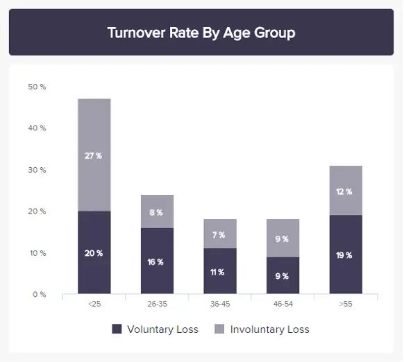
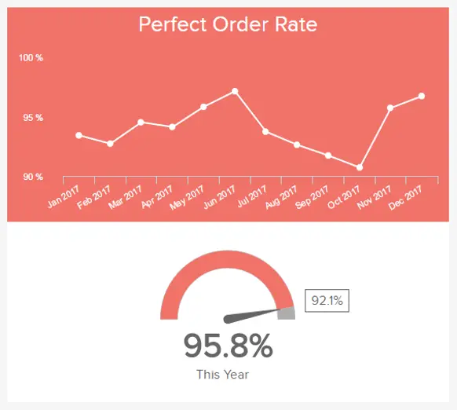
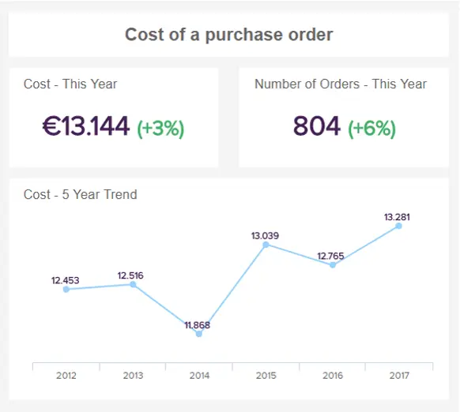
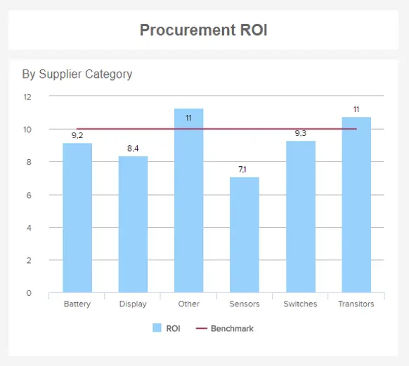

首席运营官 （COO） 肩负着确保公司内部每项运营活动尽可能高效地执行的艰巨任务。

为了帮助您在日益苛刻的环境中实现最大的运营效率，我们将在这里介绍首席运营官仪表板和报告，这些是帮助全球首席运营官有效管理时间、公司、物流流程和结果的关键工具。为了在这样的环境中取得成功，[执行仪表板](https://www.datafocus.ai/infos/executive-dashboards-and-reports)或报告可以产生显着的影响。

提高管理业务运营的战略价值和运营价值是首席运营官职位的关键要素，他们通常需要戴上许多帽子才能成功履行仅次于首席执行官的“第二把手”的角色。

此外，公司正变得越来越数据驱动和复杂，并且需要稳定的性能才能在我们残酷的数字时代取得成功。这就是为什么使用现代[仪表板工具](https://www.datafocus.ai/infos/online-dashboard)对于监控和分析多个接触点以及实时、直观且具有强大交互性水平的数据至关重要，因此任何战略活动都不会被忽视。

也就是说，在这篇文章中，我们将回答什么是 COO 仪表板和报告，将给出一些行业示例，以及一些有关如何创建自己的有价值的提示。

最后，您将能够改进报告流程并自动执行许多您可能手动执行的任务。与使用[CFO 仪表板](https://www.datafocus.ai/infos/cfo-dashboard-kpis-report-template)监控财务信息的 C 级财务官类似，首席运营官需要针对核心接触点的解决方案，使组织运转起来。但是，让我们从头开始并解释基本定义。

让我们开始吧。

您的机会：[想要构建自己的、最先进的 COO 仪表板吗？](https://www.datafocus.ai/console/)试用我们的专业仪表板软件 14 天，完全免费！

## 什么是首席运营官仪表板？

COO（首席运营官）仪表板是 COO 使用的可视化管理工具，用于连接多个数据源、跟踪、评估和使用交互式指标和高级分析功能来帮助优化公司内的运营。

这些数据的可视化表示形式实时提供信息，并创建了一个节省时间的环境，COO 可以专注于其他关键任务，而不是花费大量时间导出和操作静态电子表格。就像现代 CTO 使用专业的[CTO 仪表板](https://www.datafocus.ai/infos/cto-dashboard-report-software-tools)来实时可视化呈现的信息并与之交互一样，COO 需要类似的工具来提高生产力和绩效。这种[实时仪表板](https://www.datafocus.ai/infos/live-dashboards)可确保生产力的提高和集中的数据收集，使管理人员能够克服其工作范围内的众多实际挑战。当您使用（自动）COO 报告和智能警报完成数据管理流程时，任何异常都不会被忽视。

## 什么是首席运营官报告？

COO 报告旨在提供对关键运营 KPI 的见解，并使用现代仪表板[软件通过仪表板](https://www.datafocus.ai/infos/best-dashboard-software-features)、公共 URL、自动电子邮件或嵌入式选项共享它们，以评估相关的运营绩效。

只需单击几下即可轻松创建 COO 报告模板，并且可以重新用于重复报告流程，完全自动化，并使用[自助式数据分析工具](https://www.datafocus.ai/infos/self-service-analytics)等专业解决方案生成。

## 什么是首席运营官关键绩效指标？

首席运营官 KPI 是首席运营官用来评估各个业务领域绩效的指标。借助[KPI 工具](https://www.datafocus.ai/infos/kpi-reporting)，首席运营官可以跟踪、衡量和衡量公司的活动，以确保生产力和运营效率。

通过使用 COO 的交互式 KPI，您可以一目了然地发现大量基于运营的趋势和见解，同时为一致的绩效衡量设置准确的基准。

您可以将交互式关键绩效指标用于各种操作流程，这反过来又可以让您全面了解您的组织如何运作以及如何进行改进。

## COO 仪表板和报告的优势

全面的 COO 仪表板提供了丰富的业务提升优势。在这里，我们从首席运营官的角度看一下使用 COO 报告或仪表板的最大好处。

- 节省时间并做出更好的决策

COO 绩效指标（使数据仪表板栩栩如生的指标）的高度逻辑性和可视化性质意味着您可以比较趋势或模式，并轻松深入了解基本信息。您无需筛选冗长的电子表格或零散的数据源列表，只需登录并几乎立即访问所需的一切。

作为一名运营人员，您必须经常在压力下做出重要决定。通过使用正确的仪表板，您将能够根据业务的每个逻辑方面快速做出明智的选择。

- 发现隐藏的模式和趋势副本

COO 工具为高级决策者提供的另一个关键好处是，它们将帮助您发现数据驱动的模式和趋势，否则您将错过这些模式和趋势。作为直接向首席执行官汇报并通常充当思想领袖或共鸣板的人，有能力降低最终要花钱的低效率并推动创新至关重要。

有了战略仪表板，有价值的趋势或模式将变得更加明显。深入挖掘视觉效果将清楚地向您展示如何改善企业的核心物流领域，同时在任何问题失控之前将其扼杀在萌芽状态。

- 预测未来事件

如果您希望制定可导致组织发展的新战略，利用强大的 COO 报告模板将为您提供可访问的历史、实时和预测见解的全面组合。这种有凝聚力的指标组合将使您能够做出准确的预测，从而帮助您防止浪费时间的组织问题或让您在竞争中占据优势。

例如，如果您注意到您的客户服务流程表现不佳，并且随着查询高峰期的出现，可能会继续苦苦挣扎，您可以在事件发生之前采取行动。例如，查看数据将使您能够了解是否需要提供更好的培训、简化投诉处理程序或雇用更多人。

- 协作与沟通

作为高级运营官，您是公司的领导者之一。因此，以清晰、有说服力的方式传达您的目的和目标至关重要。

使用您的数据仪表板讲述有关业务关键物流方面的可视化故事，您将确保每个人都了解正在发生的事情以及原因。通过这样做，您将提高生产力和参与度，同时为您的员工提供 24/7 全天候访问他们需要的信息工具（跨多种设备），以便进行沟通并更好地执行。当这种情况发生时，组织将蓬勃发展。

您的机会：[想要构建自己的、最先进的 COO 仪表板吗？](https://www.datafocus.ai/console/)试用我们的专业仪表板软件 14 天，完全免费！

## 如何创建COO仪表板和报告？

要创建和组织全面的首席运营官仪表板，需要考虑以下几点，例如您的受众，纳入特定的[运营指标](https://www.datafocus.ai/infos/operational-metrics-and-kpi-examples)和我们在此处列出的其他重要元素：

1\. 利用专业的仪表板软件和工具

由于运营管理存在如此多的复杂性，专业和现代的 COO 报告工具和软件是必不可少的。例如，无论是跟踪仓库运营还是优化物流公司的运输流程，使用户能够创建交互式[物流仪表板](https://www.datafocus.ai/infos/dashboard-examples-and-templates-logistics)的软件对于持续运营成功至关重要。

借助智能 （AI） 警报和功能，简化了自动监控，确保用户在发生异常时立即收到通知。这在任何操作环境中都至关重要，因为没有它，手动工作将比解决方案造成更多的混乱，并增加改进问题解决过程的时间，从而导致额外的瓶颈。

2\. 为您的行业选择最有价值的指标

对于需要强大运营的公司以及那些想要改进当前机制的公司来说，全面了解最重要的指标至关重要。根据公司类型，指标当然会有所不同。关键是要详细考虑每个指标以及您想要传达的故事。例如，仓库运营中的完美订单率 KPI 对于能够建立更好的供应链效率进行监控是有意义的。浏览我们针对所有行业的[KPI 示例](https://www.datafocus.ai/infos/kpi-examples-and-templates)列表，找到与您的运营最匹配的示例！

3\. 与受众建立融洽的关系

知道你在向谁讲话已经做了很多工作。如果您直接向首席执行官或董事会报告，则需要拥有干净、直接和交互式的数据。这样，您可以回答即时问题并更深入地挖掘各种潜在场景。在 C 级会议上，通常会提出和讨论高级指标，因此请尝试将您的首席运营官报告集中在您正在演示的受众上，并专注于会议的主题。用内部团队内部日常运营任务和授权的详细信息来增加听众的负担是没有意义的，但你的努力和对较长时间的分析的结果，在这种情况下，在 C 级会议期间，可能是有意义的。

要了解有关各种高管级别报告的更多信息，我们建议您阅读我们关于[CEO 仪表板](https://www.datafocus.ai/infos/ceo-dashboard-report-examples-and-templates)的文章。

4\. 尽可能自动化

我们已经提到了自动化的重要性，但我们需要再次强调它，因为自动化减少了大量时间，否则会投入到静态电子表格和演示文稿上。通过使用[业务报告软件](https://www.datafocus.ai/infos/business-reporting-software)的强大功能来自动化特定的时间表将有助于任何高级决策者更有效地管理他们的时间。安排某些报告并将其发送给指定的收件人，而无需每周、每月或每年手动创建报告的每个部分，使主管能够整合[现代自动化流程](https://www.entrepreneur.com/article/332361)并将其公司带入未来。并留在那里。

现在，您已经清楚地了解了创建专业的COO仪表板和报告应遵循的步骤，让我们看一些行业示例，以帮助您可视化这些交互式工具的强大功能！

## 顶级首席运营官仪表板和 KPI 提供强大的报告

正如我们已经提到的，首席运营官必须涵盖业务不同领域的多项任务。因此，拥有配备专业操作指标的特定仪表板对于确保正确管理所有区域至关重要。为了正确看待这一点，在这里，我们将向您展示 4 个仪表板示例及其最相关的 COO 指标，涉及首席运营官工作的 3 个核心领域：物流、财务和员工。

### 1\. 物流运输仪表板

运输管理对于在专注于交付货物和产品的运营中取得成功至关重要，尤其是在我们残酷的经济中，客户希望昨天交货。在这里，交互式仪表板将使首席运营官能够有效地管理运输数据。

 在上面的例子中，我们在[物流方面有](https://www.datafocus.ai/infos/kpi-examples-and-templates-logistics)KPI，这对可持续运输管理至关重要，并将帮助C级管理层了解交付和整体运输的运作情况。

也就是说，车队效率等指标将立即显示人员和运输能力水平，而平均装载时间和重量将使您能够评估每吨的装载时间。在一定时间范围内监控这些点将帮助您设置切合实际的时间流程并确定运输组织内的模式。例如，您可以瞄准装载更多和运输更多，但请记住，这可能会导致事故，因此，保持切合实际的目标对于操作和管理您的流程非常重要。

最后，按目的地划分的交货状态和交货情况将显示您的交货是否准时，以及可能导致延迟的原因。在某些情况下，道路可能会被堵塞或其他可能导致滞后的外部因素，尤其是在长途旅行中。定期监控这些过程可以缓解未来的瓶颈。

主要指标：

- 交货时间

交货时间是在物流运输领域跟踪的重要操作指标，因为它可以让您了解您的交货是否正确处理。该指标采用所有订单的平均交货时间，从订单准备发货到实际交货时间计算。运营人员可以从此 KPI 中受益，因为它使他们能够创建狭窄的运输策略，从而为客户提供更好的服务。

- 运输费用

下一个 KPI 旨在监控与物流仓库中的运输相关的所有成本。首席运营官的目标是将成本保持在最低水平，同时保持高质量的服务。为此，该指标将费用分为不同的类别，这样您就可以了解特定阶段的成本是否超过应有的成本，并找到优化它的方法。

### 2\. 财务首席运营官仪表板

企业的财务也是首席运营官需要关注的重要领域。在这里，运营官与首席执行官和首席财务官携手合作，以确保公司的财务状况处于最佳状态。为此，下面的仪表板是一个完美的工具，因为它清楚地显示了确保流动性、发票和预算等方面稳定和主动运营管理所需的所有相关指标。

 更详细地进入这个[财务仪表板](https://www.datafocus.ai/infos/dashboard-examples-and-templates-finance)，我们首先获得当前营运资金的概述，它基本上显示了从当前负债中减去流动资产后获得的美元总额。接下来，我们得到过去 3 年的现金转换周期 （CCC），该图旨在监控公司在将其投资、库存和其他资源转换为现金方面的效率。在这种情况下，CCC自2016年以来一直在不断减少，这意味着该公司正在以有效的方式管理其财务。

在 CCC 下方，仪表板根据 1，3% 的基准率提供了过去 12 个月的供应商付款错误率的详细概述。此 KPI 可以告诉运营人员应付账款部门处理付款的效率。这方面的常见错误可能是重复付款、地址错误，甚至是金额不正确。如果有一个月的错误率真的很高，有必要更深入地寻找原因并解决问题。

如您所见，此 COO 仪表板涵盖了基本领域，如果管理得当，将确保所有财务操作顺利进行。现在，让我们更详细地了解其中的一些 KPI。

主要指标：

- 营运资金

营运资金是金融领域最重要的首席运营官指标之一。此 KPI 衡量将流动资产（可以是现金、应收账款、预付费用等）减去流动负债（可以是应付账款、信用卡债务、税款或未来 12 个月内到期的任何其他债务）后的剩余美元数。营运资金的结果将使高级操作员能够评估公司的短期财务状况及其运营效率。

- 流动比率

流动比率是与营运资金直接相关的运营KPI，因为它主要集中在企业的财务流动性上。简而言之，流动比率衡量您及时偿还债务的能力，它是通过除以您的流动资产和流动负债来计算的。您在这里的目标应该是始终保持比率高于 1，如果它较低，则意味着您无法及时支付债务。此 KPI 对首席运营官很有用，因为它允许他们确保组织始终享有健康的比例。

- 现金转换周期

下一个首席运营官 KPI 模板是有效[财务分析](https://www.datafocus.ai/infos/finance-analytics)的关键。如上所述，现金转换周期旨在评估企业将其所有资源转换为现金所需的时间。它使用以下公式计算：CCC = DIO（未偿库存天数）+ DSO（应收账款周转天数）– DPO（应付应付周转天数）。这里的目标是保持公司的现金转换周期不断缩短，因为这意味着运营和管理过程是有效的。

### 3\. 员工绩效仪表板

虽然财务和后勤是运营人员需要参加的两个核心领域，但真正推动组织成功的是其员工队伍。出于这个原因，运营人员需要确保员工处于最佳状态，并且公司为他们提供成长和改进的工具。为此，员工绩效仪表板是关键。让我们看看为什么！

 有了基本的[人力资源指标](https://www.datafocus.ai/infos/kpi-examples-and-templates-human-resources)，该仪表板将确保员工对他们的工作感到满意，从而发挥最佳表现。此仪表板的顶部告知我们缺勤指标、以天为单位的年平均缺勤率、目标低于 3，8% 的平均比率，最后是过去五年中这两个指标的演变。这是高级决策者需要跟踪的重要指标，因为它将显示员工对工作的参与度和积极性。低缺勤率可能意味着组织能够为其员工提供健康的工作环境。

转到底部，COO 仪表板提供了与员工生产力直接相关的整体劳动效率 （OLE） 的详细视图。为了跟踪 OLE，每个企业都需要根据他们对员工的期望来设定自己的评估标准。在这里，我们看到该指标被跟踪了五年，并按部门划分。跟踪此指标非常有用，因为它将告诉运营人员哪些员工或部门表现不佳，并提供培训机会或其他解决方案来提高绩效。

主要指标：

- 整体劳动效率

OLE 也称为员工生产力，是一个首席运营官 KPI，可提供更全面的员工绩效图景。尽管计算此指标的简单方法是将总销售额除以员工人数，但这可能不是最明智的选择。正如我们之前提到的，并非所有员工的工作都直接涉及销售。因此，应确保定义适当的输出，以根据每个部门的核心职责来衡量其绩效。在上面的示例中，我们看到 OLE 与显示目标 71% 的[仪表图](https://www.datafocus.ai/infos/gauge-chart-examples)一起跟踪 5 年。为了从整体劳动效率中提取更深入的见解，运营人员可以将其与其他可能影响生产力的指标进行比较并得出更深入的结论。这些可能是可用性、员工实际工作的时间以及交付或销售的产品数量等。

- 培训费用

正如我们之前提到的，保持员工的工作效率和满意度是首席运营官的重要职责之一。为潜在的人才或表现不佳的员工提供培训机会是确保每位员工的生产力和健康投资回报的好方法。此外，员工会觉得他们可以在公司成长，并提高他们的满意度。为此，此首席运营官 KPI 旨在跟踪培训员工的成本，比较净成本与回报。通过查看此指标可以轻松验证培训投资是否值得。

- 离职率（奖金关键绩效指标）

虽然它没有直接包含在我们的仪表板中，但这是一个重要的 COO KPI，用于跟踪有效的[劳动力分析](https://www.datafocus.ai/infos/workforce-people-hr-analytics)。员工流动率旨在监控在特定时期内离开企业的员工百分比。通过跟踪此指标，运营人员可以了解公司的保留工作是否成功以及员工是否满意。如果您看到高离职率，您应该更深入地研究根本原因，并找到可能导致您的员工离开组织的任何潜在问题领域。

您的机会：[想要构建自己的、最先进的 COO 仪表板吗？](https://www.datafocus.ai/console/)试用我们的专业仪表板软件 14 天，完全免费！

### 4\. 供应链首席运营官仪表板

供应链正在成为一个越来越数据驱动的物流领域，公司和首席运营官需要考虑优化供应链和货物管理流程。我们的一个例子是在考虑最关键的[供应链 KPI](https://www.datafocus.ai/infos/supply-chain-metrics-and-kpis)的情况下创建的，以帮助您实现目标。

 仪表板从库存与销售比率开始，并评估积压库存。这是一个需要监控的重要指标，因为它将显示您处理意外事件的能力。从本质上讲，它衡量的是与实际销售数量相比的可用销售库存或资产。

仪表板右侧的营业额以 5 年的时间帧显示，以查看更长时期的发展。它衡量股票或资产被出售的次数（在这种情况下，在一年内），建议将这些数字与行业平均水平进行比较，并尝试实现更高的比率。

其他指标将告诉您有关库存管理、存储成本和缺货商品的详细信息。所有这些接触点将帮助现代首席运营官优化运营并为组织提供额外的业务价值。

主要指标：

- 库存准确性

准确性是 KPI 之一，如果管理不当，可能会永久损害您的业务，因为它将直接影响您的客户满意度水平。此指标旨在监控数据库库存与实际实物商品、资产或物品的准确性。如果这两者不匹配，可能会导致意外的延期交货、不满意的客户和更高的总体成本。尽管很难保持 100% 的准确性，但该指标的健康比率是尽可能将其保持在 92% 以上。通过更详细地查看库存准确性，COO 还可以识别与接收、运输或会计相关的潜在问题。

- 库存周转率

该指标旨在衡量您的整个库存在给定时间段内的售出时间。很难为您的营业额定义一个一般基准，因为它将取决于业务行业。出于这个原因，您应该采用您的平均行业费率并将其用作超过的目标。首席运营官可以从监控营业额中受益，因为它可以告诉他们生产计划以及营销和销售管理的效率。这里的最终目标应该是始终保持尽可能高的比率。

- 库存与销售比率

现在我们转向库存与销售比率。该绩效指标衡量待售库存与实际销售量之间的比率。就像营业额一样，您的库存与销售的平均比率将取决于您的业务行业，因为销售牛仔裤比销售汽车更容易。

因此，COO应该通过思考市场来分析它，并在此基础上设定切合实际的目标。该KPI还可以与库存周转率或库存的账面成本进行比较，以更全面地了解企业的财务稳定性并做出相应的计划。

### 5\. 仓库 KPI 仪表板

仓储成本和物流对业务有重大影响。如果没有从头到尾的锋利和完全高效的存储和运输流程，您的企业将在财务和声誉上受到影响。这就是我们的仓储关键绩效指标仪表板的用武之地。

 这个强大的 COO KPI 模板配备了旨在提供顶级见解的平衡指标组合，以清晰、简洁和可访问的方式提供关键信息，例如准时发货、按国家/地区划分的总发货、成本明细和完美的订单率。

在这里，您可以做所有您需要的事情来优化仓储流程的每个阶段，以降低成本并最大限度地提高您的运输成功率。让我们了解一下与我们的仓储仪表板相关的 COO 的 KPI。

主要指标：

- 准时发货

此顶级指标可让您持续了解运输流程的效率。以百分比表示，这条重要信息将告诉您在建议交货日期之前发货的订单与发货总数的比率。通过设置明确的运输基准，您可以跟踪整体“准时”绩效，如果滞后，您可以准确指出问题所在，以提供正确的解决方案。

- 订单准确性

也称为完美订单率，这个引人入胜的视觉效果将向您展示现有供应链的流畅性和可靠性。设置基准后，您可以使用折线图和百分比图查看有多少订单到达目的地，而不会出现任何延迟、问题或事件。

同样，如果您发现任何问题，您可以立即找到问题的核心，并制定战略解决方案，优化您的供应链以获得持续成功。

- 仓储成本

仓储成本可能难以平衡，尤其是在需要考虑如此多的持续费用的情况下。但是，此交互式图表为您提供了与运行有凝聚力的仓库相关的每个核心成本的易于理解的细分。

通过查看此内容，即使快速浏览，也很容易看到您的仓库预算的去向。如果你注意到你的很大一部分开支被投入到一个看起来不成比例的领域（或者，换句话说，你花了很多钱），你可以找出原因并进行掉期、调整或战略更新。

- 出货数量

这个方便的首席运营官KPI提供了按国家/地区的完整发货明细。通过分析这些重要趋势，您可以了解哪些路线需要改进，同时了解在夏季促销、情人节或节日等高峰期可能需要分配更多资源的位置。因此，您将使您的运输流程更加可靠、一致和全面成功。

### 6\. 采购成本仪表板

首席运营官在监督和不断改进采购流程的各个方面方面发挥着至关重要的作用。为了帮助高级物流决策者制定采购策略管理流程，我们开发了一个专用的可视化[采购仪表板](https://www.datafocus.ai/infos/dashboard-examples-and-templates-procurement)。

 这个广泛而有凝聚力的仪表板充当采购神经中枢，帮助首席运营官大规模、快速地深入研究成本和投资回报。为了优化您的采购，迅速而有目的地采取行动至关重要。在这里，您可以实时挑选关键信息，并最终优化采购策略的每个关键要素。

主要指标：

- 采购订单成本

我们的[这一特定采购指标](https://www.datafocus.ai/infos/kpi-examples-and-templates-procurement)将帮助您掌握与企业各种采购相关的成本。在这里，您可以跟踪和衡量特定时间范围内的成本和订单数量，以改善您的采购到付款周期。在这里，您可以根据采购订单所需的时间长度、流程中涉及的人员以及潜在的低效率或错误率来关注提高和处理采购订单的成本。有了这些信息，您将能够降低不必要的成本，同时提高整体购买效率。

- 降低采购成本

简化与有形服务和商品相关的费用是任何现代首席运营官的关键任务。这个最有价值的 COO 指标将帮助您按类别细分持续费用，并为您提供如何降低特定成本的明确方向。

您的成本降低解决方案可能以更换供应商或完全减少某些领域的支出的形式出现。关键是，这个最令人印象深刻的首席运营官 KPI 示例将帮助您在正确的时间做出正确的决策。

- 采购投资回报率

您的采购投资回报率很重要。通过使用公式（投资收益 - 投资成本）/投资成本计算，这个重要指标将根据您的特定基准准确显示您的回报所在。

您的采购投资回报率应保持健康，以确保可持续的业务增长，并通过设定坚实的基准，您将能够采取平衡的方法从采购工作中榨取最后一滴价值。

您的机会：[想要构建自己的、最先进的 COO 仪表板吗？](https://www.datafocus.ai/console/)试用我们的专业仪表板软件 14 天，完全免费！

## 关键要点

首席运营官需要在正确的时间获得正确的信息 - 没有例外，没有妥协。使用正确的仪表板和指标，负责监督运营的人员将获得一定程度的愿景，从而推动业务遥遥领先。

我们通过仪表板和 KPI 示例展示了现代软件和工具的重要性，任何首席运营官都可以使用这些示例来创造自己的物流成功。

使用DataFocus，这可能需要一些时间。借助我们的现代解决方案，您可以构建自己的仪表板和报告，将您的操作任务提升到一个新的水平。最好的部分是 - 我们提供[14 天试用](https://www.datafocus.ai/console/)，完全免费。立即开始，享受您应得的专业和组织成长。
