数据是新的石油吗？不，数据是新的土壤。

人类是视觉动物。视觉的处理速度比任何形式的文本快 60，000 倍，研究表明，65% 的人口由视觉学习者组成。此外，传递到大脑的信息中有90%是视觉的。

将易于理解的文本与醒目的视觉效果相结合，可以最大程度地呈现数据，从而使受众易于理解和保留数据。这个概念是可视化的核心。

最近，数据可视化专家利用人类对美的天然亲和力，将信息与高度美学相结合。当我们[选择正确的数据可视化类型](https://www.datafocus.ai/infos/how-to-choose-the-right-data-visualization-types)时，要考虑的最重要的因素是，您是否为人们提供了查看他们以前从未见过或体验过的见解的机会，否则无法仅用书面文本破译。

有效视觉效果的创造者了解我们人类对视觉效果的倾向，通过添加交互式功能来捕捉想象力，同时以鼓舞人心且易于理解的方式呈现关键见解，从而更进一步。通过在感兴趣的数据点上滚动、单击和移动光标，设计人员可以在更深层次上吸引用户，使他们能够成为参与者而不是单独的查看者，从而为[数据发现](https://www.datafocus.ai/infos/what-are-data-discovery-tools)学习过程增添更多意义。

研究表明，那些遵循带有插图的指示的人比那些只遵循文本指示的人的效率高323%。为了演示，我们将重点放在全球 24 个最佳数据可视化示例上。无论是静态仪表板还是[交互式仪表板](https://www.datafocus.ai/infos/interactive-dashboard-features)，这些创意数据可视化示例都将为任何数据爱好者提供灵感。一旦我们展示了我们的示例，我们将回顾一下图形的起源，并探索为什么它在今天比以往任何时候都重要。

## 数据可视化的优势

在我们深入研究鼓舞人心的交互式数据可视化和静态示例之前，我们将研究采取主动的主要好处：

- 更快的行动：如前所述，人类大脑处理视觉信息的速度比基于文本的信息更快，这意味着您的利益相关者 - 内部 - 或您的潜在客户 - 外部 - 将能够消化新的见解并对其采取快速，积极的行动。
- 查找连接：通过以鼓舞人心的可视化格式显示数据，将更容易发现相关性并找到运营与整体商业绩效之间的联系。因此，您可以开发一份[管理报告](https://www.datafocus.ai/infos/management-reporting-best-practices-and-examples)，使您能够获得所需的见解，以做出对业务产生积极影响的更改。
- 新兴趋势：通过策划[数据仪表板](https://www.datafocus.ai/infos/data-dashboards-definition-examples-templates)并以可视化方式呈现它们，您更有可能发现可用于发展工作的市场趋势，同时提高盈利能力并获得优于竞争对手的优势。
- 新鲜的讨论：使用视觉效果最有益的元素之一是，它允许您用您的见解讲述故事，从而更深入地钻取到特定的数据段。通过利用您自己的[仪表板讲故事](https://www.datafocus.ai/infos/dashboard-storytelling-with-kpis-presentation-examples)工作，您将能够根据业务的增长、发展和方向发现新的见解并引发新的讨论。此外，通过使用鼓舞人心的信息图形，您将在更深层次上吸引目标受众，鼓励在线讨论，从而提高品牌知名度，扩大您的影响力，并帮助您将自己定位为您所在领域的思想领袖。

您的机会：[想要测试功能强大的数据可视化软件吗？](https://www.datafocus.ai/console)享受 14 天免费试用，立即开始生成令人惊叹的视觉效果！

## 我们的 24 大最佳数据可视化

现在我们已经概述了明确的好处，让我们探索来自世界各地专家的 24 个最佳数据可视化示例。

### 1） 透明国际

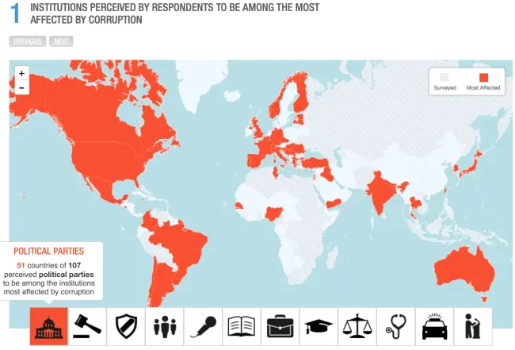

我们的第一个交互式数据可视化示例是这个干净、简单的交互式图表，它显示了透明国际腐败调查数据的结果。粗体红色使结果立即弹出。此视觉对象使用图标而不是文字来传达调查中包含的不同部门，使演示文稿在视觉上非常吸引人。透明国际向观众展示了该国的地理位置与腐败类型之间的关系，让观众得出自己的结论。

### 2）嘻哈中最大的词汇量

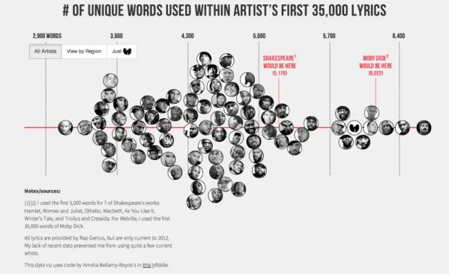

完善我们的清单并非易事。我们没有选择超级有用的，而是选择了最有趣的：马特丹尼尔在嘻哈中最大的词汇。马特解释说：“文学精英喜欢重复莎士比亚的词汇：在他的整个语料库中，他使用了28，829个单词，这表明他知道超过10万个单词，可以说是有史以来最大的词汇量。我决定将这个数据点与嘻哈界最著名的艺术家进行比较。我使用了每位艺术家的前35，000首歌词。这样，像Jay-Z这样的多产艺术家就可以与德雷克等新艺术家进行比较。虽然结果可能会让您感到惊讶，但它提醒您，一个好的[在线数据可视化工具](https://www.datafocus.ai/infos/data-visualization-tools)不仅仅是呈现信息——它讲述了一个故事。

### 3） 自拍 – 自拍的科学

该项目正在研究人们在地球不同地区拍摄自画像的方式 - 已经分析了来自柏林，纽约，曼谷，圣保罗和莫斯科的120，000多张自拍照。女性比男性更容易自拍吗？比例是多少？人们会微笑、歪头还是裁剪图片？所有这些问题都得到了解答，结果显示在制作精良的交互式可视化示例中。研究的复杂性和发现的见解使得暴露结果成为一个真正的挑战，他们很好地解决了这个问题，创建了像这样的酷数据可视化。

### 4）皮内拉斯县公立学校对黑人学生的不平等

另一个例子描绘了佛罗里达州皮内拉斯县学校日益隔离与学生表现不佳之间的联系。可视化显示《坦帕湾时报》根据佛罗里达州教育部和皮内拉斯县学区收集的数据进行的调查结果。结果非常准确和清晰。他们揭示了皮内拉斯县 150 所小学中的 5 所，学生的表现异常低。表现不佳的学校位于社会隔离程度最高的黑人社区地区。这些见解可以促使当地决策者和社会活动家更好地照顾陷入困境的机构并引入改进措施。

用户滚动而不是单击以查看图表更改并逐步跟踪调查。滚动操作是新用户最喜欢的，特别适合移动用户。在Facebook，Instagram或Twitter上，我们滚动浏览流和内容流。滚动会让用户参与更长时间，并且很难移开视线。视图可以轻松地从一个图表转换到另一个图表，使故事易于理解，并使数据本身成为屏幕上视图的中心。收集的数据和结果复杂且多产，这使得这些数据可视化成为一个真正的挑战，但他们管理得非常好且易于理解，我们认为它是我们遇到的最好的交互式数据可视化之一。

### 5）第一个解决致命威胁的数据可视化

霍乱是一种小肠细菌感染，导致受害者患有如此严重的腹泻和呕吐，以至于他们可以在两小时内死亡。在一半未经治疗的病例中，这是致命的。当这种疾病于1832年到达伦敦时，人们认为它是通过大气中的“瘴气”或难闻的气味传播的。在接下来的二十二年里，伦敦爆发了四次重大霍乱。

正是在第四次流行病期间，约翰·斯诺医生开始认为空气污染的论点似乎站不住脚。伦敦人从污染严重的泰晤士河中获取饮用水，泰晤士河也是该市的污水管道。斯诺博士假设霍乱是通过摄入受污染的水传播的。1854 年 8 月 31 日，“斯诺博士后来称之为'王国有史以来最可怕的霍乱爆发'爆发了。它既猛烈又突然。在接下来的三天里，居住在布罗德街或周围的127人死亡。

斯诺博士着手追踪人们死亡的地方和附近的水源。他的地图不仅解决了霍乱的来源，而且是最早（也是最著名的）可视化之一。斯诺博士只是在地图上画了一个点，以指示人们死于霍乱的地方。他发现几乎所有的死亡都发生在离布罗德街水泵不远的地方。人们发现，“在离另一个水泵更近的房屋中[，](http://www.ph.ucla.edu/epi/snow/broadstreetpump.html)只有10人死亡 - 其中五名受害者总是喝宽街水泵的水，三名是学童，他们可能在上学的路上喝了水泵。

还有其他几个异常现象有助于证明他的理论。附近有一个水泵，530名居民中只有五人感染了霍乱 - 事实证明他们有自己的井。附近一家啤酒厂的七十名员工毫发无损地度过了疫情;他们得到了免费的啤酒，没有打扰饮用水。当斯诺博士收到一名没有去过SoHo地区的妇女死亡的警报时，拼图的最后一块出现了。当死者的儿子告诉他，他的母亲非常喜欢宽街井水的味道，以至于她每天都有一个仆人去取水时，他知道他的假设得到了证实。伦敦的其他人花了数年时间才相信他。

### 6） 世界沙平

Worldshapin是世界上最独特的交互式数据可视化之一。该[仪表板创建者](https://www.datafocus.ai/infos/dashboard-creator)为不同国家/地区获取了几个发展因素，并以奇怪但有趣的方式对其进行了比较。可以通过在时间轴上拖动光标来操作屏幕上的颜色编码形状，直观地表示不同国家或地区随时间推移所经历的变化。这个易于使用的图表很有见地，并以全新的方式呈现数据，让用户通过互动可视化国家之间的差异。

### 7）欧洲人口增长和下降的地方

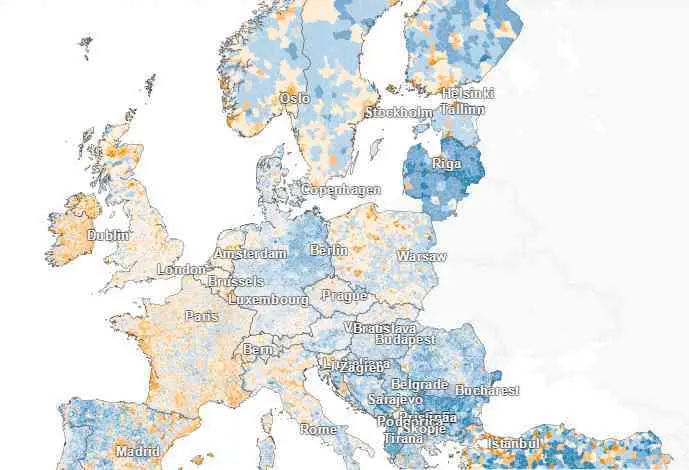

在我们选择的各种交互式数据可视化示例中，当涉及到它处理的大量数据时，这很有趣。柏林晨邮报的EuropaKarte是一张详细的地图，为观众提供了有关欧洲人口增长和下降的详细见解。国家分为与城市等地理位置相对应的字段，甚至是居民少于 5.000 的村庄。田野的颜色和强度各不相同，鲜艳的橙色象征着最大的增长，深蓝色象征着最大的下降。白色表示没有变化。当您将光标移到选定的地理字段上时，您将看到一个弹出窗口，其中包含数据，包括单位名称、居民人数和增长/下降率。

您还可以在搜索框中键入您感兴趣的位置的名称并轻松找到它。此外，您可以使用其中一个过滤器来查看欧洲或德国哪些城市以最快的速度增长/下降，或者查看总人口增长/下降最快的国家/地区列表。最后一个过滤器将按降序显示列出的每个国家/地区的出生率。这种交互式信息图完全符合由DataFocus和其他一些可视化[分析软件](https://www.datafocus.ai/infos/visual-analytics)提供商提供的地理地图可视化的当前趋势。

### 8） 新闻地图

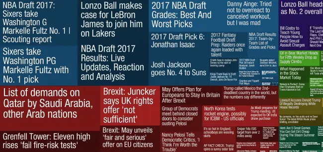

你是新闻迷吗？此应用程序将Google新闻的头条新闻组织成颜色编码的类别块。每个故事的大小取决于每个新闻集群中存在的相关文章的数量，因此用户可以快速识别获得最多报道的故事。用户还可以按国家/地区和类别过滤新闻，从而轻松找到对他们很重要的故事。

### 9） 柏林交通的交互式实时地图

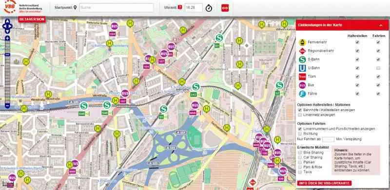

另一个很好的实时数据可视化示例实时显示了火车、电车、公共汽车甚至渡轮的位置和运动。如果你想从更远的距离看整个城市，图形不会有太大用处。你只会看到几十个迹象像愤怒的蚂蚁一样蜂拥而至。要充分了解此地图的实用性，您应该使用其中一个过滤器 - 您可以向下钻取到街道地址、通信方式、线路、站点或车站以获得更清晰的图片。

此外，如果放大，您还可以看到出租车、汽车共享、自行车共享和停车场。如果您仍然没有留下深刻的印象，请单击图标。如果单击停车场上的 P，将显示弹出窗口，其中包含更详细的见解，例如空位数量或价格。另一方面，如果你点击，比如出租车，你会看到汽车制造，相应地：公共汽车 - 整个时间表，公共汽车站也是如此 - 每条公共汽车线路的时间表都停在那里。

根据覆盖柏林和勃兰登堡联邦州的公共交通管理局VBB（Verkehrsverbund Berlin-Brandenburg）的说法，该图形不能100%精确地反映公交车位置，因为数据不是来自GPS，而是根据时间表计算的。因此，用户可能会等待，冻结在火车站，期望火车到达，但它不会出现。但是，如果火车被取消或严重延误，那么它将被从系统中取出。这种时间表的附加价值在于它可以一目了然地显示多个信息，以便您可以决定哪种交通工具最适合您。唯一的缺点：到目前为止，移动应用程序仅适用于Android系统。

### 10）黎明墙

黎明墙是《纽约时报》关于加利福尼亚州优胜美地国家公园惊人的19天自由攀登的最佳交互式数据可视化。汤米·考德威尔（Tommy Caldwell）和凯文·乔尔森（Kevin Jorgeson）是有史以来第一个在El Capitan大部分光滑的花岗岩表面完成令人叹为观止的攀登的冒险者，该洞穴被广泛认为是地球上最困难的自由攀登。自由攀登意味着绳索仅用于接住登山者的跌倒，而不是帮助攀登。视觉效果补充了故事，有机地编织到叙事中，并帮助用户描绘这个冒险的规模。

### 11） 通用电气

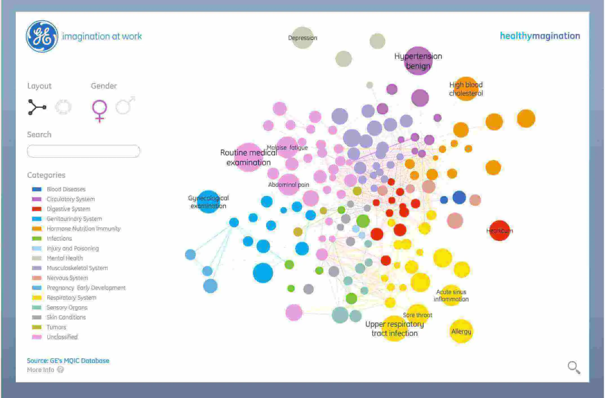

虽然乍一看，这种健康信息景观似乎势不可挡，但再看一眼就会发现它值得它提供的大量信息，使其成为我们迄今为止看到的最有效的数据可视化示例之一。通过从超过 720 万份电子病历中收集数据，通用电气创建了一个关于健康症状流行和通常相互关联的症状的有趣演示。凭借令人愉悦的色彩和多种查看关系的方式，这使得观察不愉快的症状非常愉快。

### 12）巨无霸指数

由《经济学人》推广的巨无霸指数比较了不同国家麦当劳餐厅的巨无霸汉堡的价格。为什么选择这种特殊的产品？巨无霸汉堡代表了一种标准化产品，包括来自各个领域的投入成本，例如农产品（牛肉，面包，生菜，奶酪），劳动力（蓝领和白领工人），广告，租金和房地产成本，运输等，因此代表了当地经济的总体状况。

巨无霸指数是一个实时数据可视化示例，显示货币是否处于“正确”水平。它基于购买力平价（PPP）理论，即从长远来看，汇率应该趋向于平衡任何两个国家相同一篮子商品和服务（在这种情况下是汉堡）价格的汇率。例如，2015年7月欧元区巨无霸的平均价格按市场汇率计算为4.05美元，而在美国为4.79美元。这意味着欧洲的巨无霸被低估了4.4%。

底部的散点图显示巨无霸的当地价格（以当前基础货币表示）与该国家/地区的人均 GDP 的比较。当您将光标移到各个数据点上以获取详细信息时，您将看到人均 GDP 和以所选货币表示的巨无霸价格等见解。当您单击特定国家/地区时，散点图将被折线图取代，该折线图显示所选国家/地区相对于当前基础货币的低估或高估。

### 13）日常仪式展示了标志性名人的日常生活

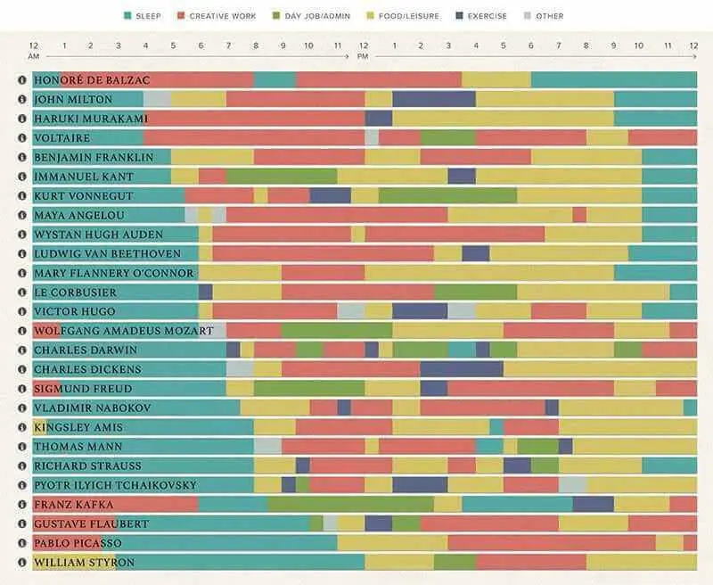

事实证明，所有伟大的思想家的想法并不完全相同，这在这个例子中得到了巧妙的展示，它使用了梅森·柯里（Mason Currey）的《日常仪式》（Daily Rituals）一书中的关键见解。为观众提供一些历史上最多产的创造性思维的日常习惯、仪式、追求和优先事项的详细反映，包括本杰明富兰克林、玛雅安吉洛和弗朗茨卡夫卡等人，日常生活是我们列表中最有趣的数据可视化示例之一。

通过使用简单的颜色编码条形图格式，Daily Routines 的创建者使观众可以轻松比较这些标志性创意天才的日常生活、习惯和仪式，并深入了解帮助这些人在一生中茁壮成长的追求，同时相互比较。

简单、醒目、有效和信息丰富，这无疑是现存最好的数据可视化示例之一，它的信息既引人入胜又信息丰富，为优化我们的日常生活以增强成功提供了关键见解。

### 14）感恩节航班在谷歌趋势上的可视化

毫无疑问，感恩节是美国最广泛庆祝的年度假期之一，仅去年一年就有5430万人在全国各地旅行，与亲人共度时光。

早在 2015 年，当大约4630 万人在感恩节旅行时，科技巨头谷歌利用其内部人才创建了我们迄今为止见过的最好的交互式数据可视化示例之一。由 Google 趋势提供支持，这篇美学上令人惊叹的互动内容提供了感恩节前一天往返美国和穿越美国的航班的一瞥。不仅每个航班都由航空公司进行颜色编码，而且这种简短的电影风格的可视化将基于航班的指标转化为一件艺术品，展示了每个航班的运行路径。

除了时间之外，无需显示任何数字或航班指标，观众可以看到一天中的哪些航段在不同类型的航班中最受欢迎——这证明了有效数据可视化的价值。

### 15）洞察“为什么公共汽车堆”

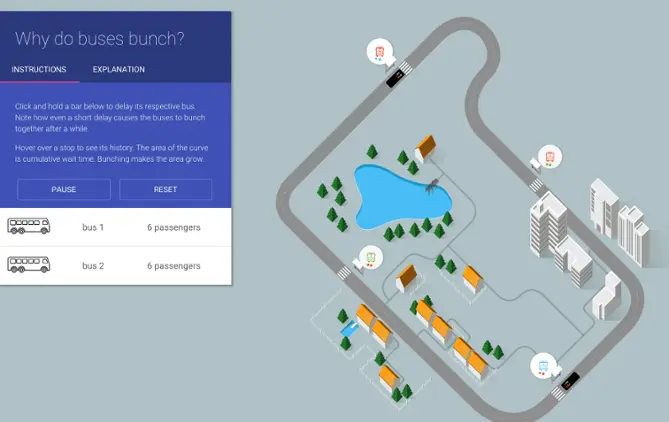

在考虑最佳的交互式数据可视化时，不可能从濑户佐排除这种创作。为了向旅行者展示为什么公共汽车“成堆”，或者换句话说 - 为什么服务经历延误或中断，导致几辆公共汽车同时到达一个公共汽车站，该公司开发了这个几乎像游戏一样的交互式数据可视化，由复杂的数据集组成。

在意识到用数字讲述故事会很混乱且远没有吸引力时，Setosa让轮子运转起来，产生一种视觉效果，使用这些数据让用户有机会造成延误并观看场景的发展，同时深入了解有多少乘客受到中断的影响。

数字指标的一个光荣示例，它转变为每个人都可以访问、引人入胜和信息丰富的内容。

您的机会：[想要测试功能强大的数据可视化软件吗？](https://www.datafocus.ai/console)享受 14 天免费试用，立即开始生成令人惊叹的视觉效果！

### 16） 实时互联网

你有没有想过有多少人和你同时使用互联网？答案是50.3 亿，分布在全球 11.4 亿个网站上。这些是巨大的数字，仅通过阅读它们很难掌握。考虑到这一点，Betfy创建了一个交互式可视化，让您在第二秒内对互联网上发生的一切有一个图形概念。涵盖不同的社交媒体平台和热门网站。

虽然视觉对象旨在实时显示互联网如何工作的想法，但其中呈现的数据实际上并不是实时发生的。实际上，您看到的是大量数据源的汇编，这些数据源已被秒分解，以掌握互联网上每天发生的事情。使用此工具可以轻松了解世界各地在线活动的规模。这也可以适应小时、天或月，具体取决于用户想要看到的内容。

### 17） COVID-19 指数传播的交互式可视化

COVID-19大流行使整个世界陷入恐惧和不确定性，可能比我们在过去几十年中经历的任何其他事件都要严重。由于这种疾病的未知性质，各种组织创建了数据系统，以使公众了解世界各地的感染情况。然而，其中许多系统只是更难理解和探索的图像。考虑到这一前提，计算机科学教授Wade Fagen-Ulmschneider创建了DIVOC-91，该项目以互动且易于探索的方式展示了COVID-19的全球传播。

使用来自约翰霍普金斯系统科学与工程中心的数据，这种交互式数据可视化提供了您可以想象的有关 COVID-19 传播的所有信息。该图表可以按多种因素进行过滤，包括国家、时间和规模，以及新病例、疫苗接种、总死亡人数等。在其众多交互功能中，此视觉对象允许用户将鼠标悬停在任何数据点上以查看其背后的内容，对整个图表进行动画处理以查看信息自动展开，并使用所选信息生成报表。这绝对是一个很好的例子，说明如何以有趣、智能和有吸引力的方式呈现大量数据。

### 18）美国如何发电

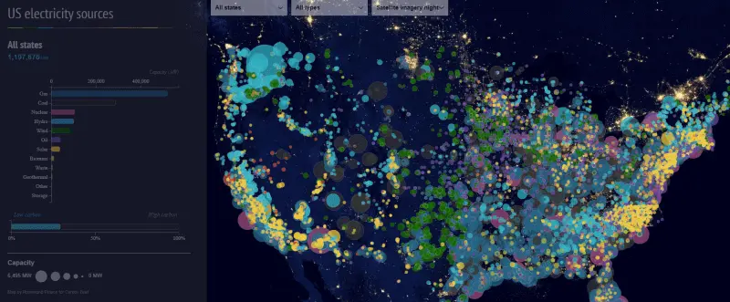

随着气候变化成为公众辩论的中心，越来越多的人对基本资源的生产方式感到好奇。其中之一是电。在这方面，美国的电力系统通常被称为“世界上最大的机器”，我们的下一个示例在非常互动的地图中解释了原因。

气候变化网站Carbon Brief发布了一张图表，显示了美国不同的电力来源，以及每种电力来源的使用和生产方式取决于各州。与此配对，地图还可以细分为高碳来源，如煤、石油和天然气，以及低碳来源，如风能或太阳能。

这是我们的交互式数据可视化示例之一，有助于告知公众电力生产的真实状态以及在更有意识的选择方面取得的进展。如果您想查看地图的实时版本以及具有深刻发现的文章，请单击上面的图像。

### 19）世界各地的灯塔地图

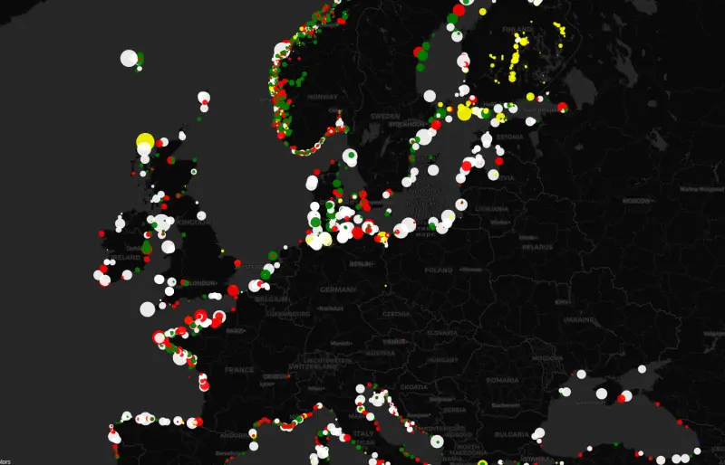

正如您在整个列表中看到的那样，有一堆交互式数据示例为我们提供了各种有用和有趣的信息。我们的下一个视觉效果是一张非常酷的地图，显示了全球各地的灯塔。现在，你可能会想，灯塔有什么有趣的地方？事实上，遍布全球的 23.000 座灯塔以其强大的灯光、不同的颜色组合和频率保护海上交通。

这个特别有趣的视觉效果是由荷兰格罗宁根大学的空间专业知识中心Geodienst创建的。通过从一个名为OpenSeaMap的开源数据库中获取航海数据，这些专家创建了一个地图，复制了数千座灯塔的颜色和频率，这些灯塔每天引导船只穿越公海。如果你去地图的实时版本，通过点击上面的图像，你可以看到不同的颜色和灯光在不同的地区变化。

### 20）跟踪海洋清理的交互式地图

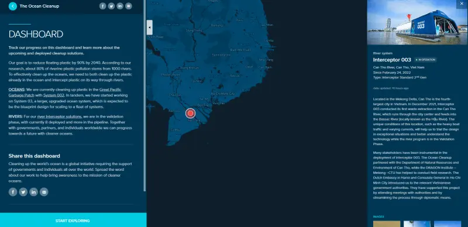

清洁海洋是许多个人和大公司在过去几年中非常认真对待的任务。其中一项举措包括海洋清理，该项目旨在到2040年从海洋中清除90%的漂浮塑料，并成为“历史上最大的清理”。

随着成千上万的人关注这一倡议，为了提高人们对这一主题的认识，海洋清理团队求助于交互式数据可视化技术，以地图的形式生成一个仪表板，用于跟踪任务的进度。访问仪表板时，用户只需单击荧光笔点即可查看在该特定区域完成的工作、流程图片、有关所用技术的信息以及它的经济影响。这是了解和参与这一全球问题的好方法。

### 21）你在政治光谱中的位置

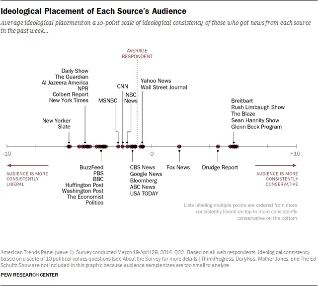

皮尤研究中心（Pew Research Center）的一个值得注意的数据可视化示例，这张出色的静态图形展示了当前的政治光谱，并帮助读者决定与不同媒体、节目和出版物的想法、观点和偏好相比，他们的个人意识形态在哪里。

不仅餐桌式视觉整洁、专业、易消化;它采用一组特定的指标，并通过允许用户确定他们的信仰与他人相比的位置来提供大量的个人价值。

### 22） 密度设计的世界语言图形

这是我们最好的数据可视化的倒数第二个，这个来自密度设计的耸人听闻的图形提供了一种快速、简单和引人入胜的方式来理解地球上存在的语言数量、在哪里使用它们，以及谁在世界的不同地区说这些语言。

此数据可视化示例专为非语言学家制作，易于导航且易于分解。它提供了一定程度的见解，可以激发、教育并为那些在许多领域和行业中研究语言的人提供非常有用的资源。令人印象深刻且富有创意的可视化壮举。

### 23）查尔斯·约瑟夫·米纳德，拿破仑入侵俄罗斯

接下来，在我们最好的数据可视化概要中，我们将在几百年后回顾拿破仑入侵俄罗斯。由土木工程师查尔斯·约瑟夫·米纳德（Charles Joseph Minard）于1892年起草，这可能是最早记录的数据可视化示例，也是迄今为止最好的可视化示例之一。

这种信息图表风格的可视化不仅以易于理解的格式提供了重要的见解，而且这个古老而有效的数据可视化示例证明了我们作为人类是真正的视觉生物。开创性的视觉效果被许多人视为“有史以来最伟大的统计图形”，虽然这种说法是主观的，但它简直是鼓舞人心的。

结合六个不同的数据集 - 地理，战略运动，方向，剩余士兵数量，温度和时间 - 这个标志性的可视化提供了对拿破仑进军俄罗斯的切实见解，为后代探索的重要历史时刻永垂不朽。

### 24） 气候影响图

最后但并非最不重要的一点是，在我们的交互式数据可视化示例列表中，我们还有另一张地图来跟踪全球气候变化的影响。正如您在此列表中的其他一些相关示例中所看到的那样，气候变化是全球关注的话题，正在引发许多行业的对话。鉴于信息是进行更改的关键，像这样的地图被证明是最有价值的交互式数据可视化解决方案之一。

该视觉效果由气候影响实验室创建，其任务是展示气候变化造成的损害，并有望在未来几年继续造成损害。该图形可以通过一年中的平均温度以及世界和美国的历史和未来情景进行过滤。

## 当今的数据可视化：为什么重要

良好的可视化在业务中尤为重要，因为必须快速分析大量数据或以清晰且可操作的格式呈现。仅靠数字行并不能创造一个足够吸引观众注意力的故事。目标始终是使你的论点背后的数据看起来足够有吸引力，以说服决策者或启发你的团队成员。借助易于使用的交互式[数据可视化软件](https://www.datafocus.ai/infos/data-visualization-tools)，越来越多的公司可以自行创建引人注目的可视化。交互式界面使非技术用户甚至可以创建可操作的图表。

您选择的可视化类型由您要传达的信息类型指导。当既不需要也不需要备用视图以及发布到静态媒体（如打印）时，固定图像是理想的选择。动态的交互式可视化效果更适合让人们自己探索数据。两者都有其优势。在创建一个时，目的应该始终是产生一定程度的兴奋和与观众的参与，因为它是最好的可视化。

## 交互式数据可视化：对我有什么好处？

结合时间和运动，帮助观众理解

交互层使您的受众能够直接与您的数据连接，并提供第二个轴来跟踪随时间变化的信息。著名数据科学家汉斯·罗斯林（Hans Rosling）和可视化Ted Talker是将时间显示为图形运动的大力支持者。观看此视频 - 统计的乐趣 - 一个完美的例子，说明如何将时间与可视化相结合，使观众能够看到趋势。

向下钻取以从数字中提取含义

我们在所有内容营销中看到的一个趋势，而不仅仅是可视化，是个人关注。内容不再是从定制白皮书到交互式电子书的通用解决方案。交互式可视化使您能够通过提供向下钻取数据的功能来接触不同级别的受众。该主题的新手仍然可以发现趋势并学习基础知识，而该领域的专家可以更深入地钻取数据以获取更多见解。

参与，参与，参与

内容营销具有竞争力。在听到你之前有很多噪音需要推动。最好的交互式数据可视化是进入聚光灯下的门票。让我们以《今日美国》的互动故事“流血事件背后”为例。大规模杀戮主导着美国媒体。作为报纸，您如何与主要主要渠道竞争？美国加大了这件作品的赌注，特别是交互式数据可视化，使观众能够深入了解大规模杀戮的时间线以获取细节。这件作品内容丰富、力量大、感人心长。

我们选择上面的最佳可视化示例展示了创造性、创新性的飞跃，这些飞跃说明了我们查看和解释数据的方式不断变化。

一切都在变得个性化。人们希望看到他们如何融入大局，以及他们在不断变化的地形上所处的位置。实时可视化示例或一些最好的交互式可视化以两种方式回答了这一需求：让查看者控制他们所看到的内容，并让他们将数据缩小到他们的个人情况，无论是年龄、位置、收入还是其他因素。

这是数据个性化新阶段的开始。代替抽象的标题和通用声明，读者将能够将自己投射到数据集中。使用正确的工具，您只需单击几下即可自行为您的业务准备最佳的交互式数据可视化，并且无需高级 IT 技能。

“可视化为你提供了你不知道的问题的答案。”

您的机会：[想要测试功能强大的数据可视化软件吗？](https://www.datafocus.ai/console)享受 14 天免费试用，立即开始生成令人惊叹的视觉效果！

总而言之，以下是最佳数据可视化示例：

- 透明国际
- 嘻哈中最大的词汇
- 自拍 – 自拍科学
- 皮内拉斯县公立学校对黑人学生的不平等
- 第一个解决致命威胁的可视化
- 世界沙平
- 欧洲人口增长和下降的地方
- 新闻地图
- 柏林交通的交互式实时地图
- 黎明墙
- 通用电气
- 巨无霸指数
- 日常仪式展示标志性名人的日常生活
- 感恩节航班在谷歌趋势上的可视化
- 洞察“为什么公共汽车会堆”
- 实时互联网
- COVID-19指数传播的交互式可视化
- 美国如何发电
- 世界各地的灯塔地图
- 交互式地图跟踪海洋清理
- 你在政治光谱中的位置
- 密度设计的世界语言图形
- 查尔斯·约瑟夫·米纳德，拿破仑入侵俄罗斯
- 气候影响图

您可以通过探索我们的软件开始可视化您自己的数据，以获得[14 天的试用](https://www.datafocus.ai/console)期 - 完全免费！
