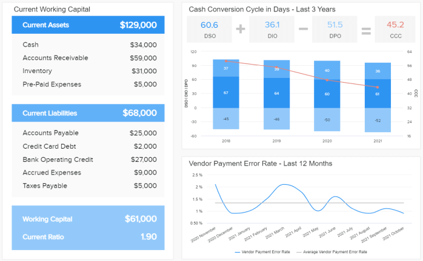
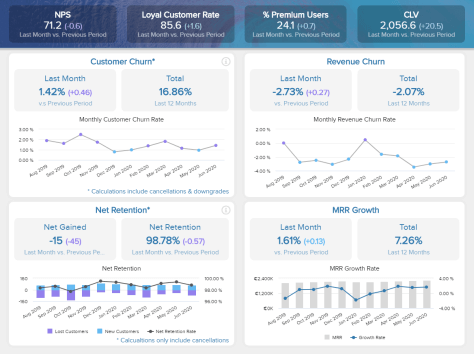

在当今数据驱动的时代，不利用数据力量的企业只会落后。为了获得如此渴望的竞争优势，公司需要实施和投资流程和工具，通过让所有员工参与流程来有效管理数据。这就是在线报告出现的地方。

在线报告是业务主管和决策者分析和监控他们的数据的过程，以提取可操作的见解，然后显示在交互式仪表板和在线环境中的报告中。这一切都可以在专业的在线报告工具的帮助下实现，因为这些类型的解决方案通过交互式报告软件功能帮助 KPI​​ 驱动的公司有效地管理他们的数据。

现代在线报告软件为用户提供了许多好处和功能，包括：

- **SaaS 环境：**在线报告工具已成为企业目前投资的一些最重要的软件。如今，产生的海量数据比以往任何时候都多，这增加了大多数组织对能够理解这一点的智能软件的需求大量的数字和数字，并将数据转化为支持决策过程的战略见解。多亏了 SaaS，24/7/365 访问报告和数据的可能性，通过公共 URL 或查看器访问轻松共享在线仪表板，已成为当今商业环境中的宝贵资源，而在线方面提供了这一点——增加超越竞争对手的优势以及产生即时洞察力的可能性。
- **易于处理：**我们的现代商业时代及其每分钟产生的数 TB 数据为[在线数据分析工具](https://www.datafocus.ai/infos/data-analysis-tools)铺平了道路——随着软件即服务解决方案的增长并没有放缓，公司的要求越来越高。最先进的在线报告软件具有易于理解且从一开始就非常易于操作的巨大优势。除了简单之外，它们的在线特性还提供了其他传统报告工具无法提供的难以置信的灵活性，这是当今很少有公司会错过的奢侈品。
- **云存储：**完整的在线报告引擎将为您提供可视化数据的优势，创建令人惊叹的演示文稿，提高生产力，同时使用最少的内存或处理器使用。使用基于云的在线报告工具，您无需担心会弄乱您自己的存储空间。它应该易于使用，能够根据您自己的业务需求和目标进行定制，并为可持续业务发展奠定基础。
- **人工智能和预测：**与所有标准数据管理功能相结合，复杂的报告工具需要通过先进的选项让您更进一步，例如用于趋势识别和预测的智能数据警报和预测分析等人工智能技术。所有这些功能将确保没有任何信息未被利用，并将使您的分析过程超越标准图表和图形，从而获得强大的业务促进洞察力。
- **嵌入式或实时仪表板：**在线报告工具最有价值的功能之一是其多功能性。使用[仪表板创建者](https://www.datafocus.ai/infos/dashboard-creator)创建报告后，您可以通过自动电子邮件报告共享它们，通过生成的 URL 实时查看它们，该 URL 可以受密码保护以提高安全性，或者您也可以通过框架。几个白色标签和设计选项使您能够根据您的个人业务需求个性化您的报告。
- **适合所有人：**在线报告生成器应该非常复杂，并与各种规模的企业合作开发。适用于任何类型的业务并提供强大的数据分析和报告功能，使经理和其他利益相关者能够做出明智的决策，以推动组织向前发展。从盈利能力报告到[在线仪表板](https://www.datafocus.ai/infos/online-dashboard)，这些解决方案让所有员工都能深入了解其组织的状态，促进部门间协作，并使企业中的每个人都能从专业报告中受益。在线报告工具有助于无缝生成和分析复杂的报告，无需特殊培训，从而实现更好的管理、决策和更快的响应。

在线报告工具对于为公司中的每个人提供正确的信息并让他们做出更好的业务决策至关重要。使用 datafocus 可以在瞬间完成。您可以先使用我们的数据报告工具分析您的数据以获取您需要的信息。通过我们方便的拖放界面，您可以在眨眼之间创建令人惊叹的图表和图形。使用我们现成的仪表板模板构建实时报告，每个模板都具有特定功能，提供更多自定义选项。您还可以使用我们的高级 SQL 查询框进行自己的数据分析并生成这些报告，以获得更高的灵活性：手动输入代码，执行跨数据库查询并立即将结果可视化。然后，您可以与您想要的人分享您的报告并一起处理他们，在您的团队中培养协作环境，同时避免报告重复的噩梦和同步问题。最后，您可以发送您的[业务仪表板](https://www.datafocus.ai/infos/dashboard-examples-and-templates)直接发送给您选择的收件人，以使他们始终保持最新状态。

### 为什么需要专业的报告工具？

报告工具用于生成和呈现数据，通常作为[在线 BI](https://www.datafocus.ai/infos/online-bi-tools)软件中的应用程序，使用户能够通过交互式可视化找到有用的信息。它们的灵活性通常可以轻松访问定义、编辑和设计自定义报告。专业的在线报告工具具有高效生成和评估业务数据的优势，因为当今的公司必须比以往更快地做出决策，并且为了做出良好的业务决策，拥有强大的在线报告工具非常重要，这将有助于获取正确的信息快速找到合适的人。没有真正[的自助式 BI](https://www.datafocus.ai/infos/self-service-bi-tools)工具，公司可能需要几个小时甚至几天才能从他们的数据中获取正确的信息，而这项工作很可能由 IT 专家完成。在一个屋檐下收集所有数据的潜力是非常宝贵的商业行为，可以创造新的收入机会并减少运营混乱，同时提高生产力。

应该从一开始就构建在线报告软件，以使报告协作变得容易并促进您的工作，而不需要一套特殊的技能或 IT 知识来使用它。您只需登录，连接您想要使用的数据源，开始分析数据，您的在线报告就可以使用了。不需要复杂的配置，也不需要定期维护、补丁更新或升级。可以从任何设备（包括移动设备）访问您的工具，让您有机会在正确的时间做出正确的决定。

此后，您将找到有关为什么需要专业报告工具的摘要：

- **节省宝贵时间：**报告工具让您成为自己的数据管理员。传统上，IT 部门是组织内满足在线报告和分析请求的派别；然而，随着企业在这个数字时代创建的大量数据，手动分析已被证明是无效且耗时的。报告工具和[仪表板软件](https://www.datafocus.ai/infos/best-dashboard-software-features)将请求数据分析的过程从数小时或数天缩短到几分钟，并将权力交到决策者手中。
- **它拥有强大的可视化功能：**当今的企业会生成大量数据，并且拥有复杂的在线报告软件可以让他们理解这些复杂的数字。该工具应该将充满数字和统计数据的庞大数据库转换为图表、图形和一个可以轻松监控的[BI 仪表板，以掌握从客户保留率到销售数据的所有信息。](https://www.datafocus.ai/infos/bi-dashboard-best-practices)这样，报告流程就完全简化了，只需单击几下即可创建，并与任何需要它的利益相关者共享。
- **它简化了技术：**要考虑的另一个关键点是简化以前仅由专业 IT 部门处理的技术的可能性。这些工具使您能够将 IT 专家从其他任务中解放出来，并完全控制您的数据和报告流程。从长远来看，您不仅可以节省宝贵的时间，还可以产生更多的利润。
- **它简化了报告流程：**静态 PowerPoint 演示文稿和无限的 Excel 工作表不再适用。共享和定制您的报告，无论是为财务或营销部门、投资者还是[客户报告](https://www.datafocus.ai/infos/client-dashboard-report-examples)，都可以通过交互式在线报告软件完成。在线功能支持即时拖放所需数据，因此您可以在一个屏幕上可视化所有内容，并根据需要过滤信息以支持相关业务讨论。
- **它适用于众多数据源：**您是否将数据存储在 Google Analytics 中？还是甲骨文、亚马逊、微软？从各种数据源中提取数据可能会导致信息丢失、混乱，并增加生成洞察力的时间。在线报告工具应该能够提供[数据连接器](https://www.datafocus.ai/infos/data-connectors)列表，使公司能够可视化他们可能拥有的任何内部和外部资源。通过依赖报告工具，业务运营的功能增加了，包括报告的生成增加了 40% 以上。
- **它提供从任何地方的访问：**如前所述，您可以从任何设备（无论是手机、平板电脑还是台式机）以及任何地方访问您的报告。获取实时数据所需要的只是 Internet 连接，并且只需一次登录即可获得报告。您无需亲临办公室即可查看和探索所有数据。借助现代技术，您可以在海滩上放松身心，而您的报告软件则可以完成繁重的工作。
- **具有战略优势：**业务市场日益饱和；现在世界各地的中小企业比以往任何时候都多，每个人都在争夺对竞争对手的竞争优势。允许挖掘数据并理解收集到的每一条信息的数据报告软件可以帮助企业获得超越竞争对手的战略优势。
- **它使报告过程自动化：**最后但并非最不重要的一点是，实施在线报告解决方案来管理您的数据将为您节省大量手动报告时间，同时显着降低人为错误的风险，因为该工具将自动更新您的数据并生成包含最新信息的报告可用的。报告还可以自定义和安排在预定义的时间发送给特定的收件人。

如果您想看到所有这些好处的实际应用，您还可以访问我们的演示仪表板页面，其中包含 80 多个[实时仪表板](https://www.datafocus.ai/infos/live-dashboards)示例。在那里，您可以探索为特定功能、行业和平台创建的各种仪表板，这些仪表板将为您提供有关您可以自己构建什么样的报告的见解。

### 免费试用我们灵活的实时在线报告生成器 14 天

我们的一些最佳功能是我们报告的灵活性和准确性。您几乎可以在任何地方使用支持互联网的移动设备或平板电脑访问我们的在线报告软件和您的个人仪表板。即使您不在办公室，也能保持最新状态，并即时创建或编辑报告，以通知选定的接收者有关当前业务发展的信息。

我们的 Web 界面提供通用的 Web 浏览，因此您可以随时随地从任何设备运行数据分析并创建报告。这种便捷的工作方式将节省您的时间和精力，因为您可以设置自动在线报告，与客户或同事分享您最新版本的工作。您确实可以随时与选定的同事或感兴趣的利益相关者在线共享或创建报告。如果您需要在一段时间内监控某些关键绩效指标并反复向利益相关者发送特定报告，我们的软件允许自动报告以将更新的报告直接发送给选定的接收者。此外，我们选择专业设计的[KPI 模板](https://www.datafocus.ai/infos/kpi-examples-and-templates)将帮助您节省时间并提供令人难以置信的新业务洞察力，同时加强部门和利益相关者之间的协作。这种新的协作方式有很多优势：任何拥有权限的人都可以访问、处理和更新报告。这意味着可以避免数据重复问题、报表版本冲突和同步问题。

这是可能的，因为我们创新的在线报告会在更新时自动从您连接的数据库中提取。因此，您将永远不会再错过任何商机，并且始终掌握当前的业务表现。需要时，您可以随时撤销授予的权限，或将某些用户的访问权限限制为基本的共享、编辑或报告。

[我们的BI 报告工具](https://www.datafocus.ai/infos/bi-reporting)的灵活性是 datafocus 的最大优势之一，对于现代企业来说，只需按一下按钮即可访问他们的所有信息并能够共享它是绝对必要的与同样需要这些信息的同事交流是非常宝贵的。那么，在我们提供 14 天无限制免费试用的同时，何不亲自测试一下我们创新的在线报告工具，看看 datafocus 如何让您的公司受益？
